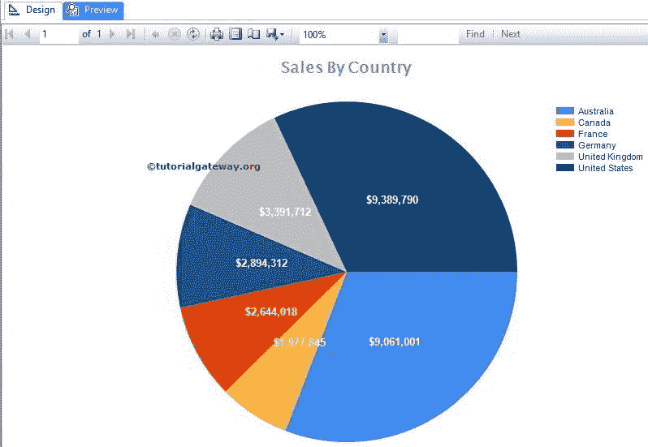
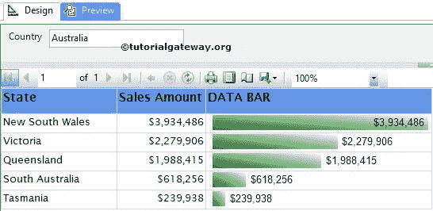
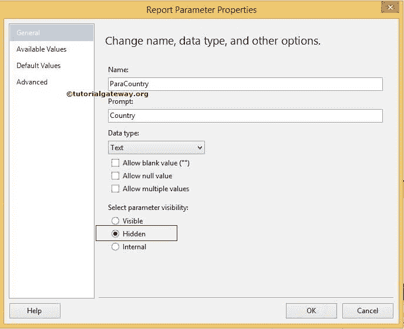
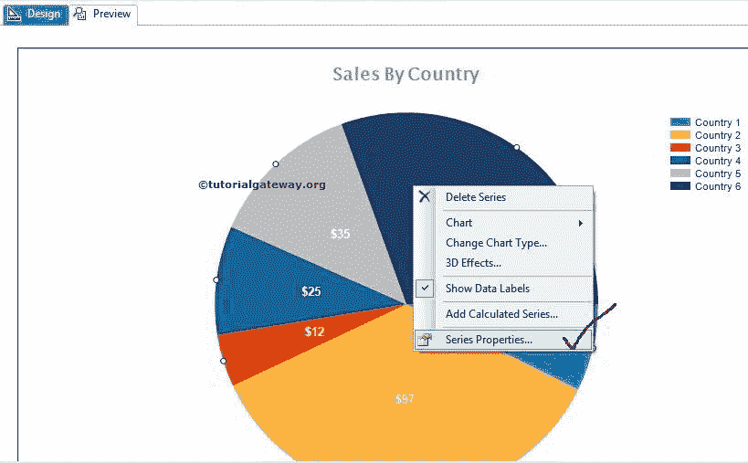
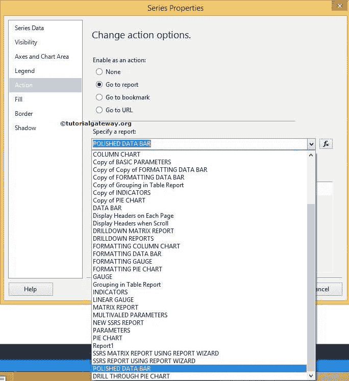
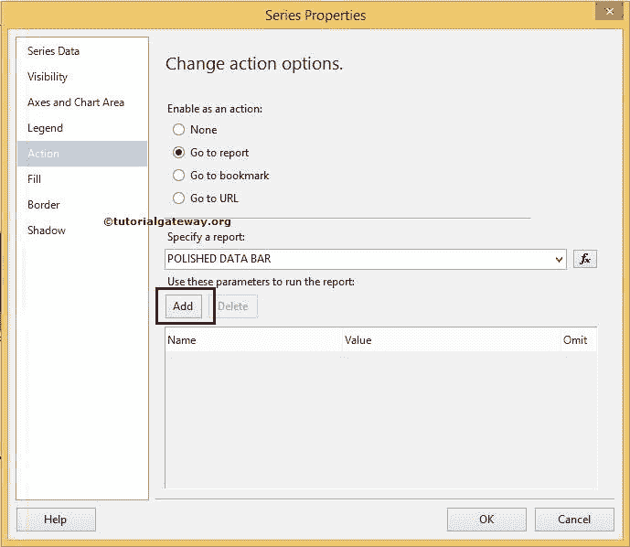
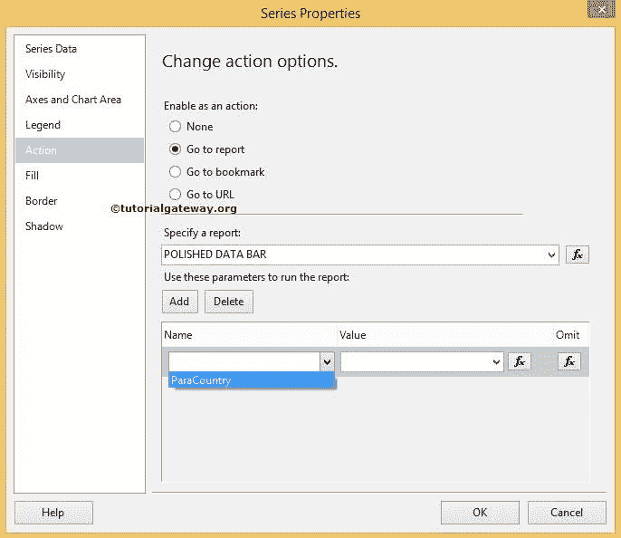
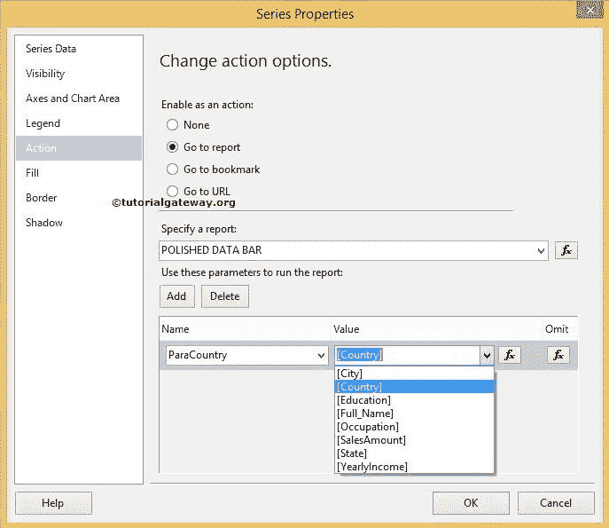
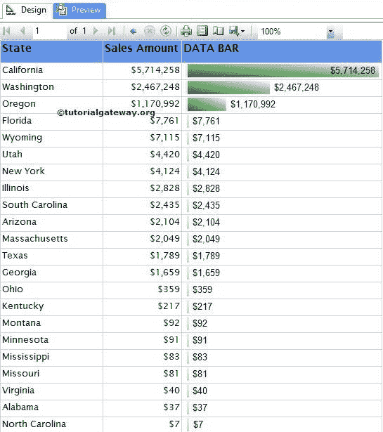
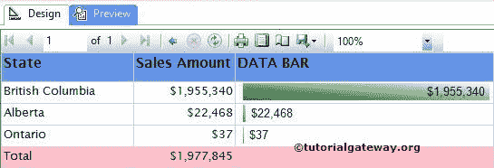

# SSRS 的穿透钻取报告

> 原文：<https://www.tutorialgateway.org/drill-through-reports-in-ssrs/>

SSRS 穿透钻取动作是最常用的实时动作。SSRS 穿透钻取报告允许用户通过单击主报告中的对象从一个报告导航到另一个报告。SSRS 钻取操作可以在矩阵、表、图表、数据条、饼图、仪表等上定义

## SSRS 的钻取报告示例

在本例中，我们将通过一个示例向您展示如何在饼图上启用 SSRS 穿透钻取操作。对于这个[动作](https://www.tutorialgateway.org/go-to-url-action-in-ssrs/)演示，我们将使用下图所示的报告。请参考 [SSRS 饼图](https://www.tutorialgateway.org/pie-chart-in-ssrs/)了解我们在本 [SSRS](https://www.tutorialgateway.org/ssrs/) 报告中使用的[数据源](https://www.tutorialgateway.org/ssrs-shared-data-source/)和[数据集](https://www.tutorialgateway.org/shared-dataset-in-ssrs/)。

我们的目标是在每个国家/地区定义 SSRS 穿透钻取行动。如果用户点击任何国家或地区，第二个报告必须显示相应的州销售情况。例如，如果用户点击英国，那么第二个报告必须显示该国的所有州。

注:如果您想在 SSRS 报告中实现这种钻取，我们必须将国家/地区值从主报告传递到第二个报告。这意味着第二个报告应该是参数化报告。

下面的截图显示了第二个报告，这是我们将在用户钻取操作中显示的报告。请参考 [SSRS 数据栏](https://www.tutorialgateway.org/data-bars-in-ssrs/)文章，了解我们在本报告中使用的[数据源](https://www.tutorialgateway.org/ssrs-shared-data-source/)和[数据集](https://www.tutorialgateway.org/shared-dataset-in-ssrs/)，我们还做了一些[格式化](https://www.tutorialgateway.org/formatting-data-bars-in-ssrs/)。如果观察的话，只是一个普通的报表，在澳洲有[基本参数](https://www.tutorialgateway.org/ssrs-report-parameters/)及其默认值。

### SSRS 穿透钻取报告操作

要对报告参数启用 SSRS 钻取操作，首先，我们要隐藏参数。因为我们要从主报告中传递参数值，在钻取报告中显示参数会很烦人。

要隐藏参数，请右键单击参数，然后选择报告属性选项。在常规选项卡中，请将参数可见性选项从可见更改为隐藏

在这里，我们将在“国家”列上应用“转到报告操作”(SSRS 钻取报告操作)。因此，右键单击饼图并选择系列属性..上下文菜单中的选项

选择系列属性后..选项，将打开一个新窗口来配置属性。请导航到操作选项卡，并选择转到报告选项以配置 SSRS 钻取报告操作。在指定报告选项下，请从如下所示的下拉列表中选择所需的报告

选择所需报告后，我们必须为选定报告中的参数赋值。首先，点击【添加】按钮配置参数值

在名称部分，请选择所选报告

的参数名称

接下来，我们必须为选定的参数分配适当的值。这里，参数参数是国家名称。所以我们从主报告中选择了国家一栏。

注意:如果在主报告中找不到准确的列，请使用 fx 按钮创建一个。

点击【确定】完成对[饼图](https://www.tutorialgateway.org/pie-chart-in-ssrs/)的 SSRS 穿透钻取操作，点击预览选项卡即可看到报表预览。如果你观察下面的截图，它看起来和普通的饼图一样。但是，如果您单击任何地区，将显示第二份报告，其中包含该国家的州详细信息。在 SSRS 穿透钻取报告预览中，我们点击了美国。

如果你观察下面的截图，我们的第二份报告在我们的第二份报告

中显示了美国的州际销售额

提示:请单击后退按钮(指向左侧的蓝色箭头)从第二个报告导航到主报告

让我们把总数加到第二份报告中。这样，您可以比较饼图和第二个报告中显示的总数。

这一次，我们点击了加拿大。从上面的截图可以看出，总数完全匹配。

