# SSRS 的向下钻取矩阵报告

> 原文：<https://www.tutorialgateway.org/drill-down-matrix-report-in-ssrs/>

在本文中，我们将向您展示如何在 SSRS 手动创建向下钻取矩阵报告？

*   如何向矩阵报告添加列总计？
*   如何将行总计添加到矩阵报告中？
*   将总计添加到矩阵报告？

## SSRS 的向下钻取矩阵报告

我们将使用下图所示的报告在 [SSRS](https://www.tutorialgateway.org/ssrs/) 矩阵报告中启用向下钻取。请参考 [SSRS 矩阵报告](https://www.tutorialgateway.org/ssrs-matrix-report/)、[数据源](https://www.tutorialgateway.org/ssrs-shared-data-source/)、[数据集](https://www.tutorialgateway.org/shared-dataset-in-ssrs/)文章，了解数据源、数据集和矩阵报告的创建。

如果您观察下面的截图，这是一个正常的矩阵报告，以国家、州列为行组，以性别、职业为列组。

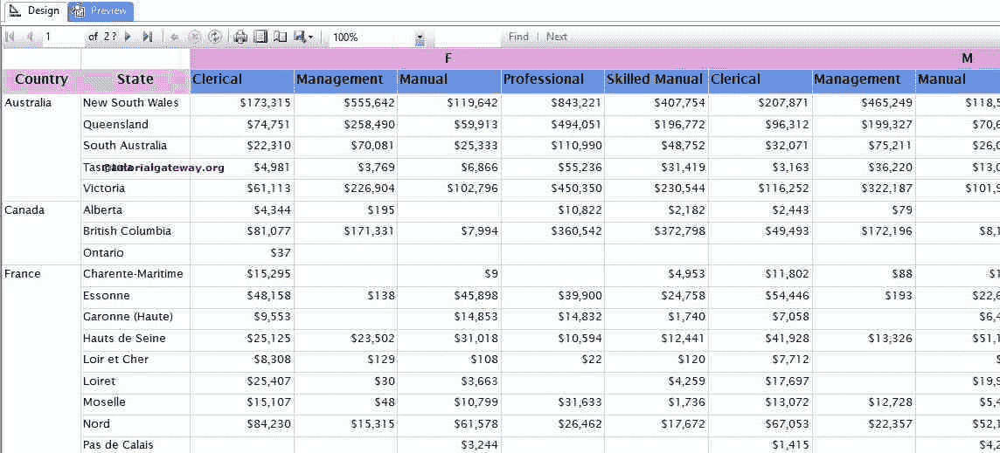

### 将总计添加到 SSRS 矩阵报告

右键单击聚合数据列将打开包含多个选项的上下文菜单。请选择添加合计选项，然后根据您的要求选择行或列。这里我们选择行。它将在现有行下生成新行，行总数为

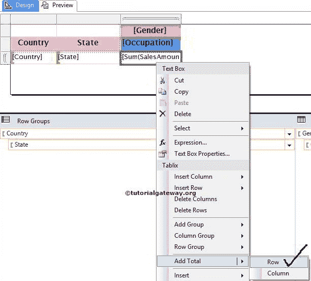

接下来，我们选择列。这意味着它将在现有行的右侧创建一个新列，列总数为

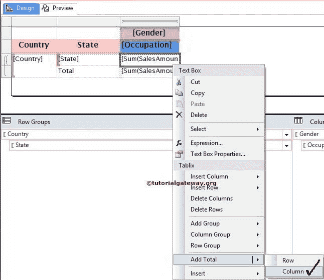

提示:通过从上面的截图中选择 fx Expression，您总是可以将默认的聚合函数 SUM 更改为其他函数。

我们可以通过选择行总计和列总计之间的空白单元格来添加总计。接下来，将“销售额”列添加到该单元格中。

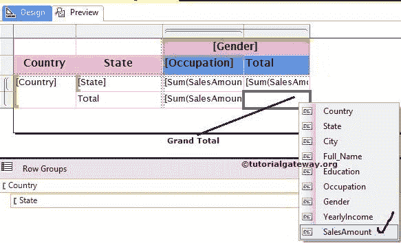

我们更改了“总计”单元格的[背景颜色](https://www.tutorialgateway.org/format-fonts-and-background-of-a-textbox-in-ssrs/)，以显示行、列和总计之间的差异。点击预览选项卡，查看

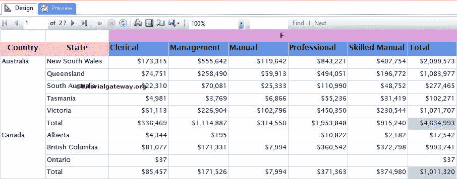

报告预览

### 在 SSRS 矩阵报告中启用追溯

当我们使用 SSRS [报告向导](https://www.tutorialgateway.org/creating-ssrs-matrix-report-using-report-wizard/)创建报告时，将很容易启用向下钻取选项。然而，要手动启用，我们需要一些额外的努力。

在这个 SSRS 向下钻取矩阵报告示例中，我们将向您展示如何隐藏州名和职业名以及

*   允许用户选择国家名称来显示或隐藏州名
*   允许用户选择性别名称来显示或隐藏职业/职业列名

首先，转到行组窗格，右键单击状态组将打开上下文菜单。请从上下文中选择组属性..选项。

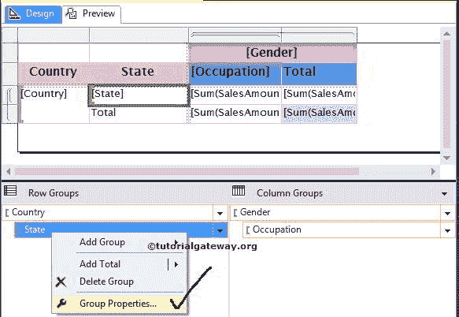

选择组属性后..选项，将打开一个新窗口来配置组属性。请选择左侧的可见性选项卡。

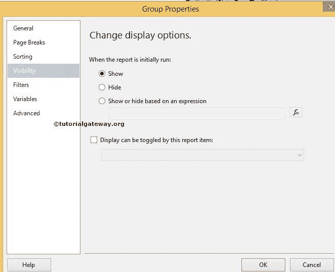

SSRS 向下钻取矩阵报告组属性的可见性选项卡有多个选项:

*   显示:当您最初运行报告时，如果您想显示州名，请选择显示选项
*   隐藏:最初运行报告时，如果要隐藏状态名称，请选择隐藏选项。在这个例子中，我们希望最初隐藏州名，所以我们选择了这个选项。
*   基于表达式显示或隐藏:您可以编写自己的表达式，通过单击 fx 按钮来显示/隐藏状态名称。
*   可以通过此报告时间切换显示:如果选择此选项，州名将根据我们在此选择的报告项目显示/隐藏。在本例中，我们希望根据用户选择的国家名称来切换州名。因此，从列表中选择“国家”列。

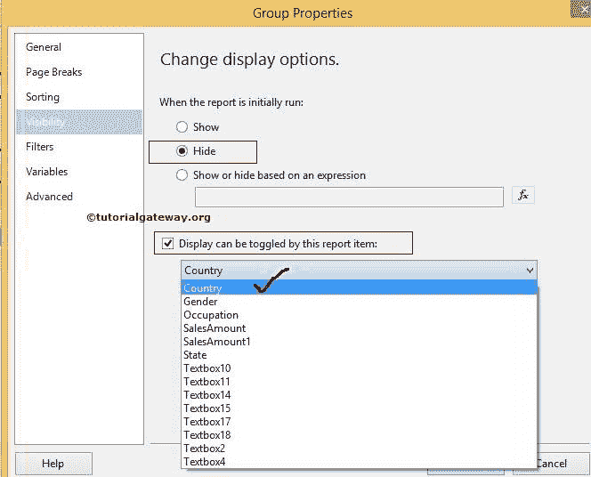

现在，转到列组窗格，右键单击职业组，并选择左侧的可见性选项卡。在本例中，我们希望根据用户选择的性别来切换职业列名称，以便从列表中选择性别列，如下所示。

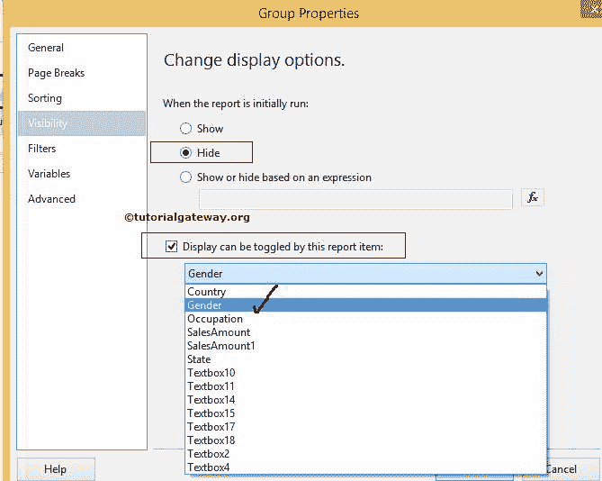

单击“确定”以手动完成对矩阵报告的向下钻取功能的启用。

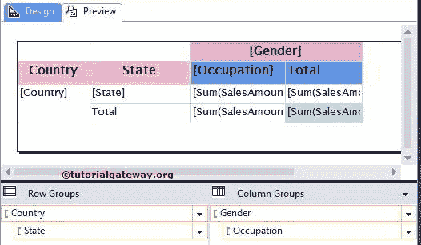

单击预览选项卡，查看 SSRS 向下钻取矩阵报告预览。如果您观察下面的截图，州名和职业名没有显示，我们在国家名和性别名旁边有一个+符号来扩展它们。

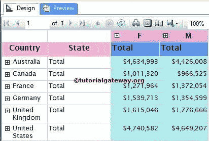

单击+符号后，将显示相应的状态名称。

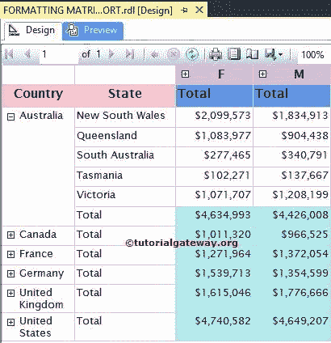

让我们预览整个 SSRS 向下钻取矩阵报告。

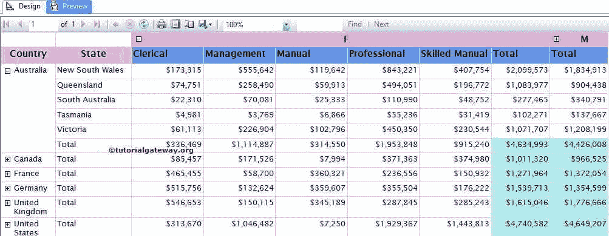