# 前往 SSRS 的网址行动

> 原文：<https://www.tutorialgateway.org/go-to-url-action-in-ssrs/>

在 SSRS，操作用于向报告添加附加功能。这意味着，我们可以定义当用户单击文本框或报告上显示的特定区域时发生的事件。SSRS 转到网址操作允许您从报告导航到指定的网址。

提示: [SSRS](https://www.tutorialgateway.org/ssrs/) 动作可以在[矩阵](https://www.tutorialgateway.org/ssrs-matrix-report/)、[表](https://www.tutorialgateway.org/ssrs-table-report/) (Together Tablix)、图表、[数据条](https://www.tutorialgateway.org/data-bars-in-ssrs/)、[饼图](https://www.tutorialgateway.org/pie-chart-in-ssrs/)、[量表](https://www.tutorialgateway.org/gauges-in-ssrs/)等

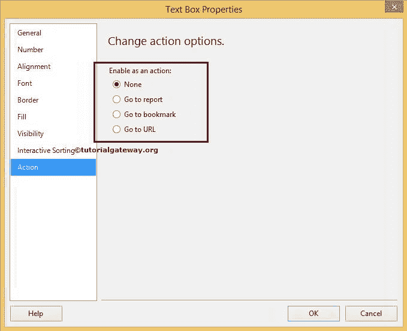

上定义

从上面的截图中，您可以观察到有三种类型的操作:

*   前往报告:最常被称为[钻取动作](https://www.tutorialgateway.org/drill-through-reports-in-ssrs/)。它允许用户通过单击主报告中的对象从一个报告导航到另一个报告。
*   转到书签:它允许用户导航到同一 SSRS 报告中的预定义书签。例如，如果报告太长，那么我们可以定义书签来轻松导航。
*   转到网址:这种类型的操作允许用户从 SSRS 报告导航到指定的网址。例如，如果我们按国家显示销售额，并且用户想要在点击时查看每个国家的热图，那么我们可以使用这个转到 URL 操作

## 转到 SSRS 的网址操作示例

在本例中，我们将通过一个示例向您展示如何在 [SSRS 报告](https://www.tutorialgateway.org/ssrs-table-report/)中启用转到网址操作。下面的截图显示了我们将在这个例子中使用的[嵌入式数据集](https://www.tutorialgateway.org/embedded-dataset-in-ssrs/)。

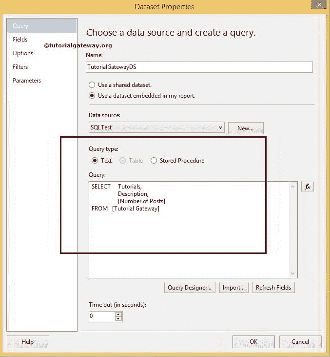

让我们也看看报告预览。如果你观察下面的截图，这是一个显示 tutorialgateway.org 帖子存档的普通表格报告。

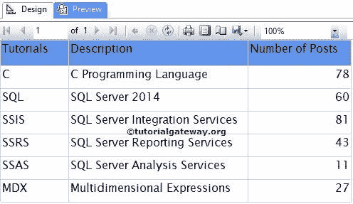

在这里，我们将对教程列应用转到网址操作。因此，右键单击教程文本框并选择文本框属性..上下文菜单中的选项

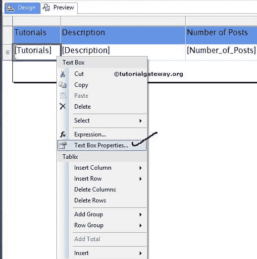

选择文本框属性后..选项，将打开一个新窗口来配置属性。对于此 SSRS 报告，请导航至“操作”选项卡，并选择“转至网址”选项，如下所示。

如果你知道网址，那就在文本框中硬编码。否则，请像我们选择

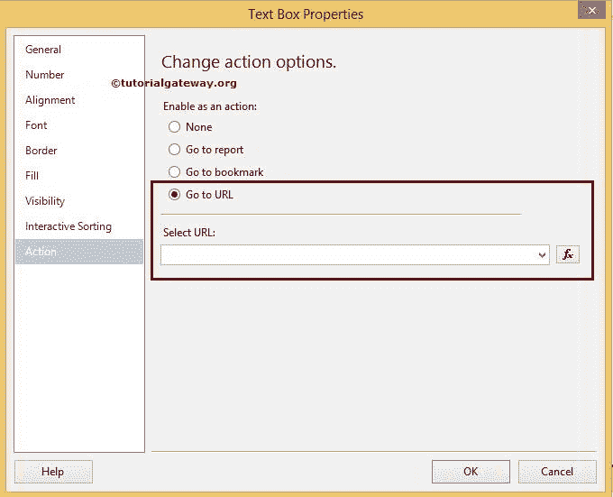

一样选择 fx 按钮

在表达式窗口中，请写出以下表达式

```
="https://www.tutorialgateway.org/" + LCase(Fields!Tutorials.Value.ToString())
```

我们只是将用户点击的文本添加到 www.tutorialgateway.org/网址。例如，如果用户点击 [MDX](https://www.tutorialgateway.org/mdx/) ，则在/

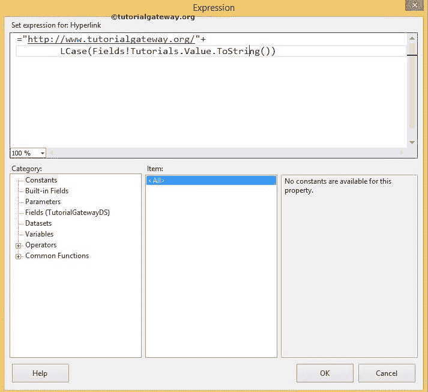

之后添加 MDX

单击确定关闭表达式窗口

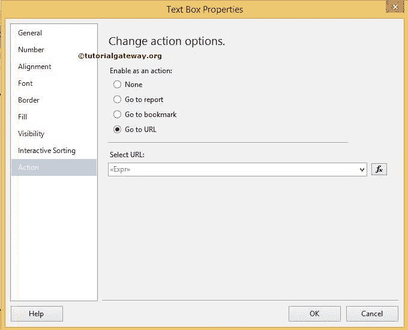

接下来，请导航到字体选项卡并更改文本的颜色。它帮助最终用户识别为超级链接

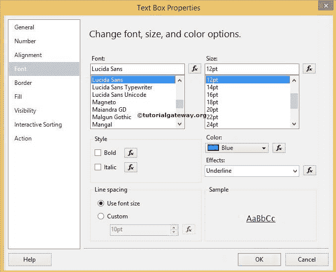

单击“确定”完成对 SSRS 表报告启用“转到网址”操作。

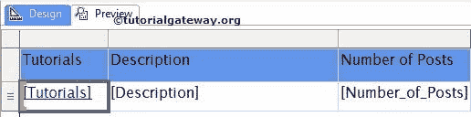

让我们通过点击预览选项卡

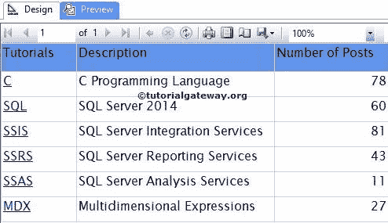

来查看 SSRS 转到网址行动报告预览

一旦我们点击 SQL，我们的默认浏览器就会打开[www.tutorialgateway.org/sql/](https://www.tutorialgateway.org/sql/)如下图所示

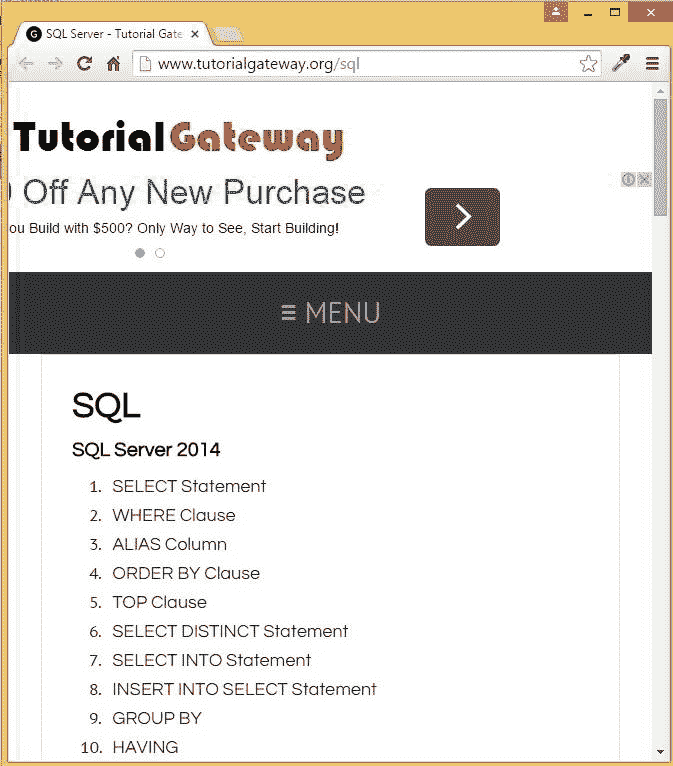T4】