# SSRS 查找函数

> 原文：<https://www.tutorialgateway.org/ssrs-lookup-function/>

在本文中，我们将向您展示如何使用 SSRS 查找函数及其优点。或者，如何在 SSRS 报告中组合多个数据集。或者，通过一个示例说明如何使用 SSRS 查找在报表创建中使用多个数据集。

我们将使用下面显示的数据集来解释 SSRS 查找函数。请参考[嵌入式数据源](https://www.tutorialgateway.org/embedded-data-source-in-ssrs/)、[数据集](https://www.tutorialgateway.org/embedded-dataset-in-ssrs/)文章，了解创建嵌入式数据源所涉及的步骤，以及我们用于本 [SSRS](https://www.tutorialgateway.org/ssrs/) 报告的数据集。

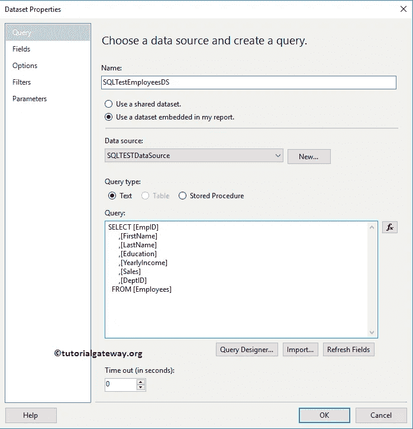

我们在上面的数据集中使用的自定义 [SQL](https://www.tutorialgateway.org/sql/) 查询所写的数据是:

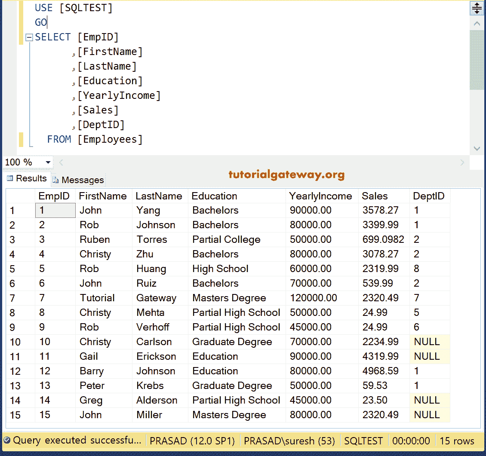

## SSRS 查找示例

为了演示在 SSRS 的查找，我们将使用之前设计的报告。

有关创建表格报告&格式的步骤，请参考 SSRS 文章中的 [SSRS 表格报告](https://www.tutorialgateway.org/ssrs-table-report/)、[表格报告格式，添加页眉、页脚请参考](https://www.tutorialgateway.org/format-table-report-in-ssrs/)[为 SSRS 报告](https://www.tutorialgateway.org/add-headers-and-footers-to-ssrs-report/)添加页眉和页脚。

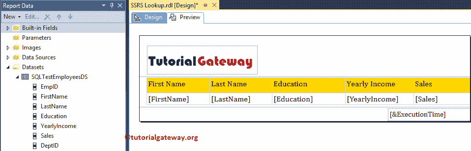

首先，让我向您展示报告预览。

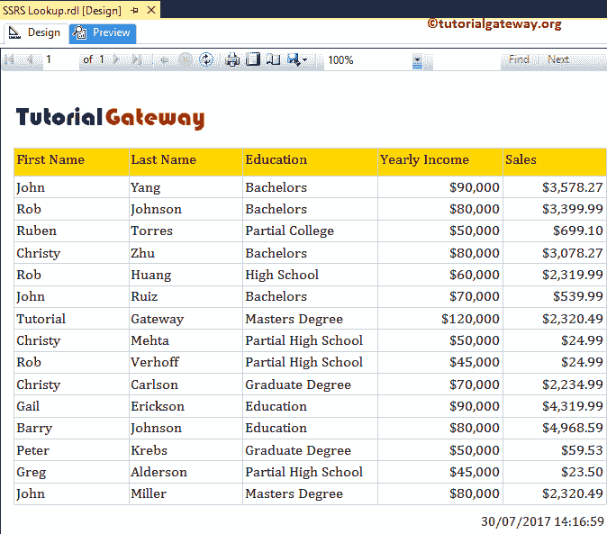

上述报告是客户的主要标准，突然客户要求您将部门名称添加到上述报告中。如您所知，“员工”表没有“部门名称”，让我添加另一个数据集。

要添加第二个数据集，请右键单击数据集文件夹并选择添加数据集..选项。

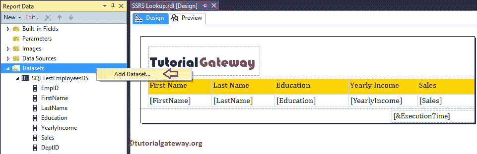

以下截图将向您展示我们正在使用的

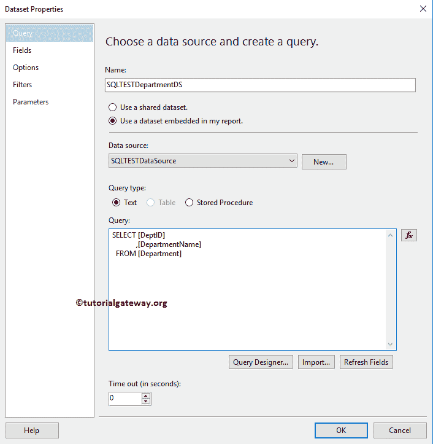

嵌入式数据集

部门表中的数据为:

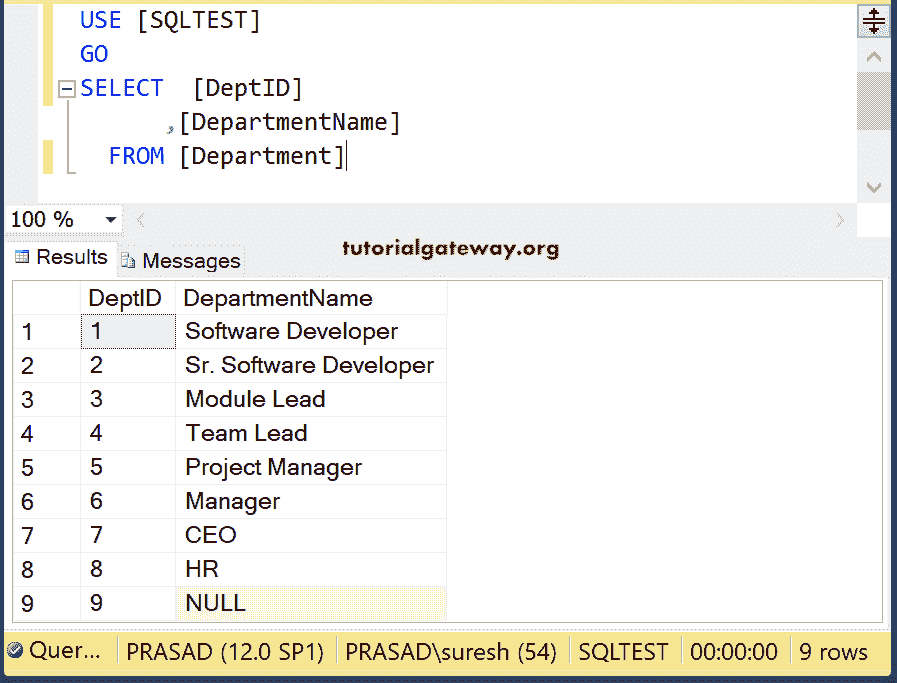

您可能很容易被诱惑添加部门名称。让我向您展示一下，如果我将部门名称拖放到现有的表中会发生什么？

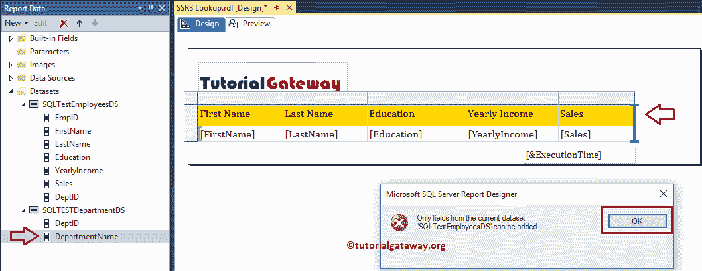

从上面的截图中，您可以看到它抛出了一个错误，因为报表设计器将只允许您使用一个数据集。

现在让我向您展示实现这一目标的理想方法。首先，通过右键单击销售列->插入列->右侧

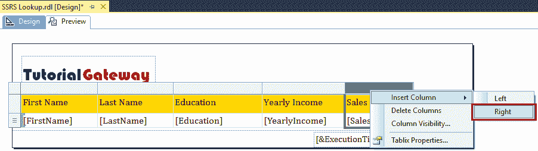

，在销售列的右侧插入一列

在我们继续之前，让我解释一下 SSRS 查找函数

### SSRS 查找示例

SSRS 查找函数从指定的数据集中返回匹配的记录。语法是:

```
Lookup(Source_IDColumn, 
          Target_IDColumn, 
            Target_Column, 
                       Target_Dataset)
```

*   Source_IDColumn:类似于一个[主键](https://www.tutorialgateway.org/sql-primary-key/)。它是第一个数据集的标识列。
*   Target_IDColumn:类似于一个[外键](https://www.tutorialgateway.org/sql-foreign-key/)列。这是第二个数据集的标识列。SSRS 查找函数将检查源标识列是否等于目标标识列，如果它们匹配，则相应的目标标识列值将返回
*   目标列:要添加到现有表中的列。
*   目标数据集:第二个数据集名称。

接下来，请选择新创建的列，右键单击它将打开上下文菜单。请从中选择表达式选项。

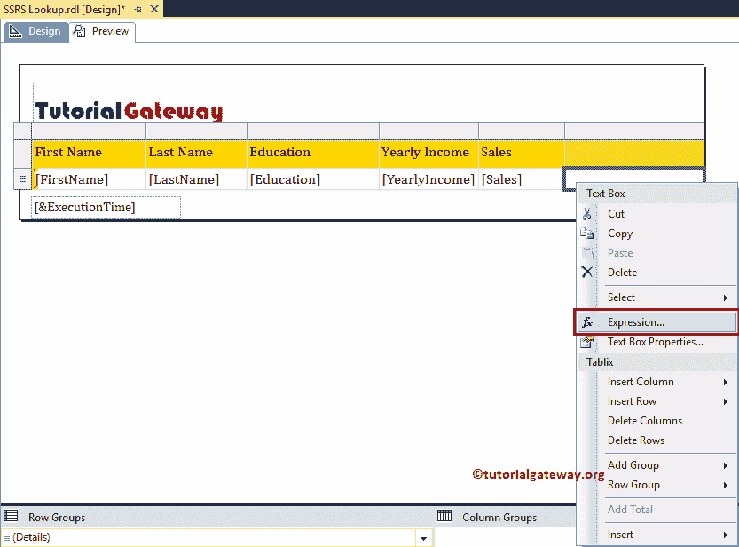

选择“表达式”选项后，将打开一个名为“表达式”的新窗口。使用此表达式窗口编写 SSRS 查找函数。

```
=Lookup(Fields!DeptID.Value, 
          Fields!DeptID.Value, 
            Fields!DepartmentName.Value, 
                       "SQLTESTDepartmentDS")
```

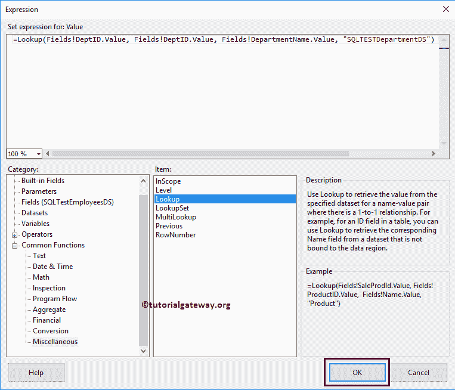

完成 SSRS 查找功能后，单击确定关闭窗口

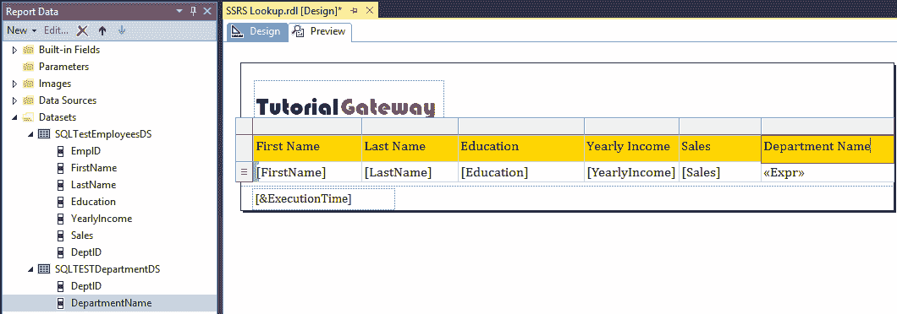

如您所见，我们的报告预览正在显示部门名称。这意味着，SSRS 查找报告正在显示来自多个数据集

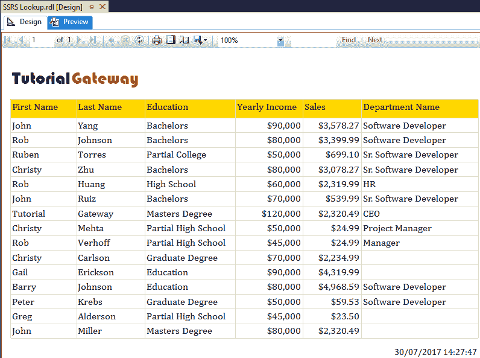

的数据