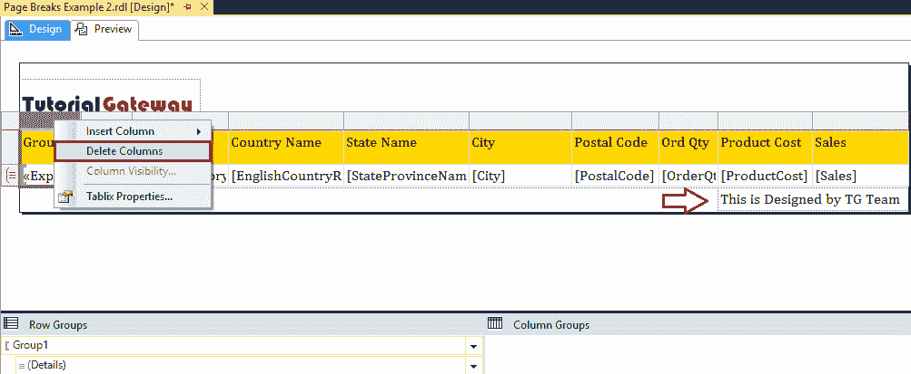

# 在 SSRS 报告中插入分页符

> 原文：<https://www.tutorialgateway.org/insert-page-breaks-in-ssrs-report/>

在本文中，我们将向您展示如何在 SSRS 报告中插入分页符。或者，如何向 SSRS 报告添加分页符。这是每个报表开发人员的标准要求之一。

对于这个 SSRS 分页示例，我们将使用下面显示的数据集。请参考[共享数据源](https://www.tutorialgateway.org/ssrs-shared-data-source/)和[数据集](https://www.tutorialgateway.org/shared-dataset-in-ssrs/)了解创建共享数据源和数据集所涉及的步骤，我们在此 [SSRS](https://www.tutorialgateway.org/ssrs/) 报告


中使用了这些步骤

我们在上面的数据集中使用的自定义 [SQL](https://www.tutorialgateway.org/sql/) 查询是:

```
-- SQL Query using for Insert Page Breaks in SSRS Report Example
USE [AdventureWorksDW2014]
GO
SELECT Terr.[SalesTerritoryRegion]
      ,Terr.[SalesTerritoryGroup]
      ,GEO.[EnglishCountryRegionName]
      ,GEO.[StateProvinceName]
      ,GEO.[City]
      ,GEO.[PostalCode]
      ,SUM(FACT.[OrderQuantity]) AS OrderQty
      ,SUM(FACT.[TotalProductCost]) AS ProductCost
      ,SUM(FACT.[SalesAmount]) AS Sales
      ,SUM(FACT.[TaxAmt]) AS TaxAmt
  FROM [DimSalesTerritory] AS Terr
  INNER JOIN [DimGeography] AS GEO
  ON  Terr.SalesTerritoryKey = GEO.SalesTerritoryKey
  INNER JOIN [FactInternetSales] AS FACT
  ON Terr.SalesTerritoryKey = Fact.SalesTerritoryKey
  GROUP BY Terr.[SalesTerritoryRegion]
      ,Terr.[SalesTerritoryGroup]
      ,GEO.[EnglishCountryRegionName]
      ,GEO.[StateProvinceName]
      ,GEO.[City]
      ,GEO.[PostalCode]
```

## 在 SSRS 报告中插入分页符

对于这个 SSRS 分页演示，我们将使用之前设计的报告之一，如下所示。

请参考 SSRS 文章中的 [SSRS 表报告](https://www.tutorialgateway.org/ssrs-table-report/)、[格式表报告，了解创建表报告&格式所涉及的步骤，以及](https://www.tutorialgateway.org/format-table-report-in-ssrs/)[添加页眉和页脚到 SSRS 报告](https://www.tutorialgateway.org/add-headers-and-footers-to-ssrs-report/)文章中添加页眉。


让我给你看看报告预览。


正如您从上面的截图中看到的，虽然我们有 16 页，但我们总是必须上下滚动才能查看最后一条记录，反之亦然。在这种情况下，我们可以使用分页符使用一些条件来分页。

在本文中，我们将向您展示在 SSRS 报告中分页或插入分页符的多种方法。

### 使用组在 SSRS 报告中插入分页符

从下面的截图中可以看到，我们的表报告是按州/省名称分组，然后按英语国家/地区名称分组。

在这个 SSRS 分页符的例子中，我们将在每个州和省的名称处分页符。为此，请转到“行组”窗格，然后单击州/省名称旁边的向下箭头。请选择“组属性”选项。


选择组属性后，将打开下面显示的窗口。


转到“SSRS 分页符”选项卡，选中下面显示的选项。

*   组的每个实例之间:如果选择此选项，当新组启动时，页面将会断开。例如，澳大利亚昆士兰州是一个新的组实例，因此它将在该点断开，并在新页面上显示属于昆士兰州的所有记录。
*   同样在小组开始时:这将在昆士兰之前应用分页符
*   同样在一组的末尾:这将在昆士兰之后使用分页


为了显示页面结束位置，我们在页脚中放置了一个自定义的[文本框](https://www.tutorialgateway.org/add-textbox-to-ssrs-report/)。


从下面的截图中，您可以看到 SSRS 分页符报告显示了 69 页，而不是 16 页。


如您所见，报告在单独的页面中显示了每个州/省组。


### 在 SSRS 报告中插入分页符

如果我们有一些分组，上述方法是理想的。如果我们的报告没有任何组，会发生什么情况？。

为此，我们使用下表报告。建议大家参考[给 SSRS 报告](https://www.tutorialgateway.org/add-row-numbers-to-ssrs-report/)增加行号，了解下图的报告。


让我给你看看报告预览。


转到行组，右键单击详细信息打开上下文菜单。请从中选择添加组，然后选择父组。


选择父组选项后，将打开一个新的 Tablix 组窗口来配置分组。在这个 SSRS 分页符的例子中，我们没有任何列到组中。所以我们点击表达式按钮来编写一些自定义代码。


选择表达式将打开一个名为表达式的新窗口。使用此表达式窗口编写自定义表达式。

下面的代码将记录除以 10。这意味着，我们将每 10 条记录归为一组。参考[将组添加到表报告](https://www.tutorialgateway.org/ssrs-grouping-in-table-reports/)文章。


现在，您可以看到我们新创建的组。在开始预览报告之前。请前往集团属性


并导航至排序选项卡


请点击【删除】按钮


删除排序栏

单击确定关闭属性窗口，然后单击预览按钮。


接下来，让我使用我们在第一个 SSRS 示例中解释的方法来应用分页符。


接下来，我们将删除分组列，因为我们不想要那个额外的列。为此，右键单击组 1 列，并从上下文菜单中选择删除列。



这将询问您是要删除组还是只删除列。请选择仅删除列选项。请记住，如果选择其他选项，则必须从创建父组开始。


现在，您可以看到报告每页显示 10 条记录。


让我去第二页。


### 使用参数在 SSRS 报告中插入分页符

我们还可以使用参数在 SSRS 报告中插入分页符，或者限制显示记录。在这个例子中，我们将同样解释。开始之前，请参考 [SSRS 参数](https://www.tutorialgateway.org/ssrs-report-parameters/)一文，了解创建参数的步骤。

要添加报告参数，请右键单击报告数据选项卡中的参数文件夹，然后选择添加参数..选项。单击添加参数后..选项，它将打开一个名为“报告参数属性”的新窗口来配置参数属性。


请添加默认值为 15


接下来，请转到组属性，并单击属性上组旁边的表达式按钮。


用新创建的参数替换 10。


现在，您可以看到 SSRS 分页报告每页显示 15 条记录。


让我把它改成 10


上面的 SSRS 分页报告满足了我们的要求，但是让我隐藏这个参数。为此，右键单击该参数将打开报告参数属性。在此，请选择隐藏的参数可见性选项。


完成后，点击【确定】关闭


窗口