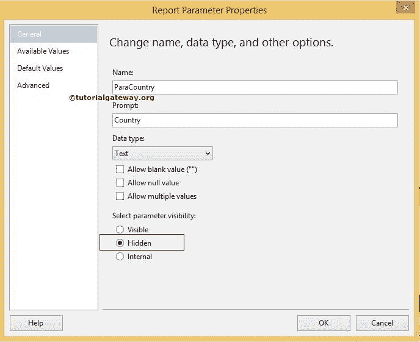
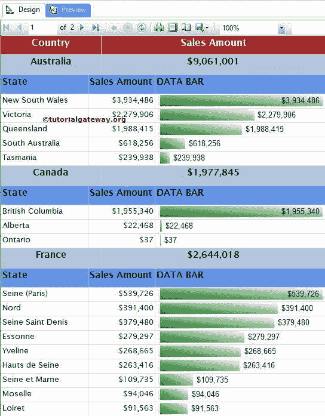

# SSRS 子报告

> 原文：<https://www.tutorialgateway.org/ssrs-subreports/>

在 SSRS，子报告允许我们向数据区域添加一个或多个相关报告。以下是 SSRS 子报告的一些优点:

*   使我们能够在一个报告中添加多个相关报告。
*   SSRS 子报告允许我们将一个报告嵌套或插入到另一个报告中。
*   并且，允许我们将参数(参数值)从主报表传递给 SSRS 子报表
*   如果将 SSRS 子报表放在表或矩阵中，则子报表将在每行重复出现。否则，它将显示一次。

## SSRS 子报告示例

在本例中，我们将通过一个示例向您展示如何在表格报告中创建 SSRS 子报告。

对于这个 SSRS 子报告的例子，我们将使用下面显示的报告。请参考[表格报告](https://www.tutorialgateway.org/ssrs-table-report/)文章，了解我们在本[SQL Server Reporting Services](https://www.tutorialgateway.org/ssrs/)报告中使用的[共享数据源](https://www.tutorialgateway.org/ssrs-shared-data-source/)和[数据集](https://www.tutorialgateway.org/shared-dataset-in-ssrs/)。

下面的截图显示了第二个报表，这是我们将在主报表(子报表)中显示的报表。请参考 [SSRS 数据栏](https://www.tutorialgateway.org/data-bars-in-ssrs/)文章，了解我们在本报告中使用的[数据源](https://www.tutorialgateway.org/ssrs-shared-data-source/) & [数据集](https://www.tutorialgateway.org/shared-dataset-in-ssrs/)，我们也做了一些[格式化](https://www.tutorialgateway.org/formatting-data-bars-in-ssrs/)。

如果你观察，它只是一个普通的报表，有[基本参数](https://www.tutorialgateway.org/ssrs-report-parameters/)，在澳洲是默认值。

首先，我们要隐藏参数，因为我们要将主报表中的参数值传递给这个子报表。要隐藏参数，请右键单击参数，然后选择报告属性选项。

在常规选项卡中，请将参数可见性选项从可见更改为隐藏，如下图

在将子报表嵌套在 SSRS 之前，我们需要在表中有一个空行。因此，从 Tablix 中选择详细信息行，并右键单击它以打开上下文。请从上下文菜单中选择插入行选项，然后选择组内–如下图所示

一旦您选择组内–下方选项，一个新的行将被添加到表

从上面的截图中，可以看到新创建的行被分成了两个单元格，但是我们只需要一个单元格来添加子报表。

为此，请选择整行并右键单击，然后选择合并单元格选项，如下图所示

现在您可以注意到，我们有一个长单元格来保存子报表。让我们将子报表添加到这个单元格

在 SSRS 有两种添加子报表的方法:

### SSRS 第一个添加子报告的方法

首先，我们可以将子报表从工具箱拖放到空单元格中，如下图所示

### 在 SSRS 添加子报告的第二种方法

右键单击空白单元格，选择插入选项，然后选择子报表选项

选择“子报表”选项后，会向表中添加一个空的子报表。

现在，我们必须将报表添加到这个子报表区域。因此，右键单击 SSRS 子报表并选择子报表属性..上下文菜单中的选项

选择子报表属性..选项打开一个新窗口来选择报告。现在，我们选择如下所示的

抛光数据条报告

选择所需的报表后，我们必须分配 SSRS 子报表(如果有)的参数值。要添加参数，请转到参数选项卡，然后单击添加按钮。

在名称部分，请选择子报表

的参数名称

接下来，我们必须为选定的参数分配适当的值。这里，参数参数是国家名称。因此，我们从主报告中选择了[销售区域国家]列。

注意:如果在主报告中找不到准确的列，请使用 fx 按钮创建一个。

点击【确定】完成在[表格报告](https://www.tutorialgateway.org/ssrs-table-report/)

中创建 SSRS 子报告

让我们通过单击预览选项卡来查看子报告报告预览。

从上面的截图可以看出，SSRS 子报表正确地嵌套在主报表中。请不要介意颜色组合。