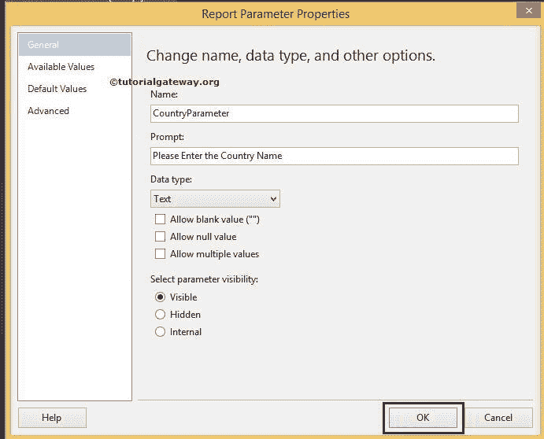
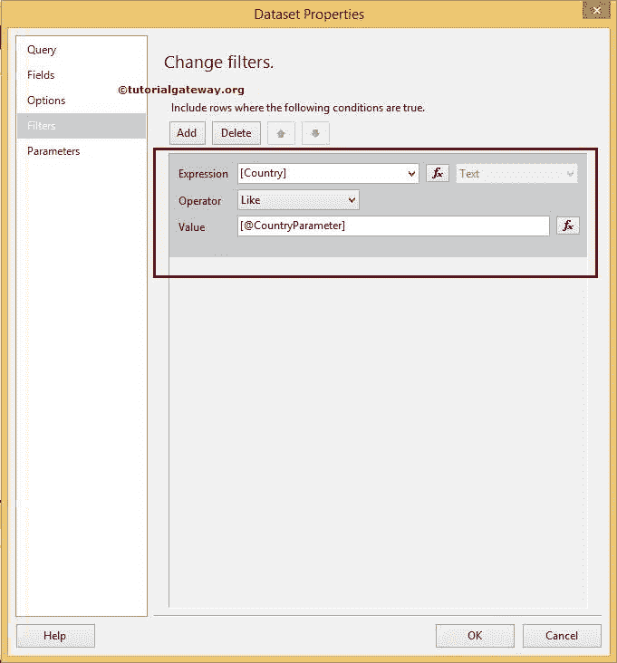

# SSRS 报告参数

> 原文：<https://www.tutorialgateway.org/ssrs-report-parameters/>

SSRS 报告参数允许用户在文本框中输入特定的值，然后，SSRS 将使用用户指定的值过滤报告数据。或报告参数使用户能够动态过滤 SSRS 报告。

在本文中，我们将通过一个示例向您展示如何在 SSRS 或 SQL Server Reporting Services 中添加报表参数。

我们将使用下图所示的报告来解释报告中的 SSRS 报告参数。请参考[表报](https://www.tutorialgateway.org/ssrs-table-report/)文章了解 [SSRS](https://www.tutorialgateway.org/ssrs/) 表报的创建。如果您观察下面的截图，它是一个普通的表报告，包含国家、全名、职业、年收入和销售额列。


下面的截图将向您展示我们用于此报告的[共享数据源](https://www.tutorialgateway.org/ssrs-shared-data-source/)和[数据集](https://www.tutorialgateway.org/shared-dataset-in-ssrs/)。


[SQL](https://www.tutorialgateway.org/sql/) 我们在上面截图中使用的命令是:

```
SELECT Geo.[EnglishCountryRegionName] AS [Country]
      ,Geo.[StateProvinceName] AS [State]
      ,Geo.[City]
      ,Cust.FirstName +' '+ Cust.LastName AS [Full Name]  
      ,Cust.EnglishEducation AS Education 
      ,Cust.EnglishOccupation AS Occupation
      ,SUM(Cust.YearlyIncome) AS YearlyIncome
      ,SUM(Fact.SalesAmount)AS SalesAmount 
FROM  DimCustomer AS Cust
  INNER JOIN
      FactInternetSales AS Fact ON 
 Cust.CustomerKey = Fact.CustomerKey
 INNER JOIN
     [DimGeography] AS Geo ON
   Cust.GeographyKey = Geo.GeographyKey
 GROUP BY Geo.[EnglishCountryRegionName]
         ,Geo.[StateProvinceName] 
	 ,Geo.[City]
	 ,Cust.FirstName
         ,Cust.LastName  
         ,Cust.EnglishEducation 
         ,Cust.EnglishOccupation 
  ORDER BY [Country]

```

## 添加 SSRS 报告参数

要添加 SSRS 报告参数，右键单击报告数据选项卡中的参数文件夹，将打开上下文菜单选择添加参数..选项。


单击添加参数后..选项打开一个名为“报告参数属性”的新窗口，以在 SSRS 配置参数属性。

*   名称:请根据您的要求指定有效的参数名称。这里，我们将其定义为 CountryParameter
*   提示:您在此指定的文本将在文本框前显示为标签
*   数据类型:国家名称是文本数据类型，所以我们保持默认文本不变



单击确定完成在 SSRS 配置报告参数。现在，我们必须对数据集应用过滤条件。请参考[数据集级过滤器](https://www.tutorialgateway.org/filters-at-dataset-level-in-ssrs/)一文了解过滤器的创建。

从报告数据选项卡中选择数据集，右键单击它将打开上下文菜单。请选择数据集属性..选项


在这个 SSRS 报告参数示例中，我们将显示其[国家/地区名称]等于我们刚刚创建的[国家/地区参数]的记录。因此，请选择国家作为表达式，选择运算符作为[类似运算符](https://www.tutorialgateway.org/sql-like/)，选择值作为参数名称。

如果您发现参数名称难以书写，请点击 fx 按钮并从图形用户界面中选择参数名称。



单击确定完成数据集级别的过滤器配置。让我们单击预览选项卡预览 SSRS 报告参数数据。


从上面的截图中，您可以观察到它正在显示一个顶部为空文本框的空白报告。要查看记录，我们必须在文本框中输入国家名称，然后按回车键。

现在，我们以国名的形式进入德国。


注意:如果我们确切地知道参数值(在这个例子中是国家名称)，那么就没有问题了。记住 100 个员工姓名或产品名称怎么样？。在这些情况下，我们必须使用[下拉列表参数](https://www.tutorialgateway.org/drop-down-list-parameters-in-ssrs/)。