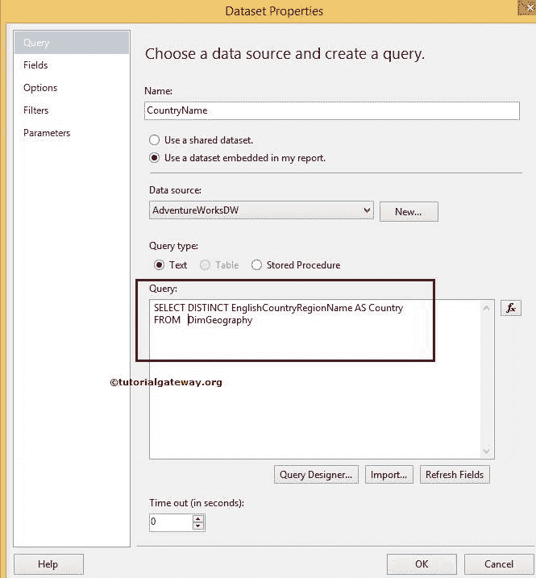
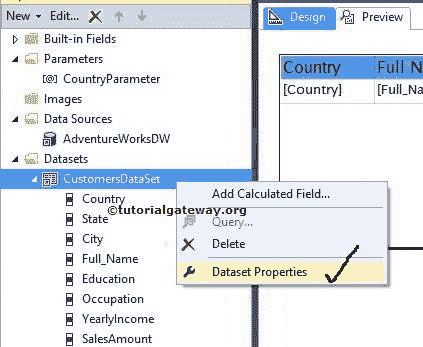

# SSRS 下拉列表参数

> 原文：<https://www.tutorialgateway.org/drop-down-list-parameters-in-ssrs/>

SSRS 下拉列表参数允许用户从下拉列表中选择所需的值，并使用用户指定的值过滤报告数据。或 SSRS 下拉参数使用户能够使用下拉列表动态过滤报告。

在本文中，我们将通过一个例子向您展示如何在 SSRS 添加下拉列表参数。

我们将使用下面显示的报告来解释 SSRS 报告中的下拉列表参数。详见 [SSRS](https://www.tutorialgateway.org/ssrs/) 中[表报](https://www.tutorialgateway.org/ssrs-table-report/)篇。

如果您观察下面的截图，它是一个普通的表格报告，包含国家、全名、职业、年收入和销售额列。


下面的截图显示了我们用于此报告的[共享数据源](https://www.tutorialgateway.org/ssrs-shared-data-source/)和[数据集](https://www.tutorialgateway.org/shared-dataset-in-ssrs/)。


我们在上面截图中使用的 [SQL](https://www.tutorialgateway.org/sql/) 命令是:

```
SELECT Geo.[EnglishCountryRegionName] AS [Country]
      ,Geo.[StateProvinceName] AS [State]
      ,Geo.[City]
      ,Cust.FirstName +' '+ Cust.LastName AS [Full Name]  
      ,Cust.EnglishEducation AS Education 
      ,Cust.EnglishOccupation AS Occupation
      ,SUM(Cust.YearlyIncome) AS YearlyIncome
      ,SUM(Fact.SalesAmount)AS SalesAmount 
FROM  DimCustomer AS Cust
  INNER JOIN
      FactInternetSales AS Fact ON 
 Cust.CustomerKey = Fact.CustomerKey
 INNER JOIN
     [DimGeography] AS Geo ON
   Cust.GeographyKey = Geo.GeographyKey
 GROUP BY Geo.[EnglishCountryRegionName]
         ,Geo.[StateProvinceName] 
	 ,Geo.[City]
	 ,Cust.FirstName
         ,Cust.LastName  
         ,Cust.EnglishEducation 
         ,Cust.EnglishOccupation 
  ORDER BY [Country]
```

## SSRS 的下拉列表参数

在我们开始创建 SSRS 下拉列表参数之前。让我们从[adventureworksdw 2014]



的[DimGeography]表中再创建一个包含不同国家/地区名称的数据集

[SQL](https://www.tutorialgateway.org/sql/) 我们在上面截图中使用的命令是:

```
SELECT [EnglishCountryRegionName] AS [Country]

FROM [DimGeography]
```

要添加 SSRS 下拉列表参数，请右键单击报告数据选项卡中的参数文件夹，然后选择添加参数..


单击添加参数后..选项，它将打开一个名为“报告参数属性”的新窗口来配置参数属性。

*   名称:请根据您的要求指定有效的参数名称。这里，我们将其指定为 CountryParameter
*   提示:您在此指定的文本将在文本框前显示为标签
*   数据类型:国家名称是文本数据类型，所以我们保持默认文本不变


如果您正在创建正常的报告参数，那么您可以单击“确定”来完成配置，但是对于下拉列表参数，我们必须选择“可用值”，如下图所示。

如果可以手动指定值，可以选择指定值选项并手动输入值。在本例中，我们希望使用前面创建的国家名称数据集，因此，请从查询选项中选择获取值，并从列表中选择数据集。


请指定值字段和标签字段。这里，我们只有一列，所以两列都是国家。

*   值字段:该值将被发送到查询。将使用此值过滤报告。
*   标签字段:该值显示给最终用户。


单击确定完成下拉列表参数的配置。现在，我们必须对数据集应用过滤条件。请参考 SSRS 文章中的[数据集级过滤器，了解过滤器的创建。](https://www.tutorialgateway.org/filters-at-dataset-level-in-ssrs/)

从报告数据选项卡中选择数据集，右键单击它将打开上下文菜单。请选择数据集属性..选项



在本例中，我们将显示其[国家/地区名称]等于我们刚刚创建的[国家/地区参数]的记录，因此，请选择国家/地区作为表达式，选择运算符作为[类似运算符](https://www.tutorialgateway.org/sql-like/)，选择值作为参数名称。

如果您发现任何难以书写的参数名称，请点击 fx 按钮。接下来，从图形用户界面中选择参数名称。


单击确定完成数据集级别的 SSRS 下拉列表过滤器配置。让我们单击预览选项卡来预览数据。


从上面的截图中，您可以看到它正在显示空白报告，下拉列表显示了我们创建的数据集中的所有国家/地区名称。为了显示记录，我们必须从下拉列表中选择国家名称，然后按回车键。

目前，我们选择加拿大作为国家名称。


### 在 SSRS 向下拉列表参数添加默认值

如果您观察上面的截图，当您预览报告并要求我们首先选择值时，它会显示空白报告。向最终用户显示空白报告会很烦人。

为了解决这种情况，我们必须为 SSRS 下拉列表参数指定一个默认值。在本例中，我们手动输入美国作为参数的默认值，如下图所示。


如果您现在预览报告而不是显示空白报告。它将显示国家名称为美国的所有记录，并允许我们使用下拉列表选择不同的值。


注意:SSRS 的下拉列表参数将非常有助于从下拉列表中一次选择一个值。要使用多值，请参考 [SSRS 多值参数](https://www.tutorialgateway.org/ssrs-multi-value-parameter/)一文