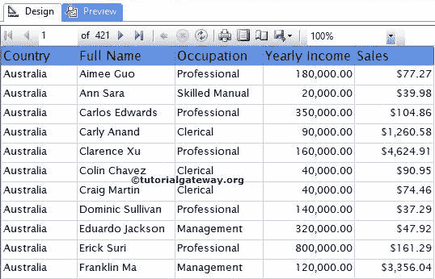
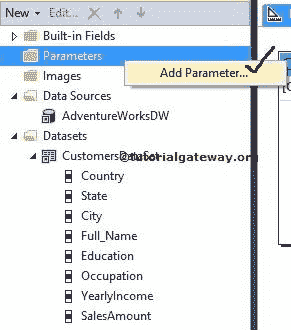
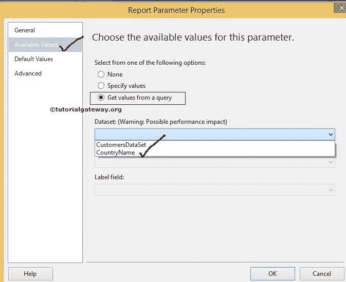
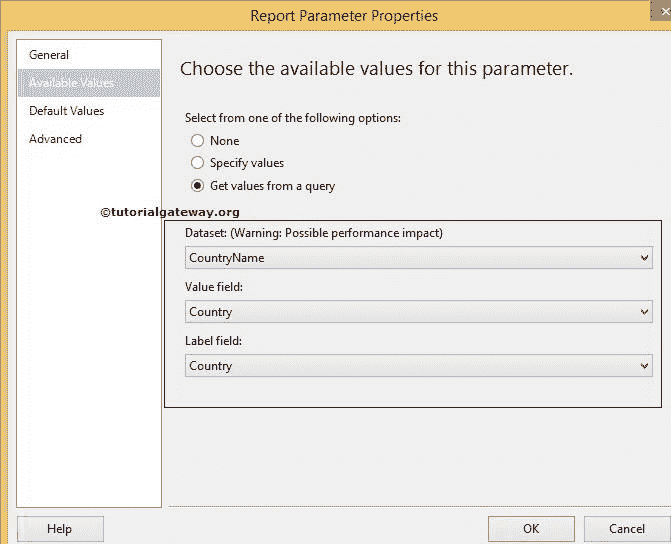

# SSRS 多值参数

> 原文：<https://www.tutorialgateway.org/ssrs-multi-value-parameter/>

SSRS 多值参数允许用户从列表中选择多个值，并使用用户选择的值过滤报告数据。或者，SSRS 多值参数使用户能够使用多个值动态过滤 SSRS 报告。

在本文中，我们将通过一个例子向您展示如何在 SSRS 添加一个多值参数。

我们将使用下面显示的报告来解释表格报告中的 SSRS 多值参数过滤器。请参考[表报](https://www.tutorialgateway.org/ssrs-table-report/)文章了解 [SSRS](https://www.tutorialgateway.org/ssrs/) 表报的创建。

如果您观察下面的截图，它是一个普通的表格报告，包含国家、全名、职业、年收入和销售额列。



下面的截图将向您展示我们用于此 SSRS 多值参数报告的[共享数据源](https://www.tutorialgateway.org/ssrs-shared-data-source/)和[数据集](https://www.tutorialgateway.org/shared-dataset-in-ssrs/)。


我们在上面截图中使用的 [SQL](https://www.tutorialgateway.org/sql/) 命令是:

```
SELECT Geo.[EnglishCountryRegionName] AS [Country]
      ,Geo.[StateProvinceName] AS [State]
      ,Geo.[City]
      ,Cust.FirstName +' '+ Cust.LastName AS [Full Name]  
      ,Cust.EnglishEducation AS Education 
      ,Cust.EnglishOccupation AS Occupation
      ,SUM(Cust.YearlyIncome) AS YearlyIncome
      ,SUM(Fact.SalesAmount)AS SalesAmount 
FROM  DimCustomer AS Cust
  INNER JOIN
      FactInternetSales AS Fact ON 
 Cust.CustomerKey = Fact.CustomerKey
 INNER JOIN
     [DimGeography] AS Geo ON
   Cust.GeographyKey = Geo.GeographyKey
 GROUP BY Geo.[EnglishCountryRegionName]
         ,Geo.[StateProvinceName] 
	 ,Geo.[City]
	 ,Cust.FirstName
         ,Cust.LastName  
         ,Cust.EnglishEducation 
         ,Cust.EnglishOccupation 
  ORDER BY [Country]

```

## 添加 SSRS 多值参数过滤器

在我们开始创建 SSRS 多值参数之前。让我们从[adventureworksdw 2014]


的[DimGeography]表中再创建一个包含不同国家/地区名称的数据集

[SQL](https://www.tutorialgateway.org/sql/) 我们在上面截图中使用的命令是:

```
SELECT [EnglishCountryRegionName] AS [Country]

FROM [DimGeography]
```

右键单击报告数据选项卡中的参数文件夹，将打开上下文菜单选择添加参数..选项。



单击添加参数后..选项，它将打开一个名为“报告参数属性”的新窗口来配置参数属性。

*   名称:请根据您的要求指定有效的参数名称。这里，我们将其定义为 CountryParameter
*   提示:您在此指定的文本将在文本框前显示为标签
*   数据类型:国家名称是文本数据类型，所以我们保持默认文本不变
*   允许多个值:如果您希望允许用户选择多个值，请选中此选项。


接下来，我们必须选择可用值，如下图所示。如果可以手动指定值，可以选择“指定值”选项并手动输入值。

在这个 SSRS 多值参数示例中，我们希望使用我们之前创建的国家名称数据集。因此，选择从查询选项中获取值，并从列表中选择数据集。



请指定值字段和标签字段。这里，我们只有一列，所以两列都是国家。

*   值字段:发送到查询的值。将使用此值过滤报告。
*   标签字段:该值显示给最终用户。



单击确定完成 SSRS 多值参数的配置。现在，我们必须对数据集应用过滤条件。有关过滤器的创建，请参考 SSRS 文章中的[数据集级过滤器。](https://www.tutorialgateway.org/filters-at-dataset-level-in-ssrs/)

从报告数据选项卡中选择数据集，右键单击它将打开上下文菜单。请选择数据集属性..选项


在这个 SSRS 多值参数示例中，我们将显示其国家出现在[国家参数]中的记录。因此，请选择国家作为表达式，选择运算符作为 [SQL IN 运算符](https://www.tutorialgateway.org/sql-in-operator/)，选择值作为参数名称。

如果您发现参数名称难以书写，请点击 fx 按钮并从图形用户界面中选择参数名称。


单击确定，在数据集级别完成 SSRS 多值参数过滤器的配置。让我们单击预览选项卡来预览数据。


从上面的截图中，可以看到它显示了一个空白报告，允许我们从我们创建的数据集中的所有国家/地区名称列表中选择多个值。要显示记录，我们必须从列表中选择国家/地区名称，然后按回车键。

目前，我们选择了加拿大和德国作为国家名称。

