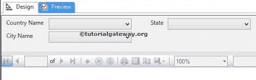
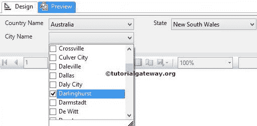

# SSRS 的多重参数

> 原文：<https://www.tutorialgateway.org/multiple-parameters-in-ssrs/>

SSRS 的多参数允许用户使用多个参数值动态过滤 SSRS 报告。这类似于在 Flipkart 和亚马逊等电子商务网站上选择品牌、尺寸和价格范围。

本文将通过一个示例向您展示如何在 SSRS 或 SQL Server Reporting Services 中添加多个参数。

我们使用下面显示的报告来解释 SSRS 报告中的多个参数。请参考[表报](https://www.tutorialgateway.org/ssrs-table-report/)文章了解 [SSRS](https://www.tutorialgateway.org/ssrs/) 表报的创建。如果您观察下面的截图，它是一个普通的表格报告，包含国家、州、城市、全名、职业、年收入和销售金额列。


下面的截图显示了我们用于本报告的[数据源](https://www.tutorialgateway.org/ssrs-shared-data-source/)和[数据集](https://www.tutorialgateway.org/shared-dataset-in-ssrs/)。


我们在上面截图中使用的 [SQL](https://www.tutorialgateway.org/sql/) 命令是:

```
SELECT Geo.[EnglishCountryRegionName] AS [Country]
      ,Geo.[StateProvinceName] AS [State]
      ,Geo.[City]
      ,Cust.FirstName +' '+ Cust.LastName AS [Full Name]  
      ,Cust.EnglishEducation AS Education 
      ,Cust.EnglishOccupation AS Occupation
      ,SUM(Cust.YearlyIncome) AS YearlyIncome
      ,SUM(Fact.SalesAmount)AS SalesAmount 
FROM  DimCustomer AS Cust
  INNER JOIN
      FactInternetSales AS Fact ON 
 Cust.CustomerKey = Fact.CustomerKey
 INNER JOIN
     [DimGeography] AS Geo ON
   Cust.GeographyKey = Geo.GeographyKey
 GROUP BY Geo.[EnglishCountryRegionName]
         ,Geo.[StateProvinceName] 
	 ,Geo.[City]
	 ,Cust.FirstName
         ,Cust.LastName  
         ,Cust.EnglishEducation 
         ,Cust.EnglishOccupation 
  ORDER BY [Country]

```

## 在 SSRS 添加多个参数

在我们开始创建国家参数之前。让我们在报告数据选项卡中创建一个数据集。首先，我们正在[adventureworksdw 2014]


中创建一个包含不同国家/地区名称的[嵌入式数据集](https://www.tutorialgateway.org/embedded-dataset-in-ssrs/)

我们在上面截图中使用的 SQL 命令是:

```
SELECT [EnglishCountryRegionName] AS [Country]

FROM [DimGeography]
```

要在 SSRS 添加多个参数，右键单击报告数据选项卡中的参数文件夹，将打开上下文菜单选择添加参数..选项。


单击添加参数后..选项，它将打开一个名为“报告参数属性”的新窗口来配置参数属性。请为报告参数提供有效的名称、提示文本和数据类型。

允许多个值:如果您希望允许用户选择多个值，请选中此选项。请参考 [SSRS 多值参数](https://www.tutorialgateway.org/ssrs-multi-value-parameter/)一文，了解多值的用法。


接下来，我们必须选择可用值。如果可以手动指定值，可以选择“指定值”选项并手动输入值。

在这个 SSRS 多参数示例中，我们希望使用我们之前创建的国家名称数据集。因此，选择从查询选项中获取值，并从列表中选择数据集。


请指定值字段和标签字段。这里，我们只有一列，所以两列都是国家。

*   值字段:发送到查询的值。将使用此值过滤报告。
*   标签字段:该值显示给最终用户。


单击确定完成国家参数的配置。

接下来，我们将从[AdventureWorksDW2014]中的[DimGeography]表创建一个包含不同州名的[嵌入式数据集](https://www.tutorialgateway.org/embedded-dataset-in-ssrs/)。我们在下面截图中使用的 SQL 命令是:

```
SELECT DISTINCT 
         A1.[EnglishCountryRegionName]
        ,A2.[StateProvinceName]
FROM [DimGeography] AS A1
    ,[DimGeography] AS A2
WHERE A1.[EnglishCountryRegionName] = A2.[EnglishCountryRegionName]
ORDER BY [StateProvinceName]
```


接下来，我们必须再创建一个参数来保存状态信息。因此，右键单击报告数据选项卡中的参数文件夹将打开上下文菜单，选择添加参数..选项。

请为报告参数提供有效的名称、提示文本和数据类型。如果您想允许用户选择多个值，请选中此允许多个值选项。


在这个 SSRS 多参数示例中，我们希望使用我们之前创建的 StateDS 数据集。选择从查询选项中获取值，并从列表中选择数据集。接下来，我们将[州/省名称]指定为值字段和标签字段。


单击确定完成状态参数的配置。

接下来，我们将从[AdventureWorksDW2014]中的[DimGeography]表中创建一个包含不同城市名称的[嵌入式数据集](https://www.tutorialgateway.org/embedded-dataset-in-ssrs/)。我们在下面截图中使用的 SQL 命令是:

```
SELECT DISTINCT 
         A1\. [StateProvinceName]
        ,A2.City 
FROM [DimGeography] AS A1
    ,[DimGeography] AS A2
WHERE A1.StateProvinceName = A2.StateProvinceName
ORDER BY City
```


接下来，我们必须再创建一个参数来保存城市信息。因此，右键单击报告数据选项卡中的参数文件夹将打开上下文菜单，选择添加参数..选项。

请为报告参数提供有效的名称、提示文本和数据类型。如果您想允许用户选择多个值，请选中此允许多个值选项。


在这个 SSRS 多参数示例中，我们希望使用之前创建的城市数据集，因此，请从查询选项中选择获取值，并从列表中选择数据集。接下来，我们将[城市]列指定为值字段和标签字段。


我们已经成功地为国家名称、州名和城市创建了三个数据集和三个参数。

现在，我们必须对数据集应用过滤条件。有关过滤器的创建，请参考 SSRS 文章中的[数据集级过滤器。](https://www.tutorialgateway.org/filters-at-dataset-level-in-ssrs/)

从报告数据选项卡中选择数据集，右键单击它将打开上下文菜单。请选择数据集属性..选项


在这个 SSRS 多参数示例中，我们将显示其[国家名称]出现在[国家参数]中、[州名]出现在[州参数]中以及[城市名称]出现在[城市参数]中的记录。因此，我们为国家、州和城市创建了三个过滤器。


这里我们使用运算符作为 [SQL IN 运算符](https://www.tutorialgateway.org/sql-in-operator/)。如果您发现参数名称难以书写，请点击 fx 按钮并从图形用户界面中选择参数名称。

点击【确定】完成数据集级过滤器的配置。让我们单击预览选项卡来预览数据。



从上面的截图中，可以看到它显示了一个空白报告，允许我们从我们创建的数据集中的国家名称、州和城市中选择多个值。



要显示记录，我们必须从列表中选择国家名、州名和城市名，然后按回车键。

目前，我们选择了澳大利亚国家、新南威尔士州、考夫斯港和达林格尔斯特市。


在这个 SSRS 多参数的例子中，如果你知道每个国家的所有州和城市名称，你就不会遇到任何问题。如果你不记得他们了呢？。为了解决这些情况，我们必须使用 [SSRS 级联参数](https://www.tutorialgateway.org/ssrs-cascading-parameters/)来过滤数据。