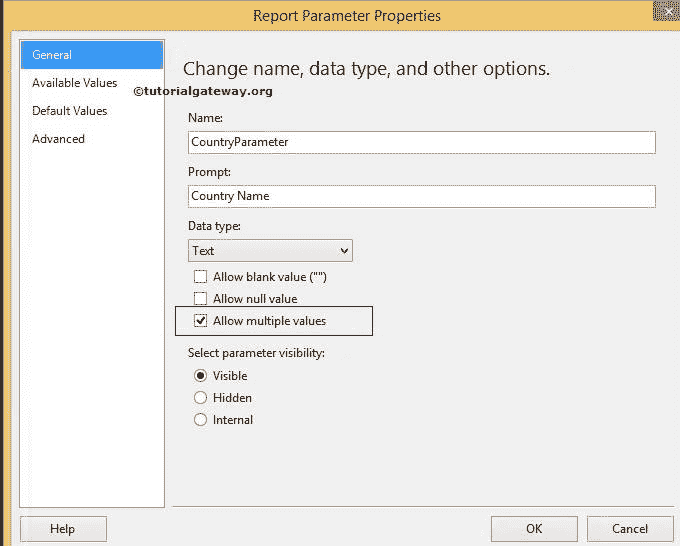
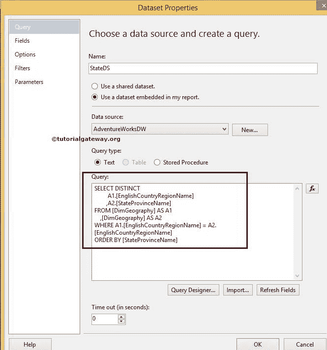
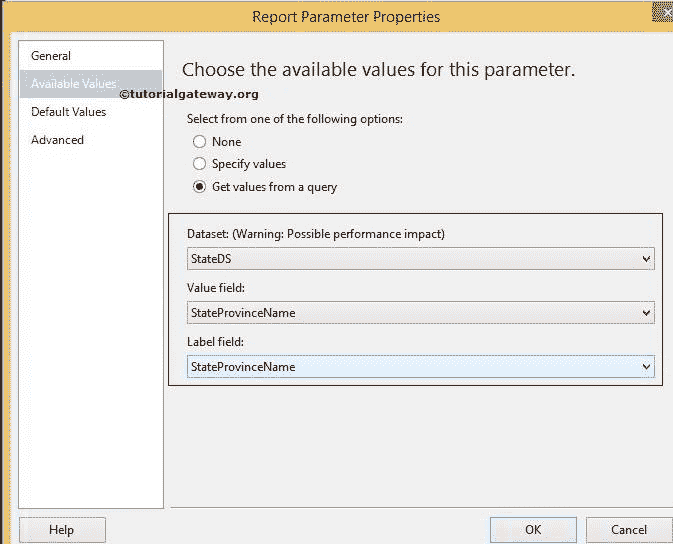
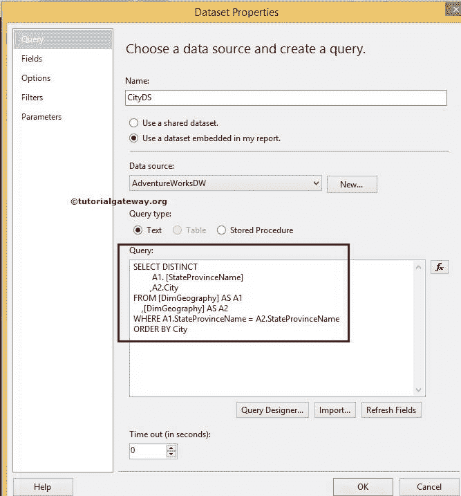
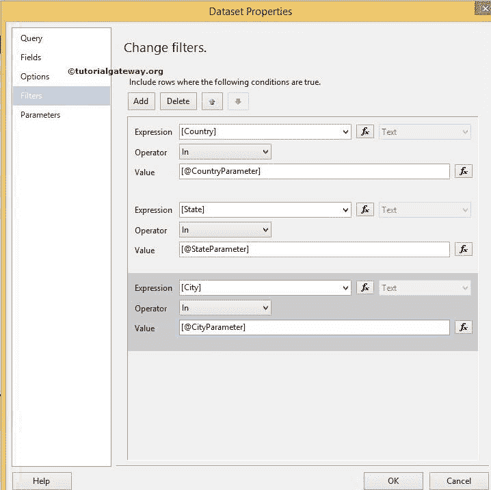

# SSRS 级联参数

> 原文：<https://www.tutorialgateway.org/ssrs-cascading-parameters/>

在 SQL Server Reporting Services 或 SSRS 中，级联参数意味着一个参数值将根据其他参数进行筛选。在本文中，我们将向您展示如何配置 SSRS 级联参数的示例。

我们将使用下图所示的报告来解释报告中的 SSRS 级联参数。请参考 [SSRS 表报告](https://www.tutorialgateway.org/ssrs-table-report/)文章了解 [SSRS](https://www.tutorialgateway.org/ssrs/) 表报告。

如果您观察下面的截图，它是一个包含国家、州、城市、全名、职业、年收入和销售金额列的标准表格报告。


下面的截图将向您展示我们用于此报告的[数据源](https://www.tutorialgateway.org/ssrs-shared-data-source/)和[数据集](https://www.tutorialgateway.org/shared-dataset-in-ssrs/)。


[SQL](https://www.tutorialgateway.org/sql/) 我们在上面截图中使用的命令是:

```
SELECT Geo.[EnglishCountryRegionName] AS [Country]
      ,Geo.[StateProvinceName] AS [State]
      ,Geo.[City]
      ,Cust.FirstName +' '+ Cust.LastName AS [Full Name]  
      ,Cust.EnglishEducation AS Education 
      ,Cust.EnglishOccupation AS Occupation
      ,SUM(Cust.YearlyIncome) AS YearlyIncome
      ,SUM(Fact.SalesAmount)AS SalesAmount 
FROM  DimCustomer AS Cust
  INNER JOIN
      FactInternetSales AS Fact ON 
 Cust.CustomerKey = Fact.CustomerKey
 INNER JOIN
     [DimGeography] AS Geo ON
   Cust.GeographyKey = Geo.GeographyKey
 GROUP BY Geo.[EnglishCountryRegionName]
         ,Geo.[StateProvinceName] 
	 ,Geo.[City]
	 ,Cust.FirstName
         ,Cust.LastName  
         ,Cust.EnglishEducation 
         ,Cust.EnglishOccupation 
  ORDER BY [Country]

```

## 配置 SSRS 级联参数

为了解释 SSRS 的级联参数，我们将创建三个[报告参数](https://www.tutorialgateway.org/ssrs-report-parameters/)，如国家、州和城市。在最终报告中，如果选择美国作为国家，则州参数必须显示属于美国的所有州。接下来，如果您选择纽约作为一个州，那么 City 参数必须使用 SSRS 级联参数显示纽约的城市。

首先，我们正在[adventureworksdw 2014]


中创建一个包含不同国家/地区名称的[嵌入式数据集](https://www.tutorialgateway.org/embedded-dataset-in-ssrs/)

我们在上面截图中使用的 SQL 命令是:

```
SELECT [EnglishCountryRegionName] AS [Country]

FROM [DimGeography]
```

右键单击报告数据选项卡中的参数文件夹，将打开上下文菜单选择添加参数..选项。


单击添加参数后..选项，它将打开一个名为“报告参数属性”的新窗口来配置参数属性。请为报告参数提供有效的名称、提示文本和数据类型。

允许多个值:如果您希望允许用户选择多个值，请选中此选项。请参考 [SSRS 多值参数](https://www.tutorialgateway.org/ssrs-multi-value-parameter/)一文，了解多值的用法。



接下来，我们必须选择可用值。如果可以手动指定值，可以选择“指定值”选项并手动输入值。

在这个例子中，我们想使用我们之前创建的国家名称数据集。因此，选择从查询选项中获取值，并从列表中选择数据集。接下来，我们将[国家]指定为值字段和标签字段。


单击确定完成国家参数的配置。

接下来，我们将从[AdventureWorksDW2014]中的[DimGeography]表创建一个包含不同州名的[嵌入式数据集](https://www.tutorialgateway.org/embedded-dataset-in-ssrs/)。我们在下面截图中使用的 SQL 命令是:

```
SELECT DISTINCT 
         A1.[EnglishCountryRegionName]
        ,A2.[StateProvinceName]
FROM [DimGeography] AS A1
    ,[DimGeography] AS A2
WHERE A1.[EnglishCountryRegionName] = A2.[EnglishCountryRegionName]
ORDER BY [StateProvinceName]
```



接下来，我们必须再创建一个参数来保存状态信息。因此，右键单击报告数据选项卡中的参数文件夹，并选择添加参数..选项。

请为报告参数提供有效的名称、提示文本和数据类型。如果您希望允许用户选择多个值，请选中“允许多个值”选项。


在本例中，我们希望使用我们之前创建的 StateDS 数据集。因此，选择从查询选项中获取值，并从列表中选择数据集。接下来，我们将[州/省名称]指定为值字段和标签字段。



单击确定完成状态参数的配置。

接下来，我们将从[AdventureWorksDW2014]中的[DimGeography]表中创建一个包含不同城市名称的[嵌入式数据集](https://www.tutorialgateway.org/embedded-dataset-in-ssrs/)。我们在下面截图中使用的 SQL 命令是:

```
SELECT DISTINCT 
         A1\. [StateProvinceName]
        ,A2.City 
FROM [DimGeography] AS A1
    ,[DimGeography] AS A2
WHERE A1.StateProvinceName = A2.StateProvinceName
ORDER BY City
```



接下来，我们必须再创建一个参数来保存城市信息。因此，右键单击报告数据选项卡中的参数文件夹将打开上下文菜单，选择添加参数..选项。

请为报告参数提供有效的名称、提示文本和数据类型。选中此允许多个值选项，允许用户选择多个值。


在本例中，我们希望使用我们之前创建的城市数据集。选择从查询选项中获取值，并从列表中选择数据集。接下来，我们将[城市]列指定为值字段和标签字段。


我们已经成功地为国家名称、州名和城市创建了三个数据集和三个参数。现在，我们必须对数据集应用过滤条件。有关过滤器的创建，请参考 SSRS 文章中的[数据集级过滤器。](https://www.tutorialgateway.org/filters-at-dataset-level-in-ssrs/)

### SSRS 级联参数示例

为了显示 SSRS 级联参数功能，我们必须应用过滤条件。因此，从报告数据选项卡中选择数据集，右键单击它将打开上下文菜单。请选择数据集属性..选项


单击添加参数后..选项，它将打开一个名为“报告参数属性”的新窗口来配置参数属性。

首先，选择之前创建的状态，并添加如下所示的过滤器。该过滤器允许 SSRS 报告根据所选国家过滤状态(参数数据)。


其次，选择之前创建的城市，并添加如下所示的过滤器。该过滤器允许 SSRS 报告根据选定的州过滤城市(参数数据)。


在这个 SSRS 级联参数示例中，我们将显示其[国家/地区名称]出现在[国家/地区参数]中、[州/省名称]出现在[州/省参数]中以及[城市名称]出现在[城市参数]中的记录。因此，我们为国家、州和城市创建了三个过滤器。

这里我们使用运算符[作为运算符](https://www.tutorialgateway.org/sql-in-operator/)。如果您发现参数名称难以书写，请点击 fx 按钮并从图形用户界面中选择参数名称。



单击确定完成数据集级别的过滤器配置。让我们单击预览选项卡来预览数据。


从上面的截图中，您可以看到它显示了一个空白报告，允许我们仅从国家/地区名称中选择多个值。“州”和“城市”值的其余参数被禁用。选择国家/地区名称后，将启用状态参数进行选择，并显示与所选国家/地区对应的状态。这在 SSRS 被称为级联参数。

这里我们选择英国作为国家名称，因此它显示英国境内的州(根据数据集)。接下来，我们从英国选择了英国。


这里，我们选择了英国的伯明翰、利物浦和伦敦


在 SSRS 级联参数报表


中按回车键预览数据