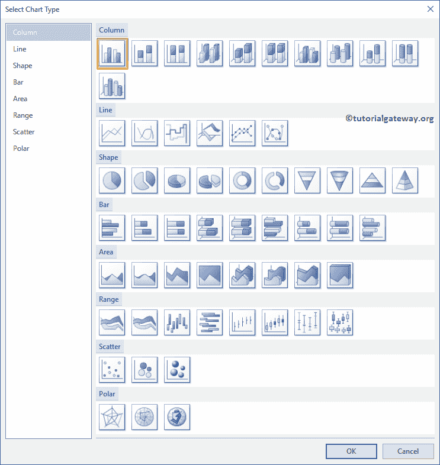

# SSRS 的图表

> 原文：<https://www.tutorialgateway.org/charts-in-ssrs/>

报告工具对于根据业务需求分析数据非常有用。在调查数据时，一些公司可能对表或矩阵报告感兴趣。然而，大多数公司使用图表(数据的图形表示)来查看趋势、销售比较等。

与其他报告工具一样， [SQL Reporting Services](https://www.tutorialgateway.org/ssrs/) 也提供了几个内置图表来可视化数据。在这一部分，我们展示了 SSRS 的可用图表列表。

## SSRS 图表列表

下面的屏幕截图显示了 SSRS 或 SQL Reporting Services 中可用的图表列表。

SSRS 图表的详细列表如下所示。下面指定的所有标题都是超链接。所以点击它们会给你看一个特别的例子。

1.  [列](https://www.tutorialgateway.org/column-chart-in-ssrs/):适合比较。您可以使用按月比较销售额，或者将今年的销售额与往年进行比较，等等。请记住，我们还在[格式化栏](https://www.tutorialgateway.org/formatting-column-chart-in-ssrs/)中解释了格式化栏选项，请参考相同内容。
2.  [堆积条](https://www.tutorialgateway.org/stacked-bar-chart-in-ssrs/):有助于进一步分割列或条
3.  [线](https://www.tutorialgateway.org/line-chart-in-ssrs/):可以用这个 SSRS 图显示趋势。例如，销售趋势，连续时期的温度。
4.  [饼图](https://www.tutorialgateway.org/pie-chart-in-ssrs/):显示高层数据很有用。请记住，我们还在[格式化派](https://www.tutorialgateway.org/formatting-pie-chart-in-ssrs/)中解释了格式化派技术。
5.  [漏斗](https://www.tutorialgateway.org/funnel-chart-in-ssrs/):分阶段可视化数据很有用。
6.  [金字塔](https://www.tutorialgateway.org/pyramid-chart-in-ssrs/):类似漏斗，分阶段查看数据有帮助。
7.  [区域图](https://www.tutorialgateway.org/area-chart-in-ssrs/):用于图形化表示定量数据。
8.  [范围图](https://www.tutorialgateway.org/range-chart-in-ssrs/):可以用这个来可视化最小值和最大值之间的数据。
9.  [散点图](https://www.tutorialgateway.org/scatter-plot-in-ssrs/):该图对于可视化任意两组数据之间的关系非常有用
10.  [气泡](https://www.tutorialgateway.org/bubble-chart-in-ssrs/):可以用这个 SSRS 图显示三维数据。或者你可以在地图上使用它们
11.  [雷达](https://www.tutorialgateway.org/radar-chart-in-ssrs/):360 度数值数据可视化非常有用。

SSRS 还提供了[数据条](https://www.tutorialgateway.org/data-bars-in-ssrs/)、[仪表](https://www.tutorialgateway.org/gauges-in-ssrs/)、[火花线](https://www.tutorialgateway.org/sparkline-in-ssrs/)和[指示器](https://www.tutorialgateway.org/indicators-in-ssrs/)。您可以在[矩阵](https://www.tutorialgateway.org/ssrs-matrix-report/)或[表](https://www.tutorialgateway.org/ssrs-table-report/)报告中使用这些。