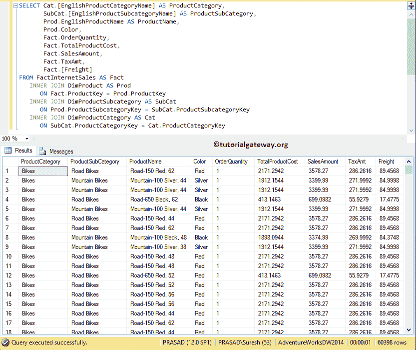
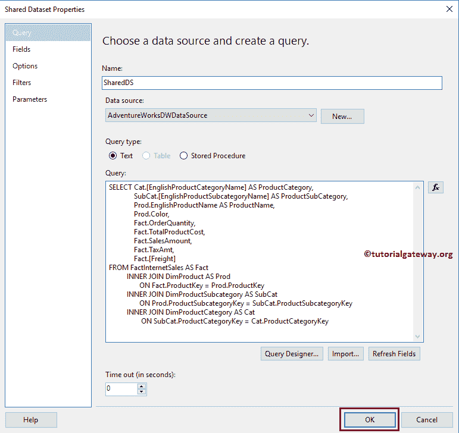
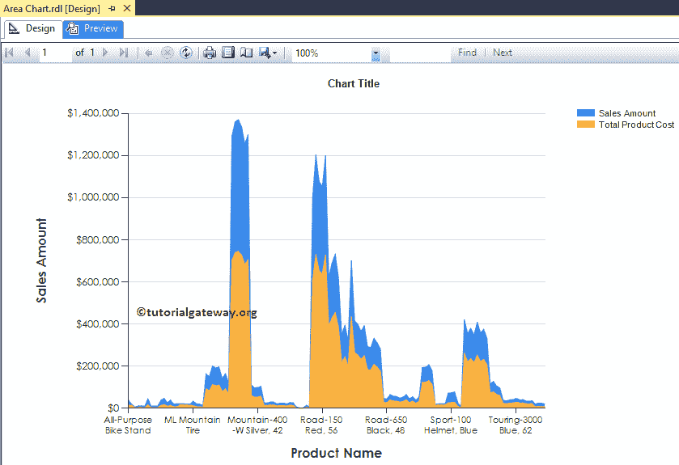
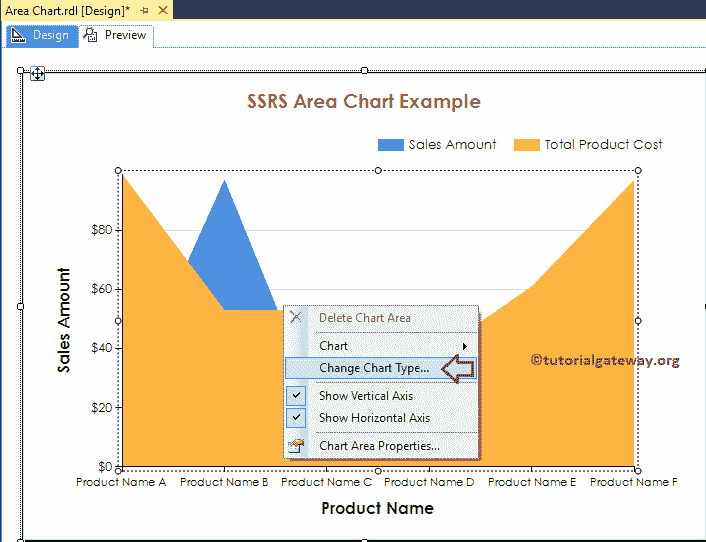

# SSRS 的区域图

> 原文：<https://www.tutorialgateway.org/area-chart-in-ssrs/>

在本文中，我们将通过一个示例向您展示如何在 SSRS 创建区域图，如何在 SSRS 或 SQL Reporting Services 中更改图表标题、图例位置、图例标题、区域图字体样式、区域图模型和三维区域图。

对于这个 SSRS 区域图的例子，我们使用了定制的 SQL 查询:

```
-- SQL Query that we use in SSRS Area Chart
SELECT Cat.[EnglishProductCategoryName] AS ProductCategory, 
       SubCat.[EnglishProductSubcategoryName] AS ProductSubCategory, 
       Prod.EnglishProductName AS ProductName, 
       Prod.Color, 
       Fact.OrderQuantity, 
       Fact.TotalProductCost, 
       Fact.SalesAmount, 
       Fact.TaxAmt, 
       Fact.[Freight]
FROM FactInternetSales AS Fact
   INNER JOIN DimProduct AS Prod
      ON Fact.ProductKey = Prod.ProductKey
   INNER JOIN DimProductSubcategory AS SubCat
      ON Prod.ProductSubcategoryKey = SubCat.ProductSubcategoryKey 
   INNER JOIN DimProductCategory AS Cat 
      ON SubCat.ProductCategoryKey = Cat.ProductCategoryKey
```

而它要返回的 [SQL](https://www.tutorialgateway.org/sql/) 数据是:



## 在 SSRS 创建区域图

在本例中，我们将在 SSRS 创建一个区域图，以显示按产品名称分组的销售额和产品总成本。下图显示了我们用于此区域图报告的[数据源](https://www.tutorialgateway.org/ssrs-shared-data-source/)和[数据集](https://www.tutorialgateway.org/shared-dataset-in-ssrs/)。



在 [SSRS](https://www.tutorialgateway.org/ssrs/) 报表设计中，我们可以通过将 Chart 属性从 SSRS 工具箱拖动到设计空间来添加区域图，或者我们可以右键单击报表设计器来打开上下文菜单。从上下文菜单中，请选择插入- >图表选项，如下所示。


选择“图表”选项后，“选择图表类型”窗口将打开，以选择所需的图表。对于这个例子，我们选择了如下截图所示的区域图。


单击“确定”按钮后，区域图将显示在带有虚拟数据的设计区域中。


单击区域图周围的空白区域将打开图表数据窗口

*   值:任何数字(公制)值，如总销售额、销售额、客户数量、税。所有这些值将使用一个聚合函数进行聚合，如总和、平均值、计数。因为我们用类别组项目对它们进行分组。
*   类别组:请指定要在其上划分区域图的列名。
*   系列组:指定进一步对单个类别进行分组的维


将“销售额”列从数据集拖放到图表数据值，将“产品名称”拖放到类别组。


单击预览选项卡查看报告预览。


如果你观察上面的截图，它给出了一个完美的结果。让我在“价值”部分再添加一个度量值“产品总成本”。


现在你可以看到我们的区域图显示的是产品成本和销售金额


之间的差异

## 格式化 SSRS 的区域图

下面的示例列表将向您展示格式化区域图所涉及的步骤

### 更改区域图的轴属性

右键单击区域图的轴，并选择水平轴属性..选项来格式化轴值。


在这里，我们更改了 SSRS 区域图表水平轴的字体样式和字体大小。


接下来，右键单击区域图的垂直轴，并选择垂直轴属性..选项来格式化轴值。


请使用上面指定的技术来更改垂直轴的字体。接下来，通过选择“数字”选项卡格式化纵轴中的数字。


### 更改 SSRS 区域图的轴标题

要更改区域图坐标轴标题，请选择坐标轴标题区域，并根据需要进行更改。或者，右键单击它以选择轴标题属性..选项。


它会打开一个名为“轴标题属性”窗口的新窗口。在“常规”部分，我们可以根据需要更改标题文本。目前，我们将其更改为产品名称


在“字体”选项卡下，我们可以更改字体样式、大小和颜色。现在，我们将颜色改为深绿色，字体改为世纪哥特式，大小改为 12pt，样式改为粗体


请将相同的属性应用于 Y 轴。完成后，单击预览选项卡查看报告预览。



### 更改 SSRS 区域图标题

要更改 SSRS 地区图表标题，请选择图表标题区域，并进行更改。或者，右键单击它并选择标题属性..选项。


这里我们将标题更改为“SSRS 区域图示例”，因为报告显示的是相同的


### 格式化 SSRS 区域图标题字体

它解释了如何在 SSRS 改变区域图的倾斜字体。为此，在字体选项卡中，我们可以更改区域图标题的字体大小、字体系列、字体样式和颜色。

在这里，我们将字体改为世纪哥特式，字体大小改为 14pt，颜色改为棕色，如下图截图所示


### 区域图的格式图例

要格式化 SSRS 区域图表图例区域，请选择图例区域，右键单击它将打开上下文菜单。请从菜单中选择图例属性选项。


它会打开一个名为“图例属性”的新窗口。在常规选项卡中，使用图例位置通过更改点位置来更改图例位置。

现在，我们将位置从默认的右上角更改为中间。


在“字体”选项卡下，我们可以更改图例的字体样式、大小和颜色。现在，我们将字体改为世纪哥特式，大小改为 10pt


单击确定按钮关闭图例属性窗口。接下来，点击 SSRS 地区图表预览选项卡，查看


报告预览

## SSRS 的不同区域图

您可以选择向系列组中再添加一个维度，以进一步划分 SSRS 区域图。目前，我们正在为系列组


添加颜色

让我给你看看


的区域图预览

SSRS 允许我们改变图表类型，即使在创建了区域图。首先，选择区域图，右键单击它，从上下文菜单



中选择“更改图表类型”选项

选择“更改图表类型...”选项后，它将打开一个名为“选择图表类型”的新窗口来选择更改。这里我们选择的是三维区域图


点击预览查看


区域图报表预览

从上面的截图中，你可以观察到我们在 SSRS 成功地将图表类型从 2D 区域图更改为三维区域图