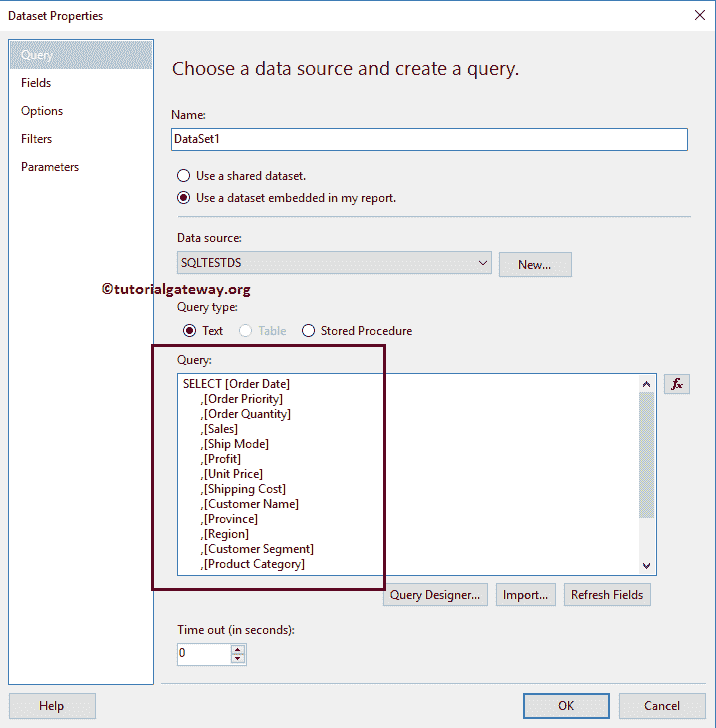
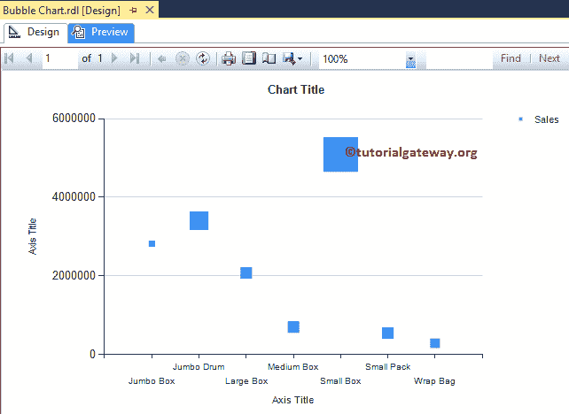
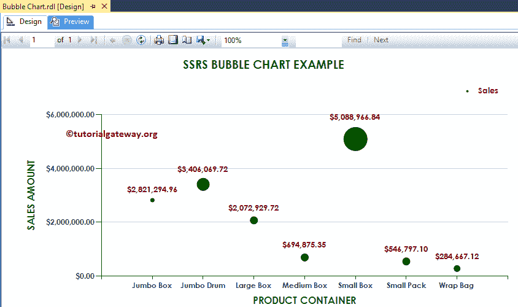

# SSRS 的泡沫图

> 原文：<https://www.tutorialgateway.org/bubble-chart-in-ssrs/>

SSRS 的泡泡图是用来显示圆形的数据。气泡图在创建地图时发挥了重要作用，因为我们可以在地图顶部使用气泡来显示利润或按邮政编码销售等。

在本文中，我们将通过一个示例向您展示如何在 SSRS 制作气泡图，如何在 SSRS 或 SQL Reporting Services 中将图表标题、图例位置、图例标题、字体样式和图表类型更改为三维气泡图。

对于这个 SSRS 气泡图示例，我们将使用自定义 SQL 查询:

```
-- SQL Query that we use in SSRS Bubble Chart
SELECT [Order Date]
      ,[Order Priority]
      ,[Order Quantity]
      ,[Sales]
      ,[Ship Mode]
      ,[Profit]
      ,[Unit Price]
      ,[Shipping Cost]
      ,[Customer Name]
      ,[Province]
      ,[Region]
      ,[Customer Segment]
      ,[Product Category]
      ,[Product Sub-Category]
      ,[Product Name]
      ,[Product Container]
  FROM [Super Store]
```

## 在 SSRS 创建气泡图

在本例中，我们将在 SSRS 创建一个气泡图来显示产品容器的销售额。下面的截图将向您展示我们用于此气泡图报告的[数据源](https://www.tutorialgateway.org/ssrs-shared-data-source/)和[数据集](https://www.tutorialgateway.org/shared-dataset-in-ssrs/)。



在 [SSRS](https://www.tutorialgateway.org/ssrs/) 报告设计中，我们可以通过将图表属性从 SSRS 工具箱拖到设计空间来添加气泡图。或者，我们可以右键单击报表设计器以打开上下文菜单。从上下文菜单中，请选择插入- >图表选项。


选择“图表”选项后，将打开一个名为“选择图表类型”的新窗口，从可用图表中选择所需的图表。在这个例子中，我们选择了一个气泡图。


单击“确定”按钮后，气泡图将显示在带有虚拟数据的设计区域中。


单击 SSRS 气泡图周围的空白区域将打开图表数据窗口

*   值:任何数字(公制)值，如总销售额、销售额、客户数量、税收等。所有这些值将使用聚合函数(总和、平均值、计数等)进行聚合。这是因为我们用类别组项目对它们进行分组。
*   类别组:请指定要在其上划分气泡图的列名。


将“销售指标”列从数据集中拖放到图表数据值，将“产品容器维度”拖放到类别组中。


单击预览选项卡查看报告预览。


如果你观察上面的截图，它提供了完美的结果，但是标记(方块)的大小是一样的。所以，让我根据利润维度来改变大小。


现在你可以看到方块以不同的大小显示(基于每个产品容器的利润)



虽然上面的图表显示了所需的结果，但它没有显示气泡。右键单击标记将打开上下文菜单。请从中选择系列属性。


单击系列属性选项后，将打开一个名为系列属性的新窗口。

在“标记”选项卡下，我们可以更改标记类型、颜色、大小、边框宽度和边框颜色。首先，让我将形状从无更改为圆形


让我把颜色改成深绿色


从报表预览中，可以看到我们成功更改了


的标记形状和颜色

## SSRS 的气泡图格式

以下示例将向您展示在 SSRS 格式化气泡图的步骤

### 更改 SSRS 气泡图的轴属性

右键单击气泡图的轴，并选择水平轴属性..选项来格式化轴值。


这里，我们将字体样式更改为世纪哥特式，颜色更改为深蓝色，字体样式更改为粗体，字体大小更改为横轴的 9pt。


接下来，右键单击区域图的垂直轴，并选择垂直轴属性..选项来格式化轴值。


请使用上面指定的技术来更改垂直轴的字体。接下来，通过选择“数字”选项卡来格式化纵轴中的数字。


### 更改 SSRS 气泡图的轴标题

要更改坐标轴标题，请选择坐标轴标题区域，并根据需要更改标题。或者，右键单击它并选择轴标题属性..选项。


它将打开一个名为轴标题属性窗口的新窗口。在“常规”部分，我们可以根据需要更改标题文本。目前，我们将其更改为产品容器


在字体选项卡下，我们可以更改坐标轴标题的字体样式、大小和颜色。现在，我们将颜色改为深绿色，字体改为世纪哥特式，大小改为 12pt，样式改为粗体


也请将相同的属性应用于 Y 轴。完成后，单击预览选项卡查看报告预览。


如果你观察上面的截图，它提供了一个完美的结果，但是我们无法确定确切的销售额。因此，让我们添加数据标签。

### 在 SSRS 向气泡图添加数据标签

要向 SSRS 气泡图添加文本或数据标签，右键单击气泡，并从菜单中选择显示数据标签选项，以显示值


接下来，让我格式化数据标签的字体。为此，请选择数据标签，右键单击它将打开上下文菜单。接下来，请从中选择系列标签属性选项。


这里我们将字体改为世纪哥特式，字体大小改为 10pt，字体颜色改为褐红色，样式改为粗体


接下来，通过选择数字选项卡将数字格式化为货币。


点击预览选项卡查看


报告预览

### 更改 SSRS 气泡图标题

要更改 SSRS 气泡图的标题，请选择图表标题区域，并根据您的要求更改标题。或者，右键单击它并选择标题属性..选项。


这里我们将标题改为 SSRS 气泡图示例，因为报告显示的是相同的


### 格式化 SSRS 气泡图标题字体

在字体选项卡中，我们可以更改气泡图标题的字体大小、字体系列、字体样式和颜色。这里我们将字体改为世纪哥特式，字体大小改为 14pt，颜色改为深绿色，如下图截图所示


### SSRS 气泡图的格式图例

要格式化 SSRS 气泡图图例区域，请选择图例区域，右键单击它将打开上下文菜单。请从列表中选择图例属性选项。


它将打开一个名为“图例属性窗口”的新窗口。在“常规”选项卡中，我们有一个名为“图例位置”的选项，通过更改点位置来更改图例位置。现在，我们将位置改为右上角。


接下来，在“字体”选项卡下，我们可以更改图例的字体样式、大小和颜色。现在，我们将字体改为世纪哥特式，颜色改为栗色，样式改为粗体，大小改为 10pt


点击确定按钮关闭属性窗口，点击预览选项卡，查看



SSRS 气泡图报表预览

## 在 SSRS 将 2D 气泡图转换为三维气泡图

SSRS 允许我们改变图表类型，即使是在创建了气泡图之后。首先，选择气泡图，右键单击它，从上下文菜单


中选择更改图表类型…选项

选择“更改图表类型...”选项后，它将打开一个名为“选择图表类型”的新窗口来选择更改。这里我们选择的是三维气泡图


点击预览选项卡，在 SSRS 报表预览


中查看三维气泡图

从上面的截图可以观察到，我们在 SSRS 成功的将图表类型从 2D 泡泡图改成了 3D 泡泡图