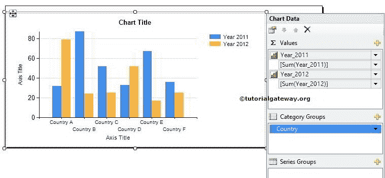

# SSRS 柱形图

> 原文：<https://www.tutorialgateway.org/column-chart-in-ssrs/>

SSRS 柱形图对比较很有用。通过查看柱形图，人们可以了解业务，而无需再担心。

例如，将今年的产品销售额与前一年进行比较，员工的月度/年度绩效，客户订单与去年或上个月或上周进行比较，等等。

在本文中，我们将通过一个例子向您展示如何在 SSRS 创建和配置柱形图。下面的截图将向您展示我们用于此 [SSRS](https://www.tutorialgateway.org/ssrs/) 柱形图报表的[数据源](https://www.tutorialgateway.org/ssrs-shared-data-source/)和[数据集](https://www.tutorialgateway.org/shared-dataset-in-ssrs/)。


[SQL](https://www.tutorialgateway.org/sql/) 我们在上面截图中使用的命令是:

```
-- SQL Query for the SSRS Column Chart
SELECT PivotTable.SalesTerritoryCountry, 
       [2010] AS [Year 2010],
       [2011] AS [Year 2011], 
       [2012] AS [Year 2012], 
       [2013] AS [Year 2013], 
       [2014] AS [Year 2014]
FROM (
      SELECT Ter.SalesTerritoryCountry
	    ,Dt.CalendarYear 
	    ,Fact.SalesAmount 
      FROM DimSalesTerritory AS Ter
	INNER JOIN
           FactInternetSales AS Fact ON 
	       Ter.SalesTerritoryKey = Fact.SalesTerritoryKey
	INNER JOIN
	   DimDate AS Dt ON
	       Dt.DateKey = Fact.OrderDateKey 
    ) AS SourceTable

PIVOT (
     SUM (SourceTable.SalesAmount) FOR 
	  SourceTable.CalendarYear IN
	   ([2010],[2011],[2012],[2013],[2014] )
      ) AS PivotTable
```

## 在 SSRS 创建柱形图

当您将图表从工具箱拖放到设计空间时，将打开一个名为“选择图表类型”的新窗口，从可用图表中选择所需的图表。在本例中，我们选择了简单柱形图，如下图所示。


单击“确定”按钮后，柱形图将显示在设计区域，并带有虚拟数据。


单击 SSRS 柱形图周围的空白处将打开图表数据窗口

*   值:任何数字(公制)值，如销售额、税、总销售额、客户数量等。所有这些值将使用聚合函数(求和、计数等)进行聚合。)因为我们用类别组项目对它们进行分组。
*   类别组:请指定要对柱形图进行分区的列名。


在本例中，我们将在 SSRS 创建 2011 年和 2012 年按国家销售的柱形图。因此，将 2011 年和 2012 年列从数据集拖放到类别组中的图表数据值和国家/地区名称。



单击预览按钮查看 SSRS 柱形图报告预览。


如果你观察上面的截图，它提供了一个完美的结果。但是，我们无法确定每个国家的确切销售额。为了解决这些情况，我们必须使用数据标签。

要将数据标签添加到 SSRS 的柱形图中，请右键单击蓝色条(代表 2011 年)。然后，从上下文菜单中选择“显示数据标签”选项以显示值。


第二，右击黄色条(代表 2012 年)。接下来，从上下文菜单中选择“显示数据标签”选项以显示值。

单击预览按钮查看柱形图报告预览。


请参考[格式化柱形图](https://www.tutorialgateway.org/formatting-column-chart-in-ssrs/)以一个实例了解格式化上述柱形图的步骤。