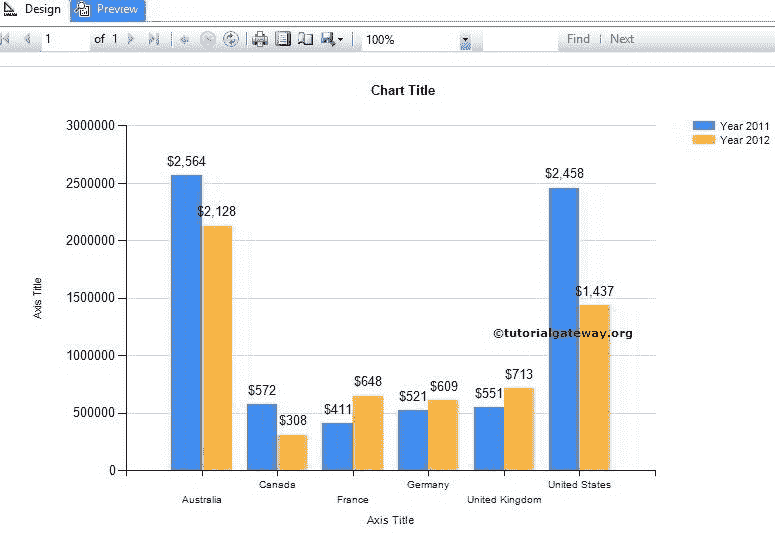
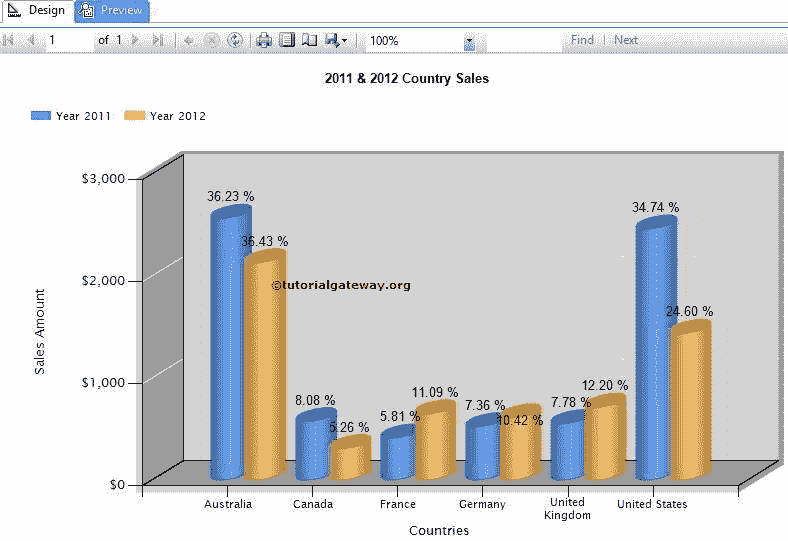
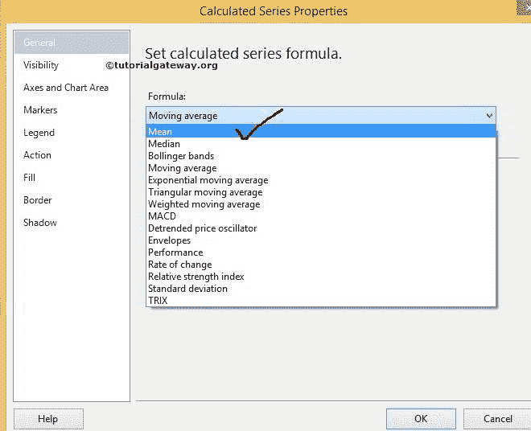

# 格式化 SSRS 的柱形图

> 原文：<https://www.tutorialgateway.org/formatting-column-chart-in-ssrs/>

在本文中，我们将向您展示在 SSRS 格式化柱形图所涉及的步骤。它包括如何更改柱形图标题、图例标题、图例位置、柱形图字体、柱形图模型、柱形图类型。

我们还将解释如何在柱形图上以标签形式显示百分比值，以及如何使用 exa 在 SSRS 或 SQL Server Reporting Services 中计算柱形图的平均值

## 格式化 SSRS 的柱形图

为了解释可用的格式选项，我们将使用下面显示的报告。请参考 [SSRS 柱状图](https://www.tutorialgateway.org/column-chart-in-ssrs/)文章，了解我们用于本次 [SSRS](https://www.tutorialgateway.org/ssrs/) 报告的[数据源](https://www.tutorialgateway.org/ssrs-shared-data-source/)和[数据集](https://www.tutorialgateway.org/shared-dataset-in-ssrs/)。

### 更改 SSRS 柱形图的标题

要更改柱形图标题，请选择图表标题区域，如下图所示

现在，根据您的要求更改标题。此处我们更改为 2011 & 2012 年国家销售，因为报告显示的是相同的

### 格式化柱形图在 SSRS 的图例位置

选择图例区域，右键单击它将打开上下文菜单。请从中选择

图例属性选项

提示:要显示柱形图图例标题，请从上面的截图中选择显示图例标题选项

在常规选项卡中，通过选择那些点位置

来更改图例位置

接下来，我们可以使用字体选项卡等更改柱形图图例的字体大小、字体系列、字体样式和颜色。

### 更改 SSRS 柱形图的轴标题

选择轴标题区域，右键单击它将打开上下文菜单。从菜单中，请选择轴标题属性选项，如下图所示

选择“轴标题属性”选项后，将出现一个名为“轴标题属性”的新窗口，用于配置标题文本、字体等。现在，我们将标题文本更改为国家，对齐方式更改为中心

接下来，我们可以使用字体选项卡更改柱形图坐标轴的字体大小、字体系列、字体样式和颜色。也请更改垂直轴标题。

### 更改 SSRS 的柱形图类型

SSRS 允许我们在创建图表后更改图表类型。首先，选择柱形图，右键单击它将打开上下文菜单。请从上下文菜单
中选择更改图表类型…选项

选择更改图表类型…选项后，它将打开一个新窗口来选择新图表。这里我们选择三维柱形图

单击“确定”完成

### 格式化 SSRS 柱形图的水平轴和垂直轴

选择水平轴区域，右键单击它将打开上下文菜单。请从菜单中选择横轴属性选项，如下图所示

一旦选择了水平轴属性选项，它将打开一个新窗口来格式化属性。这里，我们正在更改选择标签字体。你也可以试试别人

现在，选择垂直轴并转到垂直轴属性选项来配置它们。这里，我们通过将数值更改为货币
来格式化数值

点击确定按钮，预览报表

从上面的截图中，您可以观察到我们成功地更改并格式化了柱形图

### 在 SSRS 柱形图中将百分比值显示为数据标签

首先，在柱形图上选择 2011 年的数据标签，然后右键单击它们将打开上下文菜单。请从上下文菜单
中选择系列标签属性…选项

在常规选项卡中，请从下拉列表中选择标签数据为#PERCENT。选择百分比后，将显示一个弹出窗口，询问您是否要将 UseValueAsLable 设置为 false。请选择“是”，因为我们正在将默认值更改为百分比

单击“确定”完成 2011 年百分比值的配置。现在，对 2012 年

重复同样的过程

我们成功地将百分比显示为柱形图标签

### 计算 SSRS 柱形图的平均值

首先，在柱形图上选择 2011 年的数据标签，然后右键单击它们将打开上下文菜单。请从上下文菜单

中选择添加计算系列…选项

选择添加计算系列…选项后，它将打开一个名为计算系列属性的新窗口。

这里我们将计算平均值，因此从下拉列表中选择平均值，如下所示。你也可以试试别人

单击“确定”完成 2011 年平均值的计算。现在，对 2012 年
重复同样的过程

点击预览按钮预览 SSRS 专栏报告
