# SSRS 的数据栏

> 原文：<https://www.tutorialgateway.org/data-bars-in-ssrs/>

在本文中，我们将向您展示如何在 SSRS 创建和配置数据栏。为此，我们将使用下图所示的报告。

请参考 [SSRS 表报表](https://www.tutorialgateway.org/ssrs-table-report/)、[数据源](https://www.tutorialgateway.org/ssrs-shared-data-source/)、[数据集](https://www.tutorialgateway.org/shared-dataset-in-ssrs/)文章，了解 [SSRS](https://www.tutorialgateway.org/ssrs/) 数据源、数据集、表报表的创建。如果您观察下面的截图，它是一个带有州名和销售额列的标准表报告。

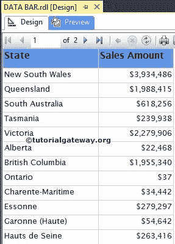

我们在这个 SSRS 数据条报告中用作[数据集](https://www.tutorialgateway.org/embedded-dataset-in-ssrs/)的命令是:

```
-- SQL Select Statement for SSRS Data Bars
SELECT Geo.EnglishCountryRegionName AS Country, 
       Geo.StateProvinceName AS State, 
       SUM(Cust.YearlyIncome) AS YearlyIncome, 
       SUM(Fact.SalesAmount) AS SalesAmount
FROM DimCustomer AS Cust 
    INNER JOIN
       FactInternetSales AS Fact ON 
  Cust.CustomerKey = Fact.CustomerKey 
    INNER JOIN
        DimGeography AS Geo ON 
  Cust.GeographyKey = Geo.GeographyKey
GROUP BY Geo.EnglishCountryRegionName, 
         Geo.StateProvinceName
ORDER BY Country
```

## 在 SSRS 创建数据栏

在本例中，我们将在销售额的右侧创建并添加 SSRS 数据条。首先，让我们通过右键单击“销售额”列来创建一个空列，并选择“插入列”选项，然后选择“右侧”选项，如下所示。

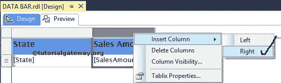

现在，将数据条从工具箱拖放到空列。当您将数据栏拖到空列时，将会打开一个名为“选择数据栏类型”的新窗口。使用此选项从可用列表中选择所需的数据栏或数据列。在这个 SSRS 的例子中，我们选择了简单数据栏。

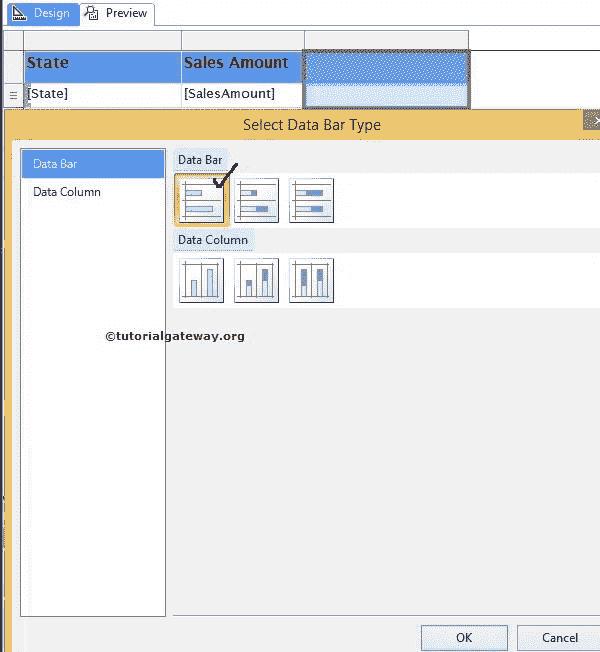

单击“确定”将数据条添加到新创建的空单元格中。

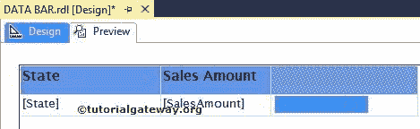

现在，我们必须在 SSRS 报告中配置数据条的值。首先，点击下方截图中的蓝色条将打开

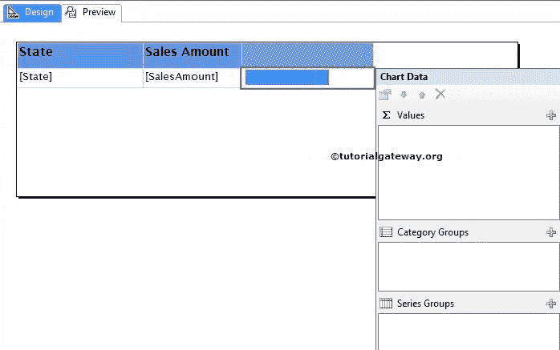

图表数据窗口

在本例中，我们希望在数据栏中显示销售额。因此，请拖放或选择销售金额作为图表值。

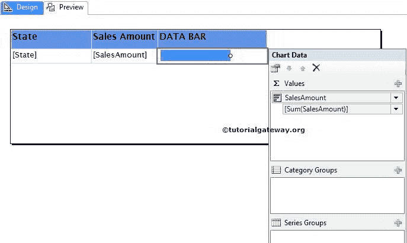

单击预览按钮查看 SSRS 数据条报告预览。

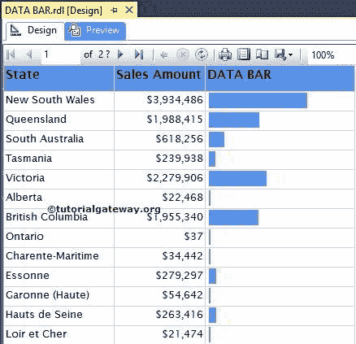

如果你观察上面的截图，它提供了一个完美的结果。但是，我们无法确定 SSRS 数据栏(各州的销售额)所代表的价值。为了解决这些情况，我们必须使用数据标签。

首先，右键单击蓝色条，并从上下文菜单中选择“显示数据标签”选项以显示值。

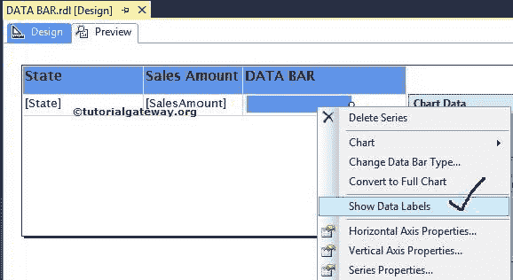

现在，让我们格式化数据标签产生的数字。首先，右键单击该值将打开上下文菜单。请选择系列标签属性..选项

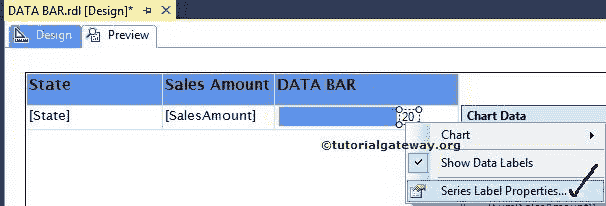

单击系列标签属性后..选项，将打开一个新窗口来格式化系列标签。在这里，我们将数字更改为货币，并删除十进制值。

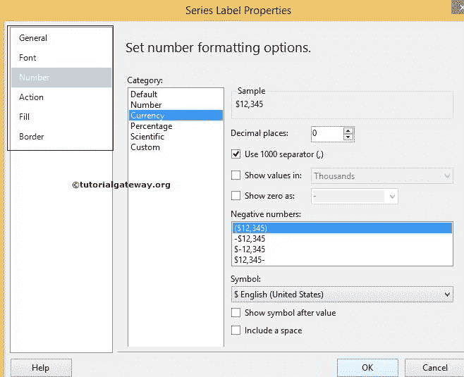

单击“确定”完成 SSRS 数据栏数据标签的格式化。让我们单击预览选项卡来查看报告预览。

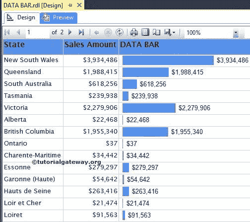

我们只是使用了 Tablix 级别的[排序](https://www.tutorialgateway.org/sorting-in-ssrs-2014/)按照销售额降序对数据进行排序。让我们看看现在的预览

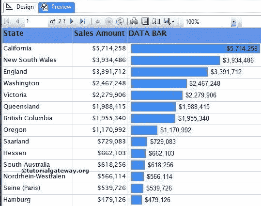

提示:请参考矩阵报告中的[数据条](https://www.tutorialgateway.org/data-bars-in-ssrs-matrix-reports/)了解矩阵报告中数据条的配置