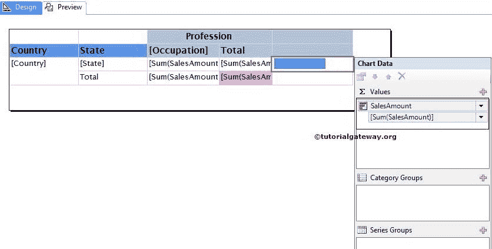

# SSRS 矩阵报告中的数据条

> 原文：<https://www.tutorialgateway.org/data-bars-in-ssrs-matrix-reports/>

实时情况下，我们主要使用矩阵报告中的数据条。在本文中，我们将向您展示如何在 SSRS 矩阵报告中创建和配置数据条。

提示:请参考[数据条](https://www.tutorialgateway.org/data-bars-in-ssrs/)文章，结合实例了解 [SSRS](https://www.tutorialgateway.org/ssrs/) 表格报告中数据条的配置。

我们将使用下图所示的矩阵报告来配置数据条。请参考 [SSRS 矩阵报告](https://www.tutorialgateway.org/ssrs-matrix-report/)、[数据源](https://www.tutorialgateway.org/ssrs-shared-data-source/)和[数据集](https://www.tutorialgateway.org/shared-dataset-in-ssrs/)文章，了解数据源、数据集和矩阵报告的创建。

如果您观察下面的截图，这是一个带有行总计、列总计和总计(粉色列)列的[向下钻取矩阵](https://www.tutorialgateway.org/drill-down-matrix-report-in-ssrs/)报告。


[我们用作](https://www.tutorialgateway.org/sql/)[数据集](https://www.tutorialgateway.org/embedded-dataset-in-ssrs/)的 SQL 命令是:

```
SELECT Geo.[EnglishCountryRegionName] AS [Country]
      ,Geo.[StateProvinceName] AS [State]
      ,Geo.[City]
      ,Cust.FirstName +' '+ Cust.LastName AS [Full Name]  
      ,Cust.EnglishEducation AS Education 
      ,Cust.EnglishOccupation AS Occupation
      ,Cust.[Gender]
      ,SUM(Cust.YearlyIncome) AS YearlyIncome
      ,SUM(Fact.SalesAmount)AS SalesAmount 
FROM  DimCustomer AS Cust
  INNER JOIN
      FactInternetSales AS Fact ON 
   Cust.CustomerKey = Fact.CustomerKey
  INNER JOIN
     [DimGeography] AS Geo ON
   Cust.GeographyKey = Geo.GeographyKey
 GROUP BY Geo.[EnglishCountryRegionName]
         ,Geo.[StateProvinceName] 
	 ,Geo.[City]
	 ,Cust.FirstName
         ,Cust.LastName  
         ,Cust.EnglishEducation 
         ,Cust.EnglishOccupation 
	 ,[Gender]
  ORDER BY [Country]
```

## SSRS 矩阵报告中的数据条

在本例中，我们将在“总计”列的右侧创建并添加数据栏。首先，让我们创建一个空列，方法是右键单击“总计”列，选择“插入列”选项，然后选择“右侧”选项。


现在，将数据条从工具箱拖放到空列。当您将数据栏拖动到空列时，将打开一个名为“选择数据栏类型”的新窗口，从可用的数据栏或数据列中选择所需的数据栏或数据列。在 SSRS 矩阵的数据条示例中，我们选择了简单数据条，如下图所示。


注:在矩阵报告中添加数据条时请小心。如果将数据栏放在总计行，则报告服务器将显示总计数据栏，而不是状态数据栏。

单击“确定”将数据条添加到新创建的空单元格中。现在，我们必须配置数据条的值。首先，点击下面截图中的蓝色条将打开图表数据窗口。

在本例中，我们希望在数据栏中显示销售额。因此，请拖放或选择销售金额作为图表值。



单击预览按钮查看 SSRS 矩阵预览中的报告数据栏。


如果你观察上面的截图，它提供了一个完美的结果。但是，我们无法识别数据栏所代表的值(每个州的销售额)。为了解决这些情况，我们必须使用数据标签。

首先，右键单击蓝色条。接下来，从上下文菜单中选择“显示数据标签”选项以显示值。


在这里，我们[格式化](https://www.tutorialgateway.org/format-numbers-in-ssrs/)由数据标签产生的数字。让我们单击预览选项卡来查看报告预览。

