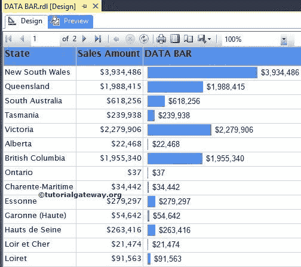

# 格式化 SSRS 的数据栏

> 原文：<https://www.tutorialgateway.org/formatting-data-bars-in-ssrs/>

在本文中，我们将向您展示在 SSRS 格式化数据条所涉及的步骤。它包括如何更改数据条颜色、数据条类型、添加自定义颜色，以及在 SSRS 将数据条转换为完整图表的示例。

## 格式化 SSRS 的数据栏

为了解释可用的格式选项，我们将使用下面显示的报告。请参考 [SSRS 数据栏](https://www.tutorialgateway.org/data-bars-in-ssrs/)文章，了解我们用于本 [SSRS](https://www.tutorialgateway.org/ssrs/) 报告的[数据源](https://www.tutorialgateway.org/ssrs-shared-data-source/)和[数据集](https://www.tutorialgateway.org/shared-dataset-in-ssrs/)。



### 格式化 SSRS 的数据栏颜色

我们通常使用一些条件来改变数据条的颜色。例如，如果销售额小于阈值点，那么红色或类似的颜色。

要格式化 SSRS 数据条颜色，右键单击蓝色条，并从上下文菜单中选择系列属性…选项。


单击系列属性…选项后，将打开一个包含许多属性的新窗口。在这里，我们可以更改可见性、边框颜色、阴影效果以及动作。

在这个例子中，我们将使用条件改变数据条的颜色，因此，转到填充选项卡并点击 fx 按钮

提示:如果您想在没有任何条件的情况下更改颜色，请从下拉列表中选择颜色。


单击 fx 按钮后，将打开一个新的表达式窗口，为颜色编写自定义表达式。我们将使用下面的表达式。

表情:

```
=IIF(
      Sum(Fields!SalesAmount.Value) > 1000000, "Green",
           IIF(Sum(Fields!SalesAmount.Value) > 100000, "Blue","Red")
     )
```

分析:

*   如果销售金额总和大于 1000000，则数据栏将填充绿色
*   如果销售金额总和大于 100000，则数据栏将填充蓝色
*   否则为红色


单击“确定”完成颜色分配。点击预览按钮，查看报告预览


从上面的截图中，您可以观察到报告根据给定的表达式生成了三种不同的颜色。

### 格式化 SSRS 数据条的水平和垂直轴属性

右键单击蓝色条将打开上下文菜单。请从菜单中选择横轴属性选项，如下图所示


选择水平轴属性选项后，将出现一个名为水平轴属性的新窗口，用于根据公司要求配置范围和比例选项。


如果要格式化垂直轴属性，请选择垂直轴属性选项。一旦选择了一个名为“垂直轴属性”的新窗口，就可以根据公司要求配置范围、边距和缩放选项。


### 更改 SSRS 数据栏类型

即使在创建数据栏之后，SSRS 也允许我们更改数据栏类型。首先，选择数据栏，右键单击它将打开上下文菜单。请从上下文菜单


中选择更改数据栏类型…选项

选择“更改数据栏类型...”选项后，它将打开一个新窗口来选择新的数据栏或数据列。这里我们选择简单的数据栏


点击【确定】完成并预览


报告

### 在 SSRS 将数据条转换为完整图表

SSRS 允许我们将数据栏转换为图表。首先，选择数据栏，右键单击它将打开上下文菜单。请选择转换为完整图表选项


一旦选择转换为全图选项，数据栏将被[纵轴和横轴柱形图](https://www.tutorialgateway.org/column-chart-in-ssrs/)取代，如下图截图


在这里，我们删除了轴标题、图表标题、图例标题，并且[也格式化了](https://www.tutorialgateway.org/formatting-column-chart-in-ssrs/)数值。


让我们点击预览来预览数据栏报告

