# SSRS 的漏斗图

> 原文：<https://www.tutorialgateway.org/funnel-chart-in-ssrs/>

SSRS 的漏斗图有助于按阶段可视化数据。例如，我们可以使用 SSRS 漏斗图来可视化我们在产品开发的每个阶段使用的资源数量或浪费百分比或生产成本。

在本文中，我们将通过一个示例向您展示如何创建 SSRS 漏斗图、更改漏斗图标题、图例位置、图例标题、漏斗图字体、漏斗图模型、托盘，以及在 SSRS 或 SQL Server Reporting Services 的漏斗图上显示数据标签。

对于这个 SSRS 漏斗图，我们使用自定义 [SQL](https://www.tutorialgateway.org/sql/) 查询:

```
-- SQL Query that we use in SSRS Funnel Chart
SELECT Geo.EnglishCountryRegionName AS Country, 
       Geo.StateProvinceName AS State, 
       Geo.City, 
       Prod.EnglishProductName AS ProductName, 
       Prod.Color, 
       Fact.OrderQuantity, 
       Fact.TotalProductCost, 
       Fact.SalesAmount, 
       Fact.TaxAmt, 
       Fact.[Freight]
FROM DimProduct AS Prod 
   INNER JOIN FactInternetSales AS Fact 
      ON Prod.ProductKey = Fact.ProductKey 
   INNER JOIN DimSalesTerritory AS Terry 
      ON Terry.[SalesTerritoryKey] = Fact.[SalesTerritoryKey] 
   INNER JOIN DimGeography AS Geo 
      ON Geo.[SalesTerritoryKey] = Terry.[SalesTerritoryKey]
```

## 在 SSRS 创建漏斗图

在本例中，我们将创建一个 SSRS 漏斗图，根据国家/地区显示销售额。下面的截图将向您展示我们用于此漏斗图报告的[数据源](https://www.tutorialgateway.org/ssrs-shared-data-source/)和[数据集](https://www.tutorialgateway.org/shared-dataset-in-ssrs/)。

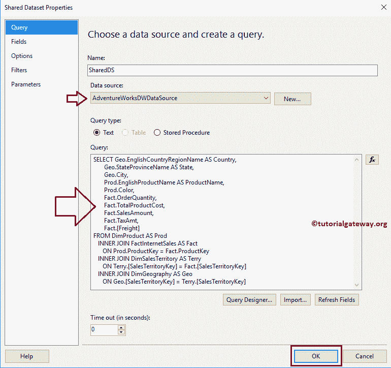

在 [SSRS](https://www.tutorialgateway.org/ssrs/) 报告设计中，我们可以通过将图表属性从 SSRS 工具箱拖动到设计空间来添加漏斗图。或者，我们可以右键单击报告设计器以打开上下文菜单。从上下文菜单中，请选择插入- >图表选项。

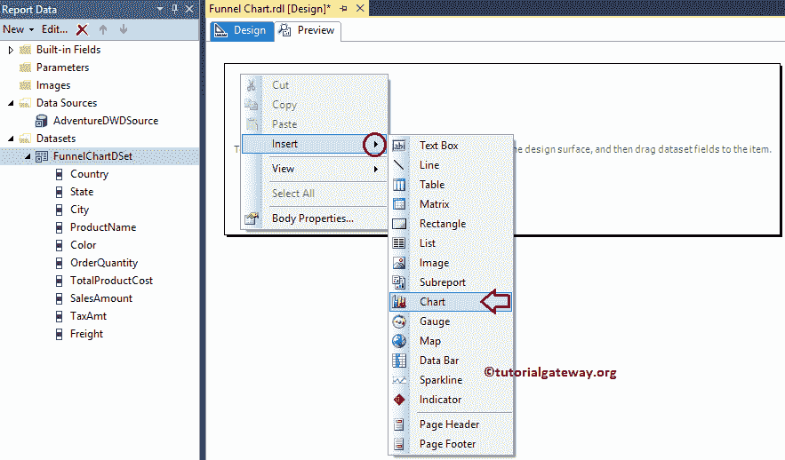

选择“图表”选项后，将打开一个名为“选择图表类型”的新窗口，从可用图表中选择所需的图表。对于本例，我们选择漏斗图。

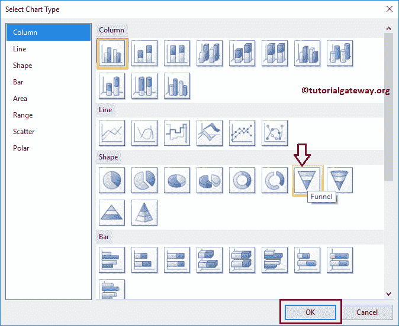

单击“确定”按钮后，漏斗图将在设计区域显示虚拟数据。

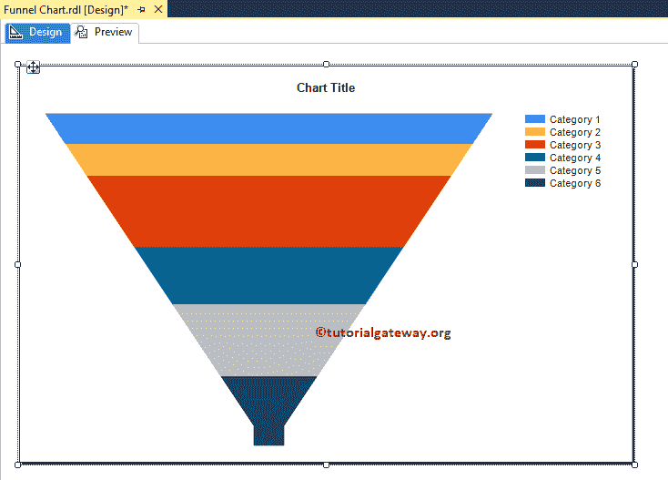

点击 SSRS 漏斗图周围的空白处，将打开图表数据窗口

*   值:任何数字(公制)值，如总销售额、销售额、税收、客户数量等。所有这些值将使用聚合函数(总和、计数等)进行聚合。这是因为我们用类别组项目对它们进行分组。
*   类别组:请指定要对漏斗图进行分区的列名。

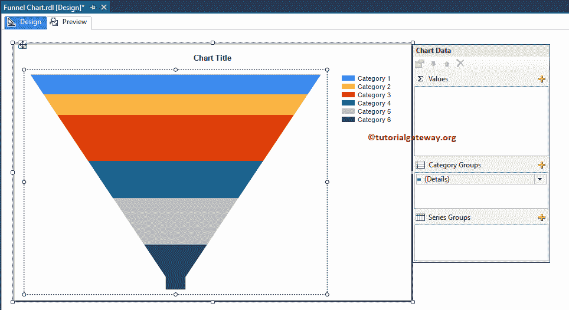

如前所述，在本例中，我们按国家创建了销售漏斗图。因此，将“销售额”列从数据集中拖放到类别组中的图表数据值和国家/地区名称中。

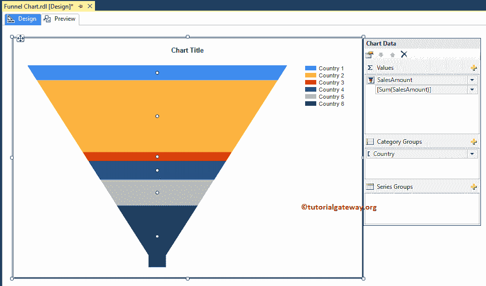

单击预览按钮查看报告预览。

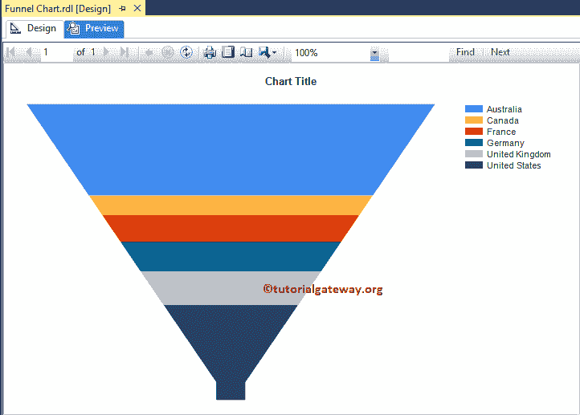

如果你观察上面的截图，它提供了一个完美的结果。尽管如此，我们还是无法确定德国销售和法国销售之间的区别。为了解决这些情况，我们必须使用数据标签。

### 在 SSRS 漏斗图中添加数据标签

右键单击漏斗图，从上下文菜单中选择显示数据标签选项，以显示值

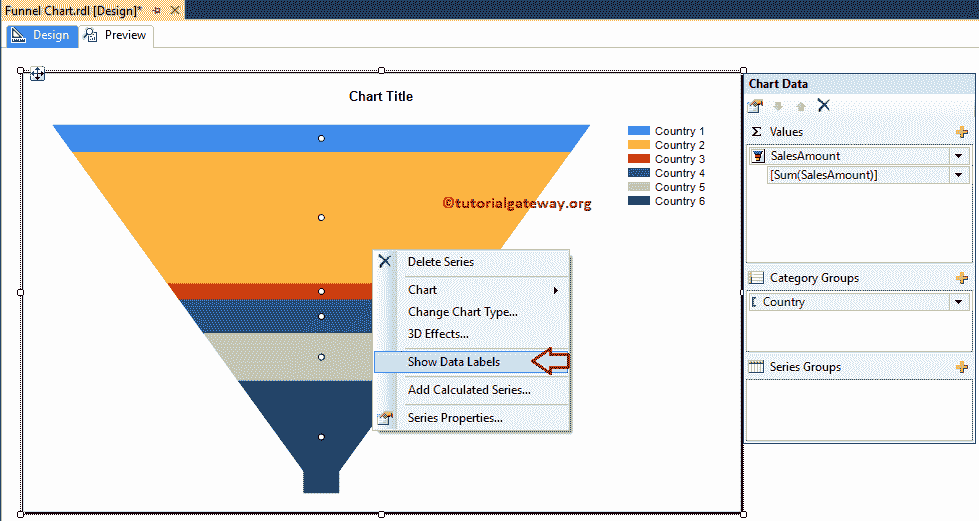

点击预览按钮，查看 SSRS 漏斗图报告预览。

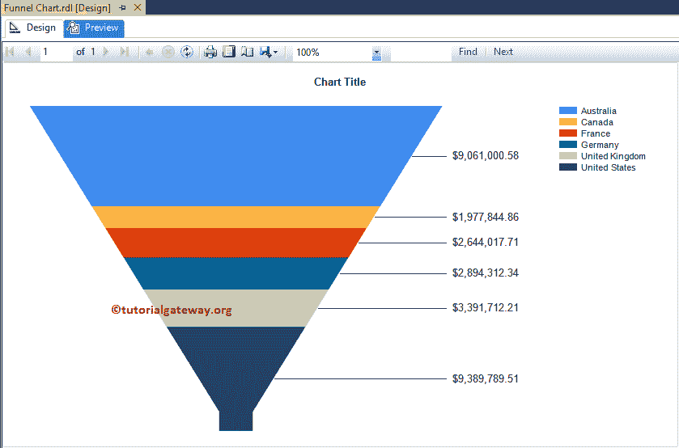

现在，您可以看到两个地区之间的销售差异。

### 更改 SSRS 漏斗图标题

要更改图表标题，请选择我们在下面截图中显示的图表标题区域，并根据您的要求更改标题。这里我们将按国家更改为销售，因为报告显示的是相同的

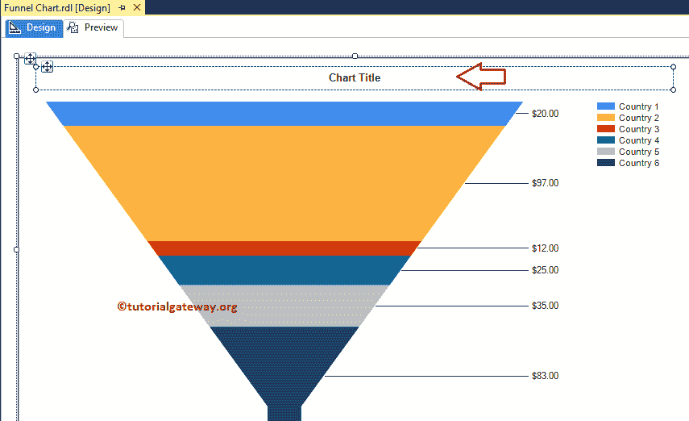

#### 格式化 SSRS 漏斗图标题字体

请选择图表标题区域，右键单击它将打开上下文菜单。请从菜单中选择标题属性选项。

接下来，在“字体”菜单中，我们可以更改字体大小、字体系列、字体样式和颜色。从下面的截图可以看到，这里我们将字体改为世纪哥特式，字体大小改为 14 磅

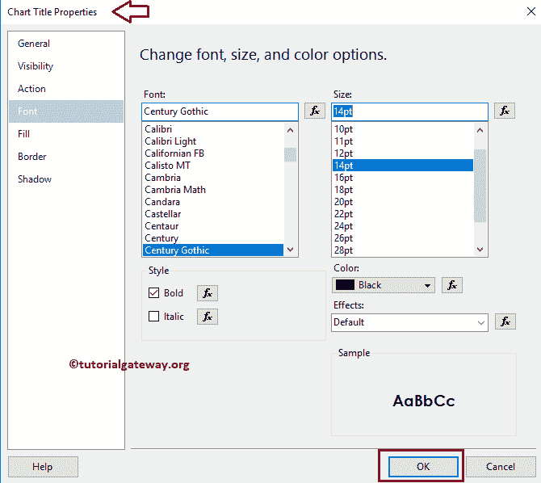

### 显示 SSRS 漏斗图的图例标题

要显示图例标题，请选择图例区域，右键单击它将打开上下文菜单。从上下文菜单中，请选择显示图例标题选项，如下图所示。

请根据您的要求重命名图例标题。这里我们将其命名为

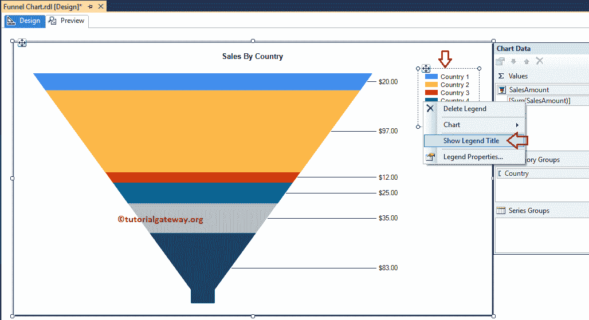

#### 格式化 SSRS 漏斗图的图例位置和字体

要格式化图例区域，请选择图例区域，右键单击它将打开上下文菜单。请从菜单中选择图例属性选项。

它将打开一个名为“图例属性窗口”的新窗口。在常规选项卡中，我们有一个名为图例位置的选项，如下图所示。您可以通过选择点位置来更改图例位置。

现在，我们将位置从默认的右上角更改为左上角。

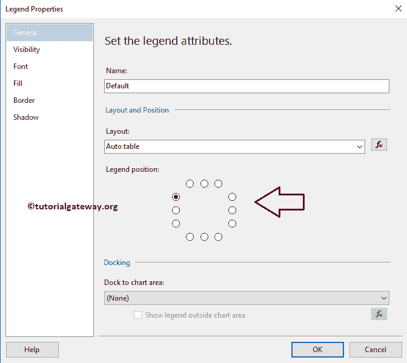

接下来，在字体选项卡中，我们可以更改漏斗图图例的字体大小、字体系列、字体样式和颜色，如下图所示

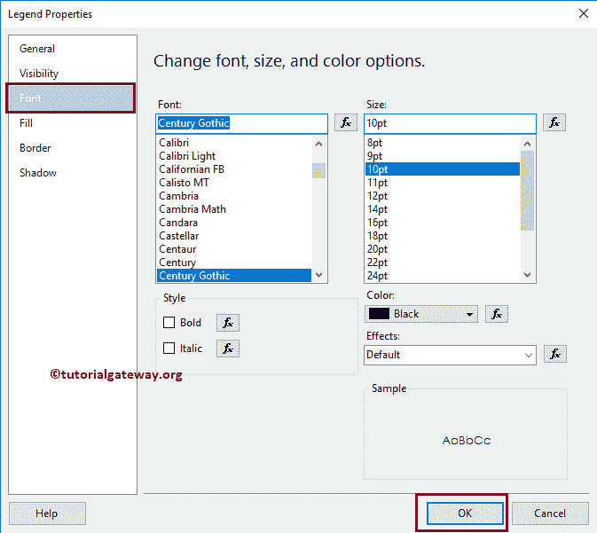

如您所见，我们将字体改为世纪哥特式，字体大小改为 10 磅

点击【确定】按钮，关闭【属性】窗口，点击预览选项卡，查看

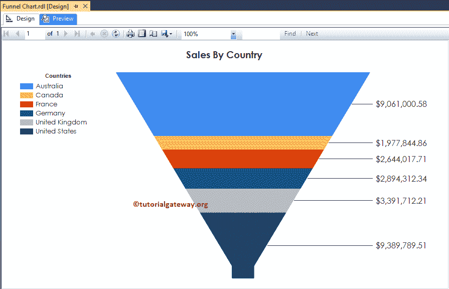

报告预览

### 改变 SSRS 漏斗图的调色板

我们还可以更改默认的漏斗图颜色或图表调色板。首先，选择图表并转到属性。通过选择调色板属性更改调色板颜色，如下图所示

这里我们选择了调色板颜色来 Excel

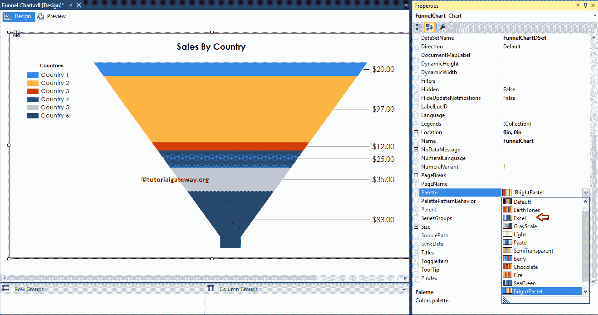

点击 SSRS 漏斗图预览选项卡，查看预览

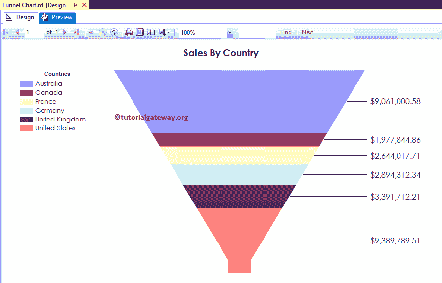

### 改变 SSRS 的漏斗图

SSRS 允许我们在创建图表后更改图表类型。首先，选择漏斗图并右键单击它，然后从上下文菜单

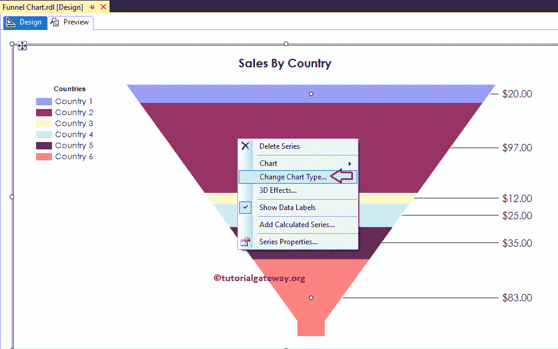

中选择更改图表类型…选项

选择“更改图表类型...”选项后，它将打开一个名为“选择图表类型”的新窗口来选择更改。这里我们选择的是 3D 漏斗图

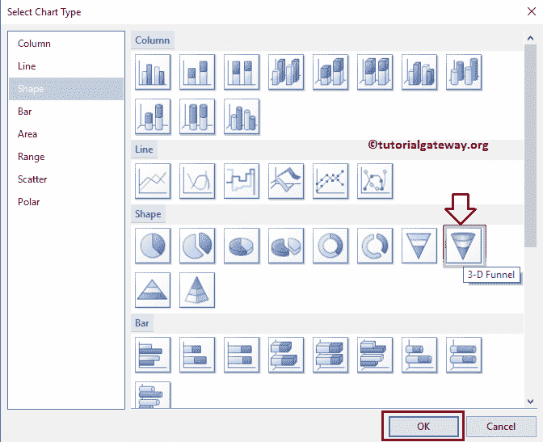

点击预览选项卡，查看 3D SSRS 漏斗图预览

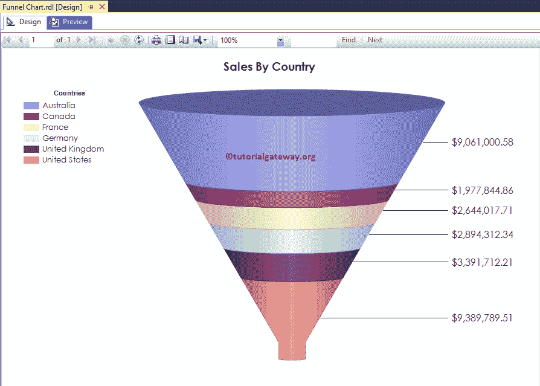

从上面的截图中，您可以观察到我们成功地将图表类型从二维漏斗更改为三维