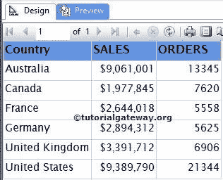

# SSRS 的仪表

> 原文：<https://www.tutorialgateway.org/gauges-in-ssrs/>

在本文中，我们将向您展示如何在 SSRS 创建和配置仪表。为此，我们将使用下图所示的报告。

如果您观察下面的截图，它是一个包含国家/地区名称、销售额和订单总数列的常规表报告。



## 在 SSRS 创建仪表

在本例中，我们将在“订单”列的右侧创建并添加 SSRS 量表。因此，首先，通过右键单击“订单”列并选择“插入列”选项，然后选择“右侧”选项，创建一个空列。

接下来，将“工具箱”中的“仪表”拖放到空列中。当您将仪表拖放到空列时，将打开一个名为“选择仪表类型”的新窗口，从可用的仪表中选择所需的仪表(径向和线性)。

请参考 [SSRS 表报告](https://www.tutorialgateway.org/ssrs-table-report/)、[数据源](https://www.tutorialgateway.org/ssrs-shared-data-source/)、[数据集](https://www.tutorialgateway.org/shared-dataset-in-ssrs/)文章，了解数据源、数据集和表报告的创建。在这个 [SSRS](https://www.tutorialgateway.org/ssrs/) 的例子中，我们使用了[嵌入式数据集](https://www.tutorialgateway.org/embedded-dataset-in-ssrs/)作为上面的报告，使用了 [SQL](https://www.tutorialgateway.org/sql/) 命令作为[数据集](https://www.tutorialgateway.org/embedded-dataset-in-ssrs/)是:

```
-- T-SQL Query required to demonstrate Gauges in SSRS 
SELECT [SalesTerritoryCountry]
      ,SUM ([OrderQuantity])AS ORDERS
      ,SUM ([SalesAmount])AS [TOTAL SALES] 

  FROM [DimSalesTerritory]
  INNER JOIN FactInternetSales ON
  [DimSalesTerritory].SalesTerritoryKey = FactInternetSales.SalesTerritoryKey
  GROUP BY [SalesTerritoryCountry]
  ORDER BY [SalesTerritoryCountry]
```

在本例中，我们选择了 SSRS 简单径向规。


单击“确定”将径向标尺添加到新创建的空单元格中。现在，我们必须配置仪表值。首先，单击仪表将打开仪表数据窗口。

在本例中，我们想要显示订单的径向指针。因此，请拖放或选择订单作为指标值。


接下来，我们必须在 SSRS 配置仪表的刻度属性。因此，右键单击标尺将打开上下文菜单。请从中选择缩放属性选项。


选择“刻度属性”选项后，将打开一个新窗口来配置 SSRS 仪表刻度。在常规选项卡中，您可以注意到径向仪表刻度的默认最小值和最大值。

默认情况下，径向刻度的最小值和最大值将介于 0 和 100 之间。这里，我们将最小值保留为 0，最大值保留为 25000。您也可以将 fx 按钮用于自定义表达式。


注意:您也可以使用“间隔”属性自定义最小值和最大值之间的 SSSR 仪表间隔。

单击“确定”完成 SSRS 径向仪表属性的配置。点击预览选项卡


查看报表预览

我们在 SSRS 成功地创建了基本的径向规

### 如何在 SSRS 向仪表添加量程

如果您观察汽车或自行车的速度计，您可以在 SSRS 径向测速仪中看到绿色、红色和默认白色，每种颜色都有其含义。如果要在报告中应用相同的内容，则可以使用 SSRS 仪表的“范围”属性。

要添加范围，右键单击比例将打开上下文菜单。请从中选择添加范围选项，如下图所示。


接下来，我们必须通过右键单击范围并选择范围属性来配置范围属性..选项


选择范围属性后..选项，将打开一个名为“径向刻度范围属性”的新窗口，以配置 SSRS 标尺的范围刻度。

*   刻度值开始范围:默认值为 250，表示范围将从 250 开始，但您可以根据需要进行更改。
*   刻度值处的结束范围:默认为 5000，这意味着 SSRS 仪表范围将在 5000 结束。根据要求进行更改。
*   相对于刻度的放置:在这里，决定是将范围放置在刻度内、刻度外还是刻度上。
*   起始宽度:起始位置的范围宽度。默认情况下为 15，但您可以相应更改。
*   结束宽度:结束位置范围宽度。默认情况下，30。根据你的需要改变。


在本例中，我们将起始位置更改为 0，结束位置更改为 Sum(Orders)。这意味着范围将从 0 开始，以总和(订单)值结束。


单击“确定”完成径向范围的范围属性配置。让我们通过单击预览选项卡来查看 SSRS 仪表报告预览。

