# SSRS 的线性仪表

> 原文：<https://www.tutorialgateway.org/linear-gauges-in-ssrs/>

在本文中，我们将向您展示如何在 SSRS 创建和配置线性仪表。为此，我们将使用下图所示的报告。

如果您观察下面的截图，它是一个包含国家/地区名称、销售额和订单数量列的常规表报告。

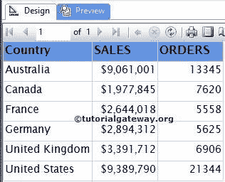

请参考 [SSRS 表报告](https://www.tutorialgateway.org/ssrs-table-report/)、[数据源](https://www.tutorialgateway.org/ssrs-shared-data-source/)、[数据集](https://www.tutorialgateway.org/shared-dataset-in-ssrs/)文章，了解数据源、数据集和表报告的创建。在这里，我们对上面的 [SSRS](https://www.tutorialgateway.org/ssrs/) 报表使用了[嵌入式数据集](https://www.tutorialgateway.org/embedded-dataset-in-ssrs/)，对[数据集](https://www.tutorialgateway.org/embedded-dataset-in-ssrs/)的 [SQL](https://www.tutorialgateway.org/sql/) 命令为:

```
-- Data to create Linear Gauge in SSRS
SELECT [SalesTerritoryCountry]
      ,SUM ([OrderQuantity])AS ORDERS
      ,SUM ([SalesAmount])AS [TOTAL SALES] 

  FROM [DimSalesTerritory]
  INNER JOIN FactInternetSales ON
  [DimSalesTerritory].SalesTerritoryKey = FactInternetSales.SalesTerritoryKey
  GROUP BY [SalesTerritoryCountry]
  ORDER BY [SalesTerritoryCountry]
```

## 在 SSRS 创建线性仪表

在本例中，我们将在“订单”列的右侧创建并添加 SSRS 线性仪表。首先，通过右键单击“订单”列并选择“插入列”选项，然后选择“右侧”选项，创建一个空列。

接下来，将仪表从工具箱拖放到空列。当您将“工具箱”中的“仪表”拖放到“空”列时，将打开一个名为“选择仪表类型”的新窗口，从可用的仪表中选择所需的仪表(径向和线性)。

在这个例子中，我们选择了简单线性仪表，如下图所示。

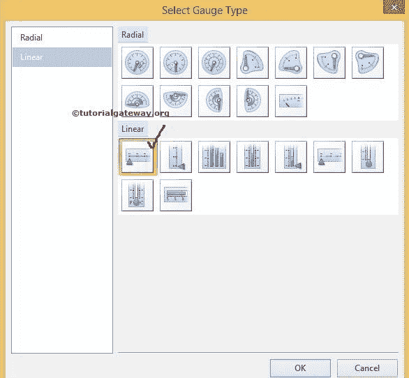

单击“确定”将线性仪表添加到新创建的空单元格中。现在，我们必须配置仪表数据。首先，点击线性仪表将打开仪表数据窗口。在本例中，我们希望显示总销售额的线性指针，因此，请拖放或选择订单作为指标值。

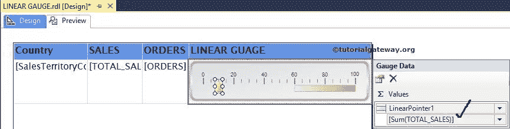

注意:将列拖到值区域时请小心，如果处理不当或掉在设计区域会导致混乱。

### SSRS 线性仪表的量程特性

如果您观察上面的截图，范围从 60 开始(刻度的中间)到 100 结束。让我们通过右键单击范围打开上下文菜单来使它更有意义。请选择范围属性..选项，如下图所示。

要添加范围，请参考 SSRS 文章中[仪表中的添加范围部分。](https://www.tutorialgateway.org/gauges-in-ssrs/)

[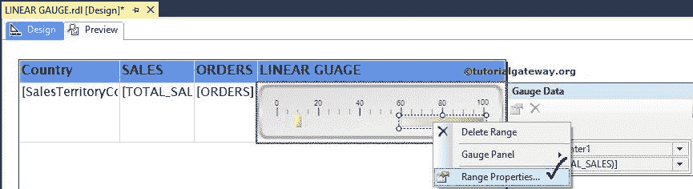](https://www.tutorialgateway.org/gauges-in-ssrs/)

选择范围属性后..选项，将打开一个名为“线性比例范围属性”的新窗口来配置范围比例。我们已经在[仪表](https://www.tutorialgateway.org/gauges-in-ssrs/)一文中解释了范围的属性及其默认值。

这里，我们将起始位置保持为 0，并将结束位置更改为 Sum(总销售额)。这意味着范围将从 0 开始，到每个区域的总销售额总和结束。

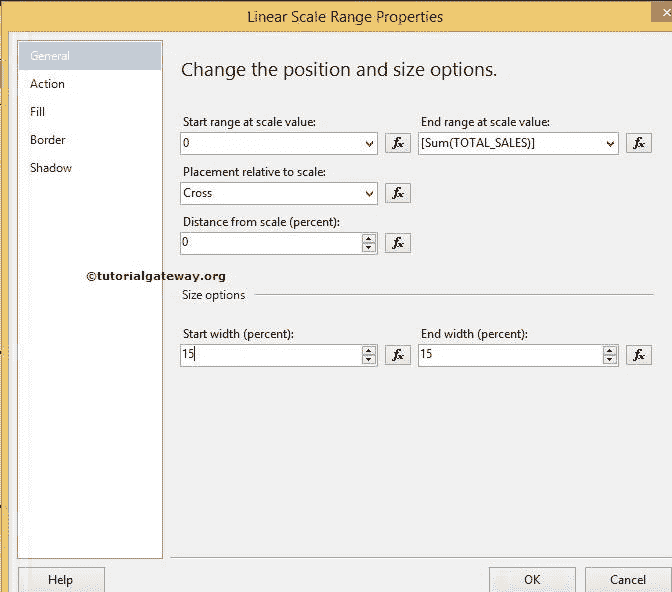

### SSRS 线性标尺刻度属性

接下来，我们必须在 SSRS 配置线性标尺的刻度属性。因此，右键单击标尺将打开上下文菜单。请从中选择缩放属性选项。

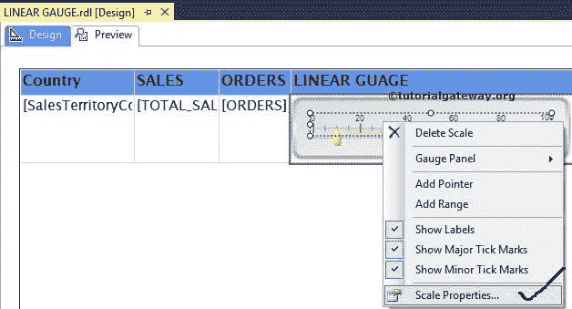

选择“刻度属性”选项后，将打开一个新窗口来配置 SSRS 线性仪表刻度。在常规选项卡中，您可以注意到线性仪表刻度的默认最小值和最大值。

这里，我们将最小值更改为 1500000，最大值更改为 9500000，因为我们的值介于这两个值之间。您也可以将 fx 按钮用于自定义表达式。

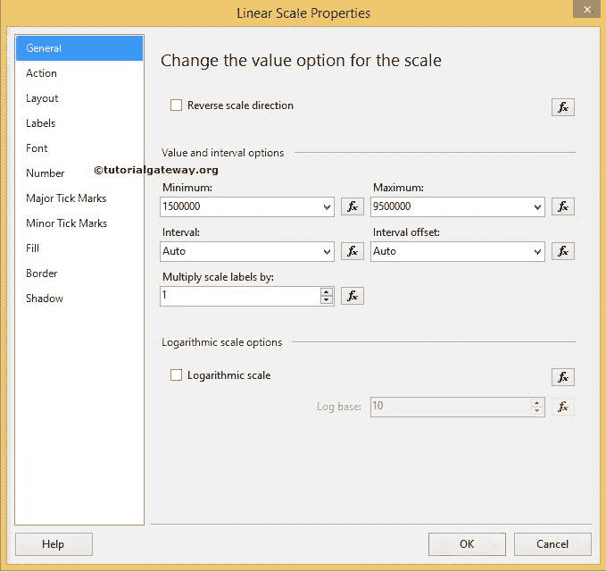

注意:您也可以使用“间隔”属性自定义最小值和最大值之间的间隔。

接下来，我们将数字格式化为货币，删除十进制值，并要求报告服务器以千为单位显示值。这意味着 150 万将显示为 1500 美元

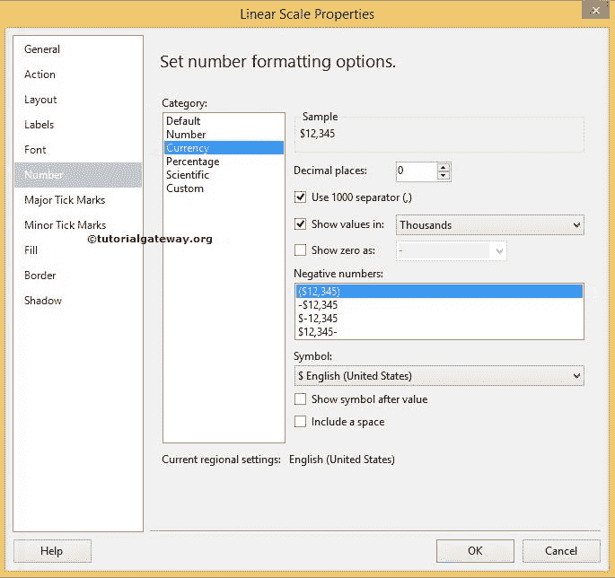

单击“确定”完成 SSRS 线性仪表属性的配置。点击预览选项卡

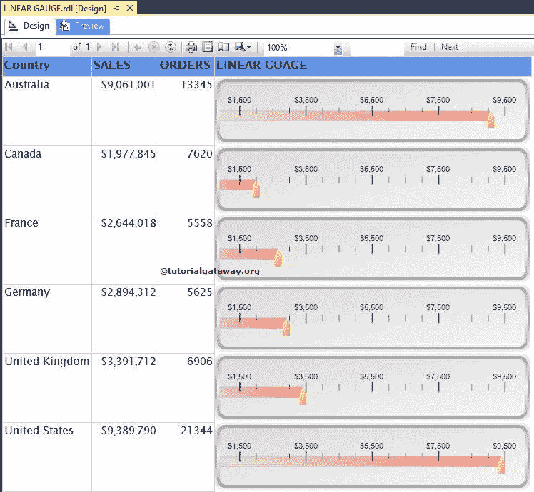

查看报表预览

如果你观察上面的截图，它给出了一个完美的结果，但是范围开始超出了起点(1500000)。

这是因为我们在开始时将范围起始值设置为 0。让我们将范围起始值更改为 1500000，如下所示

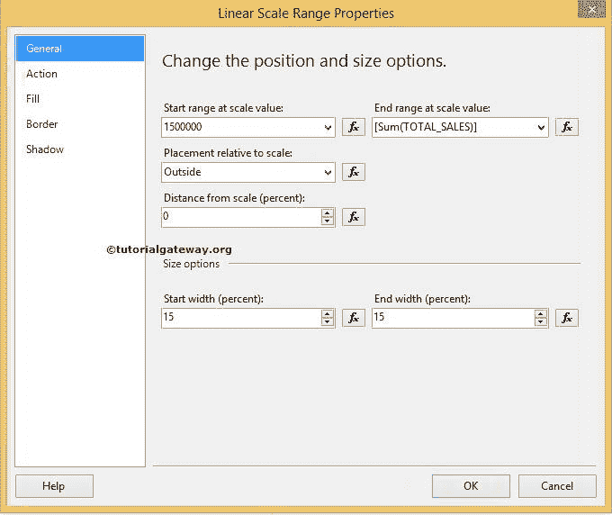

点击【确定】完成，点击预览选项卡，查看【SSRS 线性仪表报表】

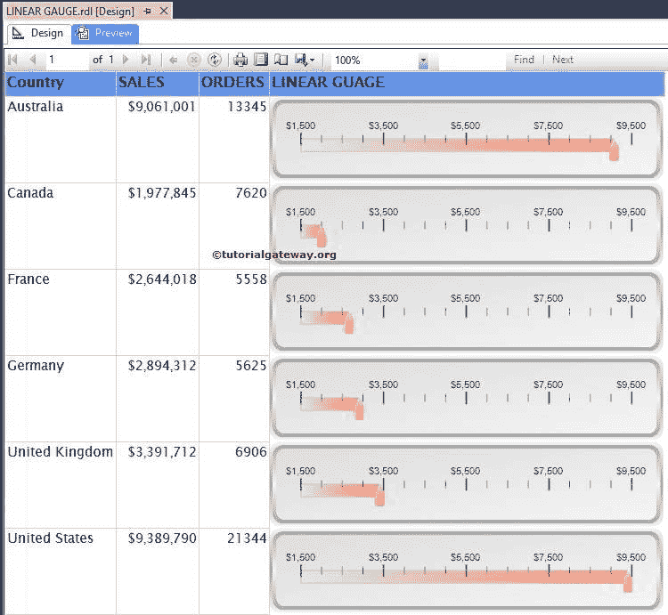

如果你观察上面的截图，它看起来整洁干净。