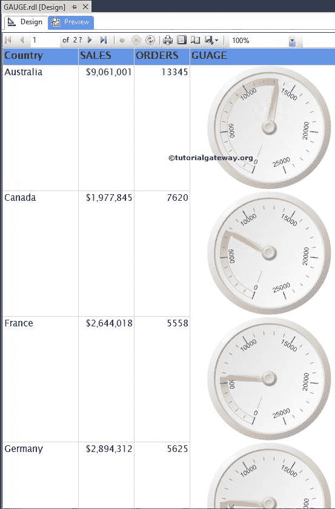
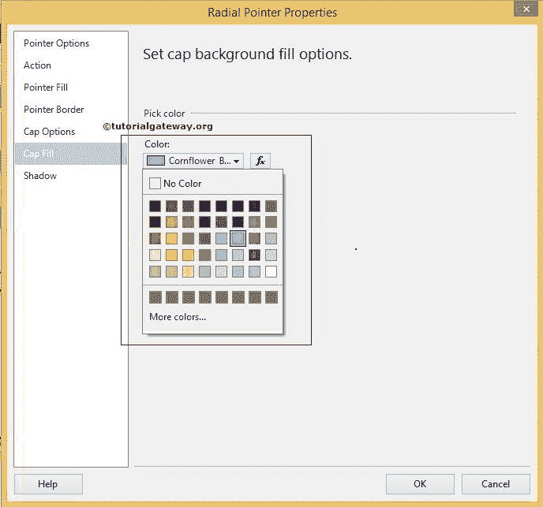
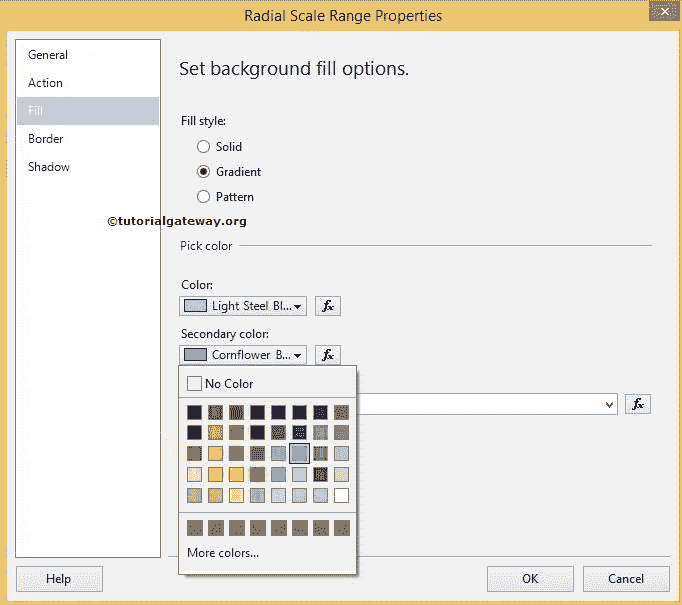
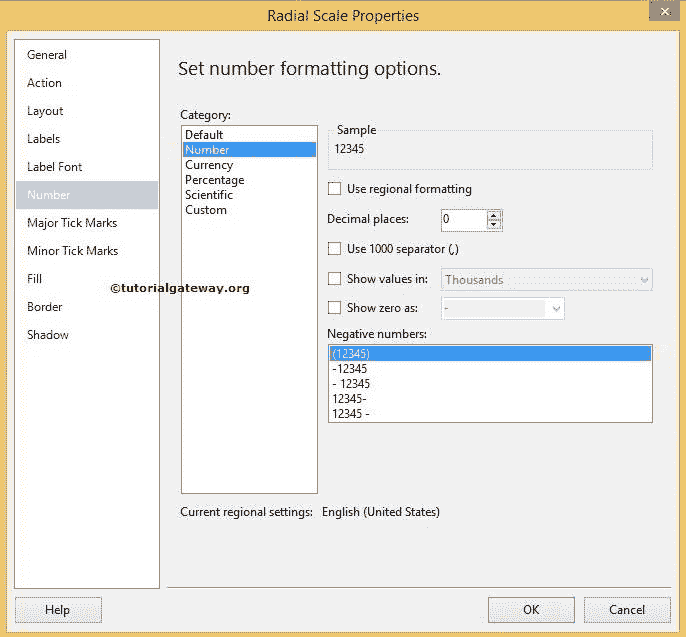

# 格式化 SSRS 的仪表

> 原文：<https://www.tutorialgateway.org/formatting-gauges-in-ssrs/>

在本文中，我们将通过一个示例向您展示如何在 SSRS 或 SQL Server Reporting Services 中更改仪表颜色、仪表框架、仪表指针和格式化范围属性。

为了解释可用的 SSRS 仪表式选项，我们将使用下面显示的报告。请参考 SSRS 文章中的[量表，了解我们用于本次](https://www.tutorialgateway.org/gauges-in-ssrs/) [SSRS](https://www.tutorialgateway.org/ssrs/) 报告的[数据源](https://www.tutorialgateway.org/ssrs-shared-data-source/)和[数据集](https://www.tutorialgateway.org/shared-dataset-in-ssrs/)。

## 格式化 SSRS 属性中的仪表

首先，右键单击仪表将打开上下文菜单，如下图所示。请选择仪表属性..菜单中选项

### 格式化 SSRS 仪表颜色(表盘颜色)

单击仪表属性后..选项，将打开一个新窗口来格式化径向仪表。从下面的截图中，您可以观察到，默认情况下，仪表填充了白烟颜色，但现在，我们选择了白色。请点击 fx 按钮来编写颜色的自定义表达式。

### 格式化 SSRS 的仪表形状

在“径向仪表属性”窗口中，如果单击“框架”选项卡，我们有多个形状可供选择，如下所示。这里我们坚持默认的循环 2，但你可以尝试自己的。

### 设置仪表的框架颜色格式

如果您点击框架填充选项卡，我们有默认的框架颜色，请根据您的要求更改 SSRS 规框架。这里我们选择矢车菊蓝色作为框架颜色。

如果你想设置仪表框架的阴影效果，请在框架阴影标签

中提供细节

### 格式化 SSRS 的仪表指针

首先，右键单击仪表指针打开上下文菜单，如下图所示。请选择指针属性..菜单中选项

### 更改仪表指针

单击指针属性后..选项，将打开一个新窗口来格式化径向仪表指针。请根据您的要求更改指针类型和指针样式。在这个例子中，我们将针样式改为隐形箭头，如下图截图

所示

### 仪表指针颜色的格式

在径向指针属性标签中，如果你点击指针填充标签，我们有默认的指针颜色和样式，请根据你的需要改变。

在这里，我们选择了原色到蓝色和副色到矢车菊蓝色。

### 格式化仪表的指针帽

在“径向指针属性”选项卡中，如果您单击“帽选项”选项卡，我们有隐藏指针帽和更改默认帽样式的选项，请相应更改。这里我们选择宽缩进的扁平作为指针帽样式。

### SSRS 仪表的格式帽颜色

在径向指针属性标签中，如果你点击填充标签，我们有默认的颜色，请根据你的要求改变。这里我们选择矢车菊蓝色。

### 仪表的格式化范围属性

首先，右键单击范围并选择范围属性..选项

### 格式化 SSRS 仪表的范围颜色

单击范围属性后..选项，将打开一个新窗口来格式化径向仪表的范围。首先，转到填充选项卡，您可以注意到一个范围的默认颜色和样式，请根据您的要求进行更改。

在这里，我们选择了一种主要颜色作为浅钢蓝，次要颜色为矢车菊蓝，如下图所示。

注意:通过单击 fx，您可以使用表达式自定义颜色

### 格式化 SSRS 仪表中的范围边框

在“径向指针属性”选项卡中，如果单击“边框”选项卡，我们有默认的线条样式、线条宽度和线条颜色。这里我们选择矢车菊蓝作为线条颜色，宽度，如下图所示。

### 设置仪表刻度属性的格式

首先，右键单击标尺将打开上下文菜单。请选择刻度属性..从中选择。单击缩放属性后..选项，将打开一个新窗口来格式化径向标尺的刻度。

首先，转到标签选项卡，您会注意到标签的默认配置。在这里你可以隐藏或显示标签，也可以改变位置等。

### 更改 SSRS 仪表中的字体样式和字体大小

在“径向比例属性”窗口中，转到“标签字体”选项卡，根据您的要求设置字体样式。在本例中，我们将字体更改为露西达无，样式更改为粗体，颜色更改为黑色

### 格式化 SSRS 仪表中的刻度数字

在数字选项卡中，您可以将数字格式更改为数字、货币或百分比。在这个例子中，我们去掉了多余的小数。

单击“确定”完成仪表的格式化。让我们通过单击预览选项卡来查看报告预览。

