# SSRS 的指标

> 原文：<https://www.tutorialgateway.org/indicators-in-ssrs/>

在本文中，我们将向您展示如何在 SSRS 创建和配置指标。为此，我们将使用下图所示的报告。请参考 [SSRS 表报告](https://www.tutorialgateway.org/ssrs-table-report/)、[数据源](https://www.tutorialgateway.org/ssrs-shared-data-source/)、[数据集](https://www.tutorialgateway.org/shared-dataset-in-ssrs/)文章，了解数据源、数据集、 [SSRS](https://www.tutorialgateway.org/ssrs/) 表报告的创建。

如果您观察下面的截图，它是一个常规的表格报告，包含城市、姓名、职务、去年销售额和销售年度至今列。

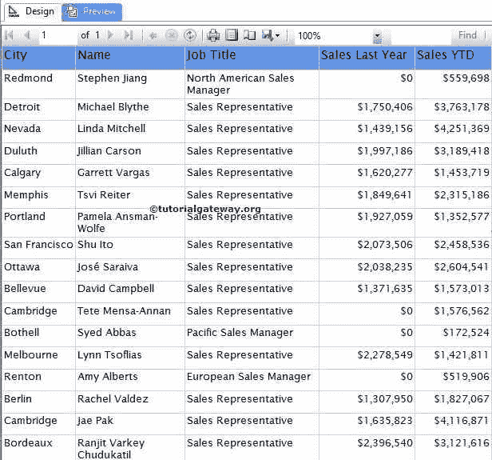

以上报表使用[嵌入式数据集](https://www.tutorialgateway.org/embedded-dataset-in-ssrs/)，下图截图

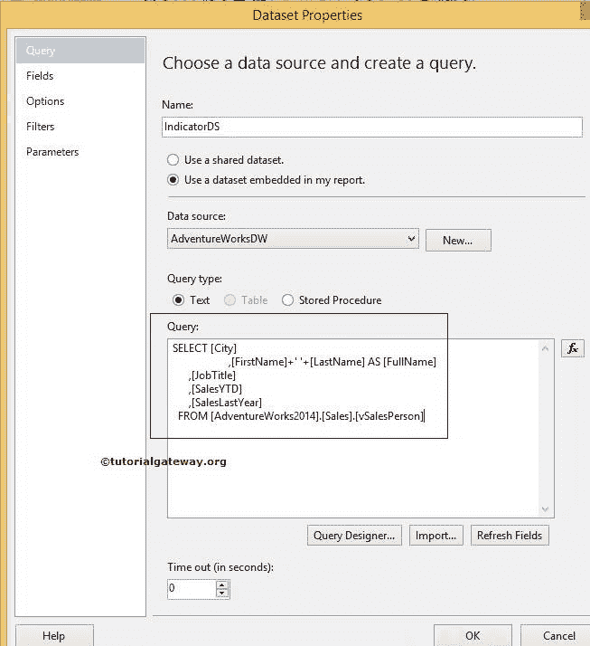

显示的数据集

[我们用作](https://www.tutorialgateway.org/sql/)[数据集](https://www.tutorialgateway.org/embedded-dataset-in-ssrs/)的 SQL 命令是:

```
SELECT [City]
      ,[FirstName]+' '+[LastName] AS [FullName]
      ,[JobTitle]
      ,[SalesYTD]
      ,[SalesLastYear]
  FROM [AdventureWorks2014].[Sales].[vSalesPerson]
```

## 在 SSRS 创建指标

在本例中，我们将在销售年初至今的右侧创建并添加 SSRS 指标，该指标应满足以下条件:

*   如果销售年初至今的值小于去年的销售额，则显示红色指示器。
*   任何大于去年销售额的项目，显示黄色指示器。

首先，让我们通过右键单击销售年初至今列来创建一个空列。接下来，选择“插入列”选项，然后选择“右”选项。

接下来，将 SSRS 指示器从工具箱拖放到空列中。当您将指示器拖放到空列时，将打开一个名为“选择指示器类型”的新窗口，从可用的指示器中选择所需的指示器(方向、符号、形状和等级)。

在这个例子中，我们选择了 SSRS 简单形状指示器，如下图所示。

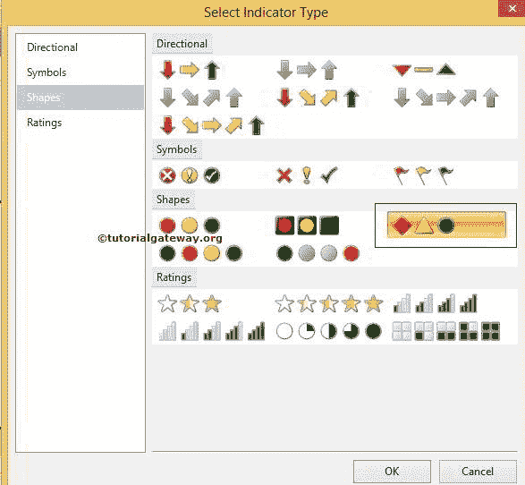

单击确定将指示器添加到新创建的空单元格中。现在，我们必须配置指示器值。首先，单击将打开仪表数据窗口的 SSRS 指示器。

在本例中，我们希望显示销售本年迄今的指标。因此，请拖放或选择截至指标值的销售年初至今。

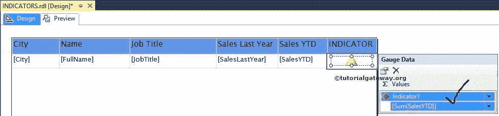

接下来，我们必须配置指示器属性，这样，右键单击指示器将打开上下文菜单。请从中选择指示器属性选项。

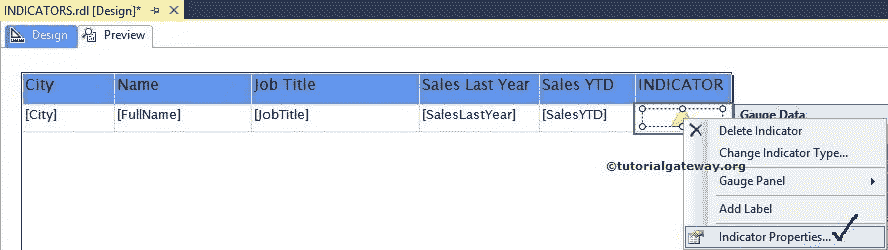

选择指标属性选项后，将打开一个新窗口来配置 SSRS 指标值。首先，转到值和状态选项卡，您可以在此处注意到指示器值的默认设置。

默认情况下，状态度量单位值为百分比，以及 0 到 33 个红色指示器、33 到 66 个黄色指示器和 66 到 100 个绿色指示器。如果要更改百分比值，可以替换默认值，或者使用 fx 按钮进行自定义表达式。

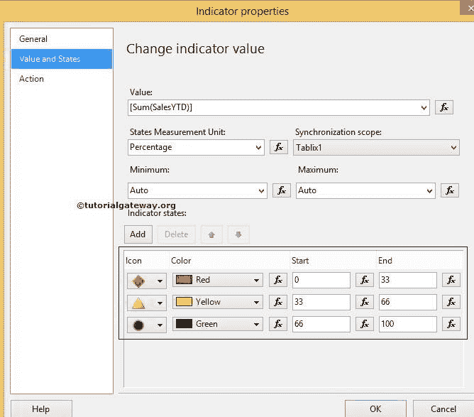

在这个 SSRS 指标示例中，我们希望基于数值显示指标。因此，请将状态度量单位值从百分比更改为数字。我们还通过选择绿色并删除它来删除绿色指示器。

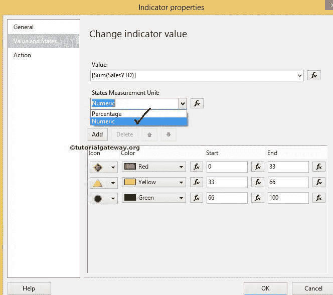

从上面的截图来看，对于红色指示器，我们同意起始值为 0。但是，我们必须更改结束值。因此，我们选择结束值文本框旁边的 fx 按钮，并编写以下表达式。

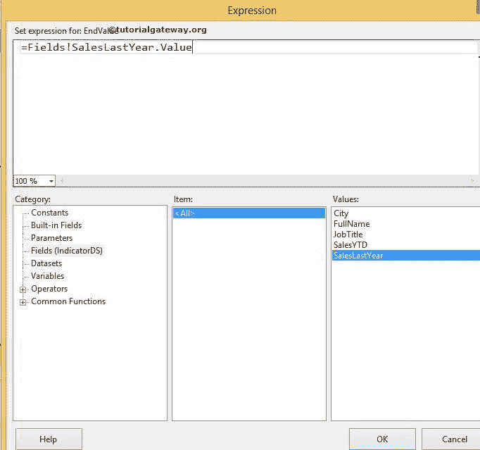

这意味着，如果销售年初至今值介于 0 和销售去年值之间，则显示红色指示器。

接下来，我们将更改黄色指示器的起始值。通过单击开始值文本框旁边的 fx 按钮，并编写以下表达式。

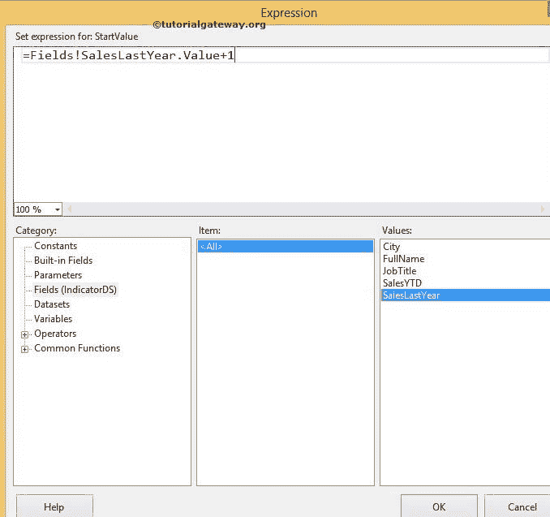

接下来，我们将黄色指示器的结束值留空。意思是，如果销售本年累计值大于去年销售，则显示黄色指示器。

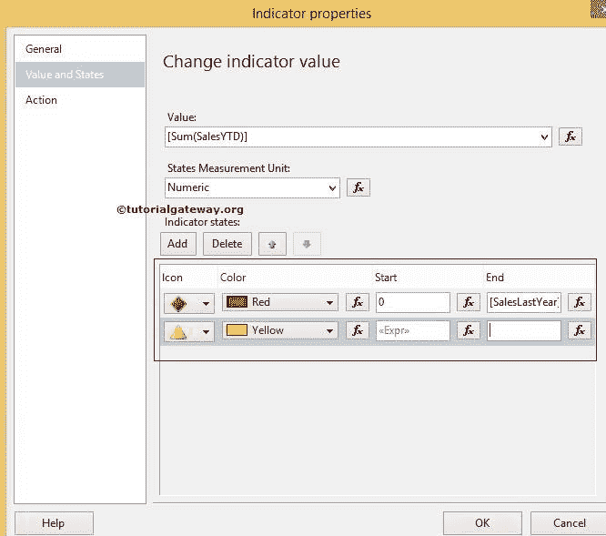

单击确定完成 SSRS 指示器属性的配置。点击预览选项卡

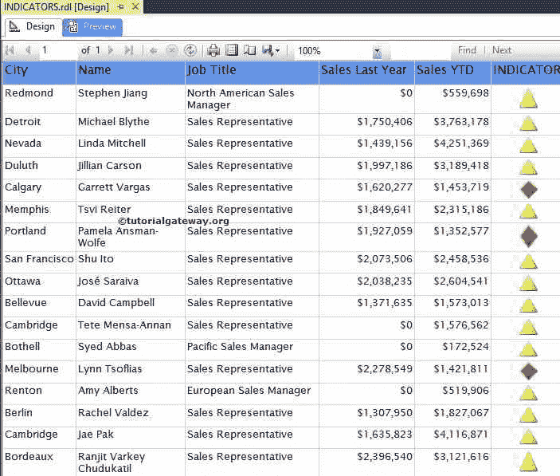

查看报表预览