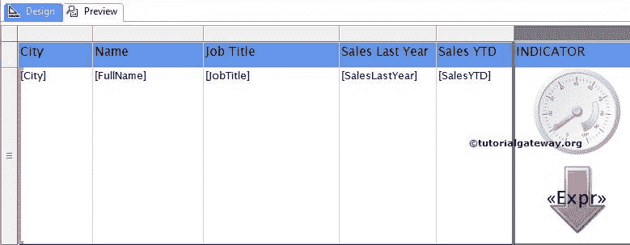

# 格式化 SSRS 指标

> 原文：<https://www.tutorialgateway.org/format-indicators-in-ssrs/>

在本文中，我们将向您展示如何在 SSRS 格式化指标。包括添加标签、更改指标颜色、图标、指标类型、添加多个指标，并举例在[SQL Server Reporting Services](https://www.tutorialgateway.org/ssrs/)中添加[量表](https://www.tutorialgateway.org/gauges-in-ssrs/)。

为了解释可用的格式选项，我们将使用下面显示的报告。请参考 [SSRS 指标](https://www.tutorialgateway.org/indicators-in-ssrs/)文章，了解我们用于本报告的[数据源](https://www.tutorialgateway.org/ssrs-shared-data-source/)和[数据集](https://www.tutorialgateway.org/shared-dataset-in-ssrs/)。

## SSRS 的格式指标

首先，右键单击指示器，并从上下文菜单中选择添加标签选项以显示值。

现在，让我们配置(或更改)标签产生的文本。首先，右键单击文本将打开上下文菜单。请选择标签属性..菜单中选项

单击标签属性后..选项，将打开一个新窗口来格式化标签。从下面的截图中，您可以观察到默认情况下，它将文本显示为标签。所以，请点击 fx 按钮来编写自定义表达式。

单击 fx 按钮后，将打开一个名为“表达式”的新窗口，其中包含可用的函数。在这里，我们将该值显示为年初至今的销售额–去年的销售额，并使用舍入函数对该值进行舍入。

单击“确定”完成将自定义表达式配置为标签文本

### 在 SSRS 更改指示器标签的字体和字号

在“标签属性”窗口中，转到“字体”选项卡，根据您的要求设置字体样式。在本例中，我们将字体更改为露西达无，将颜色更改为黑色

### 更改 SSRS 的指标类型

SSRS 允许我们更改或格式化指示器类型，即使在创建指示器之后。首先，选择指示器，右键单击它将打开上下文菜单。请从上下文菜单

中选择变更指标类型…选项

一旦您选择了更改指示器类型…选项，它将打开一个名为选择指示器类型的新窗口。使用此选项从可用的指示器中选择所需的指示器(方向、符号、形状和等级)。在这个例子中，我们选择了简单方向指示器，如下图所示。

点击【确定】完成指标类型变更，预览

报表

### 格式化 SSRS 的指示器颜色和图标

SSRS 允许我们改变指示器图标和颜色。为此，右键单击指示器将打开上下文菜单。请选择指示器属性选项来配置指示器值。首先，转到值和状态选项卡，您可以注意到指示器的默认图标和颜色。

请更改指示器颜色和指示器图标

注意:通过单击 fx，您可以使用表达式自定义颜色

从下面的截图可以观察到我们更改了

的颜色和指标

点击【确定】，进入【预览】选项卡，查看

报表预览

### 多个指标

我们还可以在一列中添加多个指标。右键点击该列将打开上下文菜单，从该菜单中，请选择

添加指标

选择“更改指示器类型...”选项后，它将打开“选择指示器类型”窗口，以选择所需的指示器(方向、符号、形状和等级)。在本例中，我们选择了简单评级指标。

从下面的截图可以观察到，指标栏里有两个指标

### 添加仪表和 SSRS 指示器

首先，选择指示器，右键单击指示器将打开上下文菜单。请选择仪表面板选项，然后从中选择添加[仪表](https://www.tutorialgateway.org/gauges-in-ssrs/)。选择“添加仪表”选项后，将打开一个新窗口来选择仪表。

从列表中选择所需的仪表，然后单击确定。这里我们选了一个简单的规

