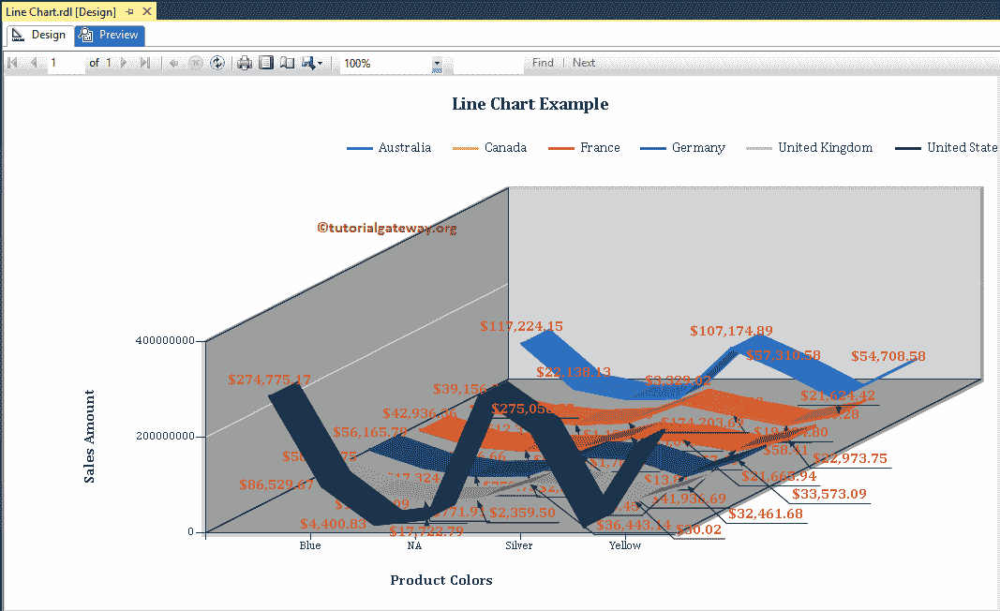

# SSRS 的折线图

> 原文：<https://www.tutorialgateway.org/line-chart-in-ssrs/>

SSRS 的折线图有助于连接各个点。我们可以使用此折线图来查找预测详细信息，或销售趋势，或利润趋势等。

在本文中，我们将通过一个示例向您展示如何创建 SSRS 折线图、如何在 SSRS 或 SQL Server Reporting Services 中更改折线图标题、图例标题、图例位置、折线图字体、图表模型以及在折线图上显示数据标签。

对于这个 SSRS 折线图的例子，我们使用了自定义 [SQL](https://www.tutorialgateway.org/sql/) 查询。

```
-- SQL Query that we use in SSRS Line Chart
SELECT Geo.EnglishCountryRegionName AS Country, 
       Geo.StateProvinceName AS State, 
       Geo.City, 
       Prod.EnglishProductName AS ProductName, 
       Prod.Color, 
       Fact.OrderQuantity, 
       Fact.TotalProductCost, 
       Fact.SalesAmount, 
       Fact.TaxAmt, 
       Fact.[Freight]
FROM DimProduct AS Prod 
   INNER JOIN FactInternetSales AS Fact 
      ON Prod.ProductKey = Fact.ProductKey 
   INNER JOIN DimSalesTerritory AS Terry 
      ON Terry.[SalesTerritoryKey] = Fact.[SalesTerritoryKey] 
   INNER JOIN DimGeography AS Geo 
      ON Geo.[SalesTerritoryKey] = Terry.[SalesTerritoryKey]
```

## 在 SSRS 创建折线图

在本例中，我们将创建一个折线图，按产品颜色显示销售额的趋势。下面的截图显示了我们用于这个折线图报告的[数据源](https://www.tutorialgateway.org/ssrs-shared-data-source/)和[数据集](https://www.tutorialgateway.org/shared-dataset-in-ssrs/)。


在 [SSRS](https://www.tutorialgateway.org/ssrs/) 报表设计中，我们可以通过将图表属性从 SSRS 工具箱拖动到设计空间来添加折线图。或者右键单击报表设计器，并从上下文菜单中选择插入- >图表选项。


它会打开一个名为“选择图表类型”的新窗口，从可用图表中选择所需的图表。对于这个 SSRS 的例子，我们选择了折线图。


单击“确定”按钮后，折线图将显示在带有虚拟数据的设计区域中。


单击 SSRS 折线图周围的空白区域将打开图表数据窗口

*   值:任何数字(公制)值，如总销售额、销售额等。所有这些值将使用聚合函数(总和、平均值、计数等)进行聚合。因为我们用类别组项目对它们进行分组。
*   类别组:请指定要对折线图进行分区的列名。


如前所述，在本例中，我们创建了一个折线图来按产品颜色查找销售趋势。因此，将“销售额”列从数据集中拖放到类别组中的图表数据值和产品颜色中。


单击预览按钮查看报告预览。


如果你观察上面的截图，它提供了完美的结果。尽管如此，我们仍然无法确定给定时间点的销售额。因此，让我们添加数据标签。

### 在 SSRS 向折线图添加数据标签

右键单击折线图，从上下文菜单中选择显示数据标签选项，以显示值


接下来，我们将格式化字体，并将数字格式从默认更改为货币。为此，请选择数据标签，右键单击它将打开上下文菜单。接下来，请选择系列标签属性选项。


这里我们使用逗号分隔 1000，我们允许 SSRS 报告以千


显示数据标签

### 更改 SSRS 折线图的轴属性

右键单击折线图的轴，并选择水平轴属性..选项来格式化轴值。


在这里，我们更改了水平轴和垂直轴的字体样式和字体大小

点击预览按钮，查看 SSRS 折线图报告预览。


### 更改 SSRS 折线图标题

要更改折线图标题，请选择图表标题区域，并根据您的要求更改标题。或者，右键单击它并选择标题属性..选项。


这里我们将标题更改为折线图示例，因为报告显示的是相同的


#### 格式化 SSRS 折线图标题字体

在字体选项卡中，我们可以更改折线图标题的字体大小、字体系列、字体样式和颜色。这里我们将字体更改为剑桥，字体大小更改为 14pt，颜色更改为绿色


单击预览按钮查看报告预览。


### 更改 SSRS 折线图的轴标题

要更改安讯士标题，请选择安讯士标题区域，并根据您的要求更改标题。或者，右键单击它并选择轴标题属性..选项。


它会打开一个名为“轴标题属性”窗口的新窗口。在这里，您可以更改标题文本以及字体样式、大小和颜色。现在，我们将颜色改为绿色，字体改为红色，大小改为 12pt


也请将相同的属性应用于 Y 轴。接下来，单击预览选项卡查看报告预览。


### SSRS 的多重折线图

虽然上面的图表满足了我们的要求。让我看看每个国家的销售趋势。为此，我们必须将国家维度添加到现有折线图中。

为此，请选择折线图周围的空白区域，并将“国家”维度添加到系列组中。


现在你可以看到每种颜色的销售趋势，以及国家


让我改变线条的粗细。为此，右键单击线条，并选择系列属性..


它会打开一个名为“系列属性”窗口的新窗口。在边框选项卡下，我们可以更改线宽、颜色、样式(虚线、实线等)。现在，我们将线宽从默认的 1pt 更改为 2pt


点击【确定】按钮，关闭系列属性窗口，选择预览选项卡，查看


报表预览

### 格式化 SSRS 折线图的图例位置

要格式化图例区域，请右键单击图例区域，并选择图例属性选项。

它会打开一个图例属性窗口。在“常规”选项卡中，我们有一个名为“图例位置”的选项，通过更改点位置来更改图例位置。现在，我们将位置从默认的右上角更改为中间。

点击【确定】按钮，关闭【属性】窗口，点击预览选项卡，查看


报表预览

### 更改 SSRS 折线图的类型

即使在创建折线图之后，SSRS 也允许我们更改图表类型。首先，选择折线图，右键单击它将打开上下文菜单。请从中选择更改图表类型…选项


选择“更改图表类型...”选项后，它将打开一个名为“选择图表类型”的新窗口来选择更改。这里我们选择的是三维折线图


点击预览选项卡查看



三维线报告预览

从上面的截图中，你可以观察到我们在 SSRS 成功地将图表类型从 2D 折线图更改为三维折线图

这次我们将把图表类型从三维折线图改为平滑线


点击预览选项卡查看


折线图预览

这次我们将把图表类型从平滑线改为带有标记的线


在我们看到预览


之前，让我更改标记大小、颜色、边框宽度和边框颜色

点击预览选项卡查看


折线图预览

这次我们将把图表类型从带标记的线条改为带标记的平滑线条


让我们看看


的报告预览