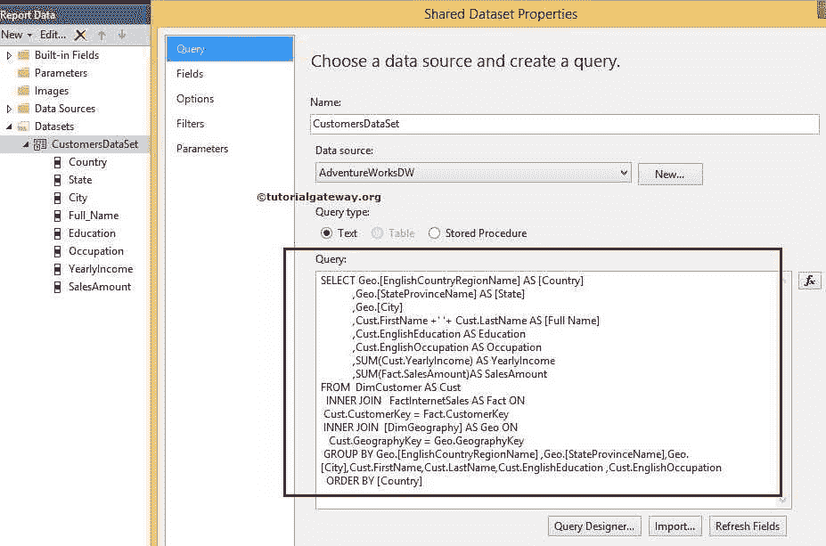
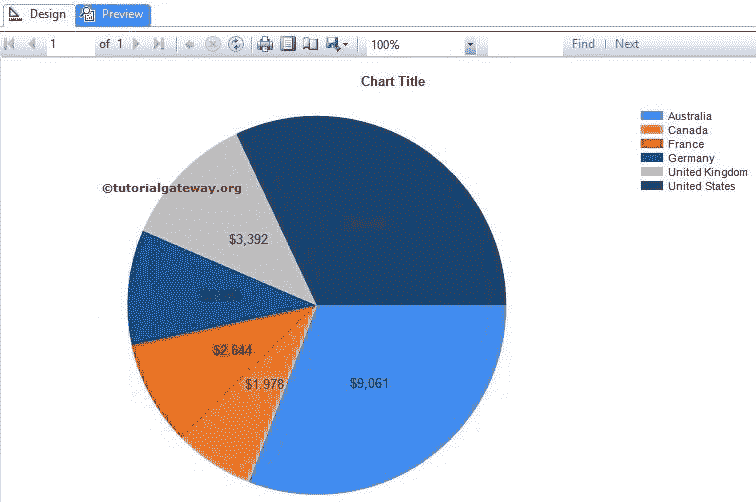

# SSRS 的饼图

> 原文：<https://www.tutorialgateway.org/pie-chart-in-ssrs/>

SSRS 的饼图对于显示高级别数据很有用，有时，如果我们以饼图的形式显示数据，视觉上会很愉悦。例如，按地区销售、全国客户数量等。

在本文中，我们将向您展示如何在 SSRS 创建和配置饼图。

下面的截图将向您展示我们用于此 [SSRS](https://www.tutorialgateway.org/ssrs/) 饼图报告的[数据源](https://www.tutorialgateway.org/ssrs-shared-data-source/)和[数据集](https://www.tutorialgateway.org/shared-dataset-in-ssrs/)。



[SQL](https://www.tutorialgateway.org/sql/) 我们在上面截图中使用的命令是:

```
SELECT Geo.[EnglishCountryRegionName] AS [Country]
      ,Geo.[StateProvinceName] AS [State]
      ,Geo.[City]
      ,Cust.FirstName +' '+ Cust.LastName AS [Full Name]  
      ,Cust.EnglishEducation AS Education 
      ,Cust.EnglishOccupation AS Occupation
      ,SUM(Cust.YearlyIncome) AS YearlyIncome
      ,SUM(Fact.SalesAmount)AS SalesAmount 
FROM  DimCustomer AS Cust
  INNER JOIN
      FactInternetSales AS Fact ON 
 Cust.CustomerKey = Fact.CustomerKey
 INNER JOIN
     [DimGeography] AS Geo ON
   Cust.GeographyKey = Geo.GeographyKey
 GROUP BY Geo.[EnglishCountryRegionName]
         ,Geo.[StateProvinceName] 
  ,Geo.[City]
  ,Cust.FirstName
         ,Cust.LastName  
         ,Cust.EnglishEducation 
         ,Cust.EnglishOccupation 
  ORDER BY [Country]
```

## 在 SSRS 创建饼图

当您将图表从工具箱拖放到设计空间时，将打开一个名为“选择图表类型”的新窗口，从可用图表中选择所需的图表。在本例中，我们选择了简单饼图。


单击“确定”按钮后，饼图将显示在带有虚拟数据的设计区域中。


单击 SSRS 饼图周围的空白区域将打开图表数据窗口

*   值:任何数字(公制)值，如销售额、税、总销售额、客户数量等。所有这些值将使用聚合函数(求和、计数等)进行聚合。)因为我们用类别组项目对它们进行分组。
*   类别组:请指定要对饼图进行分区的列名。


在本例中，我们将按国家/地区为销售额创建一个饼图。因此，将“销售额”列从数据集中拖放到类别组中的图表数据值和国家/地区名称中。


单击预览按钮查看报告预览。


如果你看到上面的 SSRS 饼图截图，它提供了一个精确的结果。尽管如此，我们还是无法识别法国销售和德国销售之间的区别。要解决这些情况，请使用数据标签。

右键单击饼图，从上下文菜单中选择显示数据标签选项，以显示值


单击预览按钮查看 SSRS 饼图报告预览。



注:请参考[格式化饼图](https://www.tutorialgateway.org/formatting-pie-chart-in-ssrs/)一文，了解格式化标签、图例和托盘所涉及的步骤。