# 在 SSRS 格式化饼图

> 原文：<https://www.tutorialgateway.org/formatting-pie-chart-in-ssrs/>

本文通过一个例子展示了如何在 SSRS 修改饼图图例标题、图例位置、标题、字体、饼图模型、托盘以及将百分比值显示为饼图上的标签。

为了解释可用的 SSRS 饼图格式选项，我们将使用下面显示的报告。请参考 [SSRS 饼图](https://www.tutorialgateway.org/pie-chart-in-ssrs/)文章，了解我们用于本次 [SSRS](https://www.tutorialgateway.org/ssrs/) 报告的[数据源](https://www.tutorialgateway.org/ssrs-shared-data-source/)和[数据集](https://www.tutorialgateway.org/shared-dataset-in-ssrs/)。

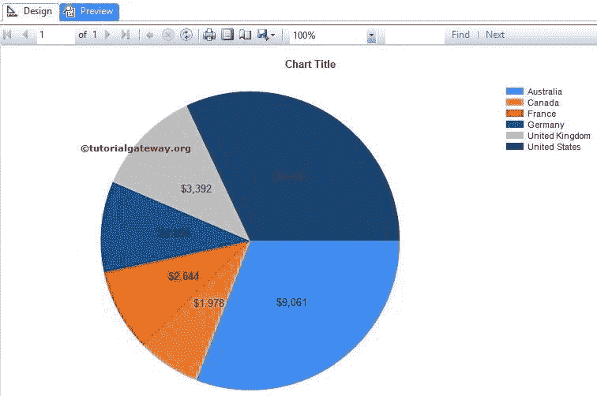

## 在 SSRS 格式化饼图

以下是在 SSRS 格式化饼图的可用选项列表

### 在 SSRS 更改饼图标题

要替换饼图标题，请选择图表标题区域

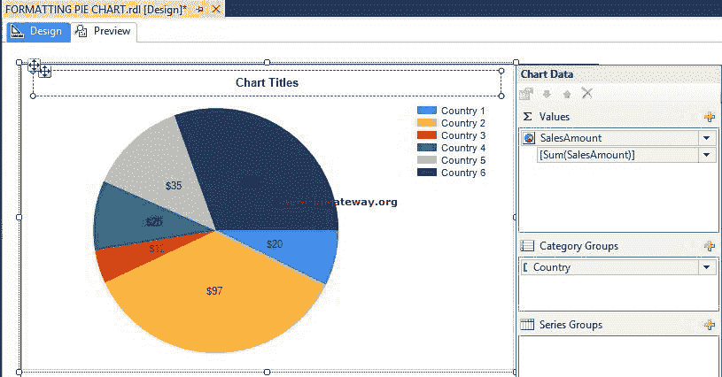

现在，根据需要更改饼图标题。在这里，我们将其重命名为“按国家销售”，因为该报告呈现的是相同的

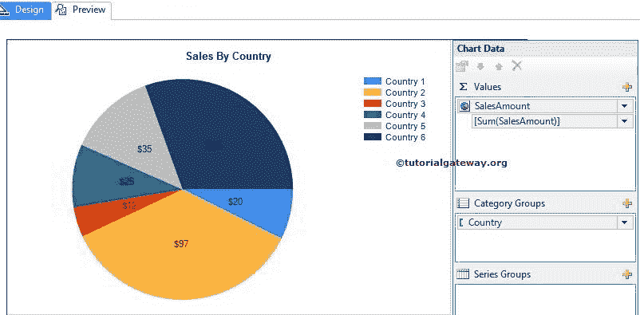

### 在 SSRS 显示饼图图例标题

要查看饼图图例标题，请选择图例区域，右键单击它将打开上下文菜单。从菜单中，选择显示图例标题选项

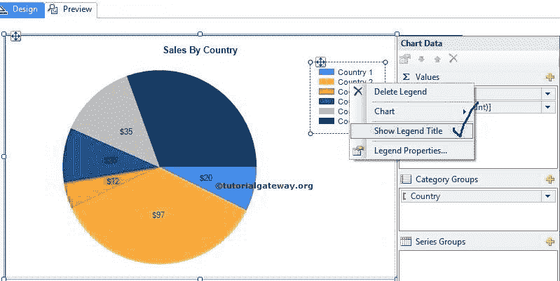

请根据您的要求重命名图例标题。这里我们把它命名为国家

### SSRS 饼图的格式字体和图例位置

选择图例区域，右键单击它将打开上下文菜单。从菜单中，请选择图例属性

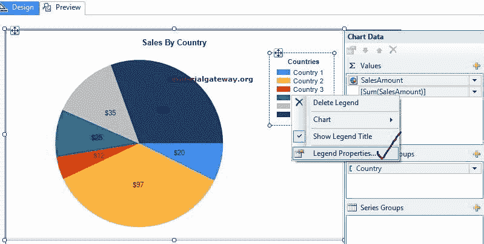

在常规选项卡中，有一个名为图例位置的选项。通过选择那些点位置

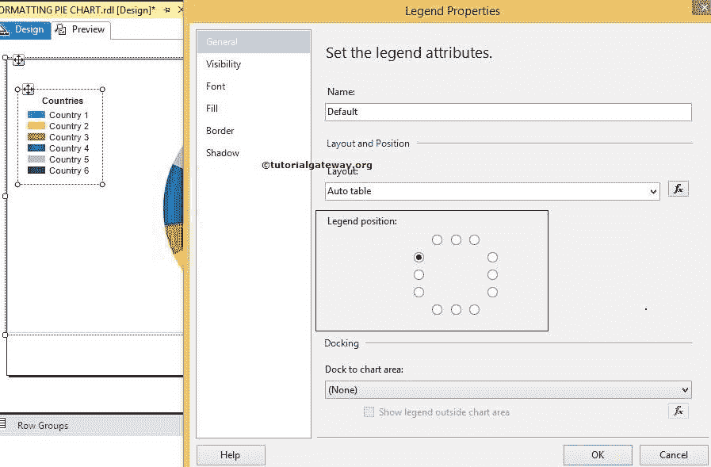

来调整图例位置

接下来，使用字体选项卡更改字体系列、字体大小、字体样式和饼图图例颜色

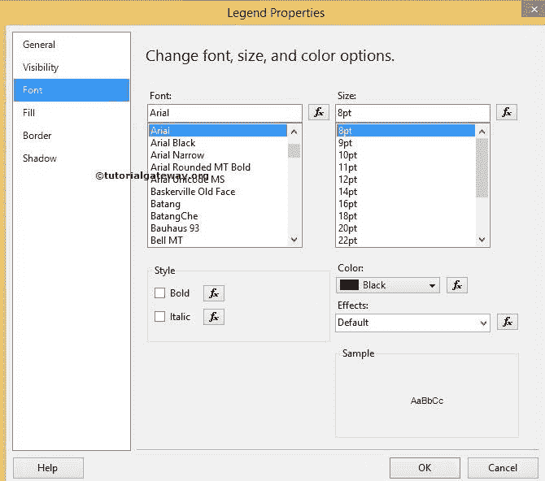

### 在 SSRS 更改为三维饼图

SSRS 允许我们在创建图表后更改图表类型。首先，选择饼图，右键单击它将打开上下文菜单。请从中选择更改图表类型…选项

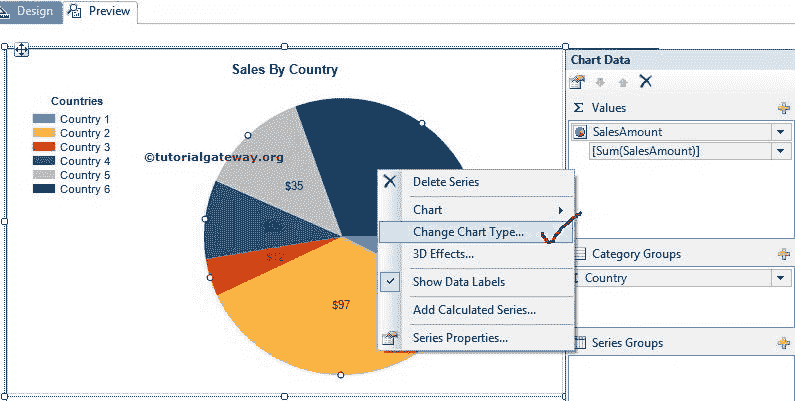

一旦您选择了更改图表类型…选项，它将打开一个新窗口来选择更改。这里有一个精选的三维饼图

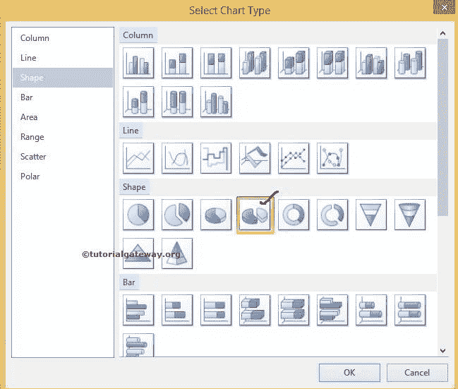

点击确定按钮，查看

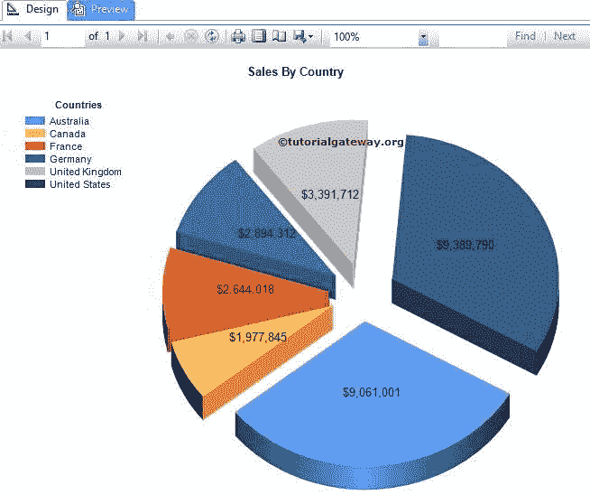

报告

从上面的截图中，您可以看到我们成功地替换了图表类型

### 更改 SSRS 饼图的调色板

我们可以在 SSRS 更改托盘和饼图颜色。首先，选择图表并转到属性。在这里，通过选择调色板属性来更改饼图颜色，如下图所示

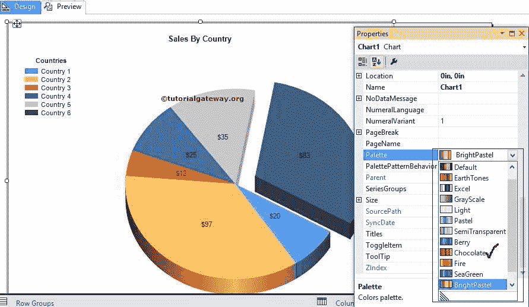

这里我们选择了巧克力色

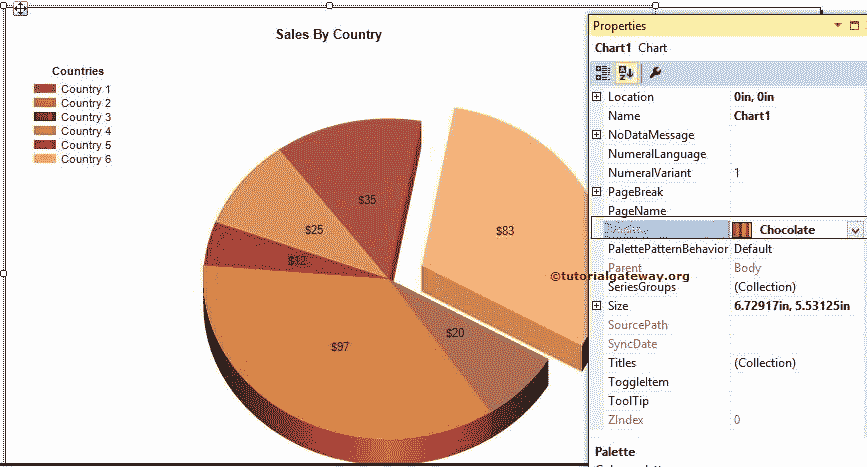

### 在 SSRS 饼图上显示百分比值

首先，选择饼图数据标签，并右键单击它们以打开上下文菜单。

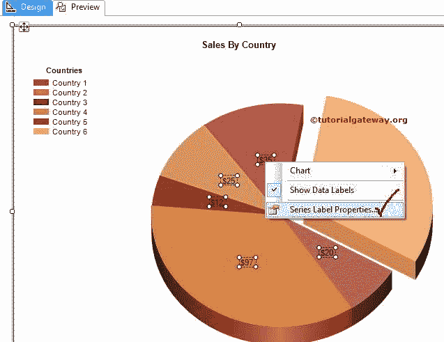

在常规选项卡中，请从下拉列表中选择标签数据为#PERCENT。选择百分比后，将显示一个弹出窗口，询问您是否要将 UseValueAsLable 设置为 false。请选择“是”，因为我们正在将默认值更改为百分比

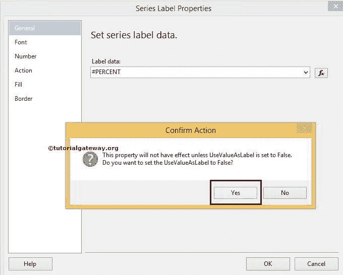

点击确定，点击预览按钮，查看 SSRS 格式饼图预览

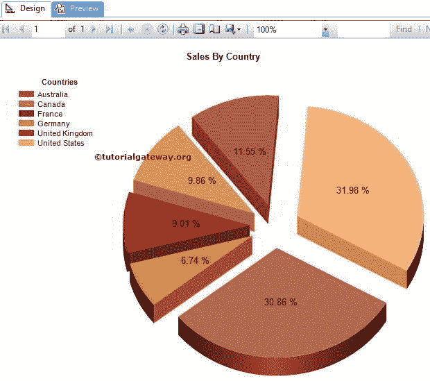

我们在 SSRS 成功地将百分比显示为饼图标签