# SSRS 的金字塔图

> 原文：<https://www.tutorialgateway.org/pyramid-chart-in-ssrs/>

SSRS 的金字塔图有助于可视化阶段中的数据(每个阶段的数据)。例如，我们可以使用 SSRS 金字塔图来可视化浪费百分比、生产成本或我们在产品开发的每个步骤中使用的资源数量。

在本文中，我们将通过一个示例向您展示如何创建 SSRS 金字塔图，如何在 SSRS 或 SQL Server Reporting Services 中更改金字塔图标题、图例标题、图例位置、金字塔图字体、图表模型、托盘以及在金字塔图上显示数据标签。

对于这个 SSRS 金字塔图的例子，我们使用了自定义 [SQL](https://www.tutorialgateway.org/sql/) 查询

```
-- SQL Query that we use in SSRS Pyramid Chart
SELECT Geo.EnglishCountryRegionName AS Country, 
       Geo.StateProvinceName AS State, 
       Geo.City, 
       Prod.EnglishProductName AS ProductName, 
       Prod.Color, 
       Fact.OrderQuantity, 
       Fact.TotalProductCost, 
       Fact.SalesAmount, 
       Fact.TaxAmt, 
       Fact.[Freight]
FROM DimProduct AS Prod 
   INNER JOIN FactInternetSales AS Fact 
      ON Prod.ProductKey = Fact.ProductKey 
   INNER JOIN DimSalesTerritory AS Terry 
      ON Terry.[SalesTerritoryKey] = Fact.[SalesTerritoryKey] 
   INNER JOIN DimGeography AS Geo 
      ON Geo.[SalesTerritoryKey] = Terry.[SalesTerritoryKey]
```

## 在 SSRS 创建金字塔图

在本例中，我们将创建一个金字塔图，按产品颜色显示销售额。我们用于此金字塔图报告的[数据源](https://www.tutorialgateway.org/ssrs-shared-data-source/)和[数据集](https://www.tutorialgateway.org/shared-dataset-in-ssrs/)为:

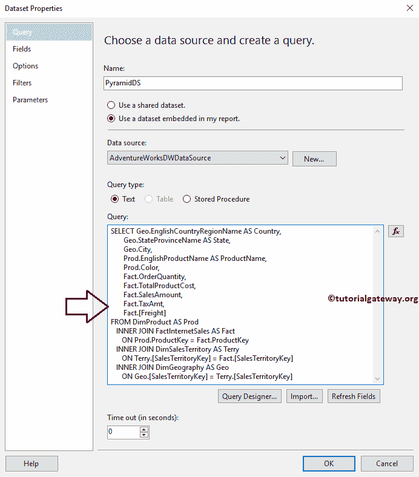

我们可以通过将图表属性从 [SSRS](https://www.tutorialgateway.org/ssrs/) 工具箱拖动到设计空间来添加金字塔图表。或者右键单击报表设计器并选择插入- >图表选项。

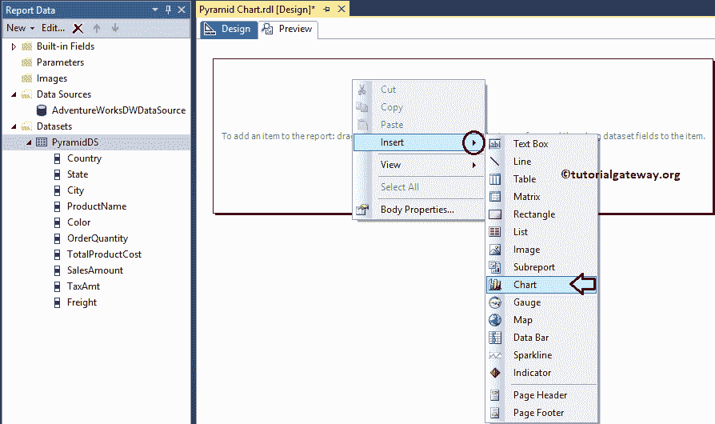

选择图表选项将打开选择图表类型窗口。对于这个例子，我们选择了金字塔图。

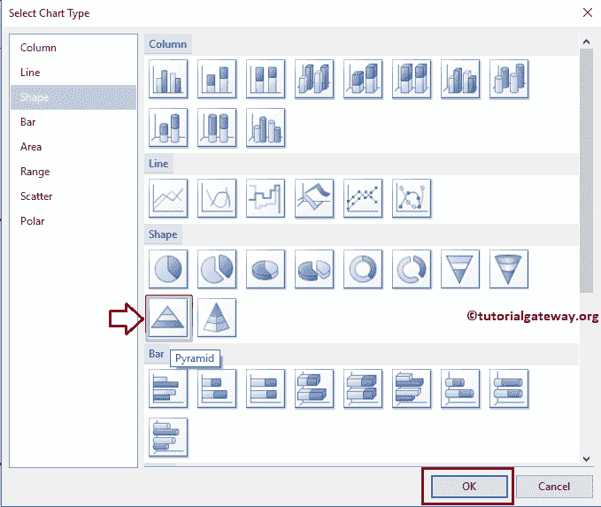

单击“确定”按钮后，金字塔图将显示在带有虚拟数据的设计区域上。

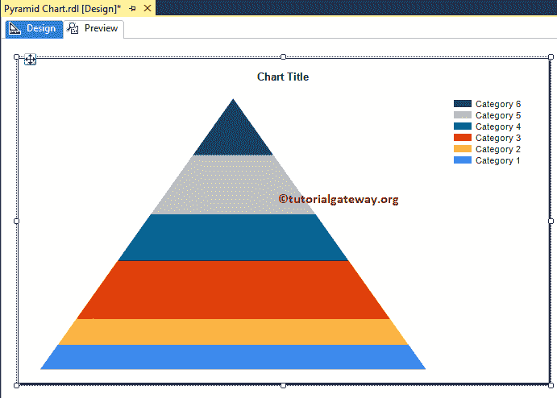

点击 SSRS 金字塔图周围的空白处将打开图表数据窗口

*   值:任何数字(公制)值，如总销售额、销售额、客户数量、税收等。所有这些值将使用聚合函数(总和、计数等)进行聚合。因为我们用类别组项目对它们进行分组。
*   类别组:请指定要对金字塔图进行分区的列名。

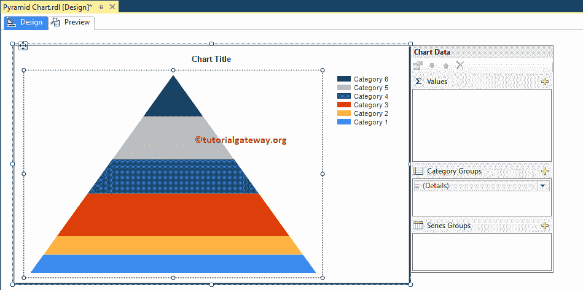

如前所述，在本例中，我们按照产品颜色创建了一个销售金字塔图。因此，将销售金额从数据集中拖放到图表数据值，并将产品颜色拖放到类别组中。

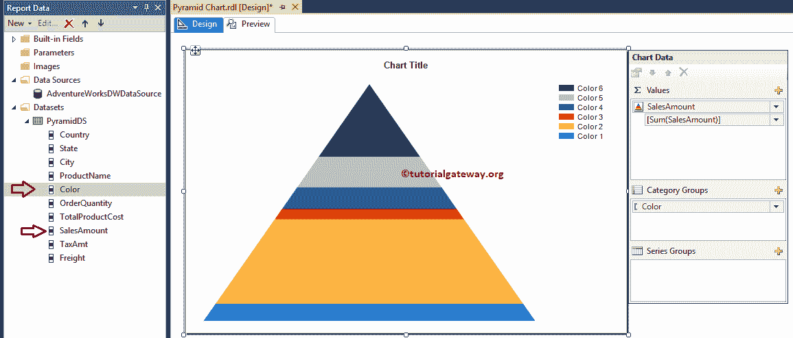

单击预览按钮查看报告预览。

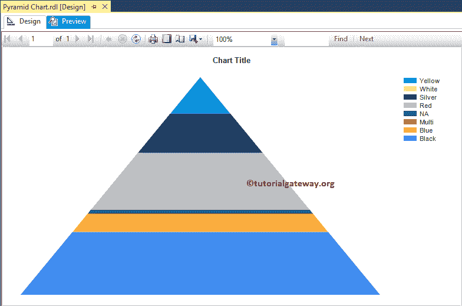

如果你观察上面的截图，我们无法识别多色产品销售和 NA 的区别。为了解决这些情况，我们必须使用数据标签。

### 在 SSRS 的金字塔图中添加数据标签

右键单击金字塔图，从上下文菜单中选择显示数据标签选项，以显示值

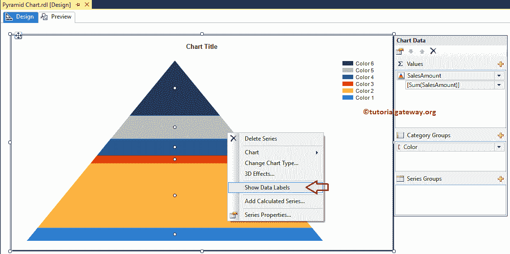

接下来，我们将格式化字体，并将数字格式从默认更改为货币。

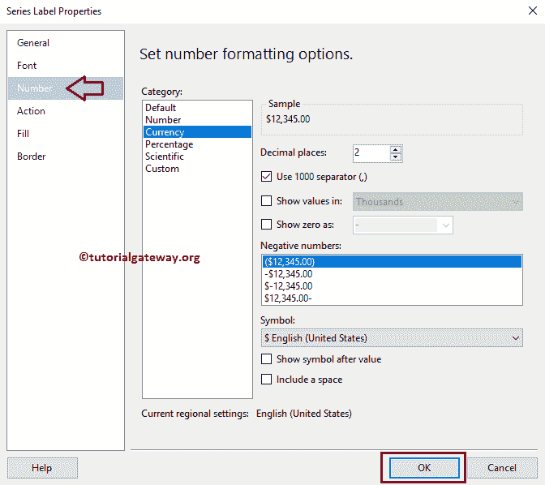

点击预览按钮，查看 SSRS 金字塔图报告预览。

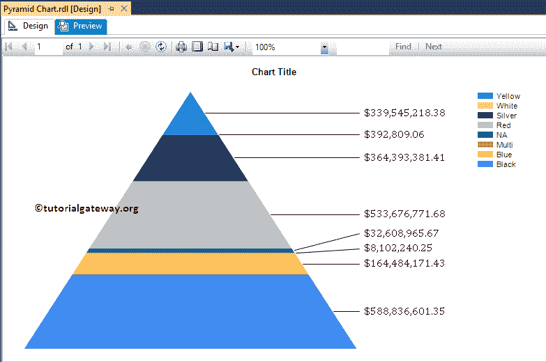

现在你可以看到每种颜色之间的销售差异。

### 更改 SSRS 金字塔图标题

要更改金字塔图表标题，请选择图表标题区域，然后更改标题。这里我们将更改为按颜色划分的销售金字塔图，因为报告显示的是相同的

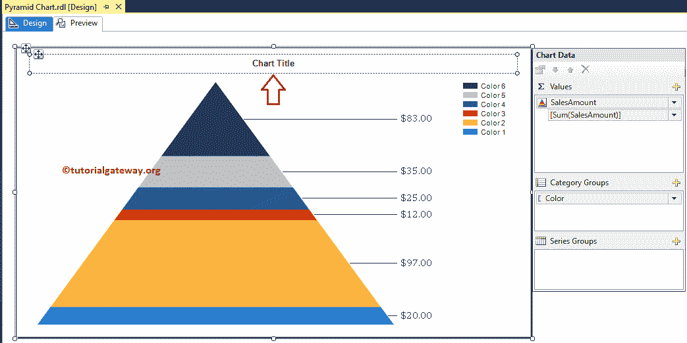

#### 格式化 SSRS 金字塔图表标题字体

请选择图表标题区域，右键单击它将打开上下文菜单。请从菜单中选择标题属性选项。

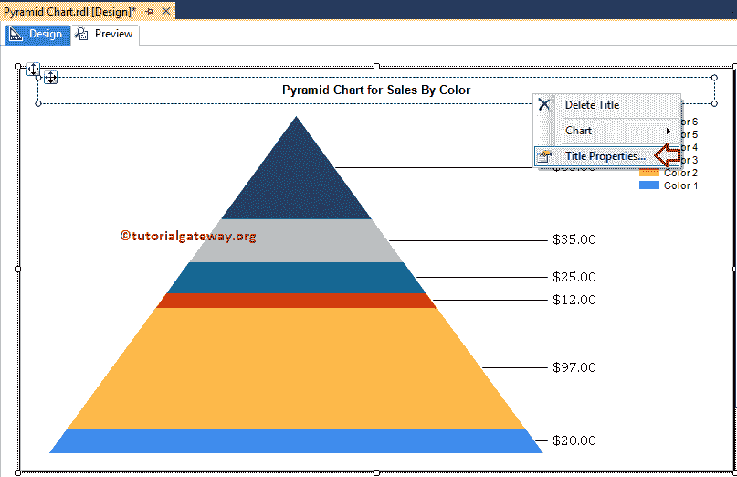

接下来，在字体选项卡中，我们可以更改金字塔图表标题的字体大小、字体系列、字体样式和颜色。这里我们将字体更改为坎布拉，字体大小更改为 14pt，颜色更改为深蓝色

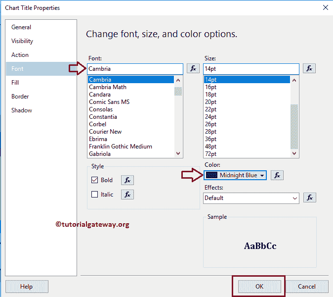

单击预览按钮查看报告预览。

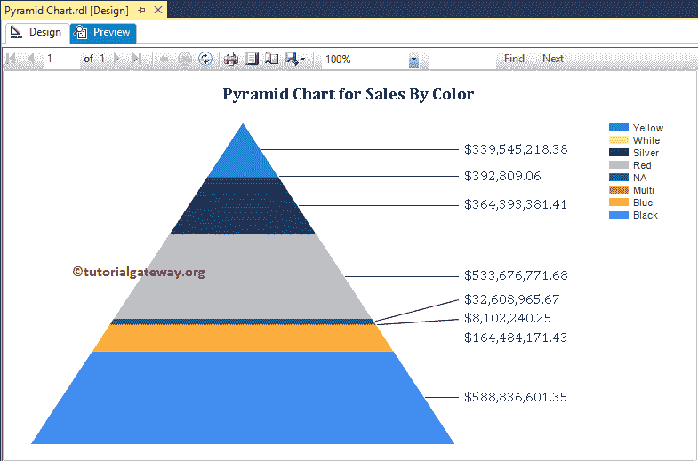

### 显示 SSRS 金字塔图的图例标题

要显示图例标题，请选择图例区域，右键单击它将打开上下文菜单。请从上下文菜单中选择“显示图例标题”选项。

请根据您的要求重命名图例标题。这里我们将其命名为产品颜色

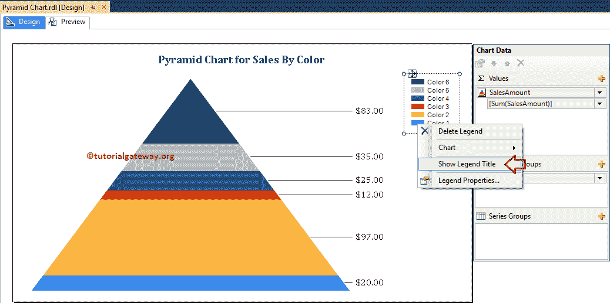

#### 格式化 SSRS 金字塔图的图例位置和字体

要格式化图例区域，请选择图例属性选项

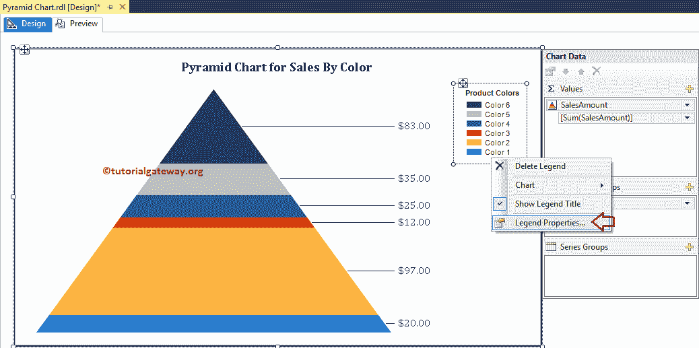

它将打开一个名为“图例属性窗口”的新窗口。在常规选项卡中，我们有一个名为图例位置的选项。您可以通过更改点位置来更改图例位置。

现在，我们将位置从默认的右上角更改为左上角。

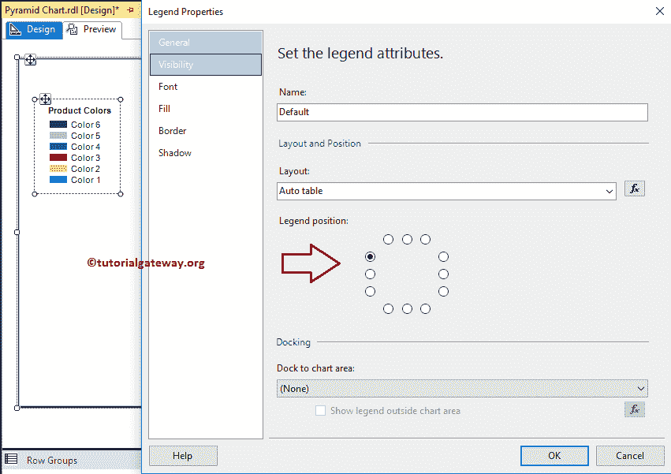

接下来，在字体选项卡中，我们可以更改金字塔图图例的字体大小、字体系列、字体样式和颜色，如下图所示

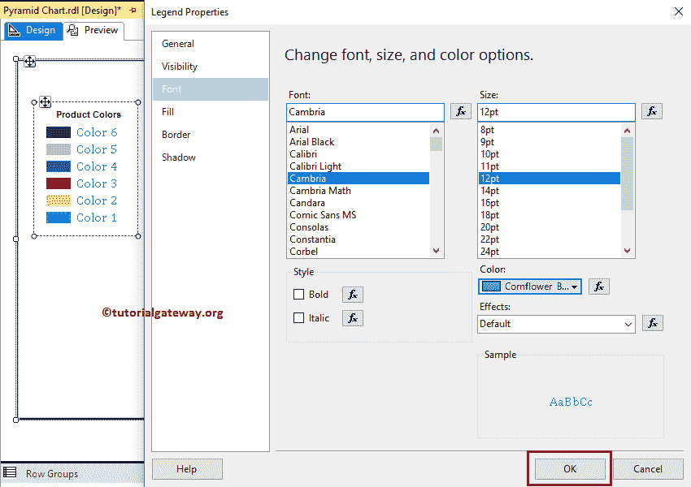

如你所见，我们把字体改成了坎布里亚，字体大小改成了 12 磅

点击确定按钮关闭属性窗口，点击预览选项卡，查看

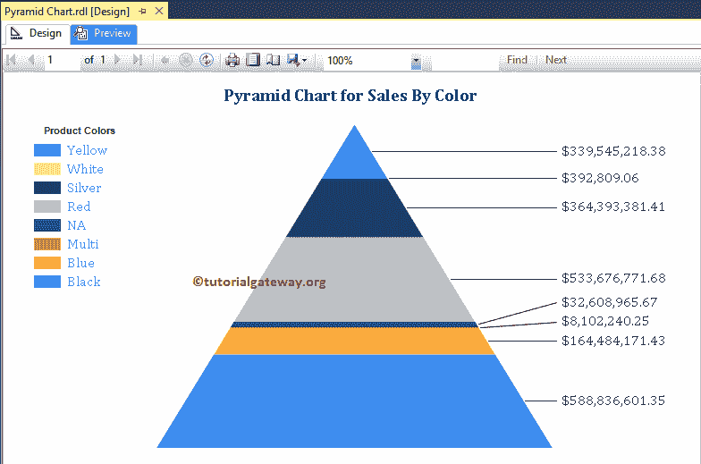

SSRS 金字塔图报表预览

### 改变 SSRS 金字塔图表的调色板

我们还可以更改 SSRS 默认的金字塔图表颜色或图表调色板。首先，选择图表并转到属性。通过选择“调色板”属性来更改调色板颜色

这里，我们决定将调色板颜色设为默认。请记住，如果您不喜欢调色板的颜色，那么您可以选择“自定义”选项，并根据需要选择颜色。

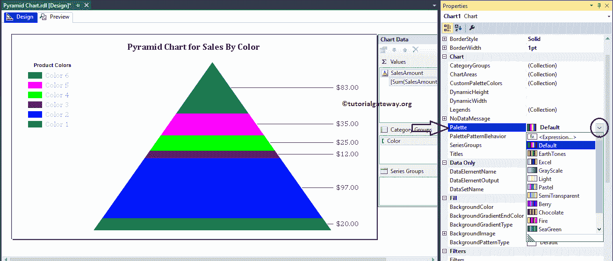

点击金字塔图预览选项卡，查看

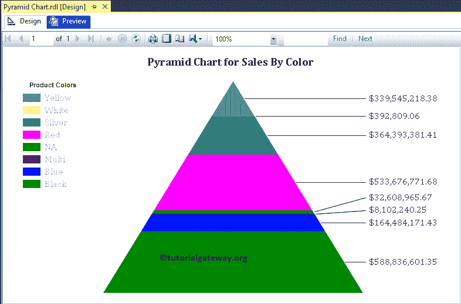

报告预览

### 改变金字塔图

SSRS 允许我们改变图表类型，即使是在创建金字塔图表之后。为此，首先，选择金字塔图表，右键单击它将打开上下文菜单。请从上下文菜单

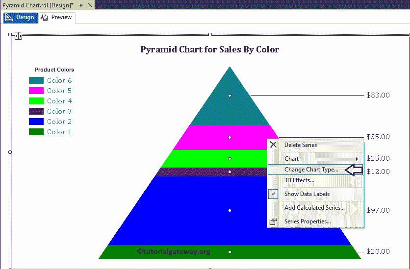

中选择更改图表类型…选项

选择“更改图表类型...”选项后，它将打开一个名为“选择图表类型”的新窗口来选择更改。这里我们选择的是 3D 金字塔图

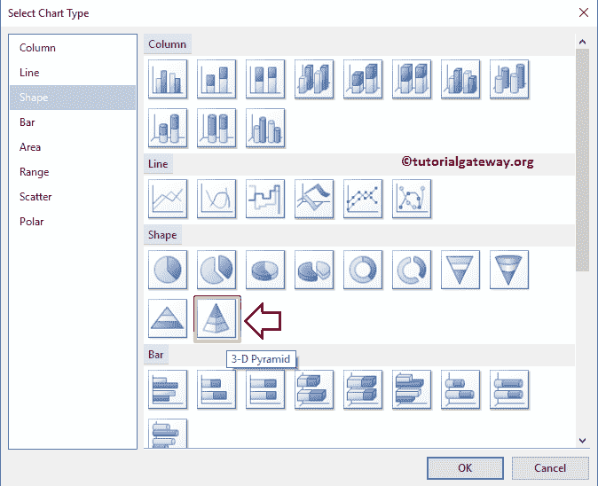

点击预览选项卡查看

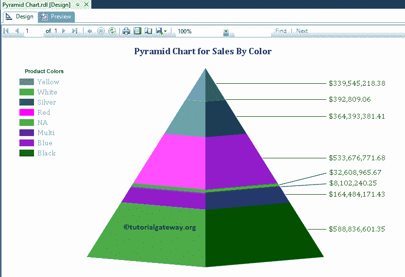

报告预览

从上面的截图中，您可以观察到我们成功地将 SSRS 图表类型从 2D 金字塔更改为三维金字塔图表