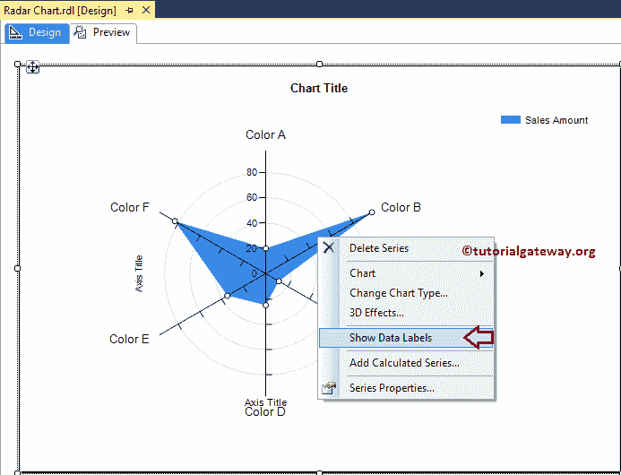
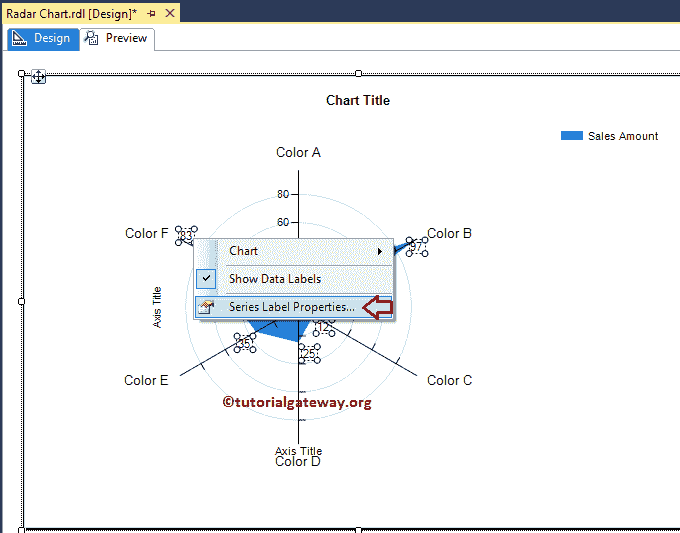
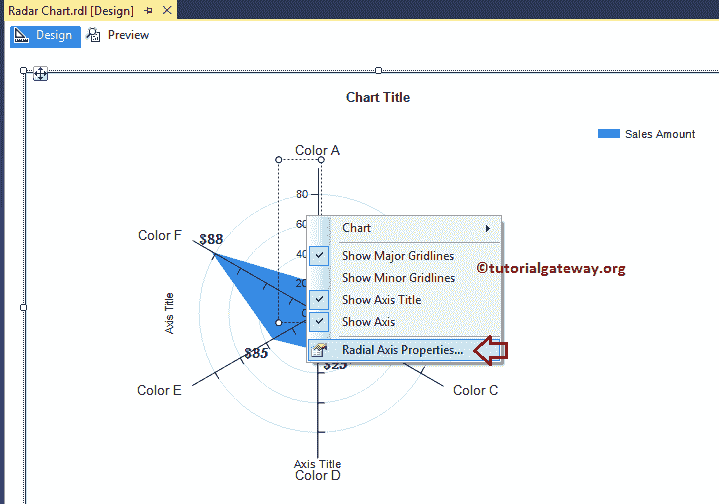
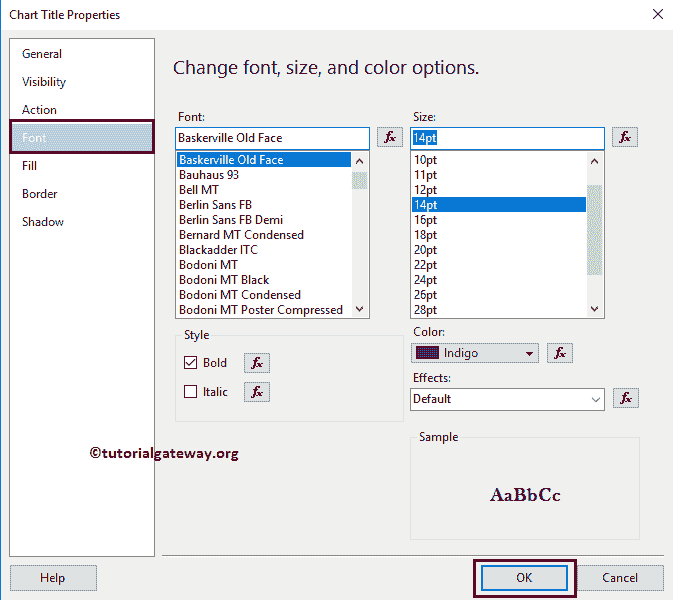

# SSRS 雷达图

> 原文：<https://www.tutorialgateway.org/radar-chart-in-ssrs/>

SSRS 的雷达图便于将数字数据可视化。我们可以称 SSRS 雷达图为折线图，其中 X 轴值以 360 度包裹。

在本文中，我们将通过一个示例向您展示如何在 SSRS 创建雷达图，如何更改其标题、雷达图字体样式、图表模型以及在 SSRS 的雷达图或 SQL Reporting Services 上显示数据标签。

对于这个 SSRS 雷达图示例，我们编写了自定义的 SQL 查询:

```
-- SQL Query that we use in SSRS Radar Chart
SELECT Cat.[EnglishProductCategoryName] AS ProductCategory, 
       SubCat.[EnglishProductSubcategoryName] AS ProductSubCategory, 
       Prod.EnglishProductName AS ProductName, 
       Prod.Color, 
       Fact.OrderQuantity, 
       Fact.TotalProductCost, 
       Fact.SalesAmount, 
       Fact.TaxAmt, 
       Fact.[Freight]
FROM FactInternetSales AS Fact
   INNER JOIN DimProduct AS Prod
      ON Fact.ProductKey = Prod.ProductKey
   INNER JOIN DimProductSubcategory AS SubCat
      ON Prod.ProductSubcategoryKey = SubCat.ProductSubcategoryKey 
   INNER JOIN DimProductCategory AS Cat 
      ON SubCat.ProductCategoryKey = Cat.ProductCategoryKey
```

而它要返回的 [SQL](https://www.tutorialgateway.org/sql/) 数据是:


## 在 SSRS 创建雷达图

在本例中，我们将创建一个雷达图，以 30 度显示按产品颜色分组的销售额。下面的截图将向您展示我们用于本次 [SSRS](https://www.tutorialgateway.org/ssrs/) 雷达图报告的[数据源](https://www.tutorialgateway.org/ssrs-shared-data-source/)和[数据集](https://www.tutorialgateway.org/shared-dataset-in-ssrs/)。


在 SSRS 报告设计中，我们可以通过将图表属性从工具箱拖到设计空间来添加雷达图。或者右键单击报告设计器以打开上下文菜单。从上下文菜单中，请选择插入->图表选项。


选择“图表”选项后，将打开一个名为“选择图表类型”的新窗口，从可用图表中选择所需的图表。对于这个例子，我们选择了雷达图。


单击确定按钮后，雷达图将显示在设计区域，并带有虚拟数据。


点击 SSRS 雷达图周围的空白处将打开图表数据窗口

*   值:任何数字(公制)值，如总销售额、销售额、客户数量、税收等。所有这些值将使用聚合函数(总和、平均值、计数等)进行聚合。这是因为我们用类别组项目对它们进行分组。
*   类别组:请指定要用于划分轴的列名。
*   系列组:在此指定维度。它进一步将单个类别分组


正如我们之前所说的，在这个例子中，我们将创建一个雷达图来按颜色查找销售额。因此，将销售金额列从数据集拖放到图表数据值，将产品颜色拖放到类别组。


单击预览按钮查看报告预览。


如果你观察上面的截图，它提供了一个完美的结果，但是我们无法确定每种颜色的确切销售金额。因此，让我们添加数据标签。

## SSRS 雷达图格式

以下示例将向您展示在 SSRS 格式化雷达图的步骤

### 向雷达图添加数据标签

右键单击雷达图，从上下文菜单中选择显示数据标签选项，显示数值



接下来，让我格式化数据标签的字体。为此，请选择数据标签，右键单击它将打开上下文菜单。在此，请从中选择系列标签属性选项。



这里我们将字体改为巴斯克维尔老脸，字体大小改为 11pt，颜色改为深绿色，字体粗细改为粗体


在数字选项卡下，我们将默认数字更改为精度为 0 的货币。


点击预览查看


报告预览

### 更改 SSRS 雷达条形图的轴属性

右键单击雷达条形图的轴，并选择径向轴属性..选项来格式化轴值。



这里，我们更改了径向轴的字体样式和字体大小。


### 更改 SSRS 雷达图标题

要更改雷达图标题，请选择图表标题区域，并根据您的要求更改标题。或者，右键单击它将打开上下文菜单。请选择标题属性..选项。


这里我们将标题改为雷达图示例，因为报告显示的是相同的


#### 格式化雷达图标题字体

在字体选项卡中，我们可以更改雷达图标题的字体大小、字体系列、字体样式和颜色。这里我们将字体改为巴斯克维尔老脸，字体大小改为 14pt，颜色改为靛蓝色，样式改为粗体，如下图截图



点击【确定】关闭属性窗口，点击预览选项卡，查看


报告预览

## SSRS 的不同雷达图

让我将产品类别添加到系列组部分


点击 SSRS 雷达图预览选项卡，查看


报告预览

这里，我们只是在数值部分


增加了一个度量(或数字)列

点击预览选项卡查看


报告

SSRS 允许我们改变图表类型，即使在创建雷达图之后。首先，选择雷达图，右键单击它将打开上下文菜单。请选择变更图表类型…选项


选择“更改图表类型...”选项后，它将打开一个名为“选择图表类型”的新窗口来选择更改。这里我们选择的是三维雷达图


点击预览选项卡查看雷达图预览


从上面的截图中，你可以观察到我们在 SSRS 成功地将图表类型从 2D 雷达图更改为 3D 雷达图