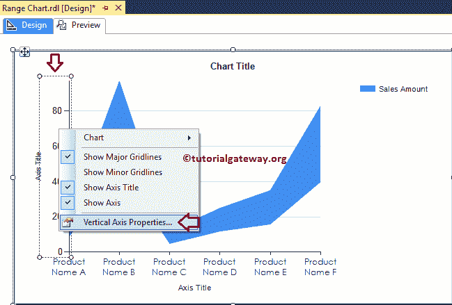
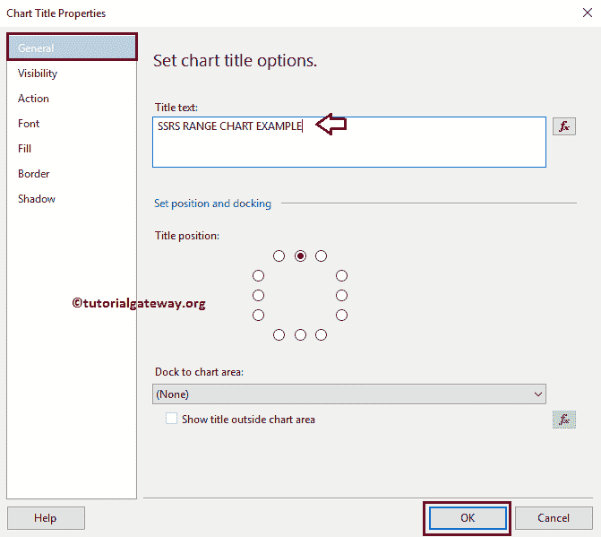

# SSRS 的范围图

> 原文：<https://www.tutorialgateway.org/range-chart-in-ssrs/>

在本文中，我们将通过一个示例向您展示如何在 SSRS 创建范围图，如何在 SSRS 或 SQL Reporting Services 中更改图表标题、图例标题、图例位置、字体样式和图表类型以平滑范围图。

对于这个 SSRS 范围图示例，我们将针对 SQL Server 数据源编写自定义 SQL 查询，我们将在这个 SSRS 报告中使用的查询是:

```
-- SQL Query that we use in SSRS Range Chart
SELECT Cat.[EnglishProductCategoryName] AS ProductCategory, 
       SubCat.[EnglishProductSubcategoryName] AS ProductSubCategory, 
       Prod.EnglishProductName AS ProductName, 
       Prod.Color, 
       Fact.OrderQuantity, 
       Fact.TotalProductCost, 
       Fact.SalesAmount, 
       Fact.TaxAmt, 
       Fact.[Freight]
FROM FactInternetSales AS Fact
   INNER JOIN DimProduct AS Prod
      ON Fact.ProductKey = Prod.ProductKey
   INNER JOIN DimProductSubcategory AS SubCat
      ON Prod.ProductSubcategoryKey = SubCat.ProductSubcategoryKey 
   INNER JOIN DimProductCategory AS Cat 
      ON SubCat.ProductCategoryKey = Cat.ProductCategoryKey
```

而它要返回的 [SQL](https://www.tutorialgateway.org/sql/) 数据是:


## 在 SSRS 创建范围图

在本例中，我们将创建一个范围图，根据产品名称(或颜色)显示销售金额、产品总成本。下面的截图将向您展示我们用于此范围图报告的[数据源](https://www.tutorialgateway.org/ssrs-shared-data-source/)和[数据集](https://www.tutorialgateway.org/shared-dataset-in-ssrs/)。


在 [SSRS](https://www.tutorialgateway.org/ssrs/) 报表设计中，我们可以通过将图表属性从 SSRS 工具箱拖动到设计空间来添加范围图表。或者右键单击报表设计器以打开上下文菜单。请从中选择插入- >图表选项。


选择“图表”选项后，将打开一个名为“选择图表类型”的新窗口，从可用图表中选择所需的图表。对于这个 SSRS 的例子，我们选择了一个范围图。


单击“确定”按钮后，范围图将显示在设计区域，并带有虚拟数据。


单击 SSRS 范围图周围的空白区域将打开图表数据窗口

*   值:任何数字(公制)值，如总销售额、销售额、客户数量、税收等。所有这些值将使用聚合函数(总和、平均值、计数等)进行聚合。这是因为我们用类别组项目对它们进行分组。
*   类别组:请指定要在其上划分气泡图的列名。


将“销售指标”列从数据集拖放到图表数据值，将“产品名称”维度拖放到类别组。


单击 SSRS 范围图预览选项卡查看范围报告预览。


如果观察上面的截图，就是我们在[区域图](https://www.tutorialgateway.org/area-chart-in-ssrs/)中生成的同一个图。因为范围图的意思是(高值到低值)，这里高值是销售金额之和，低值默认为零。

让我将低值从默认值更改为产品总成本的总和。


现在你可以看到 SSRS 范围图显示的是产品总成本和销售金额


之间的差异范围

## SSRS 范围图的格式

下面的示例列表将向您展示在 SQL Reporting Services 中格式化范围图所涉及的步骤

### 更改 SSRS 范围图的轴属性

右键单击范围图的轴，并选择水平轴属性..选项来格式化轴值。


这里，我们将字体样式更改为世纪哥特式，字体样式更改为粗体，颜色更改为深蓝色，字体大小更改为横轴的 9pt。


接下来，右键单击面积图的垂直轴，并选择垂直轴属性..选项来格式化轴值。



请使用上面指定的技术来更改垂直轴的字体属性。接下来，通过选择“数字”选项卡来格式化纵轴中的数字。


### 更改 SSRS 范围图的轴标题

要更改范围图坐标轴标题，请选择坐标轴标题，并根据您的要求更改标题。或者，右键单击它将打开上下文菜单。请选择轴标题属性..选项。


它将打开一个名为轴标题属性窗口的新窗口。在“常规”部分，我们可以根据需要更改标题文本。目前，我们将其更改为产品名称


在字体选项卡下，我们可以更改坐标轴标题的字体样式、大小和颜色。现在，我们将颜色改为深绿色，字体改为世纪哥特式，大小改为 12pt，样式改为粗体


也请将相同的属性应用于 Y 轴。完成后，单击预览选项卡查看报告预览。


### 更改 SSRS 范围图标题

要更改范围图表的标题，请选择图表标题区域，并根据您的要求更改标题。或者，右键单击它将打开上下文菜单。请选择标题属性..选项。


这里我们将标题更改为“SSRS 范围图示例”，因为报告显示的是相同的



#### 格式化 SSRS 范围图标题字体

在字体选项卡中，我们可以更改范围图表标题的字体大小、字体系列、字体样式和颜色。这里我们将字体改为世纪哥特式，样式改为粗体，字体大小改为 14pt，颜色改为棕色，如下图截图所示


### SSRS 范围图的格式图例

要格式化范围图图例区域，请选择图例区域，右键单击它将打开上下文菜单。请从菜单中选择图例属性选项。


它将打开一个名为“图例属性窗口”的新窗口。在“常规”选项卡中，我们有一个名为“图例位置”的选项，通过更改点位置来更改图例位置。现在，我们将位置改为右上角。


接下来，在“字体”选项卡下，我们可以更改图例的字体样式、大小和颜色。现在，我们将字体改为世纪哥特式，颜色改为栗色，样式改为粗体，大小改为 10pt


点击【确定】按钮，关闭【属性】窗口，点击预览选项卡，查看


报表预览

## 在 SSRS 将范围图转换为平滑范围图

SSRS 允许我们改变图表类型，即使在创建了一个范围图。首先，选择范围图，右键单击它将打开上下文菜单。请选择变更图表类型…选项


选择“更改图表类型...”选项后，它将打开一个名为“选择图表类型”的新窗口来选择更改。这里我们选择平滑范围图


点击预览选项卡查看


报告预览

从上面的截图中，你可以观察到我们成功地将图表类型从正常范围图表更改为平滑范围图表。

到目前为止，我们使用的是单个数据系列值。让我将产品总成本添加到图表值中，并将低属性更改为税额(仅用于演示目的)。


现在你可以看到，我们的范围图显示的是销售金额和产品总成本的图表


### 在 SSRS 的范围图中添加数据标签

上图包含太多数据，无法在数据标签中显示。所以让我将类别组中的维度从产品名称更改为颜色


右键单击图表，从上下文菜单中选择显示数据标签选项，以显示值


接下来，让我格式化数据标签的字体。为此，请选择数据标签，右键单击它并从中选择系列标签属性选项。


这里我们将字体改为世纪哥特式，字体大小改为 10pt，字体颜色改为褐红色，样式改为粗体


接下来，通过选择数字选项卡将数字格式化为货币。


对蓝色图表也要这样做。完成后，点击预览选项卡查看


报告预览