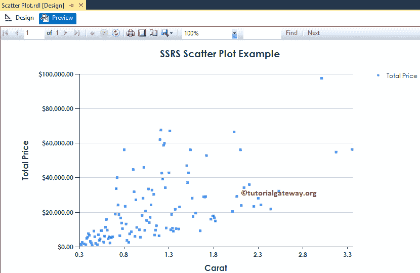
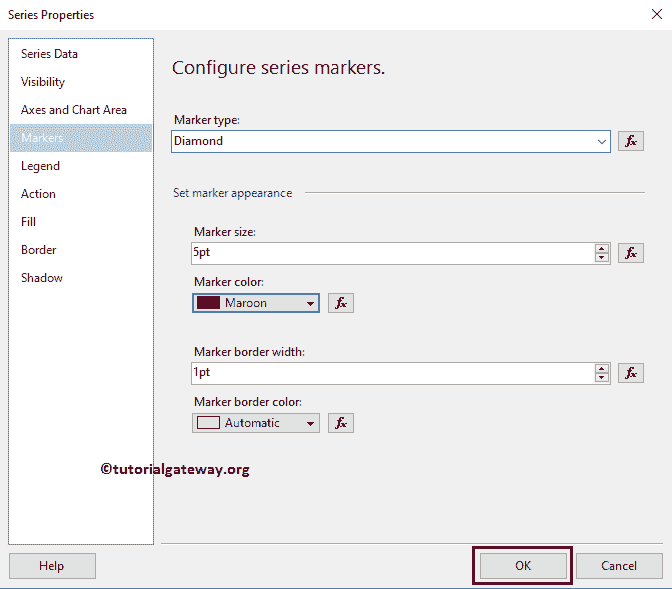
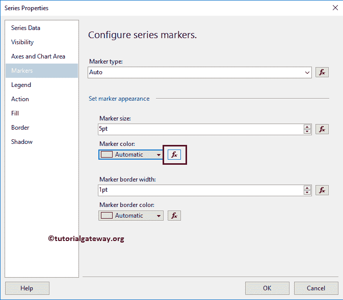
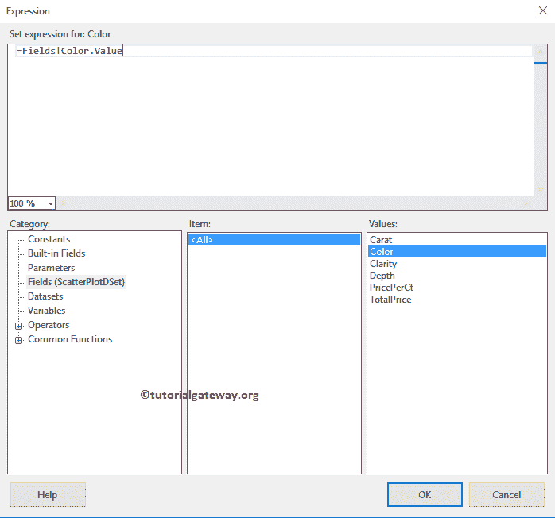

# SSRS 的散点图

> 原文：<https://www.tutorialgateway.org/scatter-plot-in-ssrs/>

SSRS 的散点图对于可视化任意两组数据之间的关系非常有用。在本文中，我们将通过一个示例向您展示如何在 SSRS 创建散点图，如何在 SSRS 或 SQL Reporting Services 中更改散点图的图表标题、图例位置、图例标题和字体样式。

对于这个 SSRS 散点图示例，我们使用了自定义 [SQL](https://www.tutorialgateway.org/sql/) 查询:

```
-- SQL Query that we use in SSRS Scatter Plot
SELECT [Carat]
      ,[Color]
      ,[Clarity]
      ,[Depth]
      ,[PricePerCt]
      ,[TotalPrice]
  FROM [Diamonds]
```

它将返回的数据是:


## 在 SSRS 创建散点图

在这个例子中，我们将创建一个散点图来显示钻石插入符号的总价。下面的截图将向您展示我们用于此散点图报告的[数据源](https://www.tutorialgateway.org/ssrs-shared-data-source/)和[数据集](https://www.tutorialgateway.org/shared-dataset-in-ssrs/)。


在 [SSRS](https://www.tutorialgateway.org/ssrs/) 报告设计中，我们可以通过将图表属性从 SSRS 工具箱拖到设计空间来添加散点图，或者右键单击报告设计器并选择插入- >图表选项。


选择“图表”选项后，将打开一个名为“选择图表类型”的新窗口，从可用图表中选择所需的图表。对于这个 SSRS 的例子，我们选择散点图。


单击“确定”按钮后，散点图将显示在带有虚拟数据的设计区域中。


单击 SSRS 散点图周围的空白区域将打开图表数据窗口

*   值:任何数字(公制)值，如总销售额、销售额、客户数量、税收等。所有这些值将使用聚合函数(总和、平均值、计数等)进行聚合。这是因为我们用类别组项目对它们进行分组。
*   类别组:请指定要在其上划分散点图的列名。
*   系列组:请在此指定维度。它进一步将单个类别分组


将“总价指标”列从数据集拖放到图表数据值，将“克拉维度”拖放到类别组。


单击 SSRS 散点图预览选项卡查看报告预览。


## 格式化 SSRS 的散点图

以下示例列表将向您展示在 SSRS 格式化散点图所涉及的步骤

### 更改 SSRS 散点图的轴属性

右键单击散点图的轴，并选择水平轴属性..选项来格式化轴值。


这里我们改变了横轴的字体样式和字体大小。


接下来，右键单击 SSRS 散点图的垂直轴，并选择垂直轴属性..选项来格式化轴值。请使用上面指定的技术来更改垂直轴的字体。接下来，通过选择“数字”选项卡格式化纵轴中的数字。


### 更改 SSRS 散点图的轴标题

要更改散点图的轴标题，请选择轴标题区域，并根据您的要求更改标题。或者，右键单击它将打开上下文菜单。请选择轴标题属性..从中选择。


它将打开一个名为轴标题属性窗口的新窗口。在“常规”部分，我们可以根据需要更改标题文本。目前，我们将其改为克拉


在字体选项卡下，我们可以更改坐标轴标题的字体样式、大小和颜色。现在，我们将颜色改为深绿色，字体改为世纪哥特式，大小改为 12pt，样式改为粗体


也请将相同的属性应用于 Y 轴。完成后，单击预览查看 SSRS 散点图预览。


### 更改 SSRS 散点图标题

要更改散点图的标题，请选择图表标题区域，并根据您的要求更改标题。或者，右键单击它将打开上下文菜单。请选择标题属性..从中选择。


这里我们将标题更改为 SSRS 散点图示例，因为报告显示的是相同的


#### 格式化 SSRS 散点图标题字体

在字体选项卡中，我们可以更改散点图标题的字体大小、字体系列、字体样式和颜色。这里我们将字体改为世纪哥特式，字体大小改为 14pt，颜色改为深绿色


### SSRS 散点图的格式图例

要格式化散点图图例区域，请选择图例区域，右键单击它将打开上下文菜单。请从菜单中选择图例属性选项。


它将打开一个名为“图例属性窗口”的新窗口。在“常规”选项卡中，我们有一个名为“图例位置”的选项，通过更改点位置来更改图例位置。目前，我们将保持现状。

接下来，在“字体”选项卡下，我们可以更改图例的字体样式、大小和颜色。现在，我们将字体改为世纪哥特式，大小改为 9pt


点击【确定】按钮，关闭【属性】窗口，点击预览选项卡，查看



报告预览

右键单击标记将打开上下文菜单。请从中选择系列属性。


单击系列属性选项后，将打开一个名为系列属性的新窗口。

在“标记”选项卡下，我们可以更改标记类型、颜色、大小、边框宽度和边框颜色。首先，让我将形状从“自动”更改为“钻石”


让我把颜色改为栗色，尺寸改为 5pt



从报告预览中，您可以看到我们成功更改了标记形状、大小和颜色


您可以选择向系列组中再添加一个维度，以进一步划分散点图标记。目前，我们正在为系列组


添加颜色

接下来，我们将标记大小更改为 5pt(默认为 3.5pt)，并将颜色保持为自动


让我给你看看报告预览


如您所见，报告显示了完美的结果，如果我将默认的颜色组合更改为更有意义的输出，可能会更好。为此，让我转到系列属性(如上所述)并点击“制作颜色”属性



下的表达式按钮

让我将颜色从自动更改为颜色尺寸字段



点击预览选项卡查看 SSRS 散点图预览


从上面的截图中，您可以看到我们使用颜色维度成功地更改了散点图的颜色。