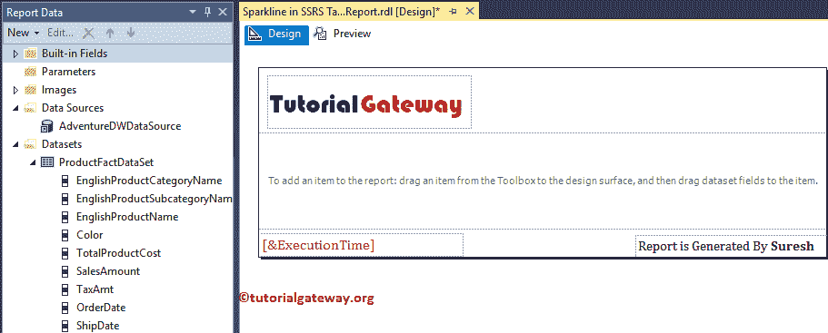

# 在 SSR 中闪闪发光

> 原文：<https://www.tutorialgateway.org/sparkline-in-ssrs/>

在本文中，我们将通过一个例子向您展示如何在 SSRS 创建迷你图。由于大多数关注者都在询问表报告中的迷你图，我们将向您展示将 SSRS 迷你图添加到表报告和矩阵报告中所涉及的步骤。

对于这个 SSRS 迷你图示例，我们将针对 SQL Server 数据源编写自定义 SQL 查询，我们将用于此报告的查询是:

```
-- SQL Query that we used in SSRS Sparkline
SELECT Prodcat.EnglishProductCategoryName,
              prodSubcat.EnglishProductSubcategoryName,  
              prod.EnglishProductName, 
              prod.Color, 
              fact.[TotalProductCost],
              fact.SalesAmount, 
              fact.TaxAmt,
              fact.[OrderDate],
              fact.[ShipDate] 
FROM dbo.DimProduct as prod 
   INNER JOIN  dbo.DimProductSubcategory AS prodSubcat ON 
               prod.ProductSubcategoryKey = prodSubcat.ProductSubcategoryKey 
   INNER JOIN  dbo.DimProductCategory AS Prodcat ON 
                prodSubcat.ProductCategoryKey = Prodcat.ProductCategoryKey 
   INNER JOIN  dbo.FactInternetSales AS fact ON 
                 fact.ProductKey = prod.ProductKey
```

## 在 SSRS 创建迷你图示例

此示例向您展示了在 SSRS 创建迷你图的分步方法，以及如何将其添加到表报表和矩阵报表中？。下面的截图将向您展示我们用于本 [SSRS](https://www.tutorialgateway.org/ssrs/) 报告的[数据源](https://www.tutorialgateway.org/embedded-data-source-in-ssrs/)和[数据集](https://www.tutorialgateway.org/embedded-dataset-in-ssrs/)。


为了演示在 SSRS 报告中添加迷你图所涉及的步骤，我们将使用之前生成的报告，如下所示。请参考[为 SSRS 报告](https://www.tutorialgateway.org/add-headers-and-footers-to-ssrs-report/)文章添加页眉和页脚，了解添加页眉和页脚所涉及的步骤。



### 向 ssrs 表报告添加亮闪闪的内容

在本例中，我们将创建一个表报告，然后在 SSRS 表中添加一个迷你图。我们可以通过将表从 SSRS 工具箱拖到设计空间来添加到报表设计中。或者，右键单击报表设计器以打开上下文菜单。请从中选择插入->表选项。


如您所见，我们添加了英文产品子类别名称作为第一列，并从表中删除了第三列。建议大家参考[新建表报告](https://www.tutorialgateway.org/ssrs-table-report/)了解创建表报告涉及的步骤。


让我做一些格式化来改变表报告的外观。请参考[格式表报告](https://www.tutorialgateway.org/format-table-report-in-ssrs/)了解可用的格式选项。


接下来，右键单击包含产品子类别名称的文本框将打开上下文菜单。请选择行组，然后选择组属性。


选择“组属性”选项后，将打开一个新窗口，如下所示。请单击添加按钮添加组表达式。


接下来，选择“分组”列。这里是英文产品子类别名称


接下来，让我将迷你图添加到空列。

在 SSRS 有多种方法可以添加迷你图。首先，右键单击空列。从上下文菜单中，请选择插入->迷你图选项。


或者，通过将迷你图从 SSRS 工具箱拖到文本框


无论哪种方式，它都将打开以下窗口来选择迷你图类型。这里我们选择的是[线](https://www.tutorialgateway.org/line-chart-in-ssrs/)类型。


现在，您可以在 SSRS 的表报告中看到迷你图。


单击迷你图周围的空白区域将打开图表数据窗口。在这里，我们希望看到按订单日期趋势列出的产品总成本。因此，将“产品总成本”列从数据集拖放到图表数据值，将订单日期拖放到类别组。


让我向您展示 SSRS 迷你图报告预览。


### 向 ssrs 矩阵报告添加亮闪闪的内容

在本例中，我们将创建一个矩阵报告，然后在该矩阵中添加一个 SSR 迷你图。

我们可以通过将矩阵报告项从 SSRS 工具箱拖到设计空间来添加矩阵。或者我们可以右键单击报表设计器，并选择插入->矩阵选项。


如您所见，我们添加了英文产品子类别名称作为行组和销售额。我建议您参考[创建新矩阵报告](https://www.tutorialgateway.org/ssrs-matrix-report/)一文，了解创建矩阵报告所涉及的步骤。


让我给你看看报告预览。


接下来，让我在组外添加一个新列。


接下来，我们将在新创建的列


中插入 SSRS 迷你图

这次我们使用[区域图](https://www.tutorialgateway.org/area-chart-in-ssrs/)作为迷你图类型


最后，我们添加了销售金额列作为图表数据值，订单日期作为类别组。


让我向您展示 SSRS 迷你图报告预览。


从上面的截图中可以看到，我们在 SSRS 成功地将迷你图添加到矩阵报告中。

让我删除迷你图列，并在行组中添加一个新列。


将销售金额和订单日期添加为迷你图字段


让我向您展示 SSRS 迷你图报告预览。


再增加一个度量值，即总产品成本


嗯，我们的 SSRS 迷你图同时显示了销售额和产品总成本。

