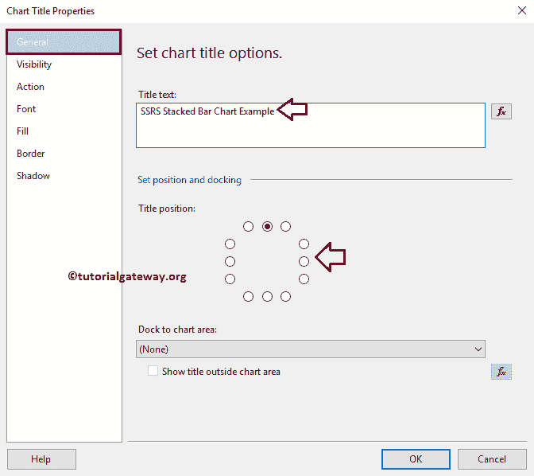
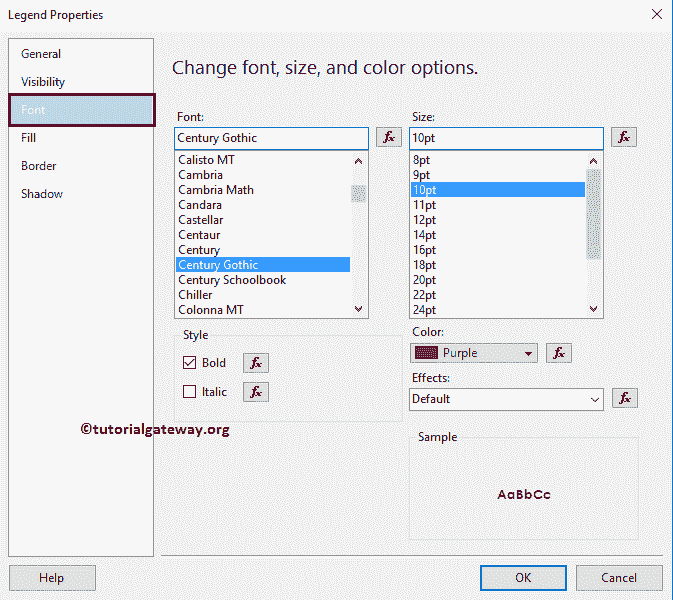
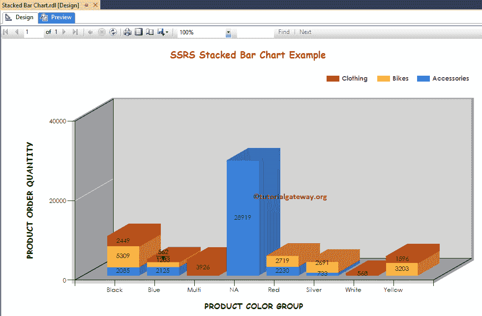

# SSRS 的堆叠条形图

> 原文：<https://www.tutorialgateway.org/stacked-bar-chart-in-ssrs/>

在本文中，我们将通过一个示例向您展示如何在 SSRS 创建堆叠条形图，如何在 SSRS 或 SQL Reporting Services 中更改图表标题、图例位置、图例标题、堆叠条形图字体样式、图表模型以及在堆叠条形图上显示数据标签。

对于这个 SSRS 堆叠条形图示例，我们将针对 SQL Server 数据源编写自定义 SQL 查询。我们将在此报告中使用的查询是:

```
-- SQL Query that we use in SSRS Stacked Bar Chart
SELECT Cat.[EnglishProductCategoryName] AS ProductCategory, 
       SubCat.[EnglishProductSubcategoryName] AS ProductSubCategory, 
       Prod.EnglishProductName AS ProductName, 
       Prod.Color, 
       Fact.OrderQuantity, 
       Fact.TotalProductCost, 
       Fact.SalesAmount, 
       Fact.TaxAmt, 
       Fact.[Freight]
FROM FactInternetSales AS Fact
   INNER JOIN DimProduct AS Prod
      ON Fact.ProductKey = Prod.ProductKey
   INNER JOIN DimProductSubcategory AS SubCat
      ON Prod.ProductSubcategoryKey = SubCat.ProductSubcategoryKey 
   INNER JOIN DimProductCategory AS Cat 
      ON SubCat.ProductCategoryKey = Cat.ProductCategoryKey
```

而它要返回的 [SQL](https://www.tutorialgateway.org/sql/) 数据是:


## 在 SSRS 创建堆叠条形图

在本例中，我们将创建一个堆叠条形图来显示按产品颜色分组的订单数量，以及按产品类别分组的订单数量。下面的截图显示了我们用于此堆叠条形图报告的[数据源](https://www.tutorialgateway.org/ssrs-shared-data-source/)和[数据集](https://www.tutorialgateway.org/shared-dataset-in-ssrs/)。


在 SSRS 报告设计中，我们可以通过将图表属性从 [SSRS](https://www.tutorialgateway.org/ssrs/) 工具箱拖动到设计空间来添加堆叠条形图。或者，我们可以右键单击报表设计器以打开上下文菜单。从上下文菜单中，请选择插入- >图表选项。


选择“图表”选项后，将打开一个名为“选择图表类型”的新窗口，从可用图表中选择所需的图表。对于这个 SSRS 的例子，我们选择一个堆叠条形图。


单击“确定”按钮后，堆叠条形图将显示在设计区域中，并带有虚拟数据。


单击堆叠条形图周围的空白区域将打开图表数据窗口

*   值:任何数字(公制)值，如总销售额、销售额、客户数量、税收等。所有这些值将使用聚合函数(总和、平均值、计数等)进行聚合。这是因为我们用类别组项目对它们进行分组。
*   类别组:请指定要对堆叠条形图进行分区的列名。
*   系列组:请在此指定维度。它将进一步将单个类别分组


正如我们之前所说的，在这个例子中，我们创建了一个 SSRS 堆叠条形图来查找按产品类别分组的订单数量。

因此，将“订单数量”列从数据集拖放到图表数据值，将“产品颜色”拖放到类别组，将“产品类别”拖放到系列组。


单击预览选项卡查看报告预览。


如果您观察上面的截图，我们无法确定确切的订单数量。因此，让我们添加数据标签。

## SSRS 堆叠条形图的格式

以下示例列表将向您展示在 SSRS 格式化堆叠条形图所涉及的步骤

### 在 SSRS 向堆叠条形图添加数据标签

右键单击堆叠条形图，并从上下文菜单中选择显示数据标签选项，以显示值


接下来，让我格式化数据标签的字体。为此，请选择数据标签，右键单击它将打开上下文菜单。接下来，请从中选择系列标签属性选项。


这里我们将字体改为世纪哥特式，字体大小改为 10pt


### 更改 SSRS 堆叠条形图的轴属性

右键单击堆叠条形图的轴，并选择水平轴属性..选项来格式化轴值。


这里，我们更改了横轴的字体样式和字体大小。请用同样的方法改变纵轴


的字体

### 更改 SSRS 堆叠条形图的轴标题

要更改轴标题，请选择轴标题区域，并根据您的要求更改标题。或者，右键单击它将打开上下文菜单。请选择轴标题属性..从中选择。


这将打开一个名为轴标题属性窗口的新窗口。在“常规”部分，我们可以根据需要更改标题文本。目前，我们将其更改为产品颜色组


在“字体”选项卡下，我们可以更改字体样式、大小和颜色。目前，我们将颜色更改为深绿色，字体更改为漫画无毫秒，大小更改为 12pt，样式更改为粗体


也请将相同的属性应用于 Y 轴。完成后，单击预览选项卡查看报告预览。


### 更改 SSRS 堆叠条形图标题

要更改堆叠条形图标题，请选择图表标题区域，并根据您的要求更改标题。或者，右键单击它将打开上下文菜单。请选择标题属性..从中选择。


这里我们将标题更改为 SSRS 堆叠条形图示例，因为报告显示的是相同的



#### 格式化 SSRS 堆叠条形图标题字体

在字体选项卡中，我们可以更改堆叠条形图标题的字体大小、字体系列、字体样式和颜色。这里，我们将字体改为漫画无 MS，字体大小改为 14pt，颜色改为棕色


### SSRS 堆叠条形图的格式图例

要格式化图例区域，请选择图例区域，右键单击它将打开上下文菜单。请从菜单中选择图例属性选项。


它会打开一个名为“图例属性窗口”的新窗口。在“常规”选项卡中，我们有一个名为“图例位置”的选项，通过更改点位置来更改图例位置。现在，我们将位置从默认的右上角更改为中间。


在“字体”选项卡下，我们可以更改图例的字体样式、大小和颜色。现在，我们将颜色改为紫色，字体改为世纪哥特式，大小改为 10pt，样式改为粗体



点击【确定】按钮，关闭【属性】窗口，点击预览选项卡，查看


报表预览

## SSRS 不同的堆叠条形图

SSRS 允许我们更改图表类型，即使是在创建堆叠条形图之后。首先，选择堆叠条形图，右键单击它将打开上下文菜单。请选择变更图表类型…选项


选择“更改图表类型...”选项后，它将打开一个名为“选择图表类型”的新窗口来选择更改。这里我们选择的是三维堆叠柱形图


点击预览选项卡查看



报告预览

从上面的截图中，您可以观察到我们成功地将图表类型从 2D 堆叠条形图更改为三维堆叠条形图

这次我们将把 SSRS 图表类型从三维堆叠条形图改为 100%堆叠柱形图


单击预览选项卡查看报告预览。可以看到，它是按系列组


显示百分比的

这次我们将把图表类型改为三维 100%堆叠柱形图


点击预览选项卡，查看


SSRS 堆叠条形图预览