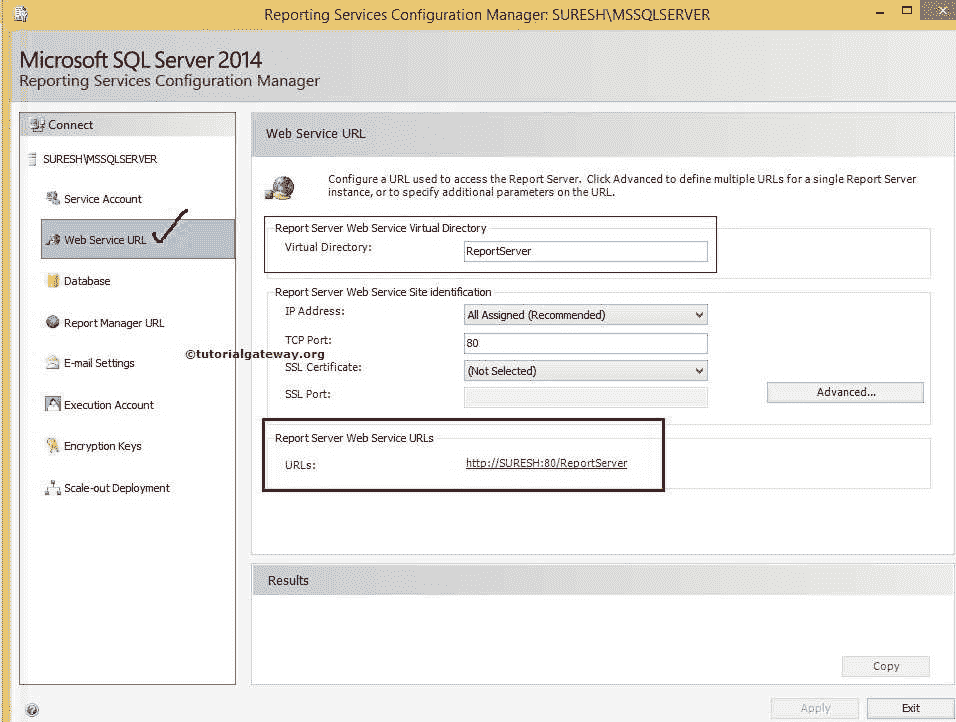
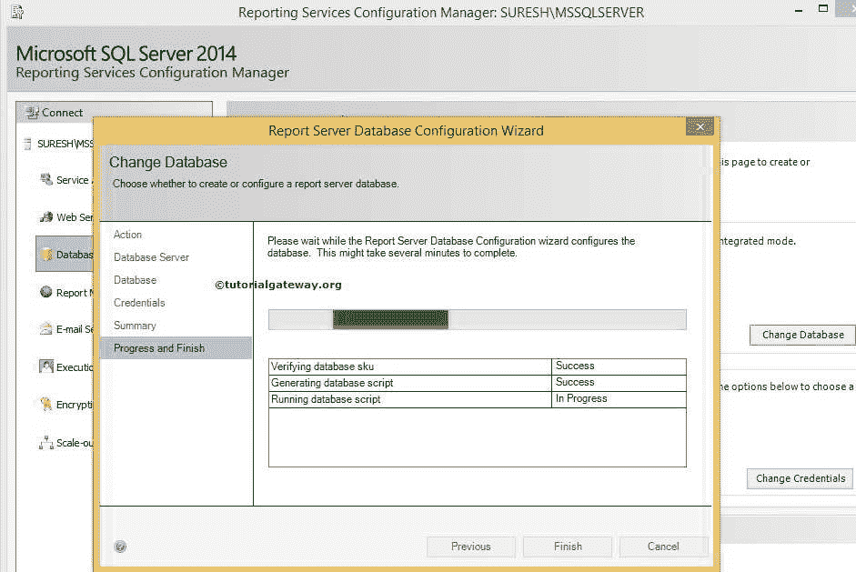

# SQL Server 报告服务配置管理器

> 原文：<https://www.tutorialgateway.org/sql-server-reporting-services-configuration-manager/>

在 SSRS，SQL Server 报表服务配置管理器用于配置报表服务本机模式安装。例如，

*   如果我们使用仅文件安装选项来安装报表服务器。那么在我们打算使用它之前，我们必须使用配置管理器来配置报告服务器
*   如果我们使用默认设置来安装报表服务器，我们可以使用此配置管理器来修改报表服务器的默认设置。

在本文中，我们将通过截图向您展示如何设置 SQL Server Reporting Services 配置管理器。

## SSRS 报告管理器使用

SSRS 配置管理器有助于执行以下任务:

*   配置报表服务器服务帐户:默认情况下，我们在最初设置报表服务器时提供默认帐户详细信息。但是使用 SQL Server Reporting Services 配置管理器，我们可以添加一个新帐户，或者更改密码。
*   创建或配置报表服务器数据库:默认情况下，报表服务器为内部存储生成两个数据库(报表服务器和报表服务器临时数据库)。我们可以使用 SQL Server 报告服务配置管理器来创建新数据库或管理现有数据库
*   对称密钥:我们可以使用 SQL Server Reporting Services 配置管理器来备份、恢复或替换对称密钥。这些密钥用于加密存储的连接字符串和凭据。
*   配置网络服务器网址:我们可以使用 SQL Server Reporting Services 配置管理器为每个应用配置网络服务器网址。这是我们将用于部署 SSRS 项目或报告的网址
*   配置报告网址:我们可以使用 SSRS 配置管理器为每个应用配置报告网址。这是我们将用于查看或保护 [SSRS](https://www.tutorialgateway.org/ssrs/) 项目或报告的网址。
*   配置电子邮件:使用 SQL Server 报告服务配置管理器配置 SMTP 服务器。SMTP 服务器用于发送有关报告处理或报告交付等的电子邮件。

## 配置 SQL Server 报告服务配置管理器

如果您使用的是 Windows 7，请转到“所有程序”，或者如果您使用的是 Windows 8 或更高版本，请转到“已安装的应用”。接下来，点击如下所示的 SQL Server Reporting Services 配置管理器

单击它后，它将打开报告服务配置管理器窗口以及报告服务配置连接窗口。使用此选项选择服务器名称和报告服务器实例名称。

这里，我们选择默认实例名和 Suresh 作为服务器名。

### SSRS 报表服务器状态

它显示当前报表服务器信息，如数据库名称、 [SQL Server](https://www.tutorialgateway.org/sql/) 实例名称、标识、版本和服务器状态。使用这两个按钮，我们可以使用此页面启动或停止报表服务器。

提示:我们可以使用“服务帐户”选项卡来更改现有帐户或为报告服务器创建新帐户。

### 网络服务的 SSRS 报告服务器网址

在 SQL Reporting Services 配置管理器中，Web 服务 URL 和 SSRS 报表管理器 URL 用于访问报表服务器 Web 服务和报表管理器。

默认情况下，报告服务提供默认的网址，但是您可以根据自己的要求更改它们。

注:这是我们将用于部署报告或 SSRS 项目

的网址

通过单击高级按钮，您可以将 TCP 端口从默认的 80 更改为其他。您可以通过单击添加、删除和编辑按钮将 IP 地址更改为网络名称。

### SSRS 报告管理器网址

在报表中，SSRS 报表管理器 URL 用于访问报表服务器 Web 服务和报表管理器。默认情况下，报告服务提供默认的网址。但是，您可以通过单击“高级”按钮，根据您的要求更改它们。

点击上面的网址后，会显示下面的截图。这是我们可以看到部署报表、[共享数据集](https://www.tutorialgateway.org/shared-dataset-in-ssrs/)、[共享数据源](https://www.tutorialgateway.org/ssrs-shared-data-source/)的地方。

注意:端口号在报表管理器网址中是可选的。有些系统可能会询问端口号，有些可能不会

### SSRS 报表管理器数据库配置

如果转到“数据库”选项卡，您可以看到当前的报表服务器数据库名称、模式以及用于该数据库的凭据。从下面的截图中，您可以看到 ReportServer 是默认的数据库名称。

在本例中，我们将向您展示更改默认数据库名称的步骤，因此，单击更改数据库按钮

单击“更改数据库”按钮后，将打开一个名为“报表服务器数据库配置向导”的新窗口来创建新数据库。

在“操作”选项卡中，您必须从列表中选择所需的选项:

*   创建新的报表服务器数据库:如果要为报表服务器内部存储创建新的基础数据库，请选择此选项。这里，我们选择这个选项是因为我们正在创建一个新的数据库。
*   选择现有报表服务器数据库:如果要修改报表服务器的现有数据库，请选择此选项。

### 将 SSRS 报表管理器连接到数据库服务器

此选项卡用于指定连接数据库所需的服务器名称、身份验证类型、用户名和密码。

点击测试连接按钮，测试我们提供的连接。

从上面的截图，看到我们的连接成功了。现在，单击下一步按钮转到数据库选项卡

在这里，我们必须根据您的要求指定新的数据库名称。目前，我们将其命名为新报表服务器，如下图所示

单击下一步按钮转到凭据选项卡。这里我们必须选择认证类型。SSRS 报告服务器提供以下类型的身份验证:

*   Windows 凭据:请在本地计算机上工作时选择此选项。在这里，您必须拥有访问数据库的权限。
*   SQL Server 凭据:如果要连接到外部数据库，请选择此选项。这里我们必须提供连接服务器所需的用户名和密码。这里的凭证应该与 SQL 安全性中的用户数据相匹配。
*   服务凭据:如果您希望报表服务器使用服务帐户进行连接，请选择此选项。在这里，凭据不会被加密或存储。

点击“下一步”按钮进入“摘要”标签。这里我们可以看到

创建的数据库的概要

点击下一步按钮创建数据库。

单击“完成”按钮完成创建新的报表服务器数据库。

从下面的截图中，可以看到新的数据库名称

