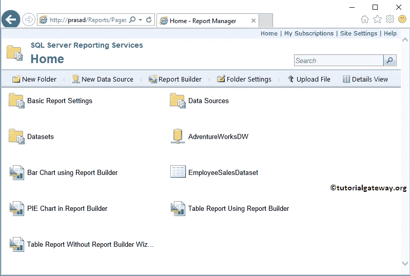
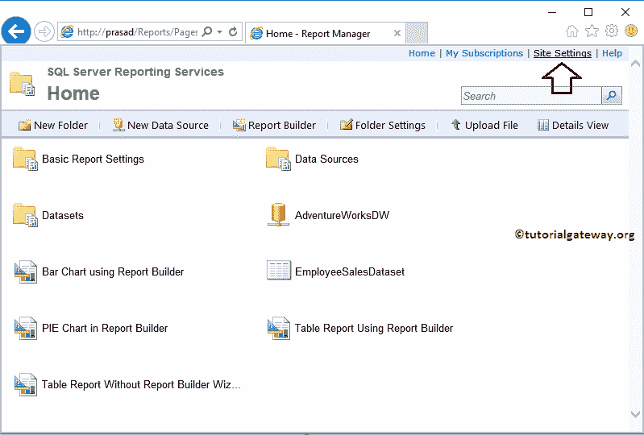
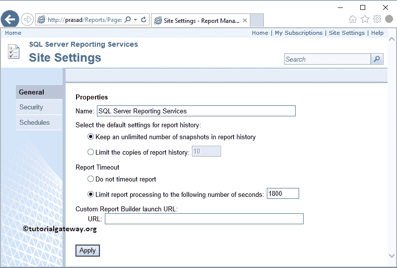
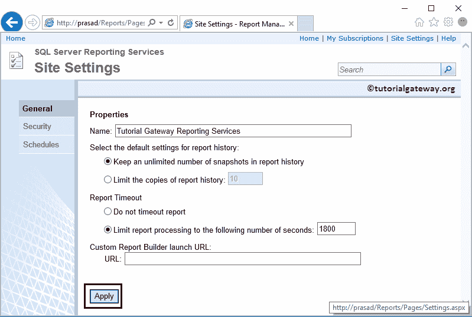
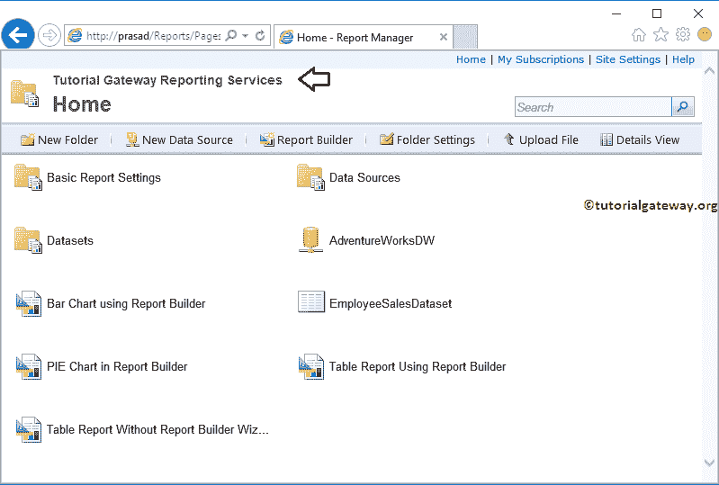

# 更改 SSRS 报告经理职位

> 原文：<https://www.tutorialgateway.org/change-ssrs-report-manager-title/>

通常，当您打开 SQL Server Reporting Services 网站时，它将显示默认标题，如下所示。但是，你有没有想过如何把 SSRS 报告经理的头衔改成一个更有意义的头衔，比如公司名称？。

在本文中，我们将通过一个示例向您展示更改报表管理器标题所涉及的步骤。

## 更改 SSRS 报告经理职位

要更改 [SSRS](https://www.tutorialgateway.org/ssrs/) 报告管理器标题，请点击右上角的站点设置超链接。

单击“站点设置”超链接后，报告管理器会将我们导航到站点设置页面。在此页面中，我们有三个选项卡，要更改报告服务标题，您必须使用常规选项卡

让我将标题更改为教程网关报告服务。

现在，您可以看到我们报告服务的新标题。

