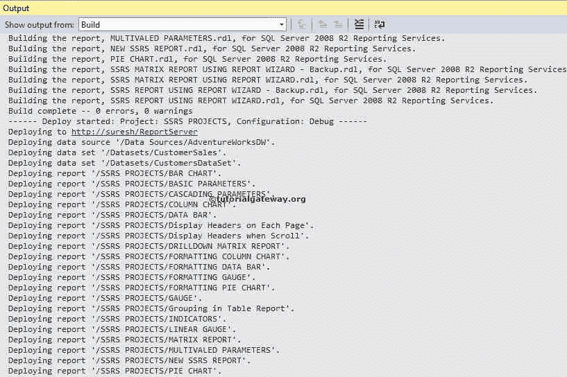
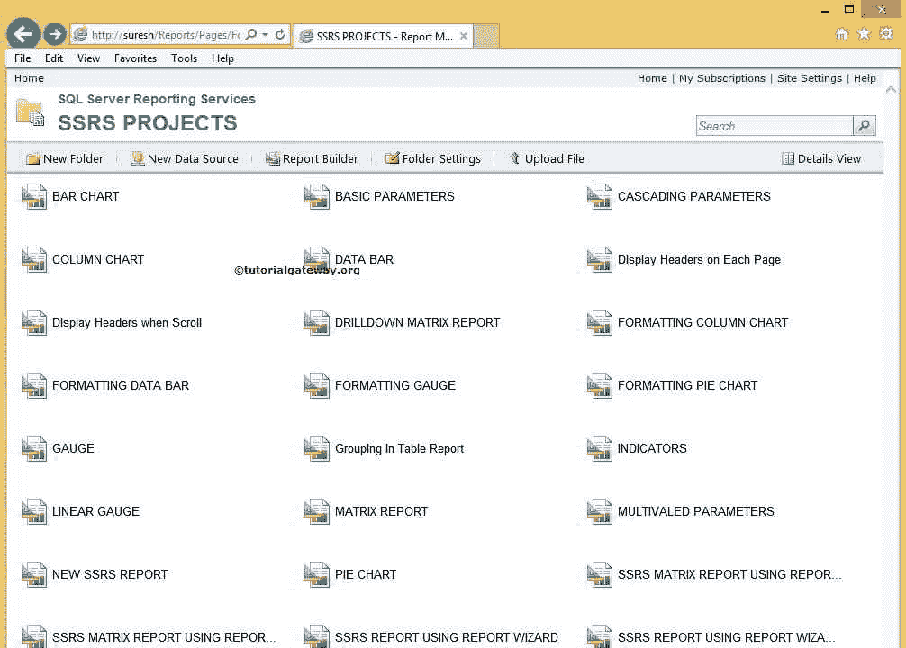

# 在 SSRS 部署报告

> 原文：<https://www.tutorialgateway.org/deploying-reports-in-ssrs/>

在本文中，我们将向您展示在 SSRS 使用 BIDS 部署报告所涉及的步骤。或者，如何在 SQL Server Reporting Services 数据工具中将 SSRS 项目部署到报表管理器，并举例说明。

下面的截图显示了本项目中的[共享数据集](https://www.tutorialgateway.org/shared-dataset-in-ssrs/)、[共享数据源](https://www.tutorialgateway.org/ssrs-shared-data-source/)和 SSRS 报告。

## 在 SSRS 部署报告

在 SSRS 项目中开始部署报表之前，我们必须配置报表服务器属性。因此，右键单击项目名称(此处为 [SSRS](https://www.tutorialgateway.org/ssrs/) 项目)并选择属性，如下图所示

T4】

单击“属性”选项后，将打开一个名为“SSRS 项目属性页”的新窗口来配置设置。以下是 SSRS 报告部署部分中的一些属性:

*   TargetDatasetFolder:请指定您要在其中部署本项目中存在的[共享数据集](https://www.tutorialgateway.org/shared-dataset-in-ssrs/)的文件夹名称。默认情况下，数据集是名称，但您可以根据需要进行更改。
*   目标数据源文件夹:请指定您要在其中部署本项目中存在的[共享数据源](https://www.tutorialgateway.org/ssrs-shared-data-source/)的文件夹名称。默认情况下，数据源是名称，但会根据需要进行更改。
*   目标报告文件夹:请指定要在其中部署我们在此项目中创建的 SSRS 报告的文件夹名称。默认情况下，项目名称将分配给此。你可以根据自己的要求修改。
*   目标报告部分文件夹:请提供要在其中部署此 SSRS 项目中存在的报告部分的文件夹名称(如果有)。默认情况下，报告部分是名称。

OverwriteDatasets:这个属性有两个选项 TRUE 和 FALSE。如果当前项目和报表服务器具有相同的共享数据集名称，则:

*   如果将此选项设置为“真”，报表服务器将使用当前项目数据集覆盖目标数据集
*   并且，如果将此选项设置为 FALSE，报表服务器将保留目标数据集。这是默认值

覆盖数据源:这个属性有两个选项“真”和“假”。如果当前项目和报表服务器具有相同的共享数据源名称，则:

*   如果将此选项设置为“真”，报表服务器将使用当前项目数据源覆盖目标数据源
*   并且，如果将此选项设置为 FALSE(默认值)，报表服务器将保留目标数据源。

目标服务器版本:请指定您正在使用的报表服务器版本。此属性有三个选项:SQL Server 2008、SQL Server 2008 R2 或更高版本和检测版本。我们使用的是 [SQL Server](https://www.tutorialgateway.org/sql/) 2014 so，我们选择了 SQL Server 2008 R2 或更高版本选项。

目标服务器网址:该属性用于提供我们要部署 SSRS 项目的目标网址。例如，如果要部署到安装在共享点的报表服务器，则提供站点 URL。

在本例中，我们将部署到报表服务器本机模式的默认 web 服务器，因此，我们将放置该 web 服务器的 URL

单击“应用”按钮完成项目属性的修改。接下来，转到解决方案资源管理器，右键单击项目名称以打开上下文菜单。请从上下文菜单中选择部署选项，如下图所示

提示:如果您没有权限，请以管理员身份运行 BIDS。

您可以在 SSRS 输出窗口查看已部署的报告

接下来，在 Internet Explorer 中打开报表管理器以查看已部署的 SSRS 项目。

提示:如果您没有权限，请以管理员身份运行浏览器。

双击数据源文件夹，查看项目

中的共享数据源

双击数据集文件夹，查看项目

中的共享数据集

接下来，双击 SSRS 项目文件夹，查看项目

中已部署的 SSRS 报告