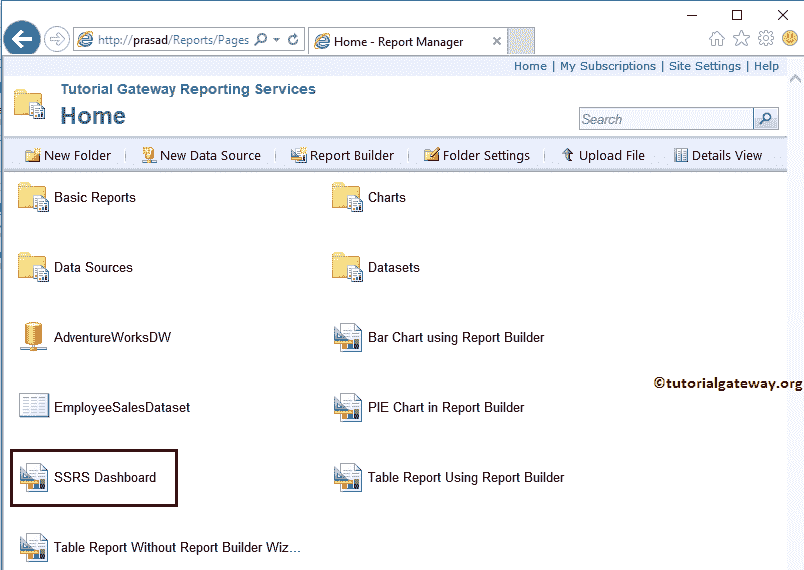

# 使用 SSRS 报告管理器部署 SSRS 报告

> 原文：<https://www.tutorialgateway.org/deploy-ssrs-reports-using-ssrs-report-manager/>

在 SSRS，部署报告非常简单直接，这要感谢微软提供了多种部署 SSRS 报告的方法。在本文中，我们将解释如何使用 SSRS 报告管理器部署 SSRS 报告

我们已经在[部署报告](https://www.tutorialgateway.org/deploying-reports-in-ssrs/)一文中解释了使用 BIDS 部署报告所涉及的步骤。

在我们开始使用 SSRS 表格报告管理器部署 [SSRS](https://www.tutorialgateway.org/ssrs/) 报告之前，让我们打开报告管理器来查看现有的数据源、数据集和报告。

## 使用 SSRS 报告管理器部署 SSRS 报告

要部署 SSRS 报告，报告管理器提供了一个名为“上传文件”的选项。在这个例子中，我们将使用这个选项来部署我们在上一篇文章中创建的 [SSRS 仪表板](https://www.tutorialgateway.org/ssrs-dashboard-reports/)报告。

单击上传文件菜单项，将打开以下页面。您可以使用此页面上传。rdl，。smdl，共享数据集，报告部件到报告管理器。或者，您可以说，使用此报告管理器页面部署 SSRS 报告。

*   浏览:此按钮将打开文件对话框，浏览本地文件系统并选择所需的文件。
*   名称:上传文件后，此文本框将自动填充选定的文件名，但您可以根据需要进行更改。
*   覆盖存在的项目:如果报告管理器中存在同名文件，则选择此选项将覆盖现有文件。

如您所见，我们正在选择文档- >项目- >图表文件夹

中的 [SSRS 仪表板](https://www.tutorialgateway.org/ssrs-dashboard-reports/)报告

点击【确定】上传或部署

报告

现在，您可以在报告管理器主页上看到我们部署的报告。

请点击已部署的报告查看报告预览

如您所见，它不显示报告；也许，它正在显示一条消息——报告服务器无法处理该报告。共享数据集“仪表板”的此引用无效。

我们收到此消息是因为报告数据集没有指向任何[共享数据集](https://www.tutorialgateway.org/shared-dataset-in-ssrs/)(共享数据)。

让我们更改已部署报告的数据集属性。为此，请单击仪表板报告旁边的向下箭头以打开菜单项。请从菜单项中选择管理选项。

选择“管理”选项后，报告管理器会将您导航到具有以下选项卡的新页面。在属性选项卡下，它将显示报告创建用户、创建和修改日期以及报告大小。

要更改数据集属性，请自行导航到共享数据集选项卡。从下面的截图中可以看到，它显示了一个错误，我们一直在解释这个错误。

请单击浏览按钮选择共享数据集。

单击“浏览”按钮将在报告管理器中显示可用文件夹和数据集的列表。

从下面的截图中你可以看到，我们正在选择数据集文件夹

中的共享数据

单击应用按钮将更改应用到报告。

请点击报告查看报告预览

现在，您可以使用报告管理器查看 SSRS 部署报告的预览。

