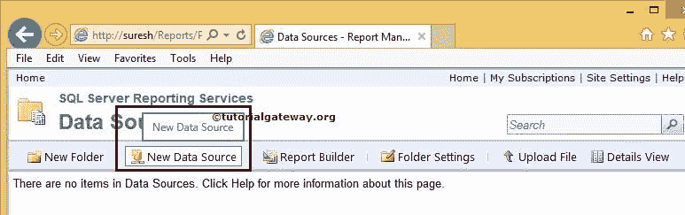
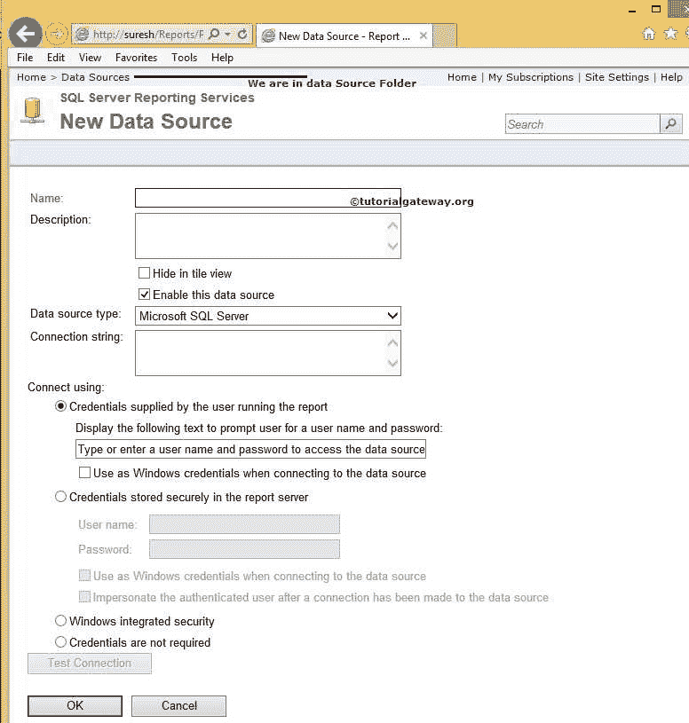
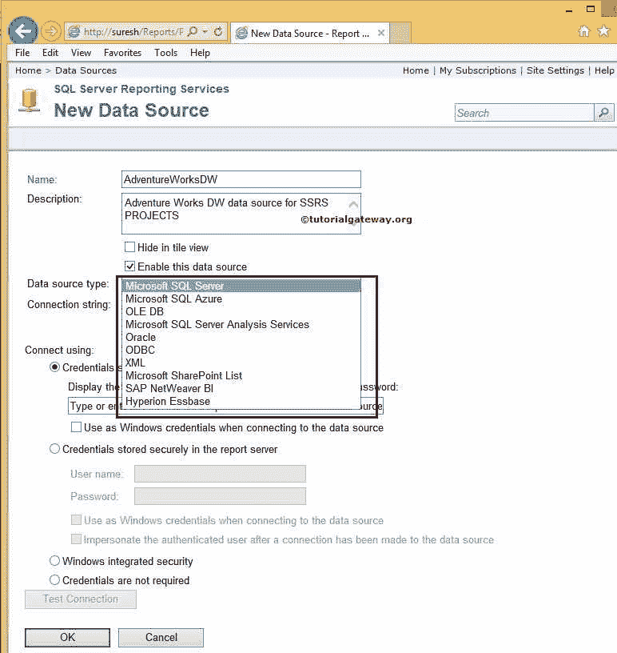
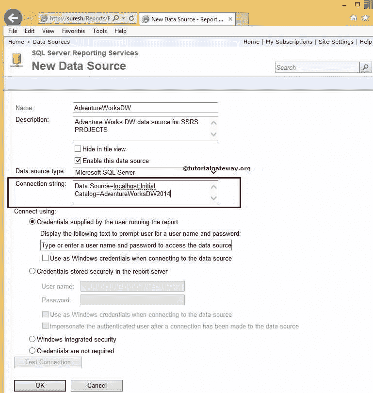
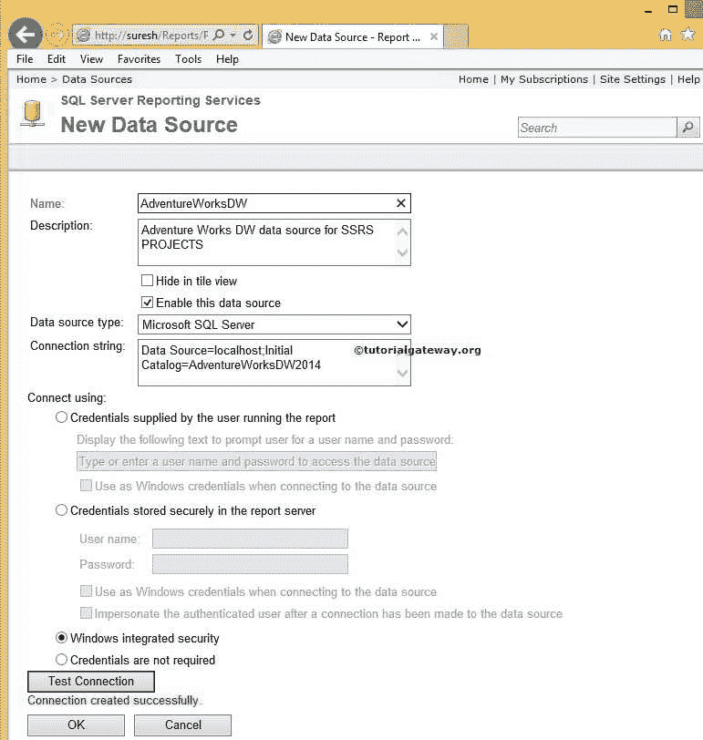
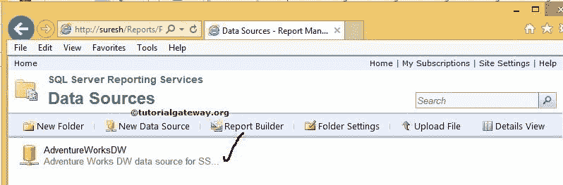

# 在 SSRS 报表管理器中创建共享数据源

> 原文：<https://www.tutorialgateway.org/data-source-in-ssrs-report-manager/>

在本文中，我们将向您展示如何在 SSRS 报表管理器中创建共享数据源。

## 在 SSRS 报表管理器中创建共享数据源

为此，请打开您的报表管理器。接下来点击【新建数据源】按钮如下图截图

单击“新建数据源”按钮后，将显示下面的截图。请参考 [SSRS 共享数据源](https://www.tutorialgateway.org/ssrs-shared-data-source/)文章了解以下 [SSRS](https://www.tutorialgateway.org/ssrs/) 属性:

下面的截图将向您展示报告管理器支持的 SSRS 共享数据源类型。

例如，如果你的数据源是 [SQL Server](https://www.tutorialgateway.org/sql/) ，那么选择微软 SQL Server 或者 OLE DB。如果您的数据源是 [SQL Server 分析服务](https://www.tutorialgateway.org/ssas/)，则选择微软 SQL Server 分析服务。

连接属性:在这里，我们必须指定数据源(提供程序)、服务器名称(或实例名称)、登录凭据和数据库名称。

连接使用:这里我们必须提到将报表与选定的数据库连接所需的凭据

*   运行报表的用户提供的凭据:当报表连接到数据源时，它将提示给定的文本(输入用户名和密码以访问数据源)。如果选中“连接到数据源时用作窗口凭据”选项，则报表服务器会将当前用户的窗口凭据传递给外部服务器。否则，它将提示输入凭据。
*   安全存储在报表服务器中的凭据:如果选择此选项，请指定登录数据源的用户名和密码，这些凭据将存储在报表中。此选项对于报表订阅很重要。
*   Windows 集成安全性:将当前用户的 windows 凭据传递给外部服务器以连接到数据源。目前，我们正在使用这个选项
*   不需要凭据:报表不会使用任何凭据来连接数据源。例如，如果我们正在访问本地文件系统中的文件，那么我们可以选择此选项。不过，尽量避免这个选项。

配置完数据源后，单击测试连接按钮检查连接是否有效。

单击“确定”完成在 SSRS 报表管理器中创建共享数据源。现在，请导航到数据源文件夹并检查新创建的数据源

