# SSRS 的缓存报告

> 原文：<https://www.tutorialgateway.org/cached-reports-in-ssrs/>

SSRS 的缓存报告是已处理报告的保存副本。如果您的报表是用大量数据生成的，或者是从大型数据集设计的，那么一次又一次地调用同一个报表是很耗时的。在这些情况下，您可以创建 SSRS 缓存报告。这样，我们可以节省报表渲染时间。

在我们开始在 SSRS 创建缓存报表之前，让我打开我的报表服务器来显示我们服务器上的现有报表。

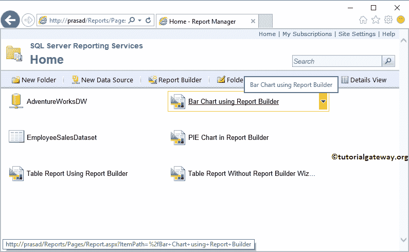

在本文中，我们将通过一个例子向您展示在 SSRS 创建缓存报告的步骤。

在这个 SSRS 缓存报表演示中，我们使用了 SSRS 报表生成器文章中[创建条形图的报表。所以请参考同样了解](https://www.tutorialgateway.org/create-bar-chart-in-ssrs-report-builder/) [SSRS](https://www.tutorialgateway.org/ssrs/) 报告数据。

## SSRS 缓存报告示例

要在条形图上创建 SSRS 缓存报表，请单击条形图旁边的向下箭头打开菜单项。请选择管理选项。

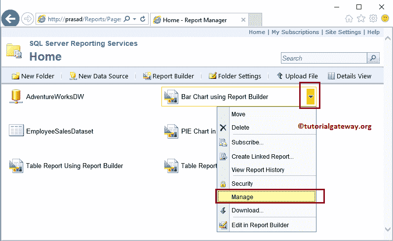

选择“管理”选项后，报表管理器会将您导航到具有以下选项卡的新页面。你可以用这个页面来管理这个报告(我必须说是高级操作)。在属性选项卡下，它将显示创建的报告、修改日期和报告大小。

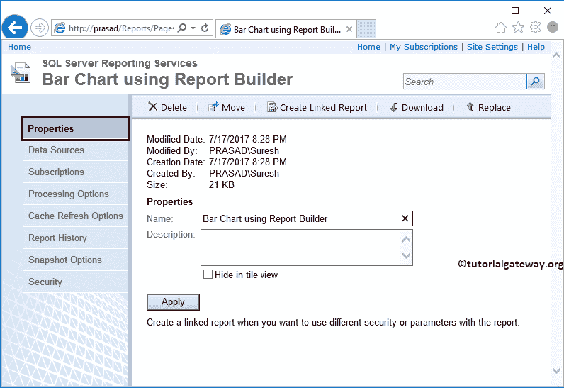

您可以通过多种方式在 SSRS 创建缓存报告:

*   使用处理选项
*   缓存刷新选项

### SSRS 缓存刷新选项

请自行导航至缓存刷新选项选项卡，并选择新建缓存刷新计划选项。

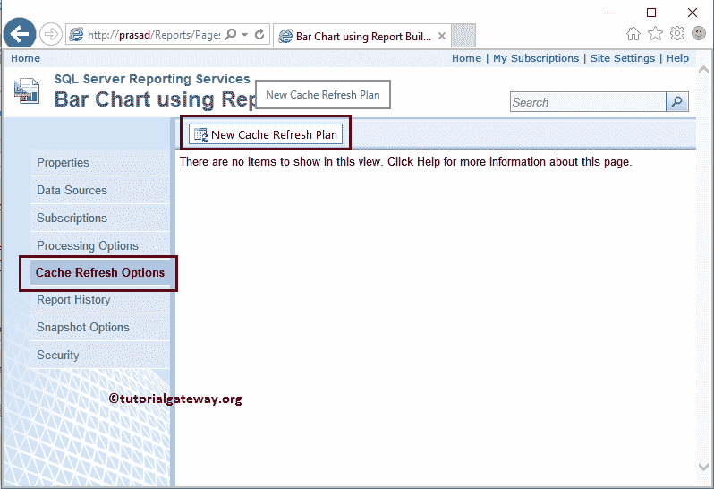

将显示以下弹出消息。点击【确定】按钮

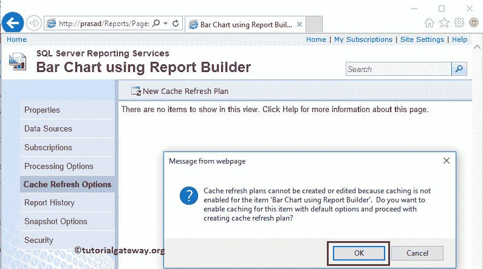

单击“确定”后，它会询问您缓存报告的描述以及缓存刷新时间。

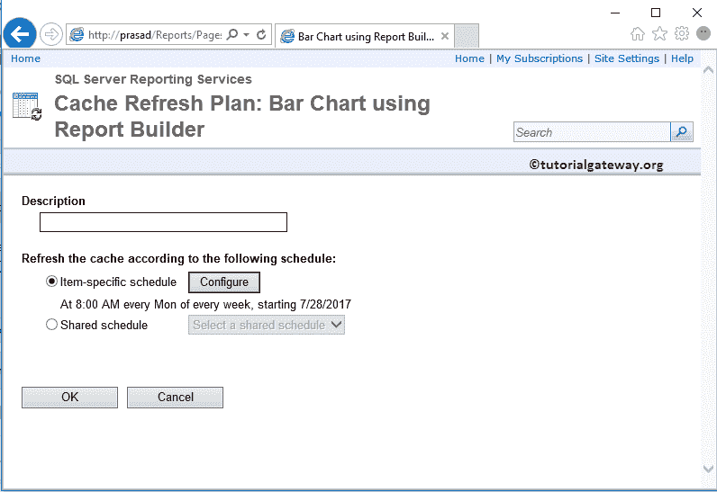

我们将缓存的条形图指定为描述，然后点击【配置】按钮

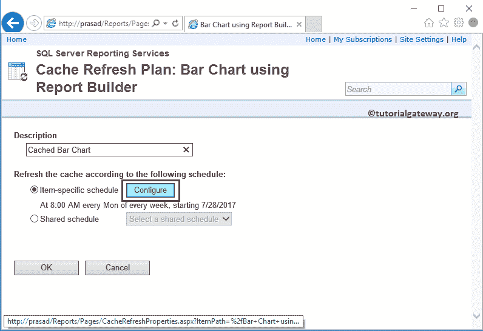

单击“配置”按钮后，报告管理器将引导您进入新页面。您可以使用此页面为 SSRS 缓存报告计划缓存。

*   计划详细信息:使用此部分计划每小时、每天、每周、每月或一生一次的缓存报告。别忘了提到开始时间。
*   开始日期:请指定您希望何时开始报告缓存。
*   停止此计划的时间:当您想要停止此缓存时。

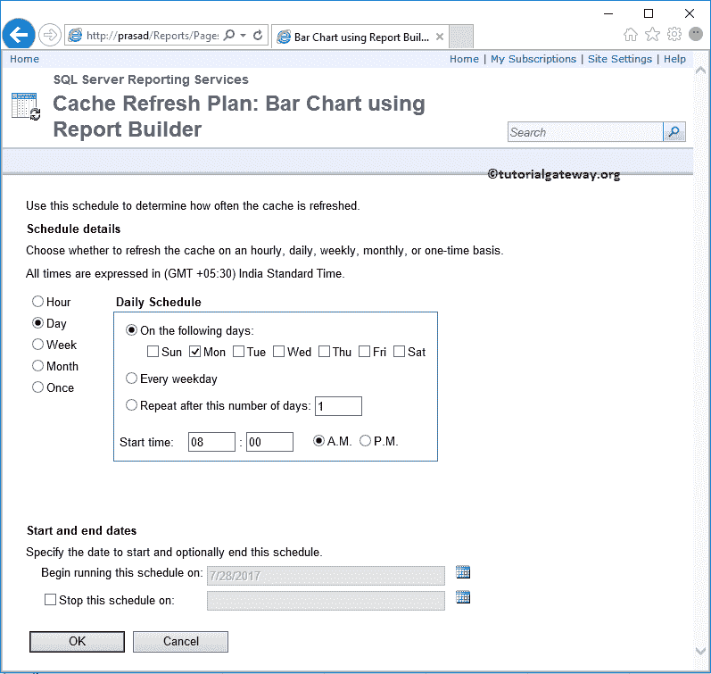

为了演示 SSRS 缓存报告，让我安排 1 分钟。

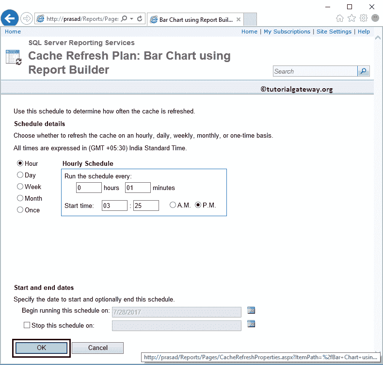

单击确定关闭缓存配置。

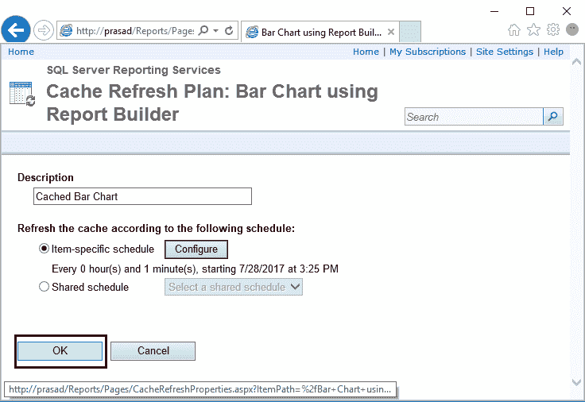

从下面的截图中，可以看到我们成功创建了一个新的缓存刷新计划来缓存 SSRS 报告。

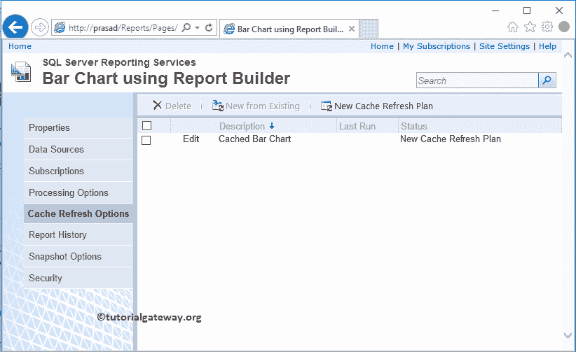

让我通过选择“在报表生成器中编辑”选项

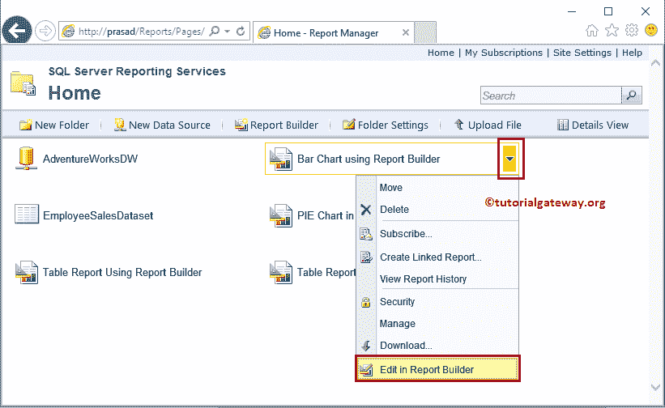

，使用报表生成器编辑条形图

让我运行 SSRS 缓存报告。从下面的截图可以看到，我们有一个[执行时间](https://www.tutorialgateway.org/global-references-in-ssrs/)，每当我们刷新(或重新运行)报告时，时间就会刷新

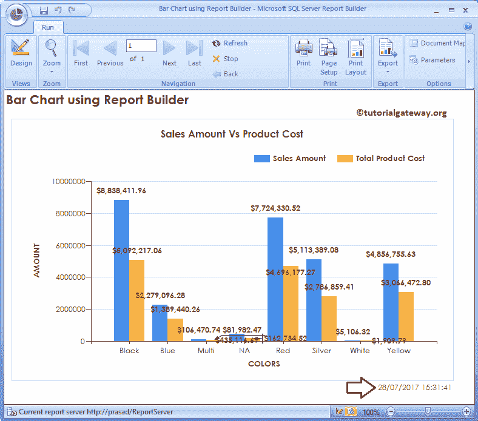

现在让我通过单击条形图

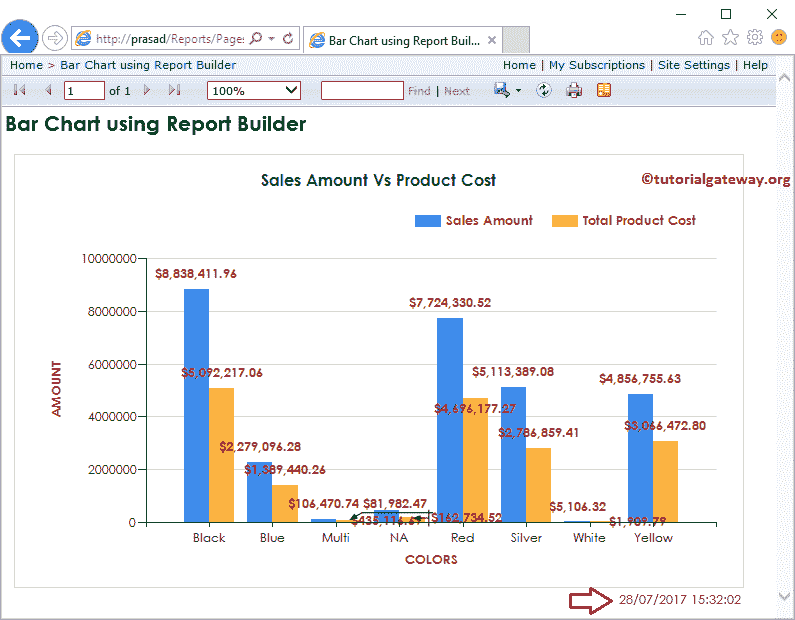

从报告管理器运行报告

让我刷新报告。

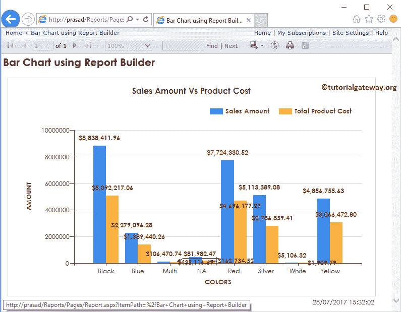

从上面的截图可以看出，执行时间没有变化，因为它显示的是 SSRS 缓存报告。如果您在一分钟后尝试，那么执行时间将会更新，因为我们将缓存时间定义为 1 分钟。

### 使用处理选项在 SSRS 缓存报告

让我通过选择饼图向您展示处理选项的默认设置，因为我们已经更改了条形图的缓存选项。

*   不缓存此报表的临时副本:默认情况下，报表服务器将分配此选项。这意味着报表将始终调用数据集、呈现，然后显示包含实时数据的报表。
*   缓存报告的临时副本。几分钟后报告副本过期:此选项将在给定的几分钟内缓存报告。
*   缓存报告的临时副本。在以下计划中使报告副本过期:此选项允许您配置计划选项。

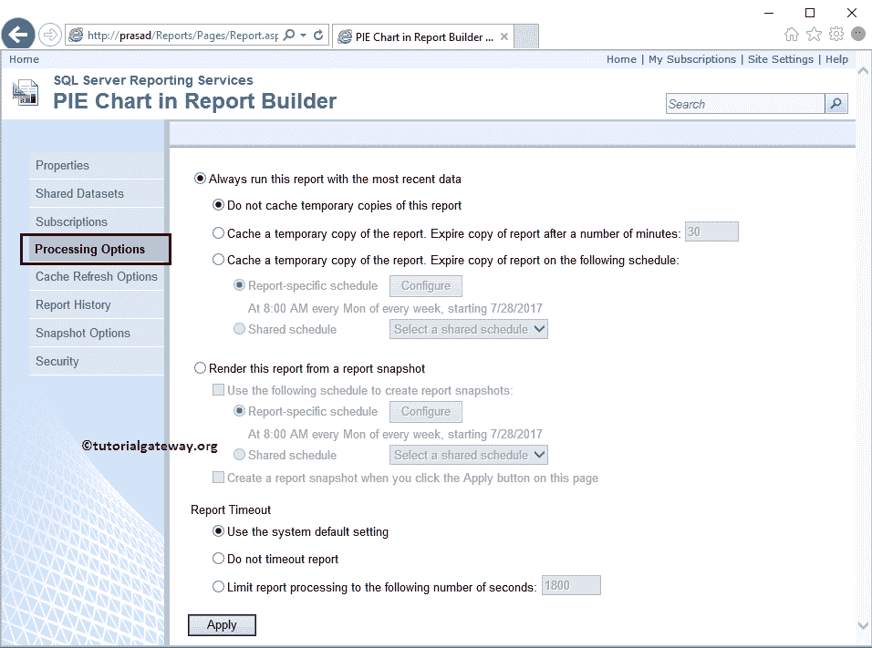

现在让我打开条形图处理选项。从下面的截图可以看出，它使用的是第二个缓存选项。该选项由报表服务器根据我们指定的缓存刷新选项自动选择。

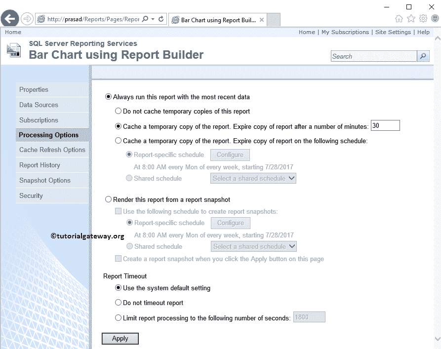

让我打开 [SQL Server](https://www.tutorialgateway.org/sql/) 管理工作室，看看 SQL Server 发生了什么。在报表管理器中创建缓存报表时，将在服务器级别创建新作业。该作业将按照我们的计划自动执行。

要查看计划选项，请右键单击作业，然后从上下文菜单中选择属性选项。

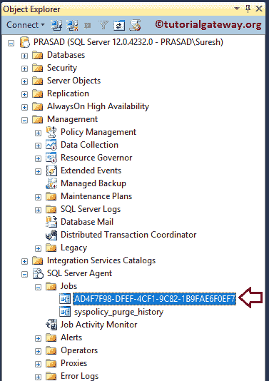

单击上下文菜单中的属性选项后，将打开以下窗口。请定位至“计划”选项卡以检查作业计划。

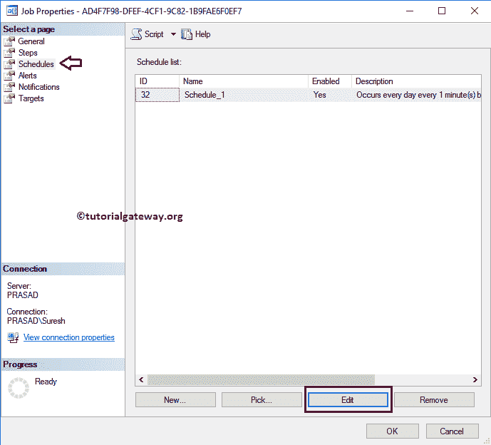

如您所见，它显示了我们在报告管理器中定义的计划属性。

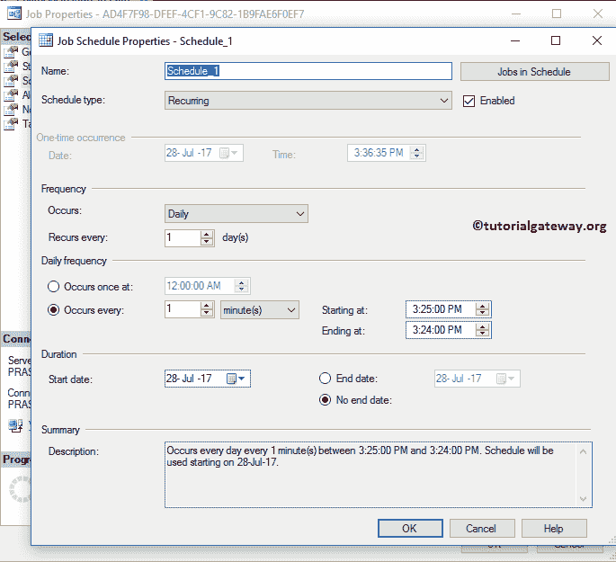