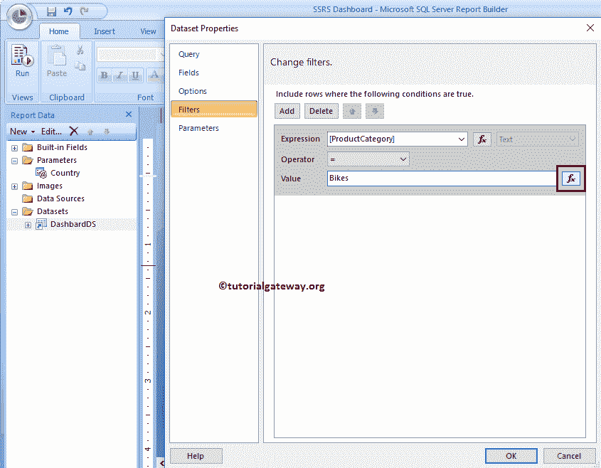

# SSRS 的链接报告

> 原文：<https://www.tutorialgateway.org/linked-reports-in-ssrs/>

SSRS 的链接报表类似于程序快捷方式。它源自报表管理器中的现有报表，并且还保留了报表定义。在本文中，我们将通过示例向您展示在 SSRS 创建链接报表的分步方法。

在我们开始在 SSRS 创建链接报表之前，让我打开我的报表管理器，显示我们服务器中现有的数据源、数据集和报表。

对于这个 SSRS 链接报告演示，我们将使用之前创建的名为 [SSRS 仪表板](https://www.tutorialgateway.org/ssrs-dashboard-reports/)的报告，因此请参考了解 [SSRS](https://www.tutorialgateway.org/ssrs/) 报告数据。

让我给你看看报告预览。

例如，自行车类别的销售经理要求我们开发上面显示的报告。看到报告后，服装部门的销售经理要求我们为服装开发相同的报告。在这种情况下，您不必从头开始创建新报告。

SQL Reporting 服务提供了一个称为链接报表的概念，您可以使用相同的概念来满足需求。

## 在 SSRS 创建链接报表示例

在我们开始在 SSRS 创建链接报告之前，我们必须更改过滤器设置。因为我们在上面指定的报告中使用硬编码值(自行车)作为数据集过滤器。

在 SSRS 链接报告中，除了参数值，我们不能更改任何内容。让我把硬编码值转换成一个参数。如果您已经在使用参数报告，那么从步骤 2 开始阅读

步骤 1:单击 SSRS 仪表板报告旁边的向下箭头打开菜单项。请从菜单项中选择“在报表生成器中编辑”选项。

选择“在报表生成器中编辑”选项后，SSRS 表格报告生成器将会打开。

首先，让我创建一个保存字符串数据的参数。从下面的截图中，可以看到我们正在创建一个名为 Country 的参数，其可见性为 Hidden。

建议大家参考[报表参数](https://www.tutorialgateway.org/ssrs-report-parameters/)了解下一个窗口呈现的各个属性。

接下来，让我添加默认参数值作为自行车。

最后，请用参数值替换硬编码值中的[数据集过滤器](https://www.tutorialgateway.org/filters-at-dataset-level-in-ssrs/)。为此，请导航到过滤器选项卡，然后单击表达式按钮。

单击“表达式”按钮后，将打开一个新窗口来编写表达式。这里，请选择参数值作为值。

步骤 2:单击 SSRS 仪表板报告旁边的向下箭头，并从菜单项中选择创建链接报告…选项。

选择“创建链接报表...”选项后，报表管理器会将您导航到以下窗口。在属性选项卡中，我们有:

*   名字:你可以根据自己的要求取自己的名字。
*   描述:请提供描述报告功能的描述。
*   位置:使用此按钮更改报告位置。单击此按钮后，它将显示报表管理器中可用的文件夹列表。

目前，我们正在主页中保存该报告，其名称为 SSRS 链接报告，描述为服装仪表板

单击“确定”按钮后，报告管理器将导航到新创建的 SSRS 链接报告预览。

我们已经在 SSRS 成功地创建了一个链接报表，但是我们想要服装部门的销售额。为此，我们必须将参数值从自行车更改为服装。

要更改参数值，请单击链接报表旁边的向下箭头打开菜单项。请从菜单项中选择管理选项。

选择“管理”选项后，报表管理器会将您导航到具有以下选项卡的新页面。

让我转到参数选项卡，您可以看到，报告参数默认值是自行车。在这里，我们必须更改默认参数值。

让我将值从自行车更改为服装

现在，让我给你看看报告预览。

上面的报告是 SSRS 仪表板报告的链接报告，过滤值是服装(不是自行车)

### 编辑 SSRS 的链接报告

在 SSRS 创建链接报表后，您可能会想在报表生成器中编辑链接报表。让我向您展示如果我编辑新创建的链接报表会发生什么？。

为此，请单击 SSRS 链接报表旁边的向下箭头，并从菜单项中选择“在报表生成器中编辑”选项。

从下面的截图中，您可以看到它抛出了一个错误，因为我们无法编辑链接的报告。

注:您在原始报告(即本例中的 SSRS 仪表板)中所做的任何更改都将自动反映在 SSRS 的链接报告中。

