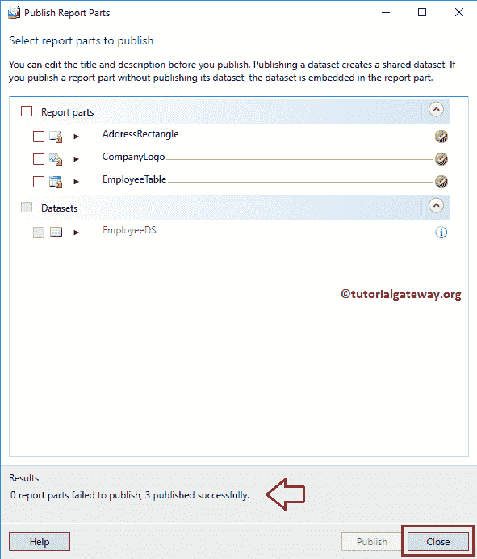
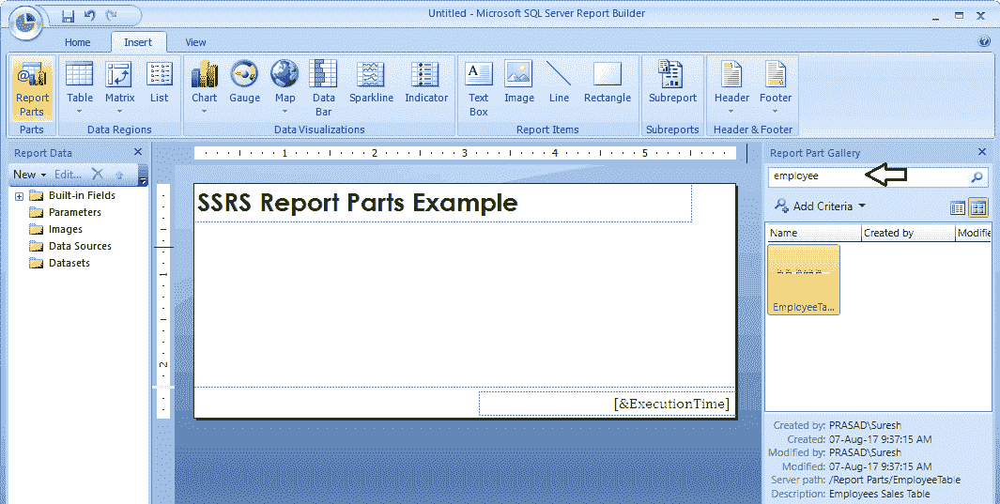
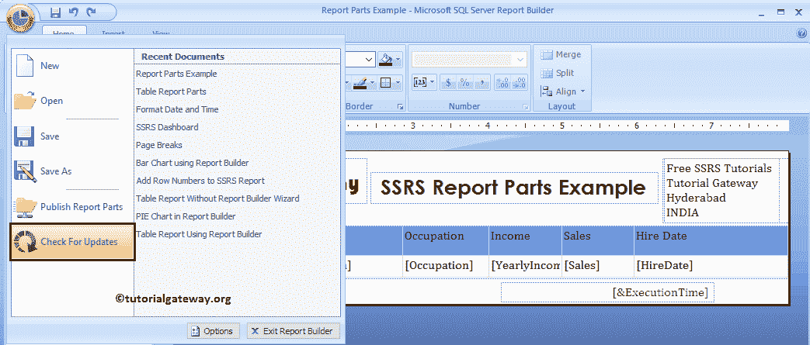

# SSRS 的报告部件

> 原文：<https://www.tutorialgateway.org/report-parts-in-ssrs/>

SSRS 的报表部件可帮助您在多个报表中重用报表或报表项。在本文中，我们将通过一个示例向您展示如何在 SSRS 创建和发布报表部件，如何重用它们，以及如何更新现有的报表部件。

为了演示在 [SSRS](https://www.tutorialgateway.org/ssrs/) 中创建报告部件所涉及的步骤，我们将使用之前生成的报告，如下所示。请参考[格式化日期和时间](https://www.tutorialgateway.org/format-date-and-time-in-ssrs-report/)一文了解报表数据，参见[添加矩形](https://www.tutorialgateway.org/add-rectangle-to-ssrs-report/)一文了解矩形配置。

提示:如果您发现在报告生成器中创建报表有任何困难。请参考[在 SSRS 表格报告生成器](https://www.tutorialgateway.org/create-new-report-in-ssrs-report-builder/)中创建新报表一文了解。

让我给你看看报告预览。如你所见，这是一个非常普通的[表报表](https://www.tutorialgateway.org/ssrs-table-report/)，带有格式化的日期和时间，并且在报表的顶部有地址(在矩形内)

## 在 SSRS 发布报表部件

从 SSRS [报告生成器](https://www.tutorialgateway.org/install-ssrs-report-builder/)发布报表部件非常容易。为此，请单击菜单中的“发布报表部件”选项。

选择“发布报告部件”按钮将打开以下弹出窗口。选择第二个选项总是明智的，因为它能让你更好地控制你正在做的事情。

选择第二个选项后，将显示一个名为“发布报表部件”的新窗口。在这里，它将向您显示 SSRS 的可用报表部件列表。

让我扩展 SSRS 报告的每个部分。这样你就可以预览他们

接下来，添加描述报表部件功能的准确描述。

完成审核后，请勾选所需的报告部分，点击【发布】按钮

单击“发布”按钮后，将显示一条消息。它记录成功发布和失败的报告部分的数量。

## 在 SSRS 报告中使用报告部分

在本例中，我们将向您展示如何在 SSRS 报告中使用报告部件。为了证明这一点，我们需要一个空的或空白的报告。因此，请打开报告生成器，选择“新建报表”选项卡，然后选择“空白报表”选项。

如下所示，我们添加了一个报告标题作为 SSRS 报告部分示例，并在页脚中添加了执行时间。除此之外，我们还格式化了文本

要使用现有的 SSRS 报告部件或[报告项目](https://www.tutorialgateway.org/ssrs-report-items/)，请转到“插入”选项卡，然后单击“报告部件”按钮

单击“报表部件”选项卡，打开一个名为“报表部件库”的新窗口。您可以使用此窗口搜索报表管理器中的报表部分。

让我搜索雇员表。一旦获得所需的报告部分，双击它会自动将该报告部分添加到设计器窗口中。

让我搜索公司

从下面的截图中可以看到，我们刚刚将所有现有的报告部分(表、矩形、图像)添加到这个新的空白报告中。

让我给你看看报告预览

让我告诉你如果我改变地址颜色会发生什么。请记住，您在此报告中所做的任何更改仅属于此报告。但是，如果您发布报告部分，那么主报告部分将被更新。

而报告预览是:

现在让我告诉你如果我发布这个报告的报告部分会发生什么？

我想我忘记提到报告部分文件夹了。首次发布报表部件时，报表管理器将自动添加一个名为“报表部件”的新文件夹。此文件夹将保存我们一生中发布的所有报告部分。

让我向您展示“报表部件”文件夹中的报表部件。

让我添加地址报告部分来检查报告部分是否更新。从下面的截图中可以看到，它显示的是更新后的地址(文本颜色为红色)。

## 更新 SSRS 的报告部件

让我打开原始报告。在本例中，我们将对此报表进行一些更改，并向您展示从属报表会发生什么情况？

如你所见，我们已经删除了年收入栏。接下来，我们公布了《SSRS 报告》的部分内容

如果希望更新反映在从属报表中。在第二个报告中，请单击主菜单中的检查更新选项。

单击检查更新选项会显示一条新消息。如果有任何报告部件更新，将显示“查看更新”按钮。否则，它会显示一条消息–0 个更新可用。

单击“查看更新”按钮后，将打开一个名为“更新报告部件”的新窗口。它将显示可用的报告部件更新。

如果您选中“在服务器选项上更新此报表部件时通知我”，则报告生成器会自动要求您进行更新。

请选择要更新的报表部件。这里，我们选择了 SSRS 的所有报告部分。

从下面的截图可以看到，员工表更新了新的报表部分(无年收入栏)

让我给你看一下 SSRS 报告部件报告预览

