# SSRS 快照

> 原文：<https://www.tutorialgateway.org/snapshot-in-ssrs/>

通常，SSRS 的大多数报告都是按需执行的。这意味着，当用户请求报告时，首先将运行数据集中的查询，然后将显示相应的报告。报表管理器中的整个过程称为处理选项。这可能是小数据集的理想方法。但是大型数据集或长时间运行的查询呢？。在这种情况下，您可以在 SSRS 使用报告快照。

SSRS 的快照是一个预先执行的报告，其中包含用于报告的布局信息和数据集。您可以使用此快照选项存储基于计划的报告数据。因此，您可以限制用户访问长时间运行的查询。

在本文中，我们将通过一个示例向您展示在 SSRS 创建快照所涉及的步骤。

在我们开始在 SSRS 创建快照之前，让我打开我的报表管理器来显示我们服务器上的现有报表。在这个 SSRS 快照演示中，我们将使用之前创建的名为[的报告，在 SSRS 报告](https://www.tutorialgateway.org/insert-page-breaks-in-ssrs-report/)中插入分页符。所以请参考同样了解 [SSRS](https://www.tutorialgateway.org/ssrs/) 报告数据。

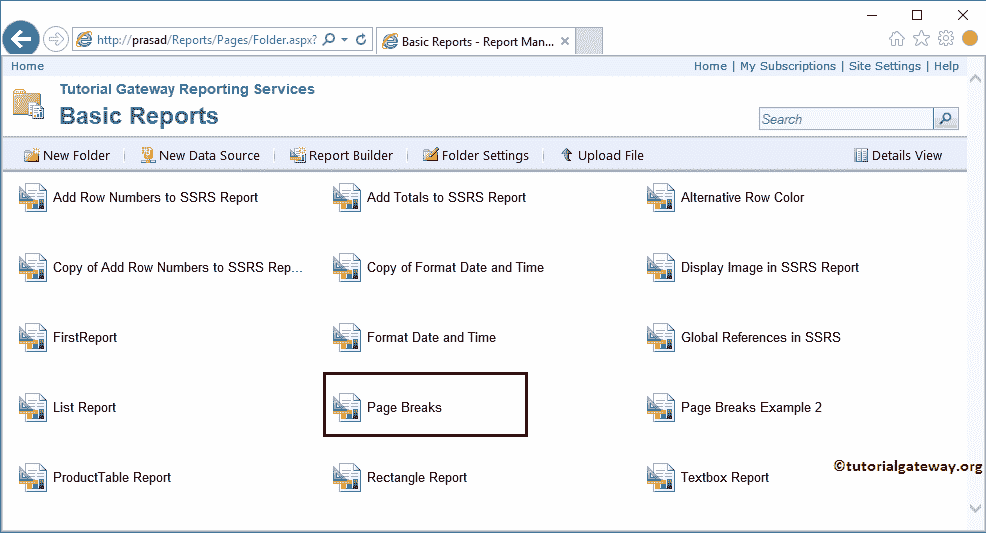

让我给你看看报告预览。

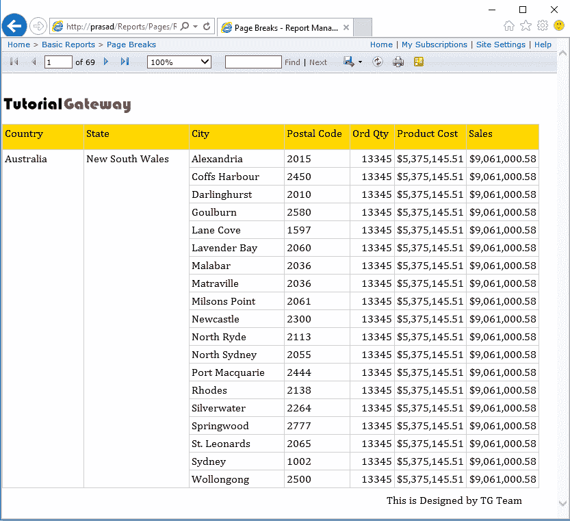

## 在 SSRS 创建报告快照

要在分页报告上创建 SSRS 报告快照，请单击报告旁边的向下箭头打开菜单项。请从菜单项中选择管理选项。

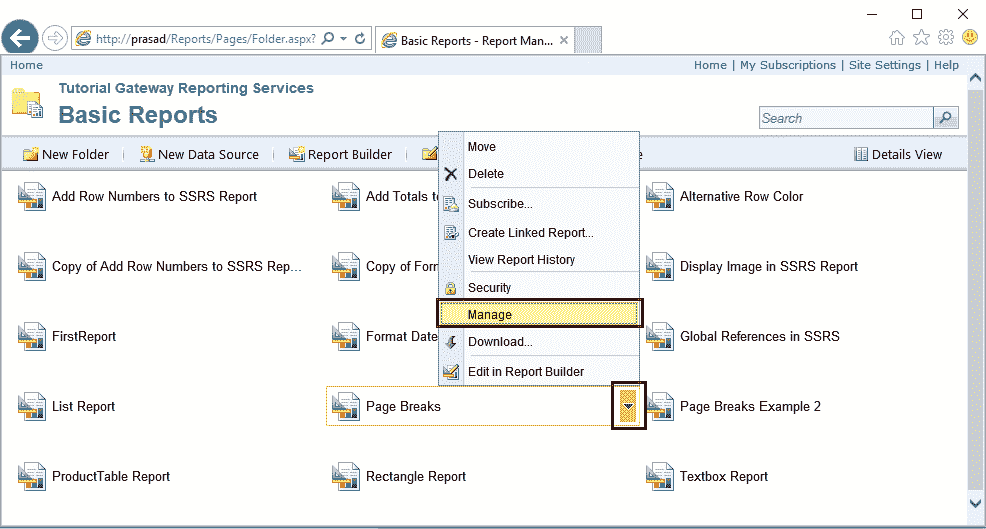

选择“管理”选项后，报表管理器会将您导航到具有以下选项卡的新页面。使用此页面管理此报告的高级设置。在属性选项卡下，它显示创建的报告、用户、创建和修改日期以及报告大小。

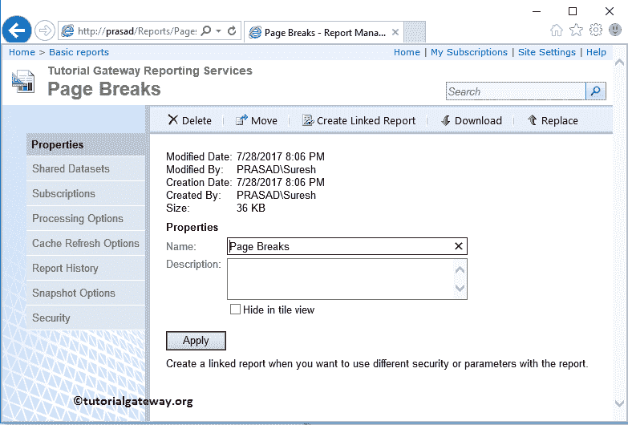

SQL 报告服务中有两种类型的快照:

1.  报告执行快照:您可以使用处理选项选项卡创建这种类型的 SSRS 快照。这种类型的快照通过允许在指定时间(计划时间)执行查询，有助于减少查询处理时间。
2.  报告历史快照:您可以使用快照选项选项卡创建这种类型的快照。这种类型的快照将在指定时间(计划时间)在“报告历史记录”选项卡中存储报告的副本。请参考[报表历史快照](https://www.tutorialgateway.org/report-history-snapshot-in-ssrs/)一文了解配置设置。

在本文中，我们将解释在 SSRS 创建报告执行快照。因此，让我通过选择“处理选项”选项卡向您展示处理选项的默认设置。

*   使用以下计划创建报告快照:此选项允许您配置计划选项—报告查询将在此计划时间处理。
*   单击此页上的应用按钮时创建报告快照:顾名思义，单击此页底部的应用按钮后，它将创建快照。

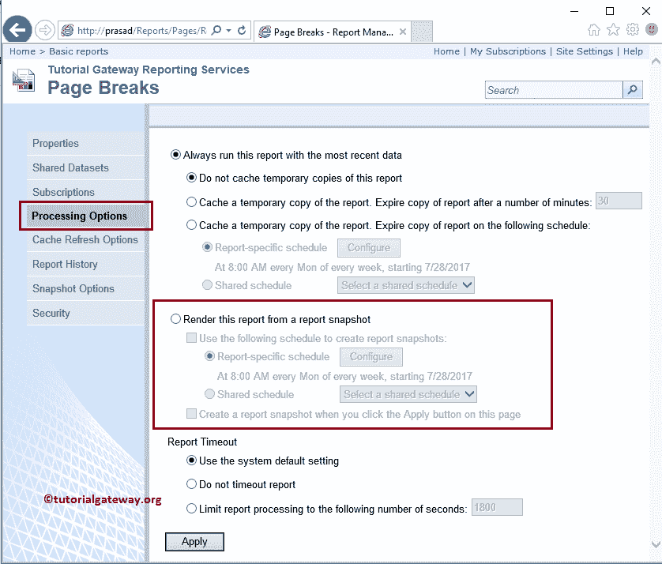

让我向您展示 SSRS 快照选项页面的默认设置。我们将在下一篇文章中向他们解释。

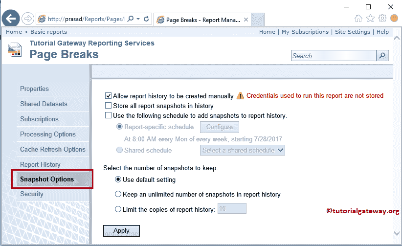

从上面的截图中，您可以看到它显示了一条错误消息:用于运行此报告的凭据未被存储。让我来解决这个错误。

首先，导航到您用于此报告的[共享数据源](https://www.tutorialgateway.org/data-source-in-ssrs-report-manager/)，然后选择管理选项。

注意:创建快照、[缓存报告](https://www.tutorialgateway.org/cached-reports-in-ssrs/)或报告订阅时，必须执行以下步骤。

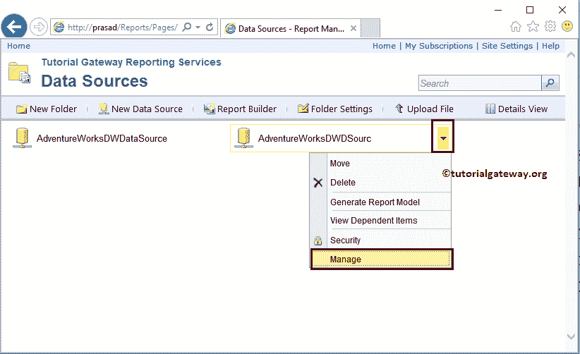

选择“管理”选项后，将显示以下页面。从属性选项卡中可以看到，此数据源使用的是 Windows 集成安全性，这对于快照是不可接受的。

*   安全存储在报表服务器中的凭据:在这里，您必须指定登录数据源的用户名和密码。这些凭据将存储在报告中。
*   Windows 集成安全性:它会将当前用户的 windows 凭据传递给外部服务器以连接数据源。

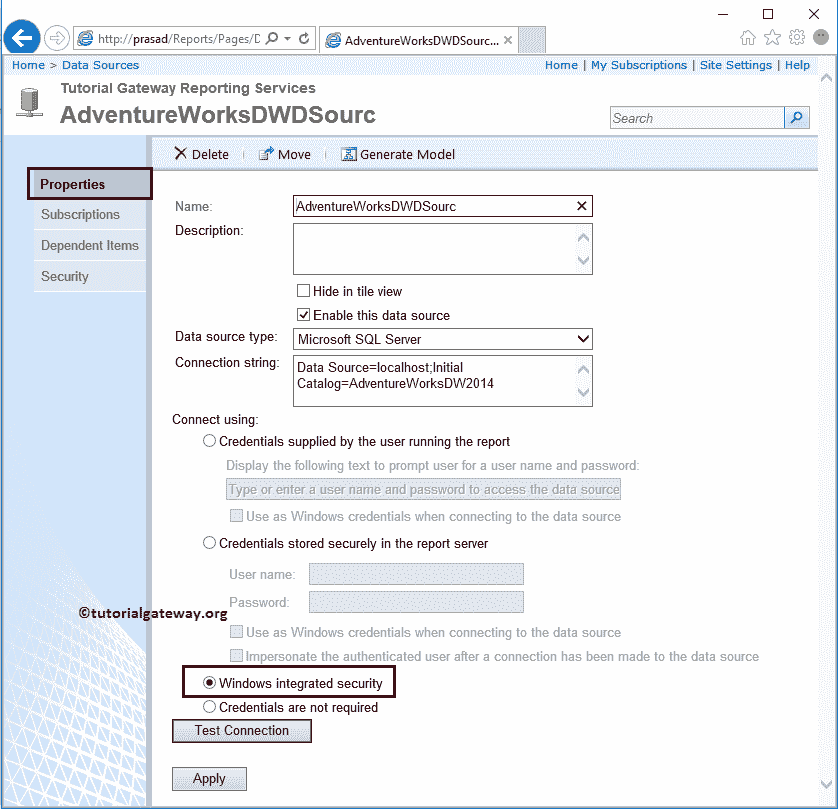

因此，请将选项更改为安全存储在报表服务器中的凭据，并提供登录 [SQL server](https://www.tutorialgateway.org/sql/) 所需的凭据。

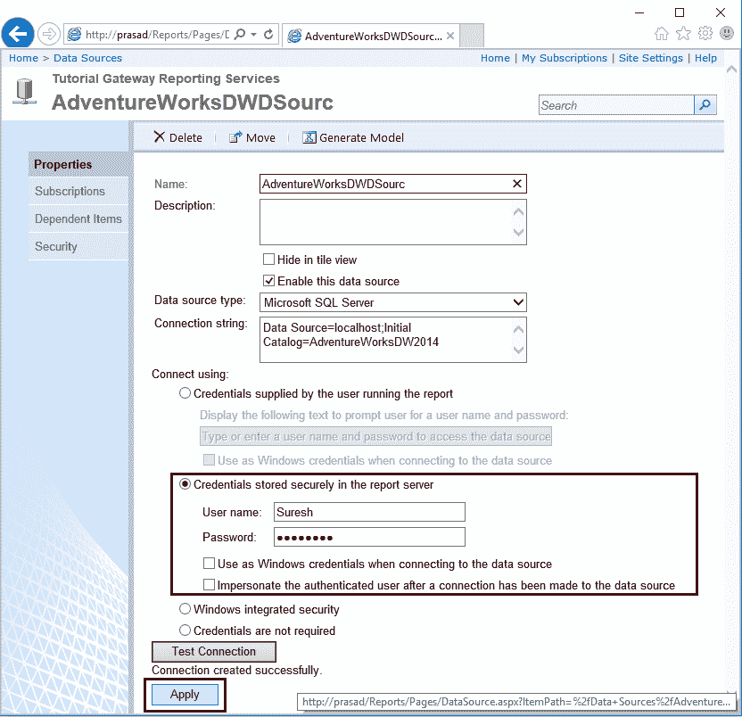

接下来，转到[分页](https://www.tutorialgateway.org/insert-page-breaks-in-ssrs-report/)报告的处理选项，并从报告快照中选择渲染此报告。这意味着，当用户调用报告时，它将从快照加载。

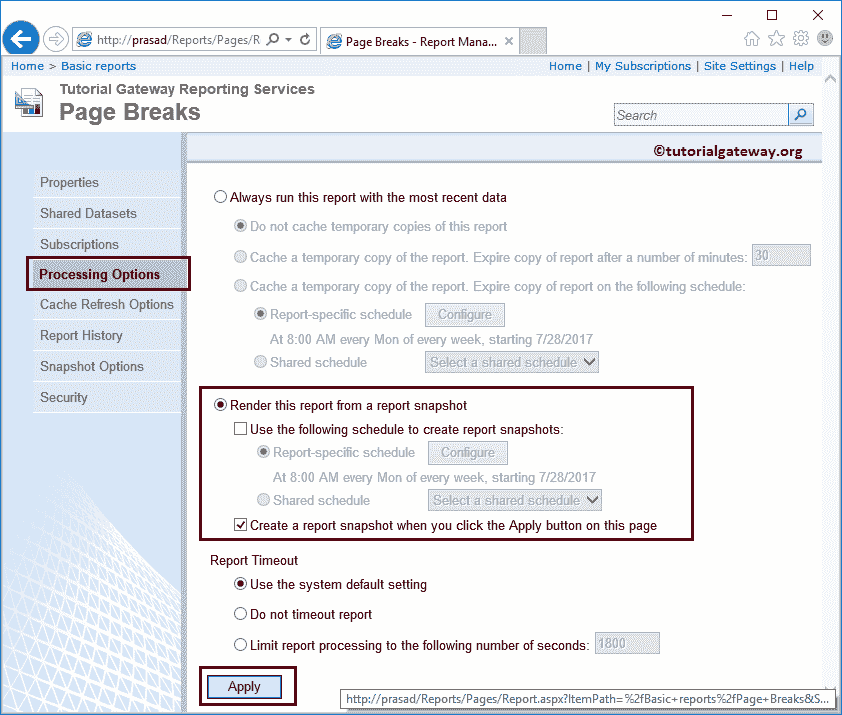

让我安排一下查询处理的时间。为此，点击【配置】按钮

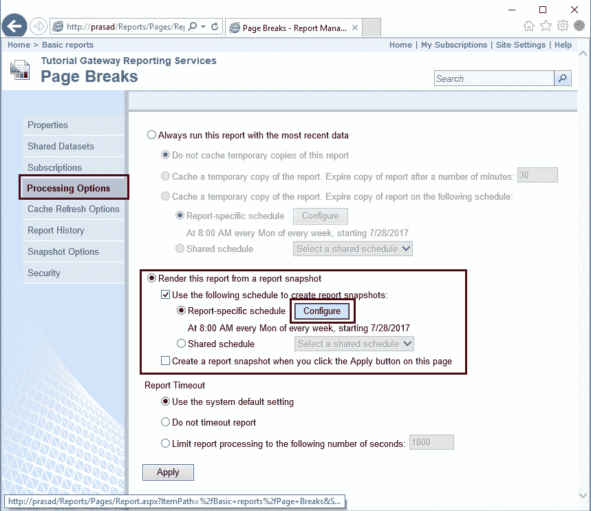

单击“配置”按钮后，报告管理器会将您导航到一个新页面。您可以使用此页面计划 SSRS 快照。

*   计划详细信息:使用此部分可以将报告快照计划为每小时、每天、每周、每月或一生一次。别忘了提到开始时间。
*   开始日期:请指定您希望何时启动报告快照。
*   停止此计划的时间:当您想要停止此快照时。

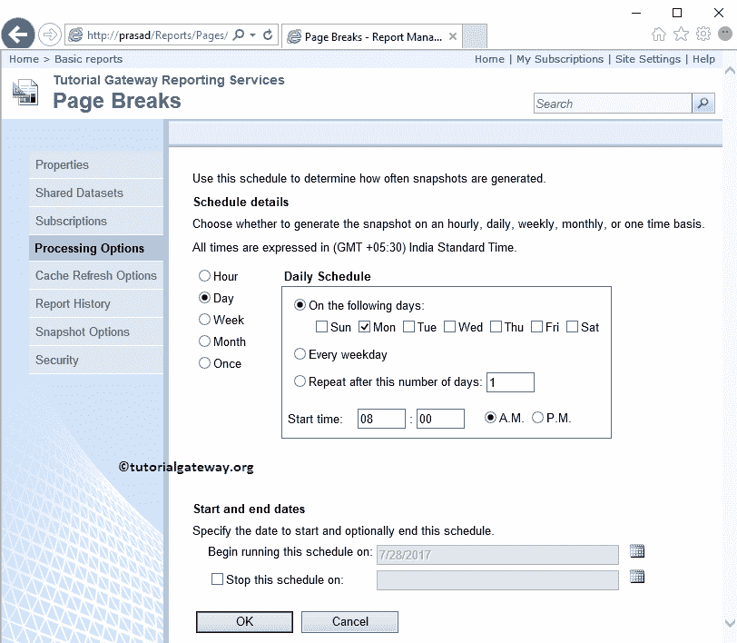

为了演示 SSRS 快照，我安排了 2 分钟。实时的，可能是每小时，也可能是每天。

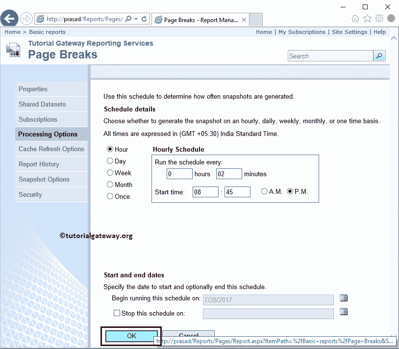

单击应用关闭 SSRS 快照配置。

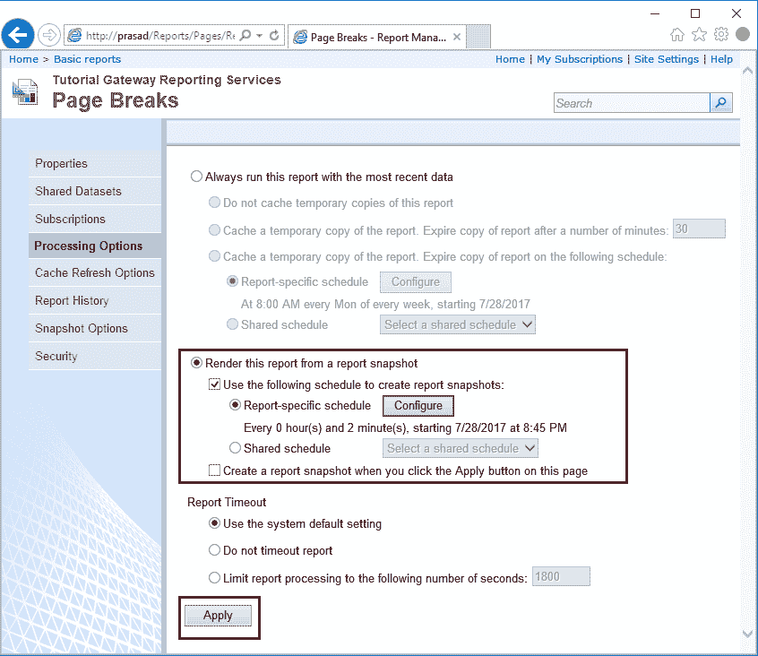

如您所见，这与报告历史无关。

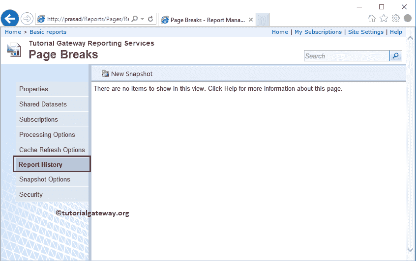

让我运行分页报告。无论您在两分钟内运行多少次，报告都将从快照呈现(而不是从真实数据集呈现)。

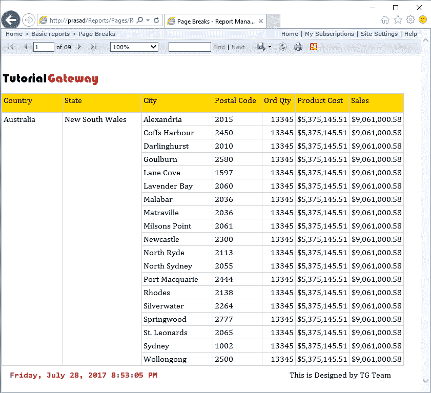

每当您在报表管理器中计划某项工作时，都会在服务器级别自动创建一个新作业。这项工作按照我们的计划自动执行。要查看计划选项，请右键单击作业，然后选择属性选项。

单击上下文菜单中的属性选项将打开以下窗口。请定位至“计划”选项卡以检查作业计划。

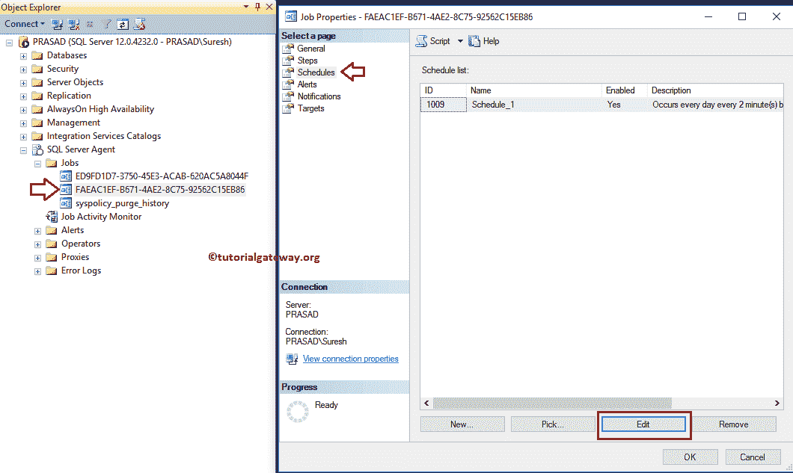

如您所见，它显示了我们在报告管理器中定义的计划属性。

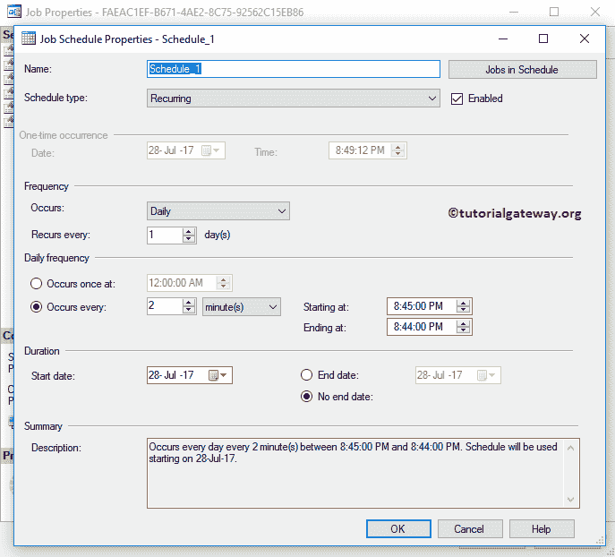

让我给你看看作业的日志文件。如您所见，它每两分钟执行一次。

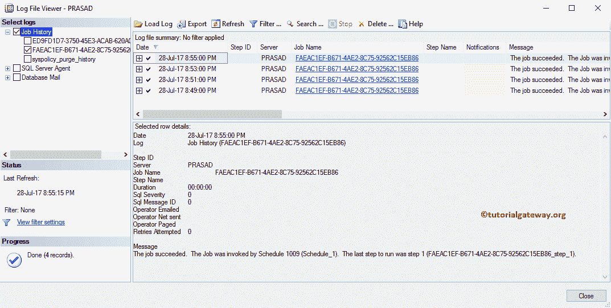