# SSRS 的报告历史快照

> 原文：<https://www.tutorialgateway.org/report-history-snapshot-in-ssrs/>

在我们之前的文章中，我们向您解释了[报告执行快照的创建。](https://www.tutorialgateway.org/snapshot-in-ssrs/)在本文中，我们将通过一个示例向您展示在 SSRS 创建报告历史快照的步骤。

SSRS 的报告历史快照将在指定时间(计划时间)在报告历史选项卡中存储报告的副本。

在我们开始在 [SSRS](https://www.tutorialgateway.org/ssrs/) 创建报告快照之前，让我打开我的报告管理器来显示我们服务器上的现有报告。在本演示中，我们将使用之前创建的名为[分页符示例 2](https://www.tutorialgateway.org/insert-page-breaks-in-ssrs-report/) 的报告，因此请参考相同的内容来理解报告数据。

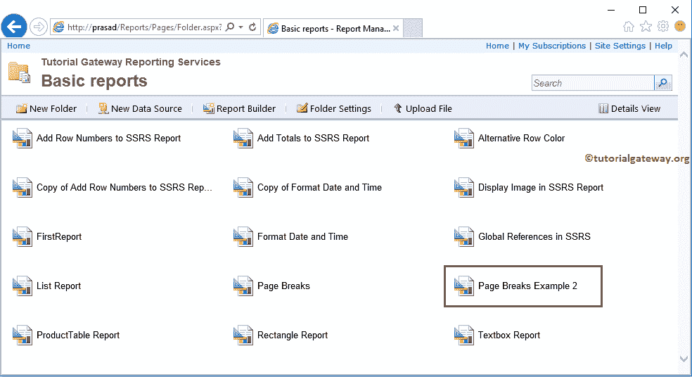

## 在 SSRS 创建报告历史快照

要在 SSRS 创建报告历史快照，请单击分页符示例 2 报告旁边的向下箭头打开菜单项。请从菜单项中选择管理选项。

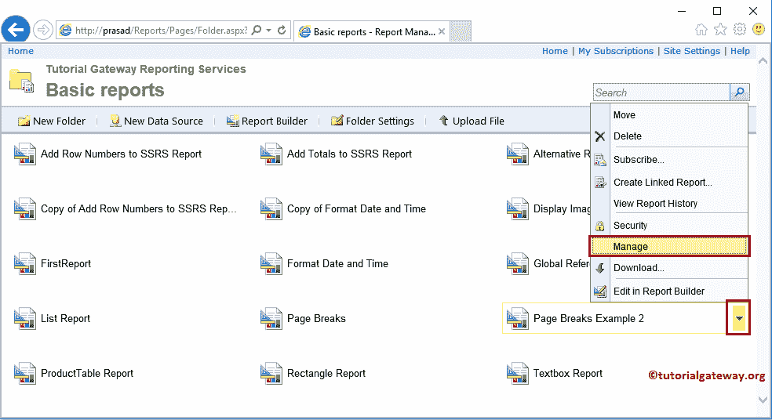

选择“管理”选项后，报告管理器会将您导航到具有以下选项卡的新页面。您可以使用此页面管理此报告的高级设置。在属性选项卡下，它将显示报告创建用户、创建和修改日期以及报告大小。

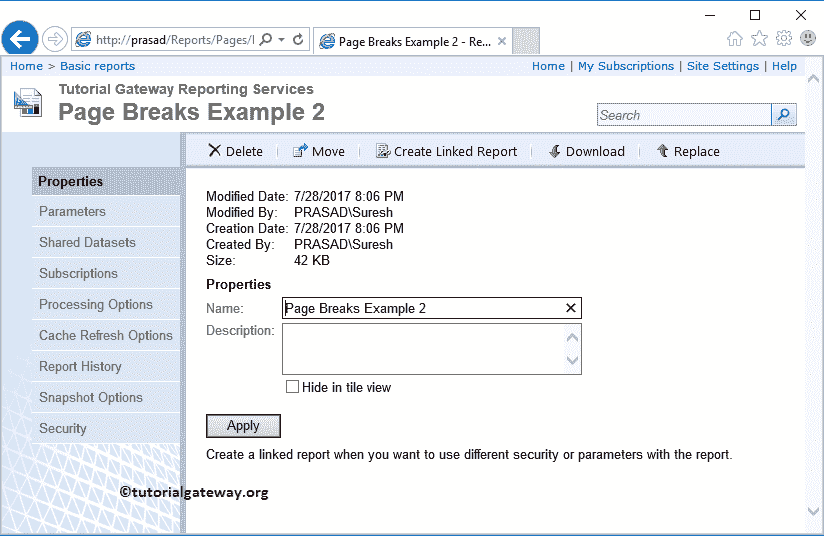

让我向您展示 SSRS 报告历史快照选项页面的默认设置。

*   允许手动创建报告历史记录:允许您创建报告历史记录。
*   将所有报告快照存储在历史记录中:如果要将快照存储在报告历史记录中，请选中此选项。
*   使用以下计划将快照添加到历史记录:此选项允许您配置计划选项。

在选择要保留的快照数量下:

*   使用默认设置:这将使用主设置。
*   在报告历史记录中保留无限数量的快照:这将保留从开始日期到结束日期的所有报告快照。您必须删除不需要的快照来手动减少内存。
*   限制报告历史的副本数:这将限制报告历史中存储的副本数。默认情况下，它是 10，这意味着将保存 10 个报告快照。

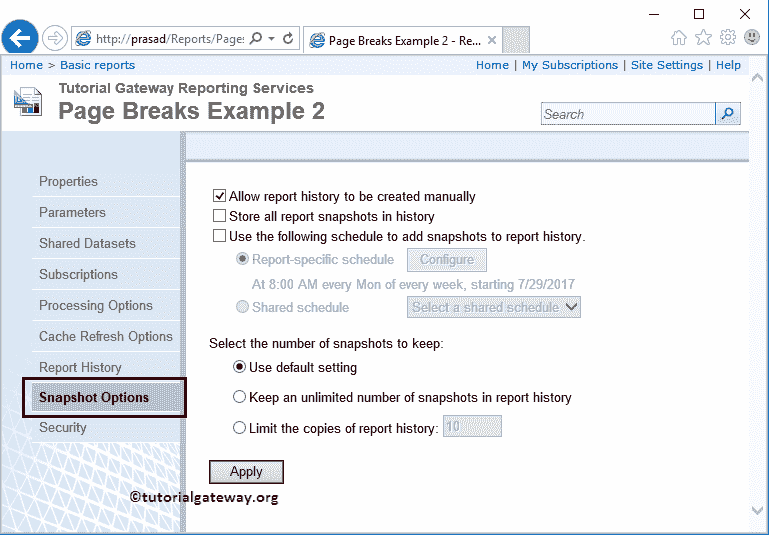

我们选中了所有三个选项，然后将报告快照限制为 10 个。现在，单击“配置”按钮来计划报告快照。

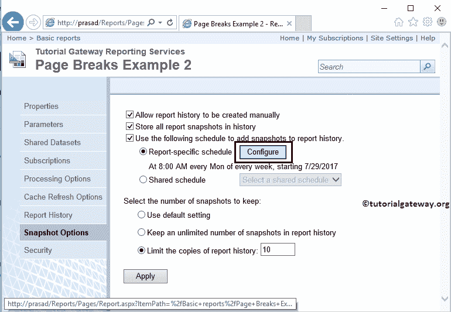

单击“配置”按钮后，报告管理器会将您导航到一个新页面。我们在上一篇文章中已经解释了这些设置。所以，请参考[快照](https://www.tutorialgateway.org/snapshot-in-ssrs/)一文理解相同。

出于 SSRS 报告历史快照演示的目的，让我将时间安排为 1 分钟，停止时间为 8 月 2 日。实时，它可能是每小时，或每天，等等。

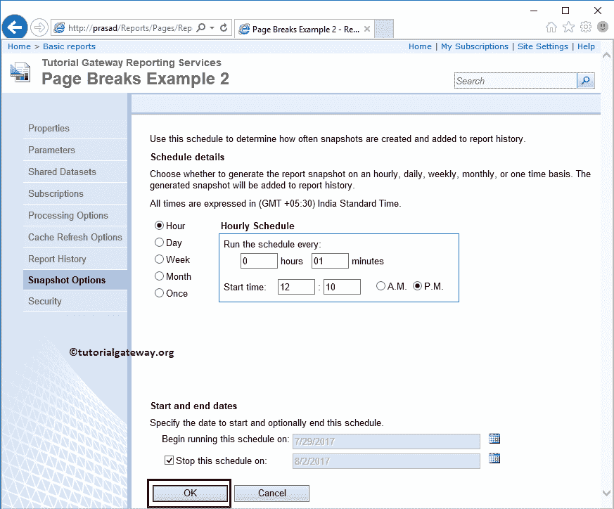

单击确定关闭快照计划，单击应用关闭 SSRS 配置中的报告历史快照。

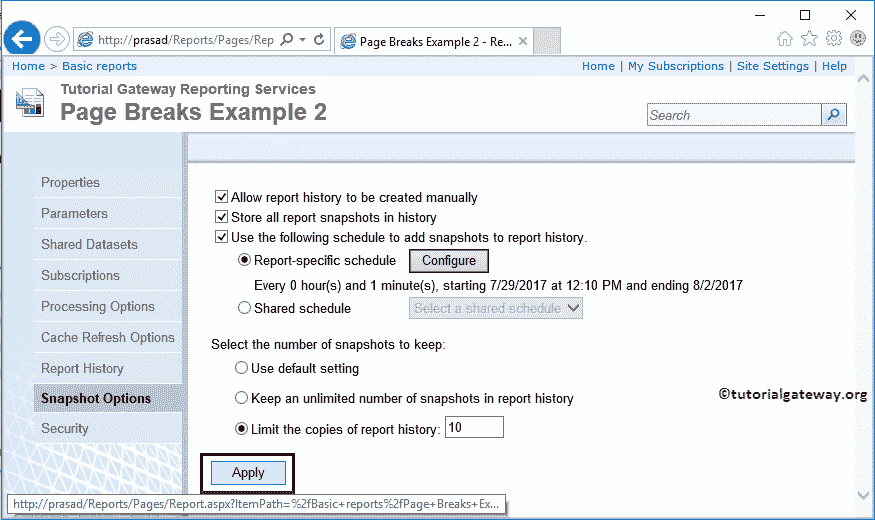

单击应用后，将显示以下弹出窗口。单击确定将其关闭。

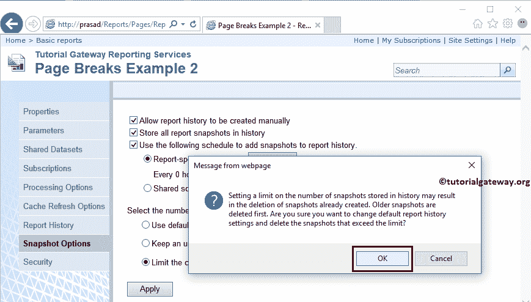

让我向您展示报告历史记录选项卡。如您所见，下午 12:15:06 有一个报告快照。

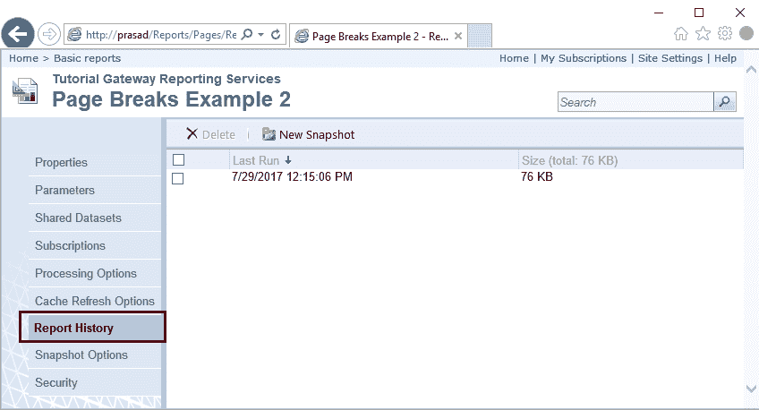

让我点击 SSRS 报告历史查看快照

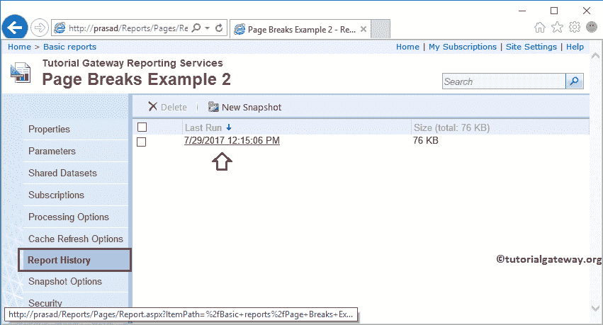

如您所见，报告预览来自报告快照历史记录。

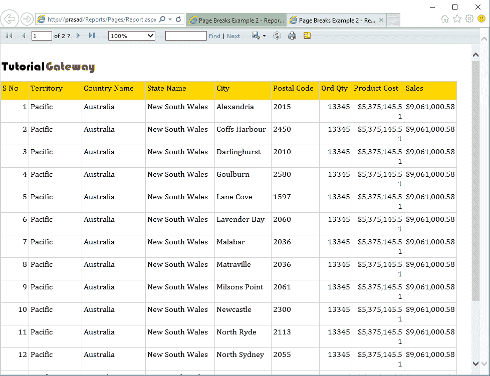

每当您在报告管理器中计划某项工作时，都会在服务器级别自动创建一个新作业。该作业将按照我们的计划自动执行。让我右键单击作业，并从上下文菜单中选择属性选项。

它将打开以下窗口。请定位至“计划”选项卡以检查作业计划。

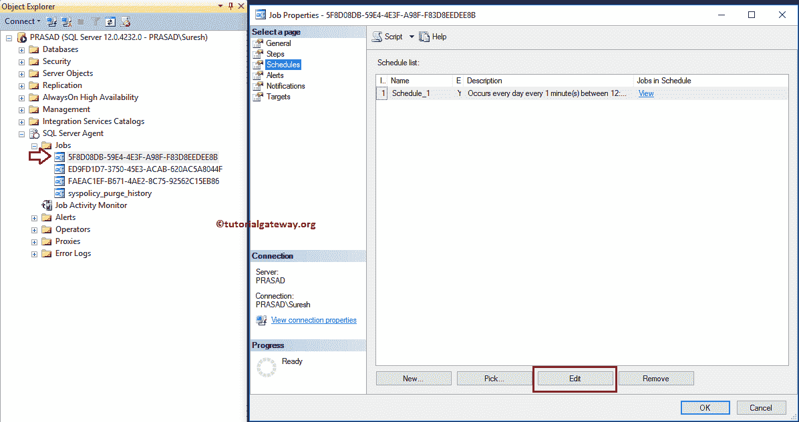

如您所见，它显示了我们在报告管理器中定义的计划属性。

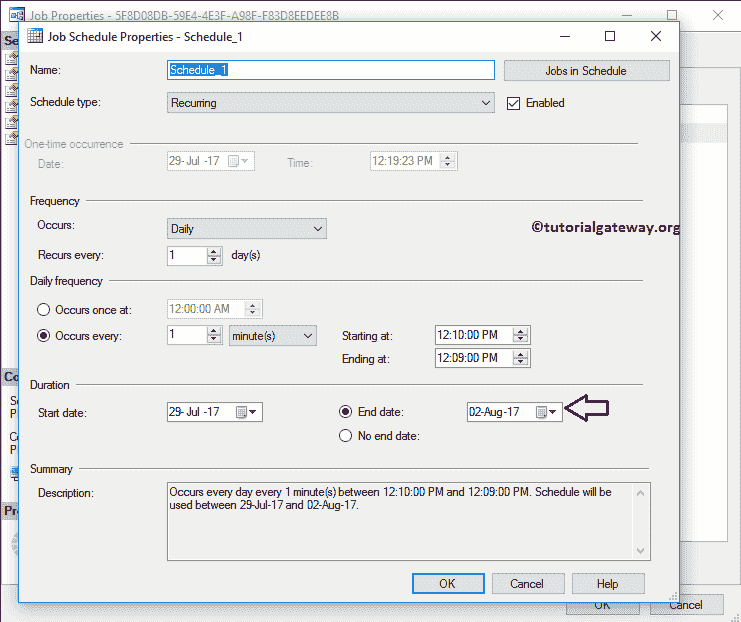

让我给你看看作业的日志文件。如您所见，它每一分钟都在执行。

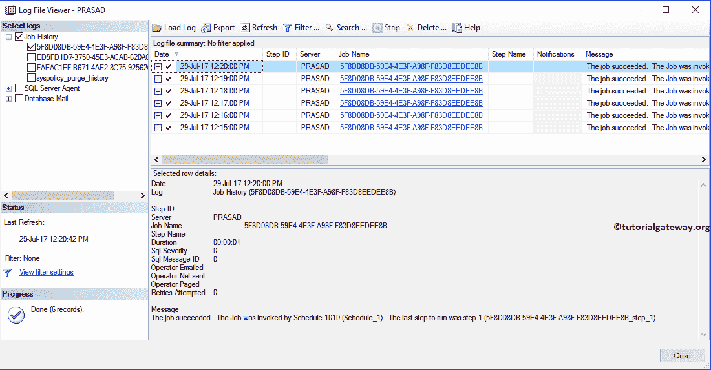

再次，让我向您展示报告历史。可以看到，有 7 个报告快照

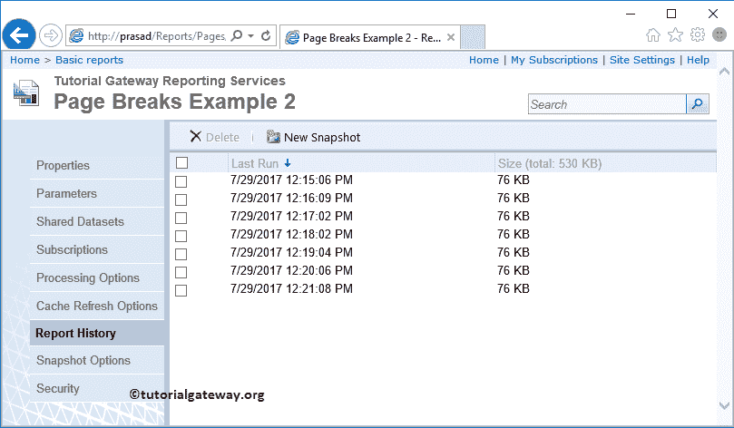