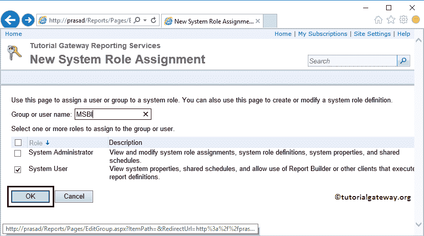

# SSRS 的安全

> 原文：<https://www.tutorialgateway.org/security-in-ssrs/>

当我们在 SSRS 或 SQL 报告服务中创建报告时，安全性是首要考虑的问题。因为，在公司世界里，经理和销售人员拥有不同的特权。SSRS 提供多级安全性，这意味着您可以限制用户访问报表管理器、文件夹或报表。

在本文中，我们将通过一个实例向您展示如何在 SSRS 应用安全性。

## SSRS 的家庭或父母级安全性

在我们开始在 [SSRS](https://www.tutorialgateway.org/ssrs/) 应用安全性之前，让我打开我的报告管理器来显示我们服务器上的现有报告。要更改父级安全性，请单击右上角的站点设置超链接。

单击“站点设置”超链接后，报告管理器会将我们导航到站点设置页面。在这个页面中，我们有三个选项卡，我们已经解释了[中的第一个选项卡【更改 SSRS 报告管理器标题](https://www.tutorialgateway.org/change-ssrs-report-manager-title/)，所以请参考相同的

请自行导航到“安全性”选项卡，查看 SSRS 报告管理器中的现有用户。从下面的截图中，您可以看到有两个用户:管理员(默认)和具有管理员权限的用户。

要添加新角色用户，请选择“新角色分配”选项。

这将打开下一页。在这里，您必须在文本框中添加用户或组，并选择适当的角色。对于 SSRS 安全演示，我们创建了一个名为 MSBI 的新 Windows 用户，我们使用的是同一个用户

现在，您可以看到具有系统用户权限的新用户(MSBI)。

### 删除 SSRS 顶级用户安全

要删除用户，请选中该用户并选择删除菜单。

显示消息框，确认用户删除。点击【确定】删除，点击【取消】撤销

## SSRS 的报告级安全性

要为单个 SSRS 报告提供安全性，请单击报告旁边的向下箭头打开菜单项。请从菜单项中选择安全选项。

选择安全选项后，将显示以下页面。要编辑默认设置，请点击编辑项目安全选项

单击“编辑项目安全性”后，将显示一个用于确认的弹出(确认窗口)框。它会询问您是否要添加自定义安全性，这与父安全性不同。点击【确定】增加，点击【取消】撤销

接下来，点击新角色分配选项，添加新用户，分配新角色

以下是 SSRS 安全中每个用户可用的角色列表

*   浏览器:这是可以分配给用户的基本角色。具有浏览器角色的用户可以查看报告、文件夹、模型和资源。除此之外，用户还可以管理个人[订阅](https://www.tutorialgateway.org/report-subscription-in-ssrs/)。
*   内容管理器:这是用户可以获得的最高角色。他可以执行报告管理器中所有可用的任务。
*   我的报告:具有该角色的用户只能在“我的报告”文件夹中工作。除了安全设置，他可以做所有的事情
*   发布者:具有发布者角色的用户可以创建[链接报表](https://www.tutorialgateway.org/linked-reports-in-ssrs/)，并管理[数据源](https://www.tutorialgateway.org/data-source-in-ssrs-report-manager/)、报表、文件夹和模型
*   报告生成器:他可以查看报表。

从下面的截图中，您可以看到我们正在分配一个名为 MSBI 的新用户，并将浏览器角色分配给他。

现在，您可以看到新用户 MSBI 扮演的浏览器角色。

提示:上面的页面还有一个名为“恢复到父安全性”的项目。通过单击此按钮，将删除我们到目前为止所做的设置，并分配我们在主页或父级安全示例中指定的角色。

## SSRS 的文件夹级安全性

要在 SSRS 提供文件夹级别的安全性，请单击文件夹旁边的向下箭头(这里是图表文件夹)以打开菜单项。请从菜单项中选择安全选项。

选择安全选项后，报告管理器将显示以下页面。按照我们在报告级别安全示例

中指定的步骤操作

## 在 SSMS 添加新用户角色

我们可以使用 [SQL Server 管理工作室](https://www.tutorialgateway.org/sql/)根据我们的要求创建一个新的角色，而不是使用默认的用户角色。为此，请打开 SSMS 并选择服务器类型作为报告服务。不要忘记登录服务器的凭据。

在 SQL Management Studio 中，导航到安全文件夹，然后右键单击角色文件夹将打开上下文菜单。请选择新角色..

选择新角色后..，将显示一个名为“新用户角色”的新窗口。请提供角色名称和有效描述(描述角色)。

接下来，选择要分配给此角色的任务。从下面的截图可以看出，用户可以创建链接报告、查看报告和查看数据源。

现在，请使用主页上的报告生成器报表选择条形图，然后转到安全性页面。要显示我们新创建的角色，让我单击新角色分配选项

现在，您可以创建新创建的角色。我想我们忘了添加描述

您还可以更改现有的用户角色。

### 更改 SSRS 安全中的用户角色设置

在 [SQL Server 管理工作室](https://www.tutorialgateway.org/sql/)中，导航到安全文件夹，然后展开角色文件夹。在这里，您可以看到默认的用户角色。请右键点击想要查看的角色，选择其属性

单击属性选项后，将打开一个名为“用户角色属性”的新窗口。在这里，您可以看到报告服务分配的默认角色。如果您愿意，也可以更改此设置。

