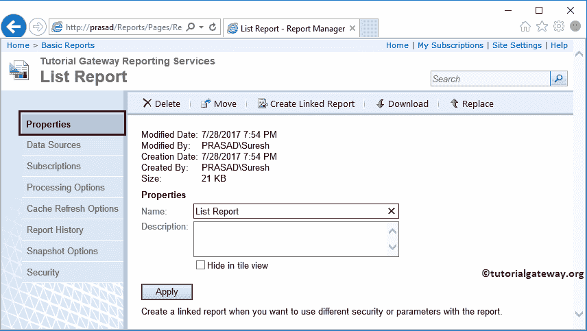

# SSRS 的报告订阅

> 原文：<https://www.tutorialgateway.org/report-subscription-in-ssrs/>

报表订阅是 SSRS 或 SQL 报告服务中的一个强大选项。SSRS 订阅允许用户在不与报表管理器、BIDS 或报表生成器交互的情况下创建报表。

在本文中，我们将通过一个示例向您展示如何在 SSRS 应用报表订阅。它包括 SSRS 电子邮件订阅和文件订阅。

在我们开始在 SSRS 应用订阅之前，让我打开我的报表管理器来显示我们服务器上的现有报表。

在这个 SSRS 订阅演示中，我们将使用之前创建的名为[列表报告](https://www.tutorialgateway.org/create-a-list-report-in-ssrs/)的报告。所以请参考相同的了解报告数据。

## SSRS 的报告订阅

要在 SSRS 创建报告订阅，单击报告旁边的向下箭头将打开菜单项。请从菜单项中选择管理选项。

选择“管理”选项后，报表管理器会将您导航到具有以下选项卡的新页面。您可以使用此页面管理此报告的高级设置。

在 [SSRS](https://www.tutorialgateway.org/ssrs/) 属性标签下，它将显示报告创建用户、创建和修改日期以及报告大小。

请自行导航至订阅选项卡，并选择 SSRS 的新订阅选项。

选择“新建订阅”选项后，报表管理器将导航到以下页面。

SSRS 的订阅支持两种类型的传递选项:Windows 文件共享和电子邮件。目前，我们还没有配置 SMTP 电子邮件设置。这就是原因；它只显示一个交付选项。

### SSRS 的 Windows 文件共享订阅

SSRS 的 Windows 文件共享订阅允许定期或在指定时间将报告保存在文件系统(硬盘)中。例如，周六会议的报告、每月进度、最后一批的温度等。

选择“窗口文件共享”选项后，报告管理器将显示以下页面。此 Windows 文件共享订阅在 SSRS 的属性是:

*   文件名:请指定文件名
*   路径:指定要保存报告的网络路径。
*   渲染格式:请选择要保存报告的格式。比如 PDF、XML、Excel 等。
*   用户名:请指定访问您在“路径”部分中指定的文件夹所需的用户名。
*   密码:指定上述指定用户的密码。
*   用较新版本覆盖现有文件:此选项将始终保留订阅报告的新副本。
*   如果存在以前的版本，请勿覆盖文件:此选项不会覆盖现有文件。
*   添加新版本时增加文件名:此选项将为订阅的报告的新副本添加不同的名称。
*   订阅处理选项:这是计划报表订阅。

让我向您展示我们将用于此订阅的文件夹。请记住，它应该在网络(共享文件夹)上。您将在订阅中提供的用户名和密码必须具有访问此文件夹的权限。

接下来，我们选择渲染格式为 PDF。从下面的截图中，您可以看到可用渲染选项的列表。

最后，我们必须安排时间，即我们希望报告保存在给定路径中的时间。。为此，请单击选择时间表按钮。

单击“选择计划”按钮后，报告管理器会将您导航到一个新页面。您可以使用此页面安排您在 SSRS 的订阅。

*   计划详细信息:使用此部分计划每小时、每天、每周、每月或一生一次的报告订阅。别忘了提到开始时间。
*   开始日期:请指定您希望何时开始报表订阅。
*   当您想要停止此 SSRS 订阅时，停止此计划。

出于 SSRS 订阅演示的目的，让我安排 2 分钟。实时的，可能是每天，或者每周一，等等。

让我提供访问报告文件夹的用户名和密码。

现在，您可以在 SSRS 订阅报告页面中看到新创建的文件订阅。

从下面的截图中，您可以看到 SSRS 订阅正在成功运行。

成功运行后，报告服务将以 PDF 格式保存报告。从下面，您可以看到 SSRS 订阅生成的 PDF。

让我打开 PDF 看看是否正确。

### SSRS 的电子邮件订阅

SSRS 的电子邮件订阅允许定期或在指定时间通过电子邮件发送报告。例如，您可以创建一个订阅，将上周的进度报告发送到您的电子邮件等。

在开始配置 SSRS 电子邮件订阅之前，我们必须在 SQL Reporting Services 配置管理器中配置 SMTP 设置。为此，请导航到电子邮件设置选项卡，并提供发件人地址和 SMTP 服务器名称。目前，我们正在输入虚拟细节。

选择电子邮件传递选项后，报告管理器将在 SSRS 订阅页面中显示以下选项。这些属性是:

*   收件人:收件人的电子邮件标识或 SMTP 地址。(您想将报告发送给谁)
*   主题:电子邮件主题。
*   渲染格式:请选择要保存报告的格式。比如 PDF、XML、Excel 等。
*   优先级:请指定电子邮件优先级。正常人会为你做这项工作。如果没有，去高中。
*   订阅处理选项:这是计划报表订阅。

我来补充一些虚拟细节，点击【确定】

现在，您可以在 SSRS 报告中看到电子邮件订阅和文件订阅。

