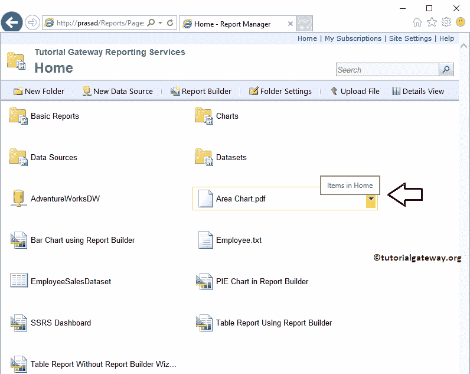

# 将文件上传到 SSRS 报告管理器

> 原文：<https://www.tutorialgateway.org/upload-file-to-ssrs-report-manager/>

SQL Server 报表管理器是放置所有已部署报表、数据源和数据集的地方。SSRS 报告管理器提供了一个名为“上传文件”的选项，您可以使用该选项将任何文件上传到报告管理器。

我们已经解释了使用此选项将报告部署到报告管理器中的步骤，以使用 SSRS 报告管理器文章来部署 SSRS 报告。在本文中，我们将通过一个示例向您展示如何将文件上传到 SSRS 报告管理器。

在我们开始在 [SSRS](https://www.tutorialgateway.org/ssrs/) 部署报告之前，让我打开我的报告管理器，显示我们服务器中现有的数据源、数据集和报告。

## 将文件上传到 SSRS 报告管理器

在本例中，我们将向报告管理器上传不同类型的文件，包括:文本文件、Pdf 文件和图像。

要将文件上传到报告管理器，请单击上传文件菜单项。单击该按钮，将打开以下页面。您可以使用此页面上传。rdl，。smdl，共享数据集，报表部件到报表管理器。

### 将文本文件上传到 SSRS 报告管理器

通过单击浏览按钮，它将打开本地文件系统来选择所需的文件。如您所见，我们正在选择 D Drive -> Logos 文件夹

中的员工文本文件

点击【确定】将文本文件上传至 SSRS 表格报告管理器

现在，您可以在报表管理器主页中看到上传的文本文件。

请点击文本文件查看文本文件

内的数据

### 上传 PDF 到 SSRS 报告管理器

通过单击“浏览”按钮，它会打开本地硬盘来选择所需的文件。如您所见，我们选择的是 D 驱动器->徽标文件夹中的区域图 pdf 文件。完成后，请点击【确定】按钮上传 PDF 文件

现在，您可以在报告管理器主页中看到上传的 PDF 文件。请点击 PDF 文件查看该 PDF 文件内的数据

从下面的截图中，您可以看到报告管理器正在显示我们上传的 PDF 文件。

### 将图像上传到 SSRS 报告管理器

通过单击上传文件页面上的浏览按钮，打开本地文件系统以选择所需的文件。这里，我们选择了显示在 D 驱动器->徽标文件夹中的主页 png 文件。完成后，点击【确定】按钮上传 PNG 文件

现在，您可以在 SSRS 报告管理器主页中看到上传的图像文件。请点击图像文件(。png)查看图片

从下面的截图中可以看到，SSRS 报告管理器正在显示我们上传的图像。

