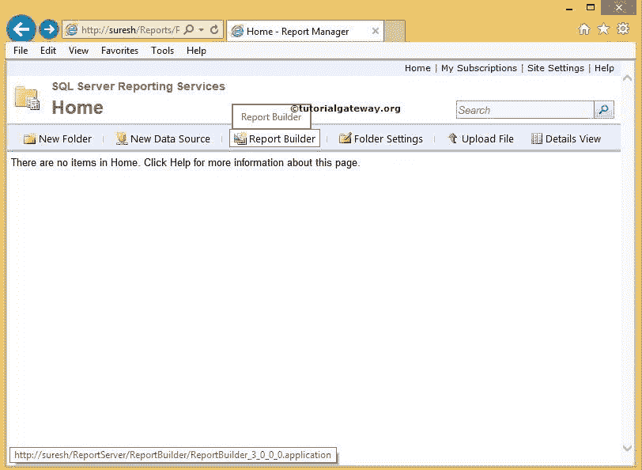
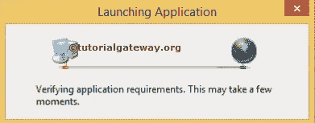
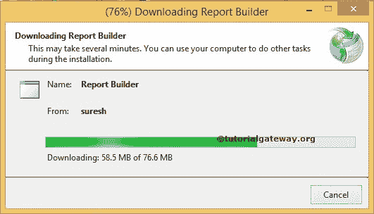
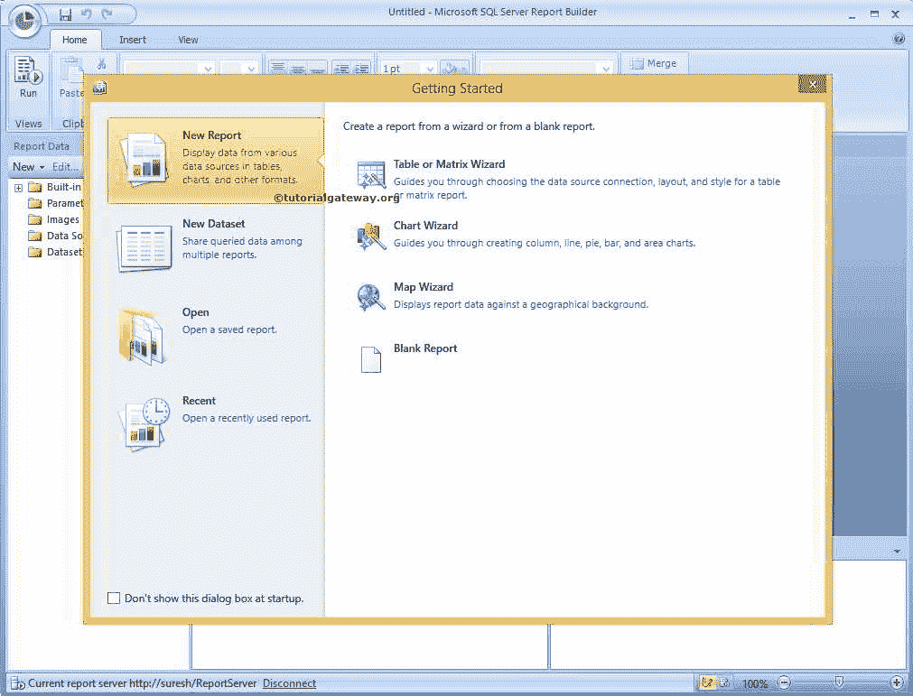
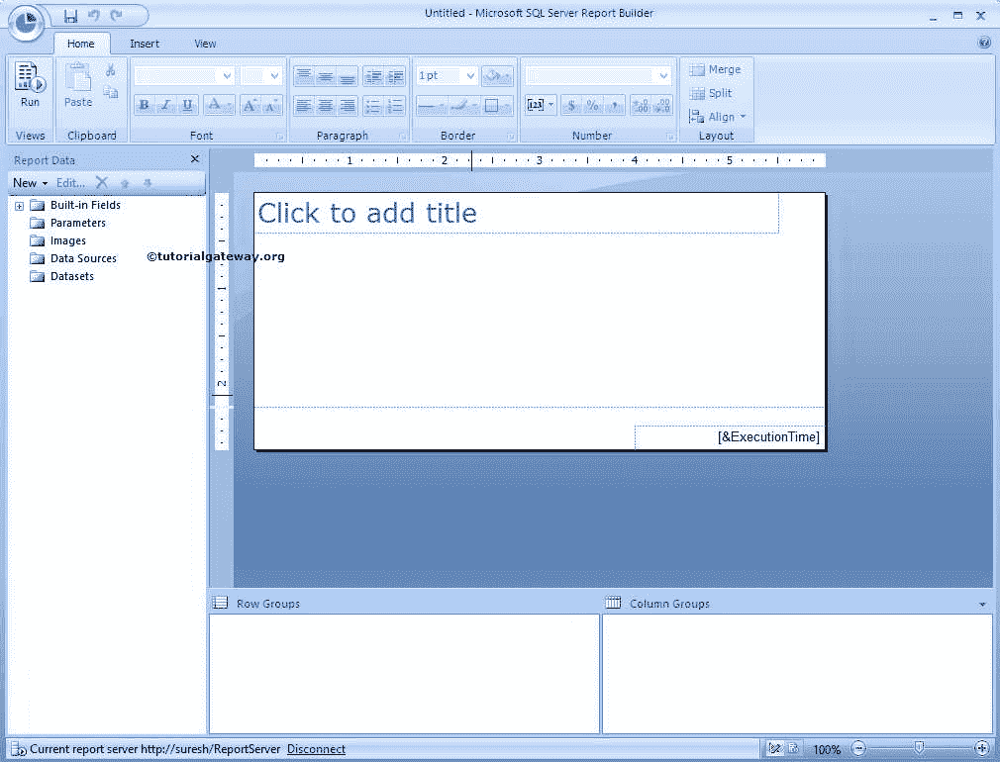

# 安装 SSRS 报表生成器

> 原文：<https://www.tutorialgateway.org/install-ssrs-report-builder/>

SQL Server 报表服务允许使用两个应用(如 BIDS 和 SSRS 报表生成器)设计报表。

*   商业智能开发工作室(简称 BIDS)。请参考[安装 SQL Server 数据工具](https://www.tutorialgateway.org/install-sql-server-data-tools/)文章，了解安装 BIDS 所涉及的步骤
*   SSRS 报表生成器–简单的工具，无需 Visual Studio 知识即可设计基本和复杂的报表。

喜欢在 Microsoft Office 环境中工作的开发人员会更喜欢 SSRS 报表生成器，因为它是他们设计、编辑和发布 SSRS 报表的最佳选择。

在早期，SSRS 报表生成器被固定设计一个简单的报表。但是，使用 SQL 报表生成器 3.0，您可以创建最复杂的报表。在本文中，我们将向您展示如何从报表管理器安装 SSRS 报表生成器。

## 安装 SSRS 报表生成器的步骤

要安装 SSRS 报表生成器，请打开您的[报表管理器](https://www.tutorialgateway.org/sql-server-reporting-services-configuration-manager/)，点击报表生成器，如下图所示

单击报表生成器检查 SSRS 报表生成器应用是否已安装。

如果找到，将打开 [SSRS](https://www.tutorialgateway.org/ssrs/) 报表生成器。

### SSRS 报表生成器下载

否则，将打开下载报表生成器窗口，下载应用

一旦微软 [SQL Server](https://www.tutorialgateway.org/sql/) 报表生成器下载到 100%，就会打开一个起始页，如下图截图所示。

使用 SSRS 报表生成器，我们可以设计表、矩阵、图表、迷你图、数据条、图表、仪表和地图报表。它的范围从简单的报告到复杂的报告。

现在，我们选择了空白报告。

