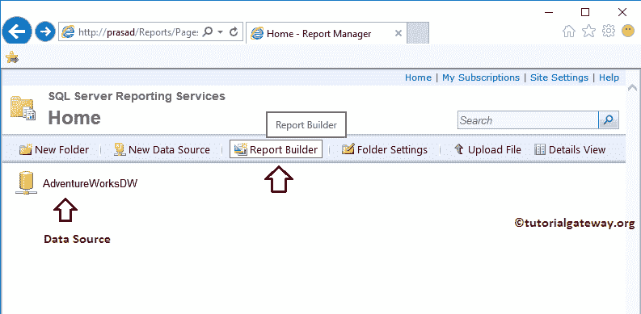

# 使用 SSRS 报表生成器向导创建新数据集

> 原文：<https://www.tutorialgateway.org/create-a-new-dataset-using-ssrs-report-builder-wizard/>

在本文中，我们将向您展示如何使用 SSRS 报表生成器向导创建新数据集。或者我们可以说，在 SSRS 报表生成器中创建共享数据集所涉及的步骤。

为此，我们将使用我们在早期的 [SSRS](https://www.tutorialgateway.org/ssrs/) 帖子中创建的[共享数据源](https://www.tutorialgateway.org/data-source-in-ssrs-report-manager/)。

要创建新数据集，我们必须打开报表生成器。为此，请打开您的报表管理器，点击报表生成器按钮，如下图所示

单击报表生成器按钮后，将打开微软 [SQL Server](https://www.tutorialgateway.org/sql/) 报表生成器。

## 使用 SSRS 报表生成器向导创建新数据集

在本例中，我们希望使用 SSRS 报表生成器向导创建一个新数据集。所以请选择【新数据集】选项卡

如果您观察下面的截图，底部的创建按钮是灰色的。这是因为报表生成器在开始创建数据集之前需要一个数据源。

因此，让我通过单击浏览其他数据源来浏览现有数据源..超链接。请记住，此时您不能创建数据源，因此请始终在创建数据集之前创建数据源。

单击浏览其他数据源后..超链接时，将打开一个新窗口，从报表服务器中选择共享数据源。

仅选择数据源后，将启用底部的创建按钮来创建数据集

单击“创建”按钮后，报表生成器将打开以下窗口。

在“数据库视图”部分，您可以选择冒险作品 DW 中现有的[表](https://www.tutorialgateway.org/sql-create-table/)、[视图](https://www.tutorialgateway.org/views-in-sql-server/)和[存储过程](https://www.tutorialgateway.org/stored-procedures-in-sql/)。

在这个例子中，我们将从冒险作品中选择两张表。为此，请转到“数据库视图”窗格并展开“表”文件夹。

从下面的截图中，您可以看到我们正在选择[Dim 员工]表和[事实经销商销售]表。

选中这些表后，这两个表中的所有字段(或列名)都将添加到“选定字段”窗格中。

从下面的截图中可以看到，在这个部分下，我们使用了删除字段按钮来删除数据集中不需要的列。要删除字段，请选择该字段，然后单击删除字段按钮。

或者您可以在数据库视图窗格中展开表格，取消选中不需要的列，如下图所示

选择完所需的表、字段后，请单击运行查询按钮检查生成的查询返回的数据。

如果你熟悉自己编写 [SQL](https://www.tutorialgateway.org/sql/) 查询，那么点击【编辑为文本】按钮

单击“编辑为文本”按钮后，将显示以下窗口来编写您的自定义 SQL 查询。写完查询后，可以使用执行按钮来获得结果。现在，我们将坚持我们在上一步中创建的查询。

在“选定字段”部分下，我们有“分组和聚合”按钮。通过点击该按钮，将把[分组依据](https://www.tutorialgateway.org/sql-group-by-clause/)条件添加到所选字段部分的所有字段中。

你可以从下面的截图中看到同样的情况。

让我将[聚合函数](https://www.tutorialgateway.org/sql-aggregate-functions/)添加到数值列中。为此，请选择包含数字数据的列，并将合计从分组依据更改为[合计](https://www.tutorialgateway.org/sql-sum-function/)。

使用相同的技术对订单数量、产品总成本、销售额、税额和单价应用求和函数

我想我忘记解释查询设计器下的窗格了。

*   数据库视图:该窗格将列出您选择的数据源中现有的[表](https://www.tutorialgateway.org/sql-create-table/)、[视图](https://www.tutorialgateway.org/views-in-sql-server/)和[存储过程](https://www.tutorialgateway.org/stored-procedures-in-sql/)。
*   选定字段:选定的表、视图或存储过程中可用的字段列表。
*   关系:报表生成器足够智能，可以找到所选时间之间的关系。但是如果您想专门提供关系，那么就使用这个窗格。为此，请选择编辑字段，并从两个表中选择公共字段。
*   应用的筛选器:使用此窗格在数据集级别应用筛选器。为此，单击过滤器按钮并添加过滤器。我们已经在 SSRS 文章的[过滤器中解释了过滤器的概念。](https://www.tutorialgateway.org/filters-at-dataset-level-in-ssrs/)

设计完查询(数据集)后，单击保存按钮。

单击保存按钮后，将打开一个名为另存为数据集的新窗口。在这里，您可以选择本地文件系统或报表服务器。这里，我们选择的是报表服务器

让我打开我的报表服务器，显示新创建的数据集

