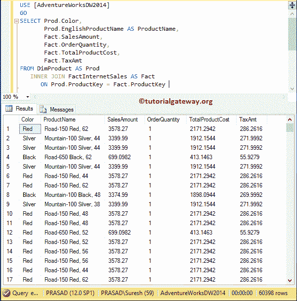
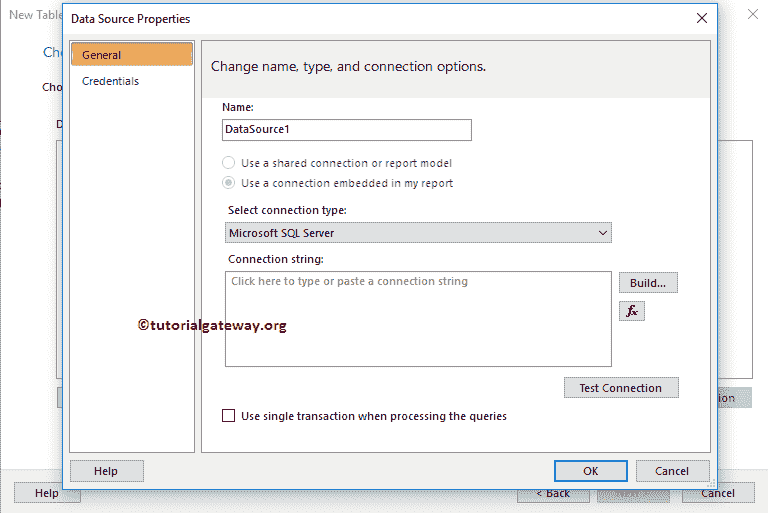
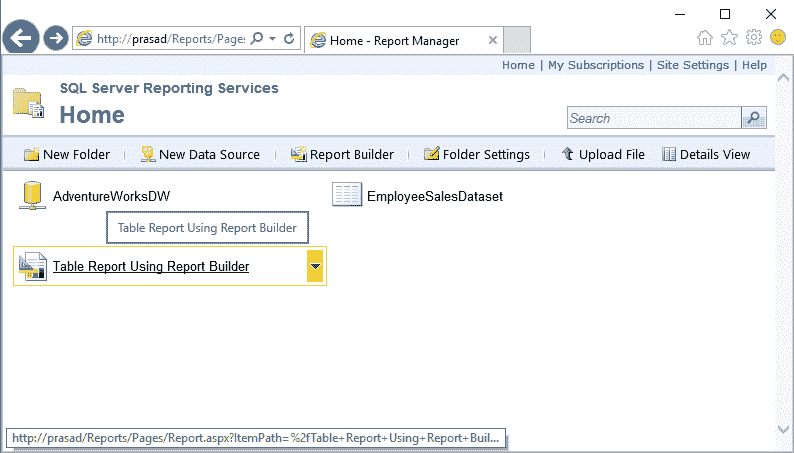

# 在 SSRS 报表生成器向导中创建新报表

> 原文：<https://www.tutorialgateway.org/create-a-new-report-in-ssrs-report-builder-wizard/>

在本文中，我们将向您展示如何在 SSRS 报表生成器向导中创建新报表。或者，我们可以说使用 SSRS 报表生成器创建新表或矩阵报表所涉及的步骤。

为此，我们将使用我们在之前的文章中创建的存储过程。下面的屏幕截图将向您展示我们将在此存储过程中使用的数据:

提示:如果你想创建一个自定义的存储过程，那么我建议你参考我们在 [SQL Server](https://www.tutorialgateway.org/sql/) 教程中提到的 [SQL 存储过程](https://www.tutorialgateway.org/select-stored-procedure-in-sql-server/)一文。



现在，让我编写 [SQL](https://www.tutorialgateway.org/sql/) 查询，在 Adventure Works DW 上创建一个[存储过程](https://www.tutorialgateway.org/select-stored-procedure-in-sql-server/):

```
USE [AdventureWorksDW2014]
GO

IF OBJECT_ID ( 'SP_ProductSales', 'P' ) IS NOT NULL   
    DROP PROCEDURE SP_ProductSales;  
GO

CREATE PROCEDURE [dbo].[SP_ProductSales]
AS
BEGIN
      SET NOCOUNT ON;
	  SELECT Prod.Color, 
             Prod.EnglishProductName AS ProductName, 
             Fact.SalesAmount,
	         Fact.OrderQuantity, 
             Fact.TotalProductCost, 
             Fact.TaxAmt
       FROM DimProduct AS Prod 
         INNER JOIN FactInternetSales AS Fact 
            ON Prod.ProductKey = Fact.ProductKey 
END
GO
```

要创建新的 [SSRS](https://www.tutorialgateway.org/ssrs/) 报表，我们必须打开报表生成器。为此，请打开您的报表管理器，点击报表生成器按钮，如下图所示


点击报表生成器按钮后，将打开 [SQL Server](https://www.tutorialgateway.org/sql/) 报表生成器的起始页，如下图截图所示。


## 在 SSRS 报表生成器向导中创建新报表

在本例中，我们希望在 SSRS 报表生成器向导中创建新报表，因此请选择新建报表选项卡，然后选择表或矩阵向导选项，如下图所示


选择“表或矩阵向导”选项后，将打开一个名为“新建表或矩阵”的新窗口，如下所示。如果报表服务器中有任何现有数据集或共享数据集，请使用第一个选项。

目前，我们正在选择第二个选项。我建议您参考【报表生成器】中的[创建新数据集一文，了解创建共享数据集所涉及的步骤。](https://www.tutorialgateway.org/create-a-new-dataset-using-ssrs-report-builder-wizard/)

[](https://www.tutorialgateway.org/create-a-new-dataset-using-ssrs-report-builder-wizard/)

接下来，我们必须创建一个数据源(到数据库的连接)。如果您有任何现有的数据源或[共享数据源](https://www.tutorialgateway.org/data-source-in-ssrs-report-manager/)，那么您可以通过单击浏览按钮来选择它们。在这里，我们将创建一个新的数据源。


一旦点击新建按钮，将打开如下窗口写入连接字符串



我们将数据源名称更改为 AdventureWorksDW，并对连接字符串进行了硬编码。

如果您发现编写连接字符串有任何困难，请单击“生成”按钮，报表生成器将为您创建一个连接字符串。


请选择新创建的数据源，然后单击下一步按钮。


设计查询窗口:使用此窗口为报表创建数据集。我们在报表生成器文章中向[解释了这个查询设计器中涉及的每个步骤。现在，我们选择前面创建的存储过程。](https://www.tutorialgateway.org/create-a-new-dataset-using-ssrs-report-builder-wizard/)

[](https://www.tutorialgateway.org/create-a-new-dataset-using-ssrs-report-builder-wizard/)

运行查询检查[商店程序](https://www.tutorialgateway.org/stored-procedures-in-sql/)


返回的数据

接下来，我们有四个部分:

*   可用字段:数据集中所有可用列的列表。
*   行组:如果要使用任何列作为行组，则将该列名添加到此部分
*   值:要在表中使用的所有列名都将放在此部分。
*   列组:如果要使用任何列作为列组，请将该列名添加到此部分


我们正在将颜色添加到行组，将剩余的列添加到值。建议大家参考[添加行组和列组](https://www.tutorialgateway.org/ssrs-grouping-in-table-reports/)一文了解分组功能。


选择布局:目前，我们保留默认设置。

*   显示小计和总计:如果要在报表中显示小计和总计，请选择此选项。
*   展开/折叠组:启用或禁用[向下钻取](https://www.tutorialgateway.org/ssrs-drill-down-report/)功能。


请从现有模板中选择布局。


现在，您可以看到自动生成的报告。


删除表报告周围的多余空间，点击【运行】按钮


单击“运行”按钮后，将生成以下报告。从下面的截图中，您可以看到报告显示了向下钻取功能。我们已经在[深入报告](https://www.tutorialgateway.org/ssrs-drill-down-report/)一文中解释了这个概念。


尝试展开颜色旁边的每个+按钮。


让我使用报表生成器将报表名称更改为表报表，然后单击保存按钮将报表保存在报表服务器中。


单击“保存”按钮后，将打开一个名为“另存为报告”的新窗口。在这里，您可以选择本地文件系统或报表服务器。这里，我们选择的是报表服务器


让我打开我的报表服务器，显示新创建的表报表


如果您想要查看报告预览或运行报告，则不必访问报告生成器或 BIDS。只需点击报告就会运行报告。让我选择之前保存的报告，点击



现在你可以在报表服务器


里面看到报表了